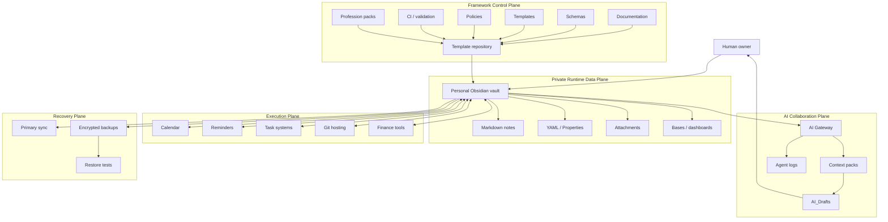
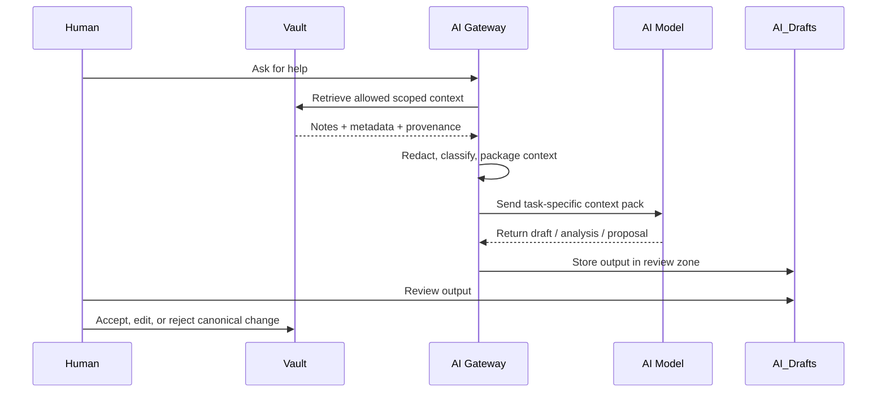
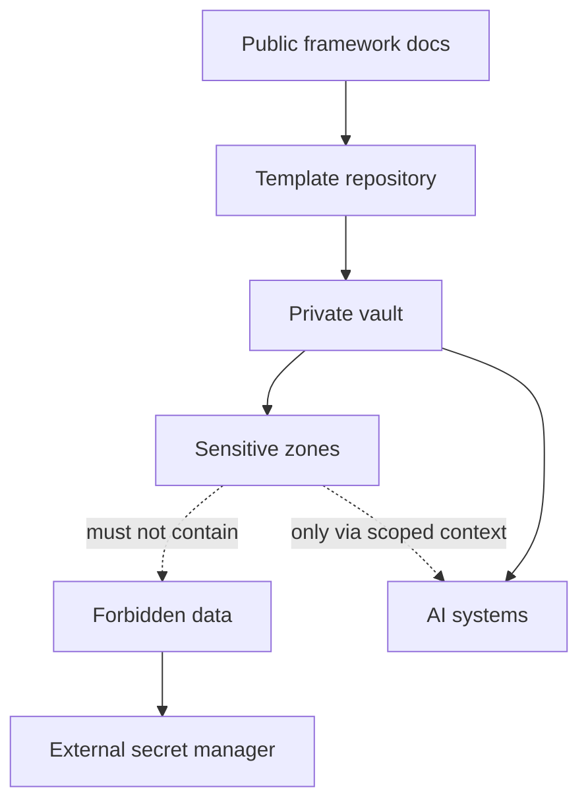
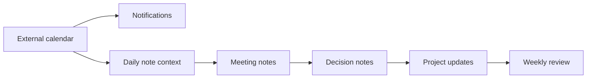
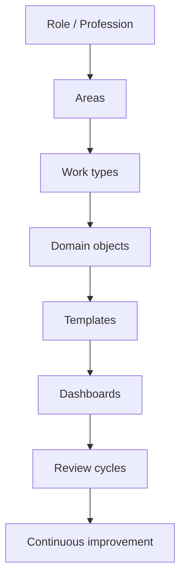
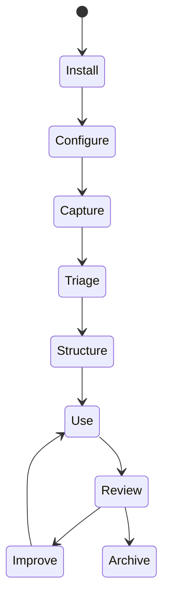
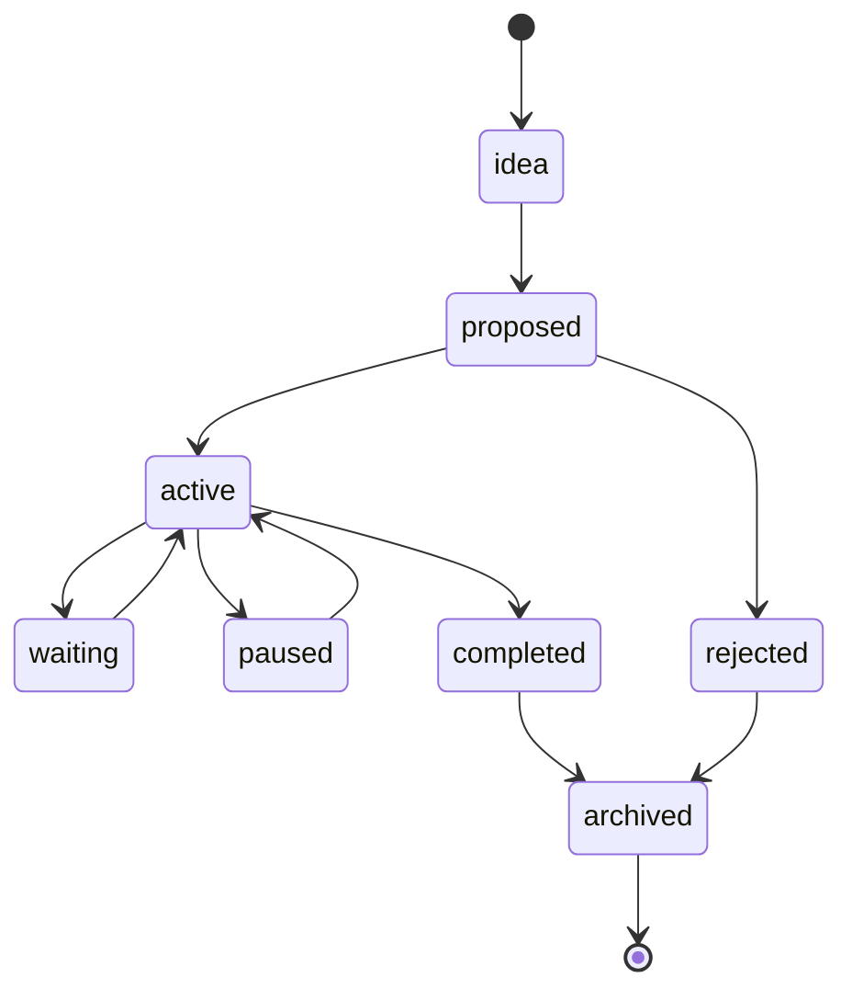
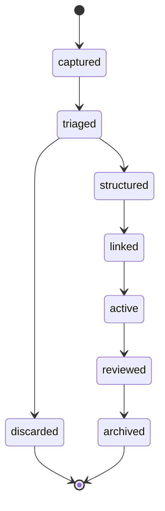
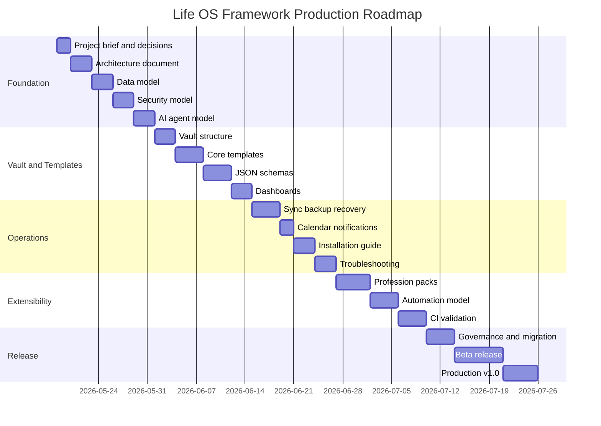

# 01_PROJECT_BRIEF

## Life OS Framework — production brief

**Life OS Framework** — это production-grade фреймворк для создания персональной операционной системы жизни, работы, знаний, проектов, задач, календаря, финансового контекста, профессиональной документации и безопасного взаимодействия человека с AI.

Это не “ещё один шаблон Obsidian”. Это **reference architecture** для долгоживущей, локально-ориентированной, расширяемой и безопасной Human + AI Operating System, где человек остаётся владельцем данных и решений, а AI становится управляемым инженерным усилителем: анализирует, структурирует, предлагает, проверяет, документирует и помогает поддерживать порядок — но не получает неограниченную власть над канонической системой.

> **Core promise:** дать человеку и команде один фундаментальный, переносимый, безопасный и адаптируемый способ управлять всей информационной жизнью — от ежедневных заметок до профессиональных процессов, от календаря до AI-агентов, от личных проектов до self-hosted инфраструктуры.

> **Truthful positioning:** проект не утверждает, что существует единственная объективно возможная архитектура для всех людей. Он предлагает **opinionated best-practice architecture**: строгую, зрелую, расширяемую и практически реализуемую систему, выбранную как рекомендуемый production-standard для этой категории решений.

---

## 1. Назначение документа

`01_PROJECT_BRIEF.md` — главный контекстный якорь проекта. Он фиксирует:

- зачем существует Life OS Framework;
- какую проблему он решает;
- для кого создаётся;
- какие цели и ограничения являются обязательными;
- какие архитектурные решения считаются базовыми;
- что входит и не входит в production scope;
- как должна выглядеть успешная итоговая реализация;
- какие документы, компоненты и проверки нужны для перехода к production.

Этот документ должен читаться первым. Все остальные документы репозитория детализируют его решения:

- `02_ARCHITECTURE.md` раскрывает техническую архитектуру;
- `03_DATA_MODEL.md` определяет онтологию, типы заметок и свойства;
- `04_SECURITY_MODEL.md` задаёт threat model, trust boundaries и security controls;
- `05_AI_AGENT_MODEL.md` описывает безопасную совместную работу человека и AI;
- `06_SYNC_BACKUP_RECOVERY.md` определяет синхронизацию, backup и restore;
- `09_PROFESSION_PACKS.md` объясняет адаптацию под любые профессии.

---

## 2. Executive summary

Современный человек живёт в раздробленной информационной среде: заметки в одном приложении, задачи во втором, календарь в третьем, документы в облаке, код в Git, финансы в таблицах, идеи в мессенджерах, AI-чаты отдельно, а долгосрочная память — нигде. Это создаёт контекстные потери, дублирование, хаос, зависимость от SaaS-платформ, слабую воспроизводимость решений и опасные сценарии, когда AI получает либо слишком мало контекста, либо слишком много власти.

Life OS Framework решает эту проблему через **локально-ориентированную персональную операционную систему**:

```text
Markdown = долговременная память
YAML / Properties = структура данных
Obsidian = человеко-ориентированный интерфейс
Bases / dashboards = операционные представления
Git = versioning, review, template distribution
Calendar / reminders = time-critical execution
Backup / restore = выживаемость системы
AI gateway = безопасное взаимодействие с AI
Profession packs = адаптация под любую деятельность
```

Базовая идея проста: **вся значимая информация должна иметь место, тип, статус, контекст, владельца, жизненный цикл, уровень чувствительности и понятный способ ревью**.

Вместо общего хранилища личных данных фреймворк использует два уровня:

1. **Framework repository** — общий шаблон: документация, схемы, политики, templates, automation, profession packs, CI.
2. **Private personal vault** — личная система пользователя: заметки, проекты, финансы, люди, работа, AI drafts, review history.

AI работает через контролируемый слой:

```text
Human request
→ scoped context pack
→ AI analysis
→ draft / proposal / patch
→ human review
→ canonical merge
```

Это даёт системе главный баланс: **AI получает достаточно контекста, чтобы быть полезным, но недостаточно полномочий, чтобы стать опасным**.

---

## 3. Product positioning

### 3.1. One-liner

**Life OS Framework is a secure, local-first, AI-augmented operating system for personal and professional knowledge, action, memory, and decision-making.**

На русском:

**Life OS Framework — это безопасная, локально-ориентированная и AI-усиленная операционная система для личной и профессиональной информации, действий, памяти и решений.**

### 3.2. Premium positioning without false claims

Life OS Framework должен ощущаться как премиальный инженерный продукт, но не должен давать ложных обещаний. Поэтому позиционирование строится не на магии, а на доказуемых качествах:

| Маркетинговое утверждение | Корректная формулировка |
|---|---|
| “Идеальный второй мозг” | “Reference architecture для персональной операционной системы знаний и действий” |
| “AI сам управляет жизнью” | “AI помогает анализировать, структурировать и предлагать действия под human review” |
| “Всё автоматически и без ошибок” | “Система снижает потери контекста через схемы, workflow, ревью и quality gates” |
| “Полная безопасность” | “Secure-by-design архитектура с least privilege, forbidden data rules, backups и human approval” |
| “Подходит абсолютно всем без настройки” | “Core framework + profession packs позволяют адаптировать систему под разные роли и профессии” |
| “Заменяет все приложения” | “Объединяет контекст и управление, но оставляет календарь, напоминания, Git, финансы и секреты в специализированных системах” |

### 3.3. Strategic promise

Life OS Framework стремится стать **фундаментальным стандартом персональной информационной инфраструктуры**:

- достаточно простым, чтобы человек мог начать с ежедневных заметок и проектов;
- достаточно строгим, чтобы не превратиться в хаотичную папку Markdown-файлов;
- достаточно безопасным, чтобы выдерживать AI-интеграции и чувствительные данные;
- достаточно расширяемым, чтобы подходить разработчику, дизайнеру, предпринимателю, преподавателю, врачу, юристу, студенту, токарю, мастеру производства или любому кастомному профессиональному профилю;
- достаточно независимым, чтобы пережить смену SaaS-сервисов, AI-провайдеров, плагинов и устройств.

---

## 4. Problem statement

### 4.1. Текущая проблема

Большинство людей и команд не страдают от нехватки инструментов. Они страдают от отсутствия **единой информационной архитектуры**.

Типичные симптомы:

- заметки существуют отдельно от задач;
- задачи существуют отдельно от календаря;
- решения не фиксируются;
- AI-чаты теряют контекст;
- проекты не имеют явного жизненного цикла;
- знания не связаны с действиями;
- документы дублируются;
- финансы и личные планы смешиваются с рабочими заметками без зон чувствительности;
- поиск работает, но система не понимает типы объектов;
- данные зависят от конкретных SaaS-платформ;
- backup считается “синхронизацией”, хотя это разные вещи;
- AI либо бесполезен из-за недостатка контекста, либо опасен из-за чрезмерного доступа.

### 4.2. Root cause

Корневая проблема — не в выборе приложения, а в отсутствии устойчивой модели:

```text
Нет схем → нет предсказуемости.
Нет lifecycle → нет управления.
Нет sensitivity model → нет безопасности.
Нет review cycle → система деградирует.
Нет context protocol → AI работает вслепую.
Нет trust boundaries → AI становится риском.
Нет backup strategy → данные не являются надёжными.
```

### 4.3. Почему обычный “Obsidian vault” недостаточен

Obsidian даёт сильную основу: локальные Markdown-файлы, свойства, ссылки, canvas, dashboards, плагины и расширяемость. Но сам по себе vault не решает:

- какие типы заметок использовать;
- как отделить канонические данные от производных;
- как проектировать AI-доступ;
- как защитить sensitive-зоны;
- как синхронизировать данные без конфликтов;
- как мигрировать шаблоны;
- как адаптировать систему под разные профессии;
- как проверять качество и безопасность репозитория;
- как не потерять данные при сбое.

Life OS Framework добавляет недостающий слой: **архитектуру, governance, схемы, workflow, security model и production discipline**.

---

## 5. Vision

### 5.1. Long-term vision

Создать универсальный, безопасный, расширяемый и локально-ориентированный фреймворк персональной операционной системы, который позволяет каждому человеку построить свою долговременную цифровую инфраструктуру:

- для жизни;
- работы;
- знаний;
- проектов;
- календаря;
- задач;
- финансового контекста;
- отношений и людей;
- профессиональных процессов;
- AI-взаимодействия;
- памяти решений;
- self-hosted или cloud-сценариев;
- будущих AI-agent workflows.

### 5.2. North star

**Каждый значимый объект жизни и работы должен быть превращён в управляемую, связанную, безопасную и пригодную для AI-интерпретации единицу знания или действия.**

### 5.3. Final-state narrative

Пользователь открывает систему утром и видит:

- что важно сегодня;
- какие встречи и обязательства требуют внимания;
- какие проекты активны;
- какие задачи просрочены;
- какие решения ждут ревью;
- какие люди требуют follow-up;
- какие финансы требуют проверки;
- какие AI drafts нужно принять или отклонить;
- какие areas требуют периодического обслуживания.

AI-ассистент не “угадывает” жизнь пользователя. Он получает curated context pack, видит нужные документы, учитывает правила безопасности, предлагает структурированные действия и пишет черновики в review-зону. Пользователь принимает финальное решение.

Через годы система остаётся читаемой, переносимой и восстанавливаемой, потому что канонические данные живут в Markdown, структура описана через схемы, а производные индексы и dashboards можно пересоздать.

---

## 6. Target users

Life OS Framework должен быть универсальным, но не одинаковым для всех. Он имеет стабильное ядро и профессиональные расширения.

### 6.1. Primary users

| Пользователь | Что получает |
|---|---|
| Разработчик | проекты, ADR, specs, bugs, releases, repo context, AI coding context |
| Дизайнер | briefs, clients, moodboards, assets, feedback, revisions, portfolio |
| Основатель / предприниматель | strategy, product, sales, hiring, investors, operations, decisions |
| Исследователь | papers, hypotheses, experiments, datasets, findings, literature maps |
| Студент | courses, lectures, assignments, exams, learning plans |
| Преподаватель | courses, lesson plans, students, assignments, feedback |
| Писатель / creator | ideas, outlines, drafts, scenes, publications, editorial calendar |
| Консультант | clients, engagements, meetings, recommendations, deliverables |
| Менеджер | projects, people, meetings, decisions, OKRs, risks |
| Мастер / токарь / machinist | orders, drawings, materials, machines, tools, setups, tolerances, QC, maintenance |
| Врач / health professional | protocols, study notes, anonymized cases, checklists; no unmanaged patient records |
| Юрист | matters, clients, deadlines, documents, precedents; with confidentiality controls |
| Финансист | models, reports, risks, decisions, deadlines; no secrets in vault |

### 6.2. Team users

Команды используют общий framework repository, но не общий личный vault.

Командная модель:

```text
Shared framework repo:
  docs, templates, schemas, policies, examples, CI, profession packs

Private user vaults:
  personal notes, projects, people, finances, work, AI drafts, logs
```

Это позволяет команде улучшать общий стандарт без смешивания личных данных.

---

## 7. Scope

### 7.1. In scope

Life OS Framework включает:

- template repository для команды или сообщества;
- personal vault template;
- Obsidian-first workflow;
- Markdown + YAML / Properties data model;
- folder architecture;
- note type ontology;
- templates;
- dashboards / Bases;
- daily / weekly / monthly review workflows;
- AI collaboration model;
- context pack architecture;
- agent gateway concept;
- human review flow;
- security model;
- forbidden data rules;
- sync strategy;
- backup / restore strategy;
- calendar and notification model;
- profession packs;
- CI/CD validation;
- migration and release process;
- governance model;
- troubleshooting;
- examples.

### 7.2. Out of scope

Life OS Framework не должен становиться:

- password manager;
- bank data warehouse;
- medical records system;
- legal case management system with regulated client data by default;
- replacement for external calendars;
- replacement for Git hosting;
- replacement for accounting software;
- uncontrolled autonomous AI agent platform;
- central shared repository of personal data;
- SaaS product requiring lock-in;
- opaque database with no portable source files.

### 7.3. Explicit non-goals

Проект намеренно не ставит цели:

- хранить секреты в Markdown;
- давать AI прямой delete/write доступ ко всему vault;
- делать один общий vault для всей команды;
- автоматически синхронизировать raw banking exports;
- превращать Obsidian в единственный notification engine;
- обещать юридическое, медицинское или финансовое соответствие без отдельной compliance-реализации;
- строить MVP на десятках плагинов;
- требовать self-hosting от обычных пользователей.

---

## 8. Core principles

### 8.1. Local-first canonical storage

Каноническая информация должна храниться в локально доступных файлах, которые остаются читаемыми без конкретного SaaS, AI-провайдера или plugin runtime.

Production implication:

```text
Canonical = Markdown + YAML + attachments
Derived = dashboards, indexes, summaries, context packs, reports
```

### 8.2. Human ownership

Человек владеет системой, контекстом и финальными решениями.

AI помогает, но не становится владельцем:

- AI может анализировать;
- AI может структурировать;
- AI может предлагать;
- AI может писать черновики;
- AI может проверять качество;
- AI не должен бесконтрольно менять каноническую систему.

### 8.3. Schema-first

Все важные сущности должны иметь тип, свойства и lifecycle.

Минимальный контракт:

```yaml
---
id: ""
type: ""
title: ""
status: ""
created: ""
updated: ""
sensitivity: ""
review:
  cadence: ""
  next: ""
relations: []
---
```

### 8.4. Derived views, not duplicated truth

Dashboards, Bases, task queries, AI context packs, semantic indexes и reports должны строиться из канонических заметок.

Если производный слой сломался, его можно пересоздать.

### 8.5. Least privilege by default

Каждый актор — человек, AI, automation, plugin, script, sync tool — получает минимальные права, необходимые для задачи.

### 8.6. Draft-first AI

AI output сначала попадает в draft/review-зону:

```text
01_Inbox/AI_Drafts
70_AI/Agent_Logs
70_AI/Evaluations
```

Только человек переносит принятые изменения в канонические notes.

### 8.7. Calendar owns time; vault owns context

Критичные уведомления, встречи, дедлайны и приглашения принадлежат внешнему calendar/reminder layer.

Obsidian хранит:

- agenda;
- meeting notes;
- decisions;
- preparation;
- follow-ups;
- review history.

### 8.8. Sync is not backup

Синхронизация повышает удобство. Backup обеспечивает выживаемость.

Production rule:

```text
No restore test = no real backup.
```

### 8.9. Security before convenience

Запрещённые данные не попадают в vault даже ради удобства.

Forbidden by default:

- passwords;
- API keys;
- private keys;
- seed phrases;
- production credentials;
- full card numbers;
- full government IDs;
- unmanaged raw banking exports;
- unmanaged identity scans.

### 8.10. Profession packs extend the kernel

Ядро системы должно быть стабильным. Профессии добавляют overlay:

```text
core ontology + profession-specific objects + templates + dashboards + checklists
```

---

## 9. System thesis

Life OS Framework строится на тезисе:

> Будущая персональная операционная система должна быть не приложением, а архитектурой: переносимой, проверяемой, локально-ориентированной, безопасной и AI-readable.

### 9.1. Why Markdown

Markdown выбран как долговременный формат, потому что он:

- читается человеком;
- хранится в файловой системе;
- легко версионируется;
- переносим между инструментами;
- совместим с Git;
- удобен для AI context extraction;
- не требует закрытой базы данных.

### 9.2. Why YAML / Properties

YAML frontmatter и Obsidian Properties превращают заметки в структурированные объекты:

```text
note → typed entity
folder → zone
property → queryable field
base → operational dashboard
```

### 9.3. Why Obsidian

Obsidian выбран как primary interface, потому что он сочетает:

- local files;
- Markdown;
- internal links;
- Properties;
- Bases;
- Daily Notes;
- Canvas;
- Graph;
- extensible plugin ecosystem;
- desktop/mobile workflows.

### 9.4. Why Git

Git нужен не всем как live sync, но он важен для:

- framework repository;
- versioning;
- code review;
- release process;
- template distribution;
- automation and CI;
- docs governance;
- auditability.

### 9.5. Why AI Gateway

Прямой AI-доступ к vault опасен. Правильная модель — gateway:

```text
AI request
→ policy check
→ scoped retrieval
→ redaction
→ context pack
→ model output
→ draft queue
→ human approval
```

---

## 10. High-level architecture



---

## 11. Canonical repository model

Production repository:

```text
life-os-framework/
├── README.md
├── 01_PROJECT_BRIEF.md
├── 02_ARCHITECTURE.md
├── 03_DATA_MODEL.md
├── 04_SECURITY_MODEL.md
├── 05_AI_AGENT_MODEL.md
├── 06_SYNC_BACKUP_RECOVERY.md
├── 07_INSTALLATION.md
├── 08_VAULT_STRUCTURE.md
├── 09_PROFESSION_PACKS.md
├── 10_CALENDAR_NOTIFICATIONS.md
├── 11_AUTOMATION_MODEL.md
├── 12_CI_CD_VALIDATION.md
├── 13_ROADMAP.md
├── 14_DECISIONS_LOG.md
├── CONTRIBUTING.md
├── SECURITY.md
├── CHANGELOG.md
├── MIGRATION_GUIDE.md
├── RELEASE_PROCESS.md
├── GOVERNANCE.md
├── TROUBLESHOOTING.md
├── docs/
├── vault-template/
├── schemas/
├── templates/
├── policies/
├── profession-packs/
├── automations/
├── examples/
├── tests/
└── .github/
```

### 11.1. Repository must contain

- reusable documentation;
- starter vault skeleton;
- schemas;
- templates;
- policies;
- profession packs;
- automation scripts;
- examples with synthetic data only;
- CI workflows;
- governance files.

### 11.2. Repository must not contain

- personal notes;
- real financial data;
- real client data;
- real medical/legal records;
- secrets;
- raw AI memory exports;
- private identity documents;
- unredacted logs;
- production credentials.

---

## 12. Vault model

Default private vault:

```text
My-Life-OS/
├── 00_System/
├── 01_Inbox/
├── 02_Daily/
├── 10_Areas/
├── 20_Projects/
├── 30_Knowledge/
├── 40_Work/
├── 50_Finance/
├── 60_People/
├── 70_AI/
├── 80_Archive/
└── 99_Attachments/
```

### 12.1. Vault zones

| Zone | Purpose | Notes |
|---|---|---|
| `00_System` | dashboards, templates, schemas, policies, maintenance | system control layer |
| `01_Inbox` | quick capture, web, voice, imports, AI drafts | unprocessed data |
| `02_Daily` | daily, weekly, monthly, yearly notes | time-based operating layer |
| `10_Areas` | long-term responsibilities | health, finance, relationships, learning |
| `20_Projects` | outcomes with lifecycle | active, waiting, someday, completed |
| `30_Knowledge` | concepts, research, resources | durable knowledge |
| `40_Work` | profession-specific work system | extended by profession packs |
| `50_Finance` | goals, budgets, decisions, reviews | no credentials or raw secrets |
| `60_People` | CRM, meetings, commitments | sensitivity required |
| `70_AI` | agents, prompts, context packs, logs | controlled AI layer |
| `80_Archive` | inactive/completed material | excluded from active views |
| `99_Attachments` | files, images, PDFs, exports | metadata note recommended |

---

## 13. Human + AI collaboration model

### 13.1. Default safe loop



### 13.2. AI action classes

| Class | Examples | Default permission |
|---|---|---|
| Read-only | summarize, classify, search, explain | allowed with scope |
| Draft-only | create proposal, rewrite draft, generate checklist | allowed to `AI_Drafts` |
| Bounded transform | propose patch to known section | human review required |
| High-impact | delete, send, publish, pay, change permissions | explicit approval required |
| Forbidden | expose secrets, bypass policy, alter audit logs | never allowed |

### 13.3. Why this matters

AI systems that process external content are vulnerable to prompt injection, retrieval poisoning, tool abuse, data exfiltration and excessive autonomy. Therefore, the framework assumes that AI output is useful but not automatically trusted.

Production rule:

```text
AI can propose. Human disposes.
```

---

## 14. Security posture

### 14.1. Security objective

Protect the user’s data, agency, identity, finances, relationships, professional confidentiality, and long-term knowledge integrity while still enabling useful AI collaboration and automation.

### 14.2. Sensitivity levels

```text
public       = safe to publish
internal     = safe within project/team context
private      = personal but low risk
sensitive    = harmful if exposed
restricted   = high-risk, special handling required
forbidden    = must not be stored in vault
```

### 14.3. Trust boundaries



### 14.4. Non-negotiable security rules

- No passwords in vault.
- No API keys in vault.
- No private keys in vault.
- No seed phrases in vault.
- No production credentials in repo.
- No raw identity scans in normal vault storage.
- No unrestricted AI write access.
- No AI deletion rights by default.
- No shared team vault with personal data.
- No backup strategy without restore tests.

---

## 15. Sync and hosting posture

Life OS Framework supports multiple deployment profiles.

| Profile | Primary sync | Best for |
|---|---|---|
| `personal-simple` | Obsidian Sync | most users |
| `developer` | Git + Obsidian Sync or Syncthing | technical users |
| `self-hosted` | Nextcloud / Syncthing + Gitea/Forgejo | privacy-first users |
| `team-template` | GitHub / Gitea framework repo | teams |
| `hybrid` | Obsidian Sync + Git snapshots + encrypted backups | power users |

Production rule:

```text
Choose one primary live sync method per vault.
Layer backup separately.
```

---

## 16. Calendar and notification posture

The framework does not try to make Obsidian the only calendar/reminder system.

Correct division:

```text
Calendar = events, deadlines, invitations, notifications
Reminders = critical alerts
Tasks = contextual actions
Obsidian = context, agendas, decisions, reviews, linked knowledge
```



---

## 17. Profession adaptation thesis

Life OS Framework must work for both knowledge workers and non-desk professions.

Universal work model:

```text
Role
→ Areas of responsibility
→ Projects / orders / cases
→ Inputs
→ Processes
→ Tools / assets / materials
→ Quality checks
→ Deliverables
→ Reviews
→ Archive
```



Profession packs provide overlays:

```text
profession-packs/developer/
profession-packs/designer/
profession-packs/machinist/
profession-packs/teacher/
profession-packs/researcher/
profession-packs/founder/
profession-packs/custom/
```

Each pack must define:

- domain objects;
- folder overlay;
- templates;
- dashboards;
- lifecycle;
- quality checklist;
- AI assistance model;
- safety/security constraints.

---

## 18. Production goals

### 18.1. Functional goals

The system must allow users to:

- capture information quickly;
- process inbox reliably;
- manage projects;
- link knowledge to action;
- maintain daily/weekly/monthly reviews;
- preserve decisions;
- operate across devices;
- use calendars and reminders;
- collaborate with AI safely;
- adapt workflows to profession;
- back up and restore data;
- evolve the system over years.

### 18.2. Engineering goals

The system must be:

- local-first;
- schema-driven;
- versionable;
- testable;
- portable;
- AI-readable;
- secure-by-design;
- self-hosting-compatible;
- cloud-compatible;
- extensible;
- maintainable;
- migration-aware.

### 18.3. Product goals

The system should feel:

- premium;
- calm;
- reliable;
- intellectually rigorous;
- empowering;
- future-proof;
- practical rather than gimmicky.

---

## 19. Production requirements

### 19.1. P0 requirements

Before production v1.0, the project must have:

- complete README;
- project brief;
- architecture document;
- data model;
- security model;
- AI agent model;
- sync/backup/recovery guide;
- installation guide;
- vault structure guide;
- profession packs guide;
- calendar/notification guide;
- automation model;
- CI/CD validation guide;
- roadmap;
- decisions log;
- security policy;
- contributing guide;
- migration guide;
- changelog.

### 19.2. P1 requirements

For team/community release:

- CODEOWNERS;
- branch protection rules;
- PR templates;
- issue templates;
- example vaults with synthetic data;
- initial schemas;
- initial templates;
- validation scripts;
- release process;
- governance model;
- troubleshooting guide.

### 19.3. P2 requirements

Future extensions:

- local LLM guide;
- MCP integration guide;
- semantic index / RAG guide;
- self-hosted reference stack;
- advanced examples;
- AI evaluation harness;
- policy engine prototype;
- context pack generator;
- agent gateway implementation.

---

## 20. Definition of success

Life OS Framework succeeds when:

1. A new user can create a private vault from the template and understand the system in one session.
2. A power user can adapt it to a complex personal/professional life without breaking the core model.
3. A team can maintain the framework repo without ever storing personal data in it.
4. AI can provide meaningful help using scoped context packs.
5. AI cannot silently mutate canonical data.
6. Security boundaries are clear and documented.
7. Sync and backup are not confused.
8. Restore has been tested.
9. Profession packs can extend the system without redefining the kernel.
10. The system remains useful if AI, a plugin, or a SaaS provider is removed.

---

## 21. Key success metrics

### 21.1. Adoption metrics

- Time to first usable vault: target under 60 minutes.
- Time to first daily note: target under 10 minutes after setup.
- Time to first project dashboard: target under 30 minutes after setup.
- Number of profession packs available.
- Number of successful migrations between framework versions.

### 21.2. Quality metrics

- Percentage of important notes with valid `type`.
- Percentage of active projects with `next_action`.
- Number of notes missing `sensitivity`.
- Number of broken internal links.
- Number of AI drafts pending review.
- Number of restore tests completed.
- Number of CI failures in framework repo.

### 21.3. Security metrics

- Zero known secrets in repo.
- Zero known secrets in vault.
- Secret scanning enabled for framework repo.
- Human review required for AI-generated canonical changes.
- Sensitive folders excluded or scoped for AI retrieval.
- Backup restore tested on schedule.

---

## 22. Operating model

### 22.1. User lifecycle



### 22.2. Project lifecycle



### 22.3. Note lifecycle



---

## 23. Required documentation set

### 23.1. Production core

```text
README.md
01_PROJECT_BRIEF.md
02_ARCHITECTURE.md
03_DATA_MODEL.md
04_SECURITY_MODEL.md
05_AI_AGENT_MODEL.md
06_SYNC_BACKUP_RECOVERY.md
07_INSTALLATION.md
08_VAULT_STRUCTURE.md
09_PROFESSION_PACKS.md
10_CALENDAR_NOTIFICATIONS.md
11_AUTOMATION_MODEL.md
12_CI_CD_VALIDATION.md
13_ROADMAP.md
14_DECISIONS_LOG.md
```

### 23.2. Governance and operations

```text
CONTRIBUTING.md
SECURITY.md
CHANGELOG.md
MIGRATION_GUIDE.md
RELEASE_PROCESS.md
GOVERNANCE.md
TROUBLESHOOTING.md
```

### 23.3. Future extensions

```text
LOCAL_LLM.md
MCP_INTEGRATION.md
SEMANTIC_INDEX.md
SELF_HOSTED_REFERENCE_STACK.md
EXAMPLES.md
```

---

## 24. Recommended MVP

MVP must be small but structurally correct.

### 24.1. MVP includes

- framework repo skeleton;
- production README draft;
- this project brief;
- architecture doc;
- security model;
- AI model;
- data model;
- vault template;
- core templates;
- basic schemas;
- daily/weekly/monthly workflow;
- AI policy;
- context pack template;
- backup guide;
- installation guide;
- CI validation baseline.

### 24.2. MVP excludes

- unrestricted AI automation;
- fully autonomous agents;
- live financial integrations;
- regulated medical/legal storage;
- plugin-heavy dependency stack;
- multi-user shared vault;
- semantic index as a required component;
- self-hosted installer as a blocker.

---

## 25. Risks and mitigations

| Risk | Description | Mitigation |
|---|---|---|
| Overengineering | System becomes too complex to start using | MVP-first, progressive disclosure, profiles |
| Vault chaos | Notes accumulate without structure | schema-first, inbox triage, weekly review |
| AI overreach | AI changes or exposes data | gateway, scoped context, draft-only writes |
| Secret leakage | Users store keys/passwords in notes | forbidden rules, secret scanning, education |
| Sync conflicts | Multi-device edits collide | one primary sync, conflict workflow |
| Backup illusion | Sync mistaken for backup | encrypted backups + restore tests |
| Profession mismatch | Framework feels only for knowledge workers | profession packs and universal work model |
| Vendor lock-in | System depends on one SaaS | Markdown, Git, self-hosted profiles |
| Sensitive data mishandling | Finance/health/legal data mixed with normal notes | sensitivity labels, restricted zones, external systems |
| Maintenance decay | System loses value over time | daily/weekly/monthly review, CI, health checks |

---

## 26. Decision baseline

Initial architectural decisions to record in `14_DECISIONS_LOG.md`:

```text
ADR-001: Use Markdown as canonical long-term storage.
ADR-002: Use YAML / Properties as structured metadata layer.
ADR-003: Use Obsidian as primary human interface.
ADR-004: Use template repository, not shared personal vault.
ADR-005: Keep personal data in private per-user vaults.
ADR-006: Treat dashboards, AI context packs and indexes as derived artifacts.
ADR-007: Use AI draft/review workflow instead of direct canonical mutation.
ADR-008: Treat external calendar/reminders as source of truth for critical time.
ADR-009: Treat sync and backup as separate systems.
ADR-010: Exclude secrets from vault and repository.
ADR-011: Extend core via profession packs instead of custom forks.
ADR-012: Require migration guides for framework version changes.
```

---

## 27. Claims policy

The project must maintain a strict claims policy.

### Allowed claims

- “local-first” when canonical data is stored locally in Markdown;
- “AI-augmented” when AI is optional and controlled;
- “secure-by-design” when security principles are explicitly embedded;
- “self-hosted compatible” when documented profiles exist;
- “profession-adaptable” when profession packs exist;
- “production-grade” when validation, security, backup and migration paths exist.

### Disallowed claims

- “unhackable”;
- “fully secure”;
- “AI never makes mistakes”;
- “works for regulated industries without compliance work”;
- “no backup needed if sync is enabled”;
- “AI can safely manage everything automatically”;
- “one setup fits everyone without adaptation.”

---

## 28. Implementation roadmap summary



---

## 29. Definition of done for this document

This document is complete when it:

- defines the project clearly;
- captures the strategic vision;
- states goals and non-goals;
- defines users and use cases;
- records core principles;
- establishes the architecture thesis;
- explains the human + AI collaboration model;
- states security posture;
- clarifies sync/calendar/backup boundaries;
- anchors profession adaptation;
- lists production documentation requirements;
- defines success and risk metrics;
- avoids false marketing claims;
- can be used as the first context file for humans and AI working on the repository.

---

## 30. References and source alignment

This brief aligns with the following public documentation and guidance:

- Obsidian Bases: https://obsidian.md/help/bases
- Obsidian Properties: https://obsidian.md/help/properties
- GitHub template repositories: https://docs.github.com/en/repositories/creating-and-managing-repositories/creating-a-template-repository
- GitHub repository security quickstart: https://docs.github.com/en/code-security/getting-started/quickstart-for-securing-your-repository
- NIST AI Risk Management Framework: https://www.nist.gov/itl/ai-risk-management-framework
- OWASP LLM Prompt Injection Prevention Cheat Sheet: https://cheatsheetseries.owasp.org/cheatsheets/LLM_Prompt_Injection_Prevention_Cheat_Sheet.html
- OWASP RAG Security Cheat Sheet: https://cheatsheetseries.owasp.org/cheatsheets/RAG_Security_Cheat_Sheet.html
- OWASP AI Agent Security Cheat Sheet: https://cheatsheetseries.owasp.org/cheatsheets/AI_Agent_Security_Cheat_Sheet.html
- OWASP Secrets Management Cheat Sheet: https://cheatsheetseries.owasp.org/cheatsheets/Secrets_Management_Cheat_Sheet.html

---

## 31. Final statement

Life OS Framework exists to solve a fundamental modern problem: humans are generating more context than their tools can safely preserve, connect, review and operationalize.

The answer is not more apps. The answer is a coherent operating system:

```text
structured enough for machines,
readable enough for humans,
secure enough for sensitive life data,
portable enough to survive tools,
extensible enough for any profession,
and controlled enough for AI collaboration.
```

The final architecture must preserve a simple truth:

> **The human owns the system. AI amplifies the system. The vault preserves the memory. The framework preserves the discipline.**
