# 02_ARCHITECTURE

## Life OS Framework — production architecture

**Life OS Framework** — это production-grade reference architecture для персональной операционной системы жизни, работы, знаний, действий и безопасного взаимодействия человека с AI.

Документ описывает итоговую архитектуру системы: слои, границы доверия, canonical data model, private vault, shared framework repository, AI gateway, context packs, sync/backup, calendar execution, profession packs, CI/CD, governance, failure modes и стратегию эволюции.

> **Premium but truthful positioning:** Life OS Framework не обещает магически “организовать всю жизнь” и не утверждает, что один инструмент подходит всем без адаптации. Он предлагает строгую, зрелую, безопасную и расширяемую архитектуру, которую можно считать рекомендуемым production-standard для систем класса Personal OS / Human + AI Operating System.

> **Core architectural claim:** лучшая production-модель для такой системы — это не общий AI-controlled database, а **human-owned local-first canonical vault + shared framework repo + controlled AI gateway + external execution systems + tested recovery plane**.

---

## 1. Назначение документа

`02_ARCHITECTURE.md` отвечает на вопрос:

> Как должна быть устроена итоговая production-система Life OS Framework, чтобы она была долговечной, безопасной, переносимой, расширяемой, удобной человеку, полезной AI и адаптируемой под любые профессии?

Документ является архитектурным контрактом между:

- maintainers framework repository;
- разработчиками automation и CI;
- авторами profession packs;
- security reviewers;
- пользователями, создающими private vault;
- AI-агентами и интеграциями, которые получают ограниченный доступ к данным;
- будущими документами: `03_DATA_MODEL.md`, `04_SECURITY_MODEL.md`, `05_AI_AGENT_MODEL.md`, `06_SYNC_BACKUP_RECOVERY.md`, `08_VAULT_STRUCTURE.md`, `09_PROFESSION_PACKS.md`.

Этот документ не заменяет детальные спецификации. Он задаёт **системную архитектуру**, а остальные файлы раскрывают отдельные домены.

---

## 2. Executive summary

Life OS Framework строится как двухконтурная система:

1. **Framework Control Plane** — общий template/framework repository: документация, схемы, шаблоны, политики, automation, profession packs, CI, тесты, примеры и release/migration process.
2. **Personal Runtime Plane** — приватный vault каждого пользователя: реальные заметки, проекты, задачи, финансы, контакты, работа, календарный контекст, AI drafts, review history и attachments.

Система намеренно избегает общего shared vault с личными данными. Вместо этого команда поддерживает **общую архитектуру и шаблон**, а каждый пользователь разворачивает собственный private vault или private repository. Это согласуется с GitHub template repository model: шаблон позволяет создавать новые репозитории с той же структурой, branches и файлами, но branches из шаблона имеют unrelated histories, поэтому обновление пользователей требует release/migration model, а не “обычного merge upstream”. См. [GitHub Template Repositories][github-template-repo].

Канонический формат данных — **Markdown + YAML / Obsidian Properties**. Obsidian Properties дают структурированные поля вроде text, links, dates, checkboxes, numbers и lists; Obsidian Bases строит database-like views поверх локальных Markdown-файлов и их properties. Поэтому архитектура разделяет canonical data и derived views: данные живут в typed notes, а dashboards, Bases, semantic indexes, context packs и AI summaries являются пересобираемыми производными артефактами. См. [Obsidian Properties][obsidian-properties] и [Obsidian Bases][obsidian-bases].

AI не получает полный доступ к vault. Он работает через staged collaboration model:

```text
Human request
→ scoped context pack
→ AI analysis
→ draft / plan / patch proposal
→ human review
→ canonical merge
```

Это решение связано с рисками prompt injection, RAG poisoning, excessive agent autonomy, tool abuse и data exfiltration, описанными в OWASP guidance для LLM, RAG и AI agents. См. [OWASP Prompt Injection][owasp-prompt-injection], [OWASP RAG Security][owasp-rag], [OWASP AI Agent Security][owasp-ai-agent].

Главный production-инвариант:

> **Человек владеет системой. AI помогает, но не управляет canonical state без human review.**

---

## 3. Architectural North Star

Life OS Framework должен стать фундаментальной системой, которая даёт человеку:

- долговременную переносимую память;
- надёжный контекст для решений;
- unified workspace для жизни, работы, проектов, людей, обучения и идей;
- безопасный слой взаимодействия с AI;
- кросс-девайсную работу;
- self-hosted и cloud-варианты;
- воспроизводимый backup/restore;
- адаптацию под любую профессию;
- понятную evolution path на годы вперёд.

Но architecture north star не означает “сделать всё внутри одного приложения”. Наоборот, зрелая архитектура разделяет роли:

```text
Markdown / YAML        = durable canonical memory
Obsidian               = human interface
Bases / dashboards     = operational views
Calendar / reminders   = time-critical execution
Git                    = versioning, review, template distribution
Sync layer             = multi-device transport
Backup layer           = survival and restore
Agent Gateway          = safe AI collaboration boundary
Profession packs       = domain adaptation
CI / policy checks     = framework quality gates
```

---

## 4. Non-negotiable architecture decisions

Эта архитектура следует решениям из `14_DECISIONS_LOG.md`.

| ADR | Decision | Architectural effect |
|---|---|---|
| ADR-001 | Life OS is a framework, not a monolithic app | Мы проектируем reference architecture, docs, schemas, templates, policies, automation |
| ADR-002 | Shared repo is template/framework, not shared personal vault | Нет личных данных в командном repo |
| ADR-003 | Each user owns a private canonical vault | Каждый vault приватен и является source of truth для пользователя |
| ADR-004 | Markdown + YAML/Properties are canonical storage | Данные остаются readable, portable, scriptable |
| ADR-005 | Obsidian is primary human interface | Obsidian используется для ежедневной работы, dashboards, review, linking |
| ADR-006 | Bases/dashboards are derived views | Views пересобираются из notes, а не становятся отдельной истиной |
| ADR-007 | Schema-first note ontology is mandatory | У важных заметок есть `type`, status, sensitivity, relations |
| ADR-008 | Stable vault kernel + profession packs | Универсальность достигается extension overlays, а не хаосом |
| ADR-010 | AI writes only to draft/review zones by default | Нет прямого AI-mutation canonical files |
| ADR-011 | AI receives scoped context packs, not full vault access | Минимизация data exposure и retrieval attack surface |
| ADR-012 | Agent Gateway mediates all AI tool access | Central policy enforcement, audit, redaction, approval |
| ADR-014 | Sensitivity zones are mandatory | Notes и folders имеют security class |
| ADR-015 | Secrets and raw credentials are forbidden | Vault не является password manager |
| ADR-017 | One primary live sync method per vault | Снижение конфликтов и corruption risk |
| ADR-018 | Sync is not backup | Sync не заменяет restore-tested backups |
| ADR-021 | Calendar/reminders own time-critical execution | Obsidian хранит context, но не является единственным notification engine |
| ADR-028 | Prompt injection/RAG poisoning/agent abuse are first-class threats | AI architecture threat-modeled from day one |

---

## 5. System overview

Life OS Framework состоит из семи основных planes.

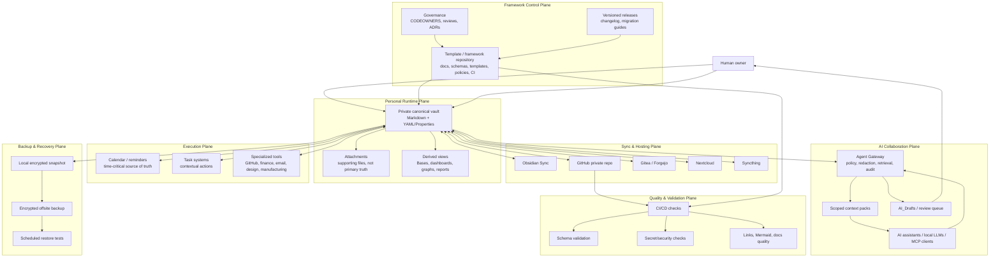

---

## 6. Control Plane vs Runtime Plane

### 6.1. Framework Control Plane

Framework Control Plane — это **общая инженерная база** проекта.

Он содержит:

```text
life-os-framework/
├── README.md
├── SECURITY.md
├── CONTRIBUTING.md
├── CHANGELOG.md
├── ROADMAP.md
├── docs/
├── vault-template/
├── schemas/
├── templates/
├── profession-packs/
├── policies/
├── automations/
├── examples/
├── tests/
└── .github/
```

Разрешено хранить:

- generic documentation;
- schemas;
- templates;
- synthetic examples;
- AI policies;
- validation scripts;
- CI workflows;
- profession pack definitions;
- migration guides;
- release notes.

Запрещено хранить:

- реальные личные данные;
- реальные контакты;
- реальные финансовые exports;
- medical/legal/client confidential records;
- API keys;
- passwords;
- private keys;
- seed phrases;
- raw AI memory dumps;
- identity document scans;
- unreduced sensitive logs.

### 6.2. Personal Runtime Plane

Personal Runtime Plane — это приватный vault пользователя.

Он содержит:

- daily/weekly/monthly notes;
- areas and projects;
- knowledge base;
- profession-specific work data;
- finance context without secrets;
- people / CRM context;
- AI drafts and logs;
- attachments;
- dashboards;
- review history.

Этот слой принадлежит пользователю. Framework может предложить структуру, но не владеет содержимым.

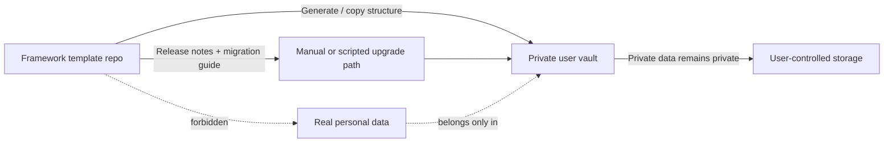

---

## 7. Repository architecture

### 7.1. Production repository layout

```text
life-os-framework/
├── README.md
├── SECURITY.md
├── CONTRIBUTING.md
├── GOVERNANCE.md
├── CHANGELOG.md
├── ROADMAP.md
├── RELEASE_PROCESS.md
├── MIGRATION_GUIDE.md
├── TROUBLESHOOTING.md
│
├── docs/
│   ├── 01_PROJECT_BRIEF.md
│   ├── 02_ARCHITECTURE.md
│   ├── 03_DATA_MODEL.md
│   ├── 04_SECURITY_MODEL.md
│   ├── 05_AI_AGENT_MODEL.md
│   ├── 06_SYNC_BACKUP_RECOVERY.md
│   ├── 07_INSTALLATION.md
│   ├── 08_VAULT_STRUCTURE.md
│   ├── 09_PROFESSION_PACKS.md
│   ├── 10_CALENDAR_NOTIFICATIONS.md
│   ├── 11_AUTOMATION_MODEL.md
│   ├── 12_CI_CD_VALIDATION.md
│   ├── 13_ROADMAP.md
│   ├── 14_DECISIONS_LOG.md
│   └── diagrams/
│
├── vault-template/
│   ├── 00_System/
│   ├── 01_Inbox/
│   ├── 02_Daily/
│   ├── 10_Areas/
│   ├── 20_Projects/
│   ├── 30_Knowledge/
│   ├── 40_Work/
│   ├── 50_Finance/
│   ├── 60_People/
│   ├── 70_AI/
│   ├── 80_Archive/
│   └── 99_Attachments/
│
├── schemas/
├── templates/
├── profession-packs/
├── policies/
├── automations/
├── examples/
├── tests/
└── .github/
    ├── workflows/
    ├── ISSUE_TEMPLATE/
    ├── pull_request_template.md
    └── CODEOWNERS
```

### 7.2. Repository responsibilities

| Path | Responsibility | Canonical? | May contain personal data? |
|---|---|---:|---:|
| `docs/` | Architecture and operating documentation | Yes | No |
| `vault-template/` | Skeleton for new user vaults | Yes | No |
| `schemas/` | JSON/YAML schema definitions | Yes | No |
| `templates/` | Note templates | Yes | No |
| `profession-packs/` | Domain overlays | Yes | No |
| `policies/` | Security, AI, sync, backup policy | Yes | No |
| `automations/` | Scripts and prompts | Yes | No |
| `examples/` | Synthetic example vaults | No, illustrative | No |
| `tests/` | Validation tests | Yes | No |
| `.github/` | CI/governance automation | Yes | No |

### 7.3. Template distribution constraint

GitHub template repositories can generate repositories with the same directory structure and files as the default branch, but branches created from a template have unrelated histories and template repositories cannot include Git LFS files. This creates three design constraints:

1. **Large binary assets must not be part of the framework template.**
2. **Framework updates require versioned releases and migration guides.**
3. **User vault upgrades cannot assume normal upstream merge semantics.**

See [GitHub Template Repositories][github-template-repo].

---

## 8. Vault architecture

### 8.1. Stable vault kernel

The vault kernel is intentionally stable.

```text
My-Life-OS/
├── 00_System/
│   ├── Dashboards/
│   ├── Templates/
│   ├── Bases/
│   ├── Schemas/
│   ├── Policies/
│   ├── Maintenance/
│   └── Operating_Manuals/
│
├── 01_Inbox/
│   ├── Quick/
│   ├── Web/
│   ├── Voice/
│   ├── Imports/
│   └── AI_Drafts/
│
├── 02_Daily/
│   ├── Daily/
│   ├── Weekly/
│   ├── Monthly/
│   └── Yearly/
│
├── 10_Areas/
├── 20_Projects/
├── 30_Knowledge/
├── 40_Work/
├── 50_Finance/
├── 60_People/
├── 70_AI/
├── 80_Archive/
└── 99_Attachments/
```

### 8.2. Folder responsibilities

| Folder | Role | Examples | Special constraints |
|---|---|---|---|
| `00_System` | System configuration, dashboards, policies | Home, bases, templates, schemas | No personal secrets |
| `01_Inbox` | Unprocessed capture | quick notes, web clips, imports | Must be triaged |
| `02_Daily` | Temporal workspace | daily, weekly, monthly reviews | Not a dumping ground |
| `10_Areas` | Long-term responsibilities | health, finance, learning | Reviewed periodically |
| `20_Projects` | Outcome-oriented work | active, waiting, completed | Active projects need next action |
| `30_Knowledge` | Concepts and reference | books, research, maps | Source/provenance required where useful |
| `40_Work` | Profession-specific domain | design, code, teaching, machining | Extended by profession packs |
| `50_Finance` | Finance context | goals, budgets, decisions, subscriptions | No credentials, no seed phrases |
| `60_People` | CRM and relationships | person notes, meetings, commitments | Sensitive by default |
| `70_AI` | AI collaboration layer | agents, prompts, context packs, logs | No raw memory dumps without review |
| `80_Archive` | Inactive material | completed projects, old reviews | Excluded from active dashboards |
| `99_Attachments` | Supporting files | PDFs, images, exports | Metadata note preferred for important files |

### 8.3. Kernel plus overlays

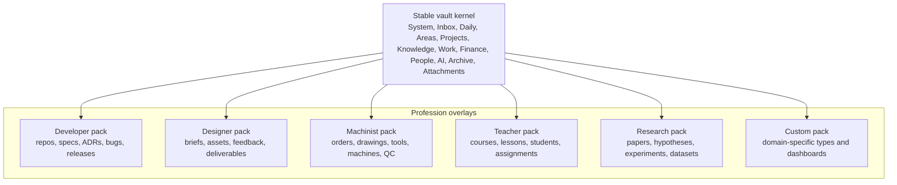

Profession packs **must extend**, not replace, the kernel ontology. This avoids fragmentation across user types.

---

## 9. Data architecture

### 9.1. Canonical vs derived data

| Data class | Examples | Source of truth? | Rebuildable? |
|---|---|---:|---:|
| Canonical notes | typed Markdown notes with frontmatter | Yes | No |
| Attachments | PDFs, images, exports | Sometimes | Partially |
| Bases | `.base` files and embedded views | No | Yes |
| Dashboards | Home, Projects, Finance | No | Yes |
| Search index | Obsidian/search/semantic/vector | No | Yes |
| Context packs | task-specific AI bundles | No | Yes |
| AI summaries | generated summaries | No until accepted | Yes |
| Calendar mirrors | imported events in notes | No | Yes |
| Reports | CI, maintenance, vault health | No | Yes |

Production rule:

> If losing a generated artifact would lose truth, it was incorrectly classified. Truth belongs in canonical typed notes or explicitly managed attachments.

### 9.2. Base note contract

Every important note should include structured metadata:

```yaml
---
id: "project-life-os-framework"
type: "project"
title: "Life OS Framework"
status: "active"
created: "2026-05-18"
updated: "2026-05-18"
area: "systems"
project: "life-os-framework"
tags:
  - life-os
  - architecture
sensitivity: "public"
review:
  cadence: "weekly"
  next: "2026-05-25"
relations:
  people: []
  projects: []
  decisions:
    - "ADR-001"
    - "ADR-004"
  resources: []
source:
  type: "internal"
  url: null
  captured_at: null
---
```

### 9.3. Base ontology

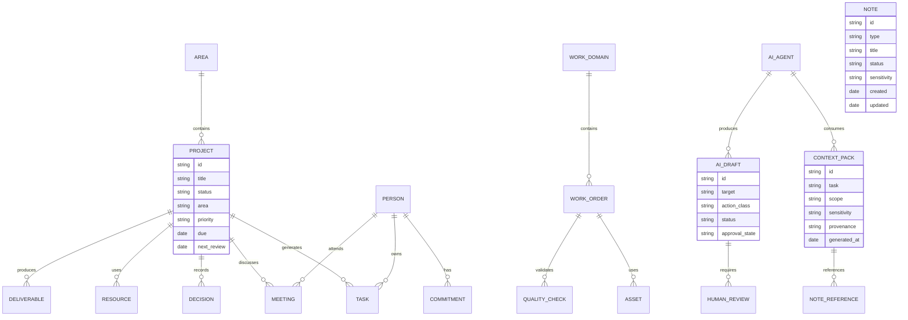

### 9.4. Lifecycle: notes

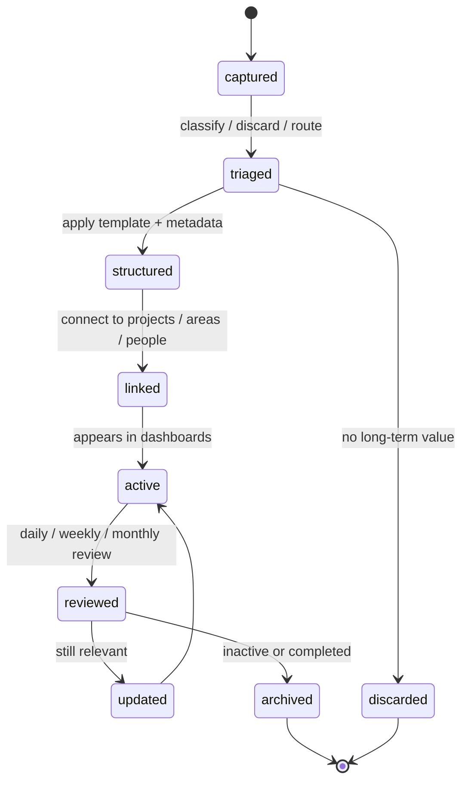

### 9.5. Lifecycle: projects

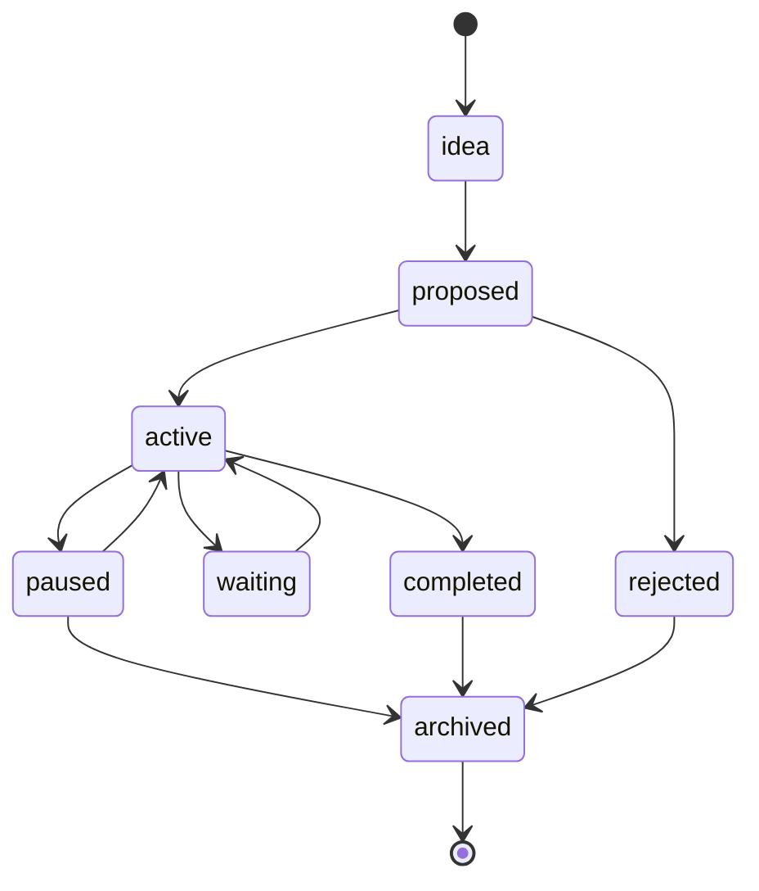

---

## 10. Human operating workflow

The human workflow is intentionally simple:

```text
Capture → Triage → Structure → Link → Act → Review → Improve
```

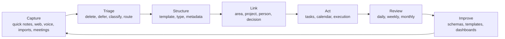

### 10.1. Daily workflow

- open `Today` dashboard or daily note;
- review calendar and critical reminders;
- select top priorities;
- process urgent inbox items;
- work from projects/tasks dashboards;
- capture decisions and context;
- close day with short review.

### 10.2. Weekly workflow

- clear Inbox;
- review active projects;
- verify next actions;
- check waiting-for items;
- review finance attention items;
- review people follow-ups;
- review AI_Drafts;
- update dashboards;
- verify backup status.

### 10.3. Monthly/quarterly workflow

- review areas;
- archive completed work;
- inspect vault health;
- evaluate profession pack fit;
- update goals;
- run restore drill when scheduled;
- review security posture.

---

## 11. AI collaboration architecture

### 11.1. Core model

AI collaboration is mediated by an Agent Gateway.

AI may:

- search scoped context;
- summarize;
- classify;
- draft;
- propose diffs;
- find inconsistencies;
- generate checklists;
- prepare reviews;
- explain architecture;
- assist with migration.

AI must not directly:

- delete canonical files;
- rewrite canonical notes without review;
- access full vault by default;
- expose private context;
- store secrets;
- send external messages;
- move money;
- change permissions;
- execute arbitrary shell commands;
- act on untrusted imported content as instructions.

### 11.2. Agent Gateway

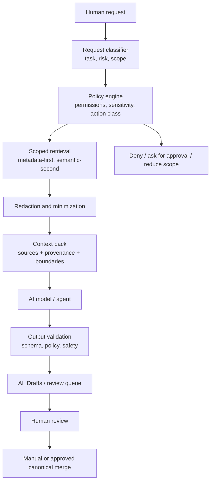

### 11.3. Sequence: safe AI change proposal

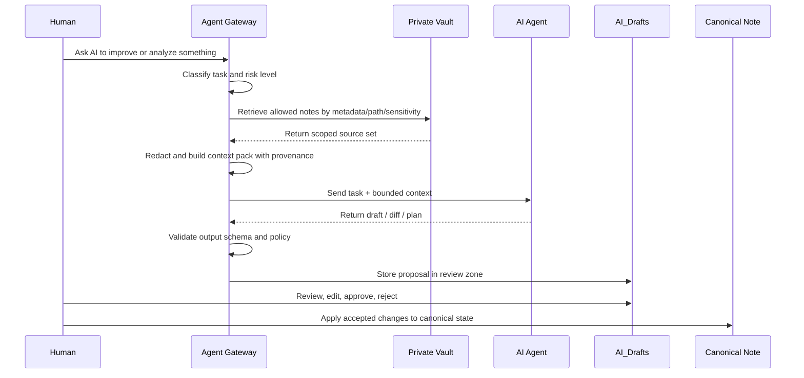

### 11.4. AI action classes

| Class | Examples | Default permission | Human approval |
|---|---|---|---|
| `read-only` | search, summarize, explain | Allowed if scoped | Not always |
| `draft-only` | draft note, checklist, proposal | Allowed to `AI_Drafts` | Before canonical merge |
| `bounded-transform` | propose section edit, metadata fix | Draft proposal only | Required |
| `external-action` | send email, create event, create issue | Blocked by default | Required |
| `destructive` | delete files, erase logs, rewrite history | Forbidden by default | Exceptional process only |
| `sensitive` | finance/legal/health/security | Restricted | Required |
| `irreversible` | money movement, permissions, credentials | Forbidden in normal scope | Out-of-band approval |

### 11.5. Context pack architecture

A context pack is a task-specific, disposable, provenance-rich bundle generated from canonical notes.

```yaml
---
id: "context-pack-weekly-review-2026-W21"
type: "context-pack"
task: "weekly-review"
status: "generated"
generated_at: "2026-05-18T12:00:00+03:00"
sensitivity: "private"
allowed_use:
  - "summarize"
  - "find gaps"
  - "propose next actions"
forbidden_use:
  - "canonical write"
  - "external communication"
  - "financial action"
include:
  paths:
    - "20_Projects/Active"
    - "02_Daily/Weekly"
  types:
    - "project"
    - "weekly-review"
exclude:
  sensitivity:
    - "restricted"
    - "forbidden"
provenance_required: true
expires_at: "2026-05-19T00:00:00+03:00"
---
```

### 11.6. AI security rationale

The architecture treats prompt injection, RAG poisoning and agent abuse as first-class threats. OWASP describes prompt injection as a vulnerability where malicious natural-language input can manipulate model behavior when instructions and data are processed together, with impacts including unauthorized data access, tool actions, and prompt leakage. OWASP RAG guidance states that RAG redistributes risk across ingestion, retrieval, generation and output, and recommends access-control metadata, integrity checks, output validation and observability. OWASP AI Agent guidance recommends least privilege, scoped tools, human-in-the-loop controls, action classification, audit trails, and separation between decision-making and execution.

Therefore, direct AI access to the full vault is not acceptable as a production default.

---

## 12. Security architecture overview

Detailed controls live in `04_SECURITY_MODEL.md`. This architecture defines top-level security boundaries.

### 12.1. Security zones

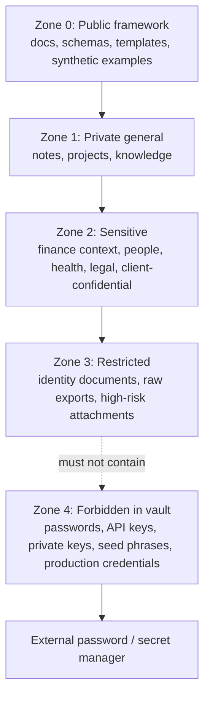

### 12.2. Sensitivity levels

| Level | Meaning | Example | AI access default |
|---|---|---|---|
| `public` | Safe for repo/docs | synthetic examples | Allowed |
| `internal` | Non-public project context | framework planning | Scoped |
| `private` | Personal data | life projects, private notes | Scoped + minimized |
| `sensitive` | Could harm if exposed | people, finances, health | Restricted |
| `restricted` | High-impact / regulated | identity scans, raw legal/medical/client data | Denied unless explicit |
| `forbidden` | Must not be in vault | passwords, seed phrases, private keys | Never |

### 12.3. Forbidden data

The following must not be stored in framework repo or normal vault notes:

- passwords;
- API keys;
- private keys;
- seed phrases;
- production credentials;
- full card numbers;
- full government IDs;
- raw banking exports unless separately encrypted and explicitly needed;
- identity document scans in normal vault storage;
- unreviewed raw AI memory dumps containing private data;
- unredacted logs from external services.

OWASP Secrets Management guidance specifically highlights the risk of API keys, database credentials, IAM permissions, SSH keys and certificates being hardcoded in source code or configuration, and recommends centralized, standardized secrets management with access control and lifecycle management. See [OWASP Secrets Management][owasp-secrets].

### 12.4. Zero-trust posture

The system follows zero-trust principles:

- verify every access;
- minimize context;
- scope every tool;
- classify data;
- separate read, draft, write, execute, delete;
- record provenance;
- fail closed;
- require human approval for high-impact actions.

---

## 13. Sync and hosting architecture

Detailed setup lives in `06_SYNC_BACKUP_RECOVERY.md` and `07_INSTALLATION.md`.

### 13.1. Core rule

> Use **one primary live sync method** per vault. Do not combine multiple live sync engines for the same files unless the user understands and accepts conflict risk.

Obsidian’s own sync guidance warns against mixing multiple sync services for the same vault because it may cause data conflicts or corruption. See [Obsidian sync methods][obsidian-sync-methods].

### 13.2. Supported sync profiles

| Profile | Primary sync | Versioning | Backup | Best for |
|---|---|---|---|---|
| `personal-simple` | Obsidian Sync | Optional Git snapshot | Encrypted local/offsite | Most users |
| `developer` | Obsidian Sync or Syncthing | GitHub/Gitea private repo | Encrypted offsite | Developers, engineers |
| `self-hosted` | Nextcloud or Syncthing | Gitea/Forgejo | Restic/Borg/Kopia | Privacy/self-hosted users |
| `privacy-first` | Syncthing trusted devices | Local Git | Encrypted offline/offsite | Users avoiding SaaS |
| `team-template` | GitHub/Gitea framework repo only | Git | Repo backup | Maintainers |
| `hybrid` | One live sync + Git snapshots | Git | Encrypted offsite | Power users |

### 13.3. Sync architecture

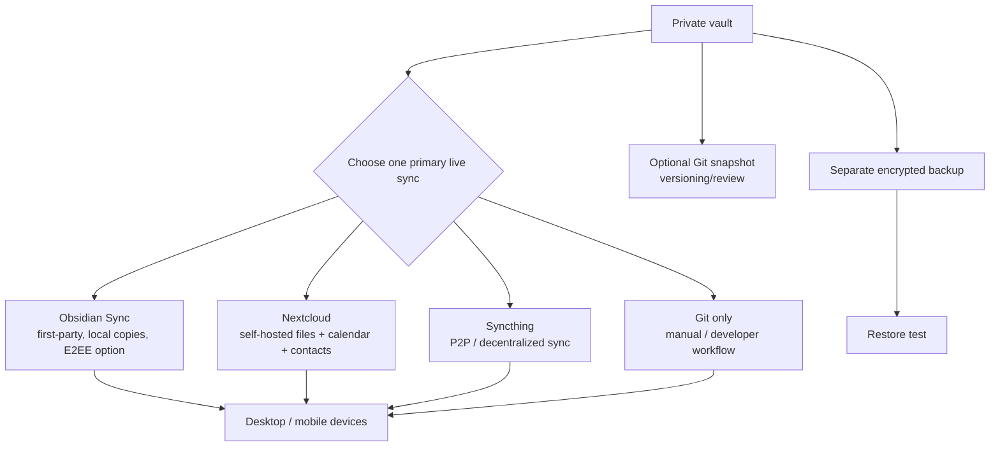

### 13.4. Obsidian Sync

Obsidian Sync is the recommended live sync default for most non-self-hosted users.

Key facts:

- Obsidian stores notes locally and keeps a local copy on devices.
- Obsidian Sync is the first-party sync solution and keeps vaults synced across devices.
- End-to-end encryption is the default and strongest remote vault security option; Obsidian states that not even its team can access notes under E2EE.
- Obsidian Sync uses AES-256 and derives keys using scrypt with salt.
- Obsidian documents trade-offs: some metadata is not end-to-end encrypted, including which device uploaded/deleted a file, when it was uploaded, and the mapping between encrypted file paths and encrypted content.
- Obsidian Headless Sync exists for CI/agents/automation and is currently described as open beta; Obsidian warns not to use both desktop Sync and Headless Sync on the same device.

See [Obsidian Sync Security][obsidian-sync-security], [Obsidian Sync Methods][obsidian-sync-methods], and [Obsidian Headless Sync][obsidian-headless-sync].

### 13.5. GitHub private repository

GitHub is recommended for:

- framework repository;
- docs versioning;
- schema/template review;
- developer vault snapshots;
- pull request workflows;
- CI/CD validation.

Git is not the default live sync solution for all users because it requires push/pull discipline and is not designed as a conflict-free mobile-first sync engine. Obsidian notes that Git provides strong version control but syncing is not automatic. See [Obsidian sync methods][obsidian-sync-methods].

### 13.6. Nextcloud

Nextcloud is recommended when the user wants self-hosted files, calendar, contacts and collaboration. Nextcloud documentation describes it as installable on a user’s own Linux server and includes desktop clients. See [Nextcloud Docs][nextcloud-docs].

Important constraints:

- Nextcloud desktop client can create conflict files when local and remote versions change between sync runs.
- Nextcloud Server-Side Encryption protects file contents at rest on storage, but keys are stored on the server and SSE does not protect against a compromised server or malicious administrator; E2EE is the appropriate threat model when server admins must not access data.
- Nextcloud Calendar/CalDAV can send invitations and event reminders if configured.

See [Nextcloud conflicts][nextcloud-conflicts], [Nextcloud encryption][nextcloud-encryption], and [Nextcloud Calendar/CalDAV][nextcloud-calendar].

### 13.7. Syncthing

Syncthing is recommended for decentralized local-first sync and privacy-first users.

Important constraints:

- Syncthing detects conflicting changes and creates `.sync-conflict-...` files.
- Syncthing file versioning applies to changes received from other devices, not local changes made on the same device.
- Syncthing untrusted/encrypted devices can store encrypted data on a device that should not see plaintext, but this feature is still marked beta/testing in the docs.

See [Syncthing conflicts][syncthing-conflicts], [Syncthing versioning][syncthing-versioning], and [Syncthing untrusted devices][syncthing-untrusted].

---

## 14. Backup and recovery architecture

### 14.1. Core rule

> Sync is not backup. Backup exists only when restore has been tested.

### 14.2. Backup model

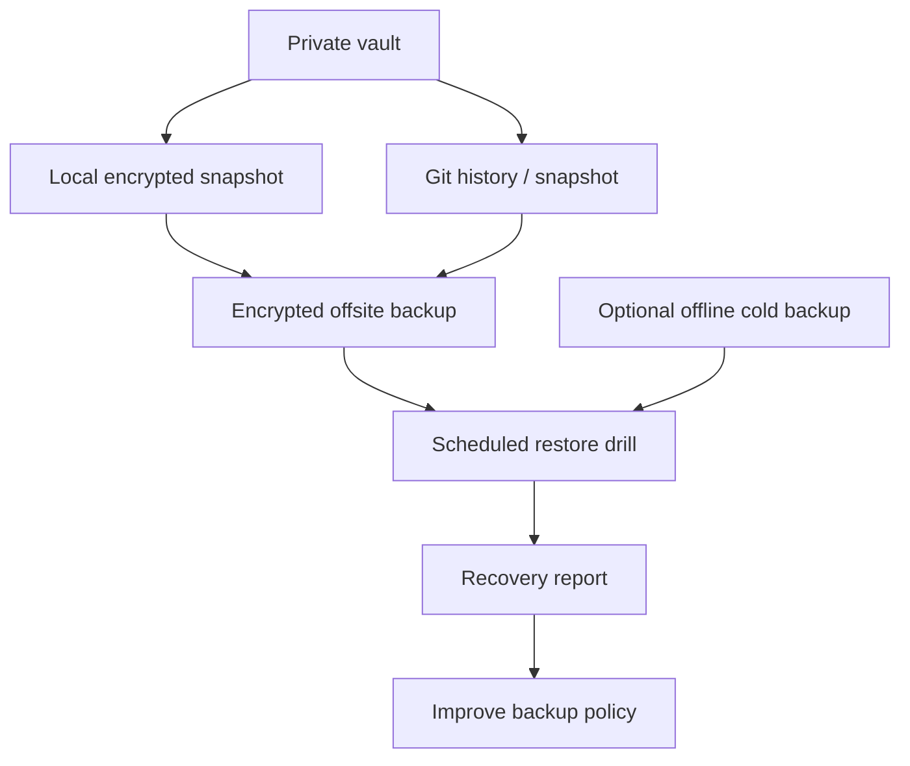

### 14.3. Recovery requirements

| Requirement | Default target | Notes |
|---|---:|---|
| RPO for normal users | ≤ 24h | Maximum acceptable data loss |
| RPO for active developers | ≤ 1h to 4h | Depends on commit/sync cadence |
| RTO for basic vault restore | ≤ 2h | From backup to usable vault |
| RTO for full restore with attachments | ≤ 24h | Depends on attachment volume |
| Restore drill cadence | Monthly or quarterly | More often for sensitive/professional use |
| Backup encryption | Required | Local and offsite |
| Offsite backup | Required for production | Separate from sync provider |

NIST SP 800-184 emphasizes recovery planning, realistic test scenarios, recovery playbooks, testing and continuous improvement. See [NIST SP 800-184][nist-sp800-184].

---

## 15. Calendar, task and notification architecture

### 15.1. Core rule

> Calendar/reminders own time-critical execution. Obsidian owns context.

### 15.2. Responsibilities

| System | Responsibility | Source of truth? |
|---|---|---:|
| External calendar | meetings, deadlines, invitations, reminders | Yes for time |
| System reminders | critical notifications | Yes for alerts |
| Obsidian daily notes | planning, agenda, logs, context | Yes for context |
| Obsidian Tasks | contextual project tasks | Yes for vault tasks |
| Full Calendar / calendar plugins | mirror, view, link events to notes | No unless deliberately configured |

### 15.3. Calendar flow

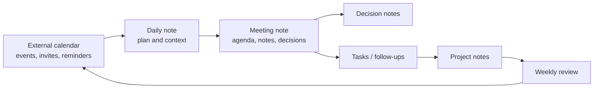

### 15.4. Plugin posture

- Obsidian Tasks can track tasks across the vault, query them, mark them done, and supports due dates, recurring tasks, done dates and filtering. See [Obsidian Tasks][obsidian-tasks].
- Full Calendar Remastered can store events as notes and supports note-based events, Daily Notes, ICS, CalDAV, Google Calendar, Bases and Tasks integration. It is useful as a context layer, but production architecture still treats external calendar/reminder systems as the source of truth for time-critical execution. See [Full Calendar Remastered][full-calendar-remastered].
- Nextcloud Calendar/CalDAV can send invitations and reminder notifications when configured. See [Nextcloud Calendar/CalDAV][nextcloud-calendar].

---

## 16. Profession adaptation architecture

### 16.1. Why profession packs exist

Life OS Framework must support designers, developers, founders, researchers, students, teachers, writers, consultants, lawyers, doctors, operators, craftspersons, machinists and custom professions.

The wrong approach is to create one enormous folder tree for everyone. The right approach is:

```text
Stable kernel ontology
+ profession-specific overlays
+ domain templates
+ domain dashboards
+ quality checklists
+ AI assistance rules
```

### 16.2. Profession pack structure

```text
profession-packs/{pack-name}/
├── README.md
├── pack.yaml
├── templates/
├── schemas/
├── dashboards/
├── checklists/
├── examples/
├── ai/
│   ├── allowed-context.yaml
│   ├── suggested-prompts.md
│   └── risk-notes.md
└── migration.md
```

### 16.3. Profession pack flow

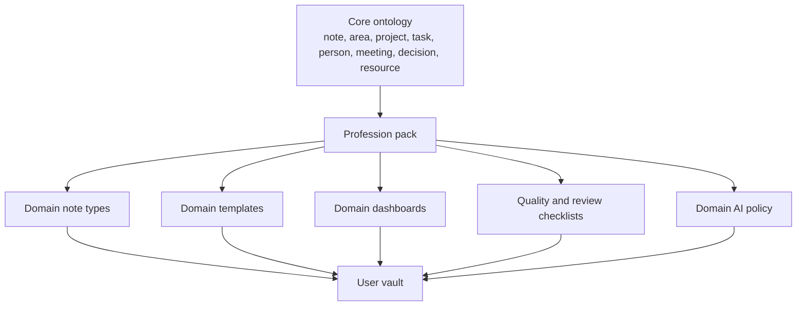

### 16.4. Example overlays

| Profession | Domain objects | Dashboards |
|---|---|---|
| Developer | repository, spec, ADR, bug, release, postmortem | active specs, open ADRs, bugs, releases |
| Designer | client, brief, moodboard, asset, revision, deliverable | feedback, deadlines, portfolio candidates |
| Machinist | work-order, drawing, material, machine, tool, setup, tolerance, QC | active orders, maintenance, quality issues |
| Teacher | course, lesson, student, assignment, feedback, exam | upcoming lessons, grading, student attention |
| Researcher | paper, hypothesis, experiment, dataset, finding | reading queue, experiments, findings |
| Founder | strategy, product, sales, hiring, investor, ops | runway, roadmap, sales pipeline, hiring |
| Lawyer | matter, client, document, deadline, precedent | matters, filings, deadlines |
| Healthcare | protocol, study note, anonymized case, checklist | protocols, continuing education, reviews |

---

## 17. Integration architecture

### 17.1. Integration principles

External systems remain source of truth for specialized domains:

- banking systems own real balances and transactions;
- calendar systems own event notifications;
- GitHub/Gitea own code and issues;
- design tools own editable design files;
- medical/legal/ERP/MES systems own regulated records;
- password managers own secrets;
- Life OS stores context, decisions, summaries, links and review state.

### 17.2. Integration pattern

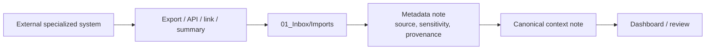

### 17.3. Web capture

Obsidian Web Clipper can highlight pages and save web content to the vault, and Obsidian states that clipped content is saved locally and usage metrics are not collected. For production use:

- every captured source needs provenance;
- web-clipped content is untrusted input;
- AI must not treat clipped text as instructions;
- important sources should be internalized or archived where licensing and policy allow;
- sensitive web capture should be reviewed before AI exposure.

See [Obsidian Web Clipper][obsidian-web-clipper].

---

## 18. Derived artifact architecture

### 18.1. Artifact classes

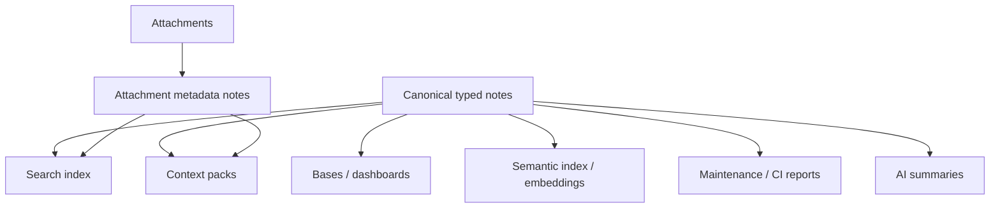

### 18.2. Rules

- Derived artifacts must be rebuildable.
- Derived artifacts must include generation metadata where persisted.
- Derived artifacts must not outlive deletion/retention policy.
- AI summaries are not canonical until reviewed and merged.
- Semantic index chunks must carry note IDs, paths, sensitivity, source and timestamp.
- Restricted/forbidden data must not enter semantic indexes by default.

---

## 19. Automation architecture

### 19.1. Automation classes

| Class | Examples | Default |
|---|---|---|
| Safe automation | lint docs, validate schemas, generate reports | Allowed in CI |
| Review-required automation | propose metadata changes, generate dashboards | Draft output only |
| Sensitive automation | backup, restore, redaction, migration | Requires explicit execution and logs |
| Forbidden automation | delete canonical notes, move money, expose secrets | Denied by default |

### 19.2. Automation flow

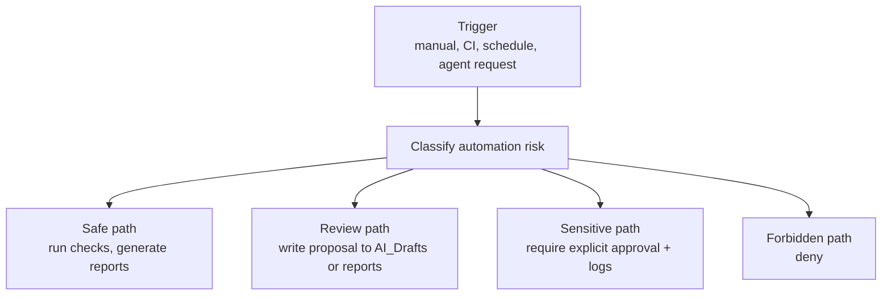

---

## 20. CI/CD and validation architecture

### 20.1. CI quality gates

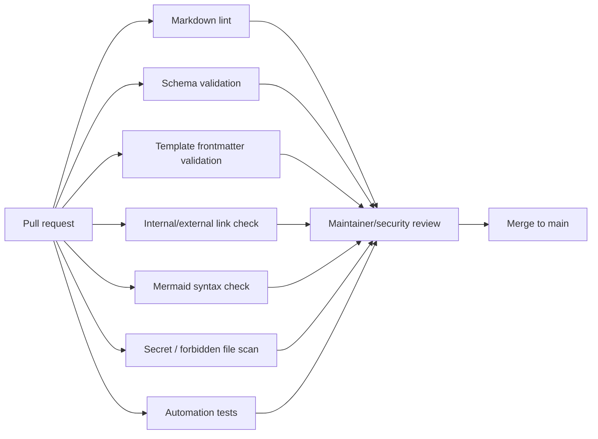

### 20.2. Repository protection baseline

For framework repository:

- protected main branch;
- required pull request reviews;
- required status checks;
- CODEOWNERS review for schemas/security/AI/policies;
- secret scanning;
- push protection;
- dependency/security scanning for automation code;
- signed commits optional but recommended for maintainers;
- release tags and changelog.

GitHub protected branches can require pull request reviews and status checks before merge. CODEOWNERS automatically requests review from responsible owners. Secret scanning detects hardcoded credentials in Git history and other repo surfaces; push protection blocks contributors from pushing secrets. See [GitHub Protected Branches][github-protected-branches], [GitHub CODEOWNERS][github-codeowners], [GitHub Secret Scanning][github-secret-scanning], and [GitHub Push Protection][github-push-protection].

---

## 21. Performance and scalability architecture

### 21.1. Scalability risks

Vault degradation usually comes from:

- missing metadata;
- uncontrolled tags;
- duplicated notes;
- large binary files treated as knowledge;
- unbounded inbox;
- stale dashboards;
- unreviewed AI output;
- unrestricted semantic indexing;
- sync conflicts;
- no archive policy;
- no retention/deletion propagation.

### 21.2. Optimization rules

| Area | Rule |
|---|---|
| Metadata | Important notes require `type`, `status`, `sensitivity`, `created`, `updated` |
| Dashboards | Build from properties and queries, not hand-maintained lists |
| Attachments | Important attachments need metadata notes and summaries |
| Inbox | Must be processed by review cadence |
| Archive | Archived notes excluded from active dashboards by default |
| AI | AI output goes to draft/review zones |
| Semantic index | Metadata-first retrieval, sensitivity filtering, rebuildable index |
| Sync | One primary live sync method per vault |
| Backup | Restore-tested encrypted backup |
| Profession packs | Extend kernel; do not fork core ontology |

### 21.3. Performance model

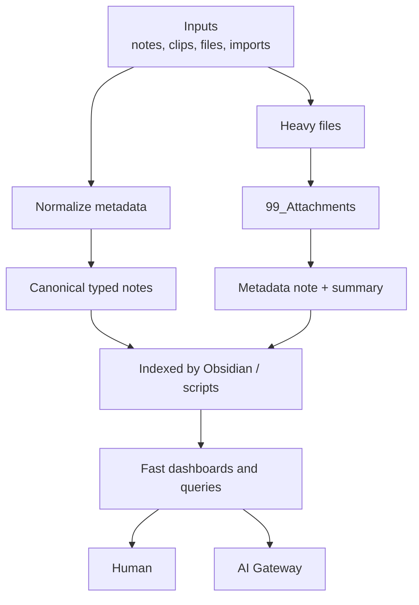

---

## 22. Failure modes and mitigations

| Failure mode | Impact | Mitigation |
|---|---|---|
| User stores secrets in vault | Credential compromise | Forbidden data policy, secret scanning, education |
| AI writes directly to canonical notes | Corruption, privacy leak | Agent Gateway, draft-only writes, human review |
| Multiple sync engines used simultaneously | Conflicts/corruption | One primary live sync method rule |
| Sync mistaken for backup | Data loss after deletion/ransomware | Separate encrypted backups and restore drills |
| Unbounded inbox | System decay | Weekly triage and inbox SLA |
| Dashboards become hand-maintained | Stale truth | Derived views from properties |
| Profession pack forks ontology | Fragmentation | Kernel extension rules and schema review |
| Semantic index includes restricted data | Privacy leak | Sensitivity filters, index policy, deletion propagation |
| Prompt injection in web clips | AI manipulation | Treat imports as untrusted, separate instructions/data |
| Git template updates cannot merge cleanly | Upgrade friction | Versioned releases + migration guides |
| Local device compromise | Vault exposure | Device encryption, backups, secret exclusion |
| Self-hosted admin can read data | Privacy risk | E2EE or Syncthing untrusted device mode where needed |
| Backup encryption key lost | Permanent data loss | Key escrow strategy, documented recovery process |

---

## 23. Threat boundaries

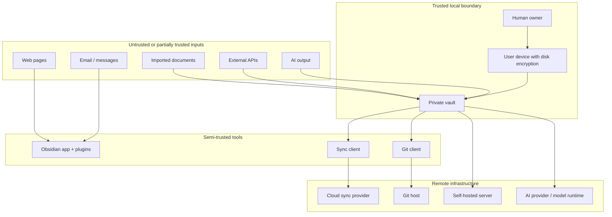

Production implication:

- imported content is data, not instruction;
- AI output is draft, not truth;
- remote systems are not assumed harmless;
- plugins and automations need least privilege;
- sensitive zones need stronger controls than general notes.

---

## 24. Deployment profiles

### 24.1. Personal simple

```yaml
profile: personal-simple
primary_sync: obsidian-sync
versioning: optional-git-snapshot
backup:
  local_encrypted: true
  offsite_encrypted: true
ai:
  mode: manual-context-packs
calendar:
  source_of_truth: external-calendar
best_for:
  - personal productivity
  - learning
  - projects
  - non-technical users
```

### 24.2. Developer

```yaml
profile: developer
primary_sync: obsidian-sync | syncthing
versioning: github-private | gitea | forgejo
backup:
  encrypted_offsite: true
ai:
  mode: agent-gateway
ci:
  schema_validation: true
  markdown_lint: true
  secret_scan: true
best_for:
  - engineers
  - technical founders
  - AI-assisted documentation
```

### 24.3. Self-hosted

```yaml
profile: self-hosted
primary_sync: nextcloud | syncthing
versioning: gitea | forgejo
network: tailscale | wireguard | reverse_proxy
backup: restic | borg | kopia
calendar: nextcloud-calendar
contacts: nextcloud-contacts
ai:
  mode: local-first | controlled-cloud
best_for:
  - privacy-first users
  - homelab users
  - teams with infrastructure capacity
```

### 24.4. Team template maintainers

```yaml
profile: team-template
shared_repo: framework-only
private_vaults: per-user
branch_protection: true
codeowners: true
secret_scanning: true
push_protection: true
release_process: required
migration_guide: required
best_for:
  - framework maintainers
  - organizations
  - professional communities
```

---

## 25. Migration and evolution architecture

### 25.1. Release model

Because user repositories generated from a template have unrelated histories, updates must be versioned and migration-driven.

```mermaid
flowchart LR
    Main["Framework main"]
    Release["Tagged release"]
    Changelog["CHANGELOG.md"]
    Migration["MIGRATION_GUIDE.md"]
    UserVault["Private user vault"]
    Apply["User applies selected changes"]
    Validate["Run validation"]

    Main --> Release
    Release --> Changelog
    Release --> Migration
    Migration --> UserVault
    UserVault --> Apply
    Apply --> Validate
```

### 25.2. Compatibility policy

| Change type | Compatibility | Required process |
|---|---|---|
| New template | Backward-compatible | Changelog |
| New schema optional field | Backward-compatible | Schema version bump |
| Required field added | Breaking | Migration guide |
| Note type renamed | Breaking | Migration script |
| Sensitivity policy tightened | Security-breaking | Security advisory / migration |
| AI permission changed | Security-sensitive | AI/security review |
| Profession pack updated | Pack-specific | Pack changelog |

---

## 26. Production MVP boundary

The MVP must be small but architecturally correct.

### 26.1. MVP includes

- `README.md`;
- `01_PROJECT_BRIEF.md`;
- `02_ARCHITECTURE.md`;
- `03_DATA_MODEL.md`;
- `04_SECURITY_MODEL.md`;
- `05_AI_AGENT_MODEL.md`;
- `06_SYNC_BACKUP_RECOVERY.md`;
- `07_INSTALLATION.md`;
- `08_VAULT_STRUCTURE.md`;
- `09_PROFESSION_PACKS.md`;
- `10_CALENDAR_NOTIFICATIONS.md`;
- `11_AUTOMATION_MODEL.md`;
- `12_CI_CD_VALIDATION.md`;
- `13_ROADMAP.md`;
- `14_DECISIONS_LOG.md`;
- base vault skeleton;
- core schemas;
- core templates;
- AI policy;
- context pack template;
- backup guide;
- CI baseline.

### 26.2. MVP excludes

- unrestricted AI agents;
- direct canonical write access by AI;
- automatic raw finance import;
- unmanaged secrets;
- regulated records as normal notes;
- complex multi-agent orchestration;
- mandatory local LLM;
- mandatory MCP;
- mandatory semantic index;
- real profession data in examples.

---

## 27. Future architecture layers

Advanced layers are designed as extensions, not replacements.

```mermaid
flowchart TB
    Core["Core v1<br/>Markdown, Obsidian, schemas, policies, dashboards"]
    MCP["MCP integration<br/>through gateway only"]
    LocalLLM["Local LLM<br/>privacy-first inference"]
    Semantic["Semantic index<br/>metadata + embeddings"]
    EventBus["Personal event bus"]
    AgentRuntime["Policy-based agent runtime"]
    Federation["Multi-vault federation"]

    Core --> MCP
    Core --> LocalLLM
    Core --> Semantic
    Semantic --> AgentRuntime
    MCP --> AgentRuntime
    LocalLLM --> AgentRuntime
    AgentRuntime --> EventBus
    EventBus --> Federation
```

Future features must preserve:

- human ownership;
- local-first canonical data;
- sensitivity filtering;
- provenance;
- review before canonical mutation;
- rebuildability of derived artifacts;
- deletion propagation.

---

## 28. Architecture roadmap fit

```mermaid
gantt
    title Life OS Framework Architecture Roadmap
    dateFormat YYYY-MM-DD

    section Foundation
    Project brief and ADR log             :done, a1, 2026-05-18, 1d
    Architecture document                 :active, a2, 2026-05-18, 2d
    Data model                            :a3, after a2, 3d
    Security model                        :a4, after a3, 3d
    AI agent model                        :a5, after a4, 3d

    section Runtime
    Vault structure                       :b1, after a5, 2d
    Sync backup recovery                  :b2, after b1, 3d
    Calendar notifications                :b3, after b2, 2d

    section Extensibility
    Profession packs                      :c1, after b3, 4d
    Automation model                      :c2, after c1, 3d
    CI/CD validation                      :c3, after c2, 3d

    section Release
    Installation guide                    :d1, after c3, 3d
    Migration and governance docs         :d2, after d1, 3d
    Production v1.0                       :milestone, d3, after d2, 1d
```

---

## 29. Architecture Definition of Done

The architecture is production-ready when all conditions are true:

```text
[ ] Shared framework repo contains no personal data.
[ ] Private vault is the only canonical runtime data plane.
[ ] Markdown + YAML/Properties are canonical.
[ ] Bases/dashboards/context packs are derived and rebuildable.
[ ] Note ontology is documented and schema-backed.
[ ] Vault kernel is stable.
[ ] Profession packs extend, not fork, the kernel.
[ ] AI access is mediated by Agent Gateway.
[ ] AI writes only to draft/review zones by default.
[ ] Context packs are scoped, minimized, provenance-rich and disposable.
[ ] Sensitive zones and forbidden data policy exist.
[ ] Secrets are externalized to password/secret managers.
[ ] One primary live sync method per vault is selected.
[ ] Backup is encrypted and restore-tested.
[ ] Calendar/reminders own time-critical execution.
[ ] CI validates docs, schemas, templates, links, Mermaid and secrets.
[ ] Branch protection/CODEOWNERS/security checks protect framework repo.
[ ] Release and migration process exists.
[ ] Failure modes and mitigations are documented.
[ ] Documentation set is complete enough for users and maintainers.
```

---

## 30. Architecture summary

The final architecture is:

```text
Framework Template Repository
    ↓
Private User Vault
    ↓
Schema-driven Markdown Knowledge Graph
    ↓
Obsidian Human Interface + Derived Dashboards
    ↓
Scoped Agent Gateway + Context Packs + AI_Drafts
    ↓
External Execution Systems
    ↓
Encrypted Backup + Restore-Tested Recovery
    ↓
Profession Packs + Release/Migration Evolution
```

This architecture is deliberately opinionated. It rejects convenient but unsafe defaults: shared personal vaults, unrestricted AI access, secrets in Markdown, sync-as-backup, AI-generated canonical mutation, and profession-specific schema chaos.

It chooses a more durable line:

> **Human-owned canonical data, machine-readable structure, AI-assisted operation, explicit trust boundaries, recoverable storage, and profession-level extensibility.**

That is the foundation on which the remaining production documentation and implementation should be built.

---

## 31. Reference baseline

This document intentionally references primary or authoritative sources for tool capabilities and security posture. Detailed source mapping should be maintained in each specialized document.

### Obsidian and vault architecture

- [Obsidian Bases][obsidian-bases]
- [Obsidian Properties][obsidian-properties]
- [Obsidian Sync security][obsidian-sync-security]
- [Obsidian sync methods][obsidian-sync-methods]
- [Obsidian Headless Sync][obsidian-headless-sync]
- [Obsidian Web Clipper][obsidian-web-clipper]
- [Obsidian Local REST API & MCP Server][obsidian-local-rest-api]
- [Obsidian Tasks][obsidian-tasks]
- [Full Calendar Remastered][full-calendar-remastered]

### GitHub and repository governance

- [GitHub Template Repositories][github-template-repo]
- [GitHub Protected Branches][github-protected-branches]
- [GitHub CODEOWNERS][github-codeowners]
- [GitHub Secret Scanning][github-secret-scanning]
- [GitHub Push Protection][github-push-protection]

### Security, AI and recovery

- [NIST AI Risk Management Framework][nist-ai-rmf]
- [NIST Cybersecurity Framework][nist-csf]
- [NIST SP 800-184 Cybersecurity Event Recovery][nist-sp800-184]
- [OWASP Secrets Management][owasp-secrets]
- [OWASP Prompt Injection Prevention][owasp-prompt-injection]
- [OWASP RAG Security][owasp-rag]
- [OWASP AI Agent Security][owasp-ai-agent]
- [OWASP MCP Security][owasp-mcp]
- [OWASP Zero Trust Architecture][owasp-zero-trust]

### Self-hosted and sync alternatives

- [Nextcloud documentation][nextcloud-docs]
- [Nextcloud file conflicts][nextcloud-conflicts]
- [Nextcloud encryption][nextcloud-encryption]
- [Nextcloud Calendar/CalDAV][nextcloud-calendar]
- [Syncthing conflicts][syncthing-conflicts]
- [Syncthing file versioning][syncthing-versioning]
- [Syncthing untrusted devices][syncthing-untrusted]

[obsidian-bases]: https://obsidian.md/help/bases
[obsidian-properties]: https://obsidian.md/help/properties
[obsidian-sync-security]: https://obsidian.md/help/sync/security
[obsidian-sync-methods]: https://obsidian.md/help/sync-notes
[obsidian-headless-sync]: https://obsidian.md/help/sync/headless
[obsidian-web-clipper]: https://obsidian.md/help/web-clipper
[obsidian-local-rest-api]: https://community.obsidian.md/plugins/obsidian-local-rest-api
[obsidian-tasks]: https://publish.obsidian.md/tasks/Introduction
[full-calendar-remastered]: https://community.obsidian.md/plugins/full-calendar-remastered

[github-template-repo]: https://docs.github.com/en/repositories/creating-and-managing-repositories/creating-a-template-repository
[github-protected-branches]: https://docs.github.com/en/repositories/configuring-branches-and-merges-in-your-repository/managing-protected-branches/about-protected-branches
[github-codeowners]: https://docs.github.com/en/repositories/managing-your-repositorys-settings-and-features/customizing-your-repository/about-code-owners
[github-secret-scanning]: https://docs.github.com/en/code-security/concepts/secret-security/about-secret-scanning
[github-push-protection]: https://docs.github.com/en/code-security/how-tos/secure-your-secrets/prevent-future-leaks/enabling-push-protection-for-your-repository

[nist-ai-rmf]: https://www.nist.gov/itl/ai-risk-management-framework
[nist-csf]: https://www.nist.gov/cyberframework
[nist-sp800-184]: https://csrc.nist.gov/pubs/sp/800/184/final
[owasp-secrets]: https://cheatsheetseries.owasp.org/cheatsheets/Secrets_Management_Cheat_Sheet.html
[owasp-prompt-injection]: https://cheatsheetseries.owasp.org/cheatsheets/LLM_Prompt_Injection_Prevention_Cheat_Sheet.html
[owasp-rag]: https://cheatsheetseries.owasp.org/cheatsheets/RAG_Security_Cheat_Sheet.html
[owasp-ai-agent]: https://cheatsheetseries.owasp.org/cheatsheets/AI_Agent_Security_Cheat_Sheet.html
[owasp-mcp]: https://cheatsheetseries.owasp.org/cheatsheets/MCP_Security_Cheat_Sheet.html
[owasp-zero-trust]: https://cheatsheetseries.owasp.org/cheatsheets/Zero_Trust_Architecture_Cheat_Sheet.html

[nextcloud-docs]: https://docs.nextcloud.com/
[nextcloud-conflicts]: https://docs.nextcloud.com/server/latest/user_manual/en/desktop/conflicts.html
[nextcloud-encryption]: https://docs.nextcloud.com/server/stable/admin_manual/configuration_files/encryption_configuration.html
[nextcloud-calendar]: https://docs.nextcloud.com/server/stable/admin_manual/groupware/calendar.html
[syncthing-conflicts]: https://docs.syncthing.net/users/syncing.html?highlight=conflict
[syncthing-versioning]: https://docs.syncthing.net/users/versioning.html
[syncthing-untrusted]: https://docs.syncthing.net/users/untrusted.html
