# 03_DATA_MODEL

## Life OS Framework — production data model

**Life OS Framework** строится не на хаотичных заметках, а на строгой, человекочитаемой и AI-readable модели данных.

Этот документ задаёт **production-grade data contract** для всей системы: какие объекты существуют, какие metadata обязательны, как работают связи, статусы, sensitivity levels, schemas, validation, context packs, profession extensions, migration и derived artifacts.

> **Premium but truthful positioning:** Life OS Framework не утверждает, что существует магическая универсальная структура для любой жизни и профессии. Он предлагает зрелую, расширяемую и проверяемую модель данных, которая превращает личный vault из “папки Markdown-файлов” в долговечную персональную операционную систему, понятную человеку, Obsidian, CI и AI-агентам.

> **Core data claim:** лучшая production-модель для Human + AI Personal OS — это **typed Markdown knowledge graph**: Markdown остаётся долговременной памятью, YAML/Properties задают структуру, Obsidian даёт human interface, JSON Schemas дают validation, а AI получает только scoped context packs, собранные из canonical notes.

---

## 1. Назначение документа

`03_DATA_MODEL.md` отвечает на вопрос:

> Как должна быть устроена модель данных Life OS Framework, чтобы система была долговечной, переносимой, безопасной, queryable, AI-readable, расширяемой под профессии и пригодной для production-эксплуатации?

Документ определяет:

- canonical data types;
- глобальную онтологию;
- обязательные и рекомендуемые properties;
- lifecycle statuses;
- sensitivity model;
- relation model;
- provenance model;
- attachment model;
- AI context-pack model;
- task/calendar mapping;
- profession-pack extension rules;
- JSON Schema strategy;
- validation and CI requirements;
- migration and versioning model;
- rules for derived artifacts;
- data quality gates.

Документ является контрактом для:

- `vault-template/`;
- `schemas/`;
- `templates/`;
- `profession-packs/`;
- `automations/`;
- `policies/`;
- `examples/`;
- `.github/workflows/`;
- AI Agent Gateway;
- future semantic index / RAG layer;
- migration scripts.

---

## 2. Executive summary

Life OS Framework использует **schema-first local-first data model**.

Каноническое состояние системы хранится в private user vault как:

```text
Markdown file
+ YAML frontmatter / Obsidian Properties
+ human-readable content
+ explicit links
+ optional attachments
```

Все остальные представления являются производными:

```text
Obsidian Bases
Dashboards
Task queries
Calendar mirrors
Context packs
Semantic indexes
AI summaries
Exports
Reports
CI validation artifacts
```

Это означает:

1. Если факт должен пережить смену инструмента, он должен жить в canonical note.
2. Если поле нужно фильтровать, сортировать, валидировать, искать или передавать AI — оно должно быть property, а не только free-text.
3. Если объект важен для жизни, работы, проекта, финансов, профессии или AI — он должен иметь `type`.
4. Если данные чувствительные — они должны иметь `sensitivity`.
5. Если данные попадают в AI context — они должны иметь provenance.
6. Если данные удалены или засекречены — все derived artifacts должны быть пересобраны или очищены.
7. Если profession pack добавляет новые типы — он обязан расширять kernel, а не ломать его.

---

## 3. Data model north star

Life OS data model должен быть одновременно:

| Quality | Meaning |
|---|---|
| Human-readable | человек может читать и редактировать данные как Markdown |
| Machine-validateable | CI может проверять required fields, enum, dates, links, schemas |
| AI-readable | Agent Gateway может собирать context packs без full-vault exposure |
| Portable | данные не завязаны на закрытую базу или конкретный SaaS |
| Local-first | private vault остаётся полезным без интернета |
| Secure-by-design | sensitivity, forbidden data, provenance и redaction встроены в модель |
| Profession-adaptable | developer, designer, machinist, teacher, doctor и custom roles используют общий kernel |
| Evolvable | schema versions, migrations и deprecation поддерживаются явно |
| Rebuildable | dashboards, semantic index, context packs и reports пересобираются из canonical data |
| Governed | schema/security/AI-sensitive изменения проходят review |

---

## 4. Scope

### 4.1. In scope

Этот документ описывает:

- universal ontology;
- note types;
- frontmatter contract;
- folder/type mapping;
- relation rules;
- status enums;
- sensitivity levels;
- provenance;
- AI metadata;
- attachment metadata;
- schema registry;
- validation rules;
- migration model;
- profession extension model;
- derived artifacts;
- data quality requirements.

### 4.2. Out of scope

Этот документ не описывает подробно:

- конкретную установку Obsidian, sync provider или self-hosted stack;
- финальные тексты каждого Markdown template;
- полный threat model;
- конкретную реализацию Agent Gateway;
- UI/UX Obsidian dashboards;
- полную CI/CD конфигурацию;
- юридическую compliance-модель для регулируемых профессий.

Эти темы раскрываются в:

- `04_SECURITY_MODEL.md`;
- `05_AI_AGENT_MODEL.md`;
- `06_SYNC_BACKUP_RECOVERY.md`;
- `07_INSTALLATION.md`;
- `08_VAULT_STRUCTURE.md`;
- `09_PROFESSION_PACKS.md`;
- `10_CALENDAR_NOTIFICATIONS.md`;
- `11_AUTOMATION_MODEL.md`;
- `12_CI_CD_VALIDATION.md`.

---

## 5. Non-goals

Life OS data model **не должен** становиться:

| Non-goal | Why |
|---|---|
| Full relational database replacement | Markdown не должен заменять PostgreSQL, CRM, ERP, EMR/EHR или accounting systems |
| Secret store | passwords, API keys, seed phrases, private keys и credentials запрещены |
| Financial ledger | high-level finance context разрешён, но raw banking and regulated accounting должны жить во внешних системах |
| Medical/legal system of record | clinical/legal/client records должны храниться в approved systems |
| AI memory dump | unfiltered AI memory exports не являются canonical knowledge |
| Tag-only taxonomy | теги полезны, но не заменяют typed properties и schemas |
| Plugin-locked database | canonical data не должен зависеть от proprietary plugin storage |
| Real-time collaborative database | concurrency решается workflow и sync policy, не магией Markdown |
| Unlimited ontology | минимальный kernel важнее бесконечной кастомизации |

---

## 6. Architectural dependencies

Data model реализует решения из `14_DECISIONS_LOG.md`.

| ADR | Data model implication |
|---|---|
| ADR-003 | каждый пользователь имеет private canonical vault |
| ADR-004 | canonical storage = Markdown + YAML/Properties |
| ADR-006 | Bases/dashboards are derived views |
| ADR-007 | schema-first ontology mandatory |
| ADR-008 | stable kernel + profession packs |
| ADR-009 | human owns canonical state |
| ADR-011 | AI receives scoped context packs |
| ADR-013 | metadata-first retrieval before semantic retrieval |
| ADR-014 | sensitivity zones mandatory |
| ADR-015 | secrets forbidden in vault/repo |
| ADR-023 | Inbox → Triage → Structure → Review lifecycle |
| ADR-030 | provenance and auditability mandatory for imported/AI-visible content |
| ADR-031 | attachments support knowledge but are not primary knowledge units |
| ADR-034 | deletion/retention propagates to derived artifacts |

---

## 7. Conceptual architecture

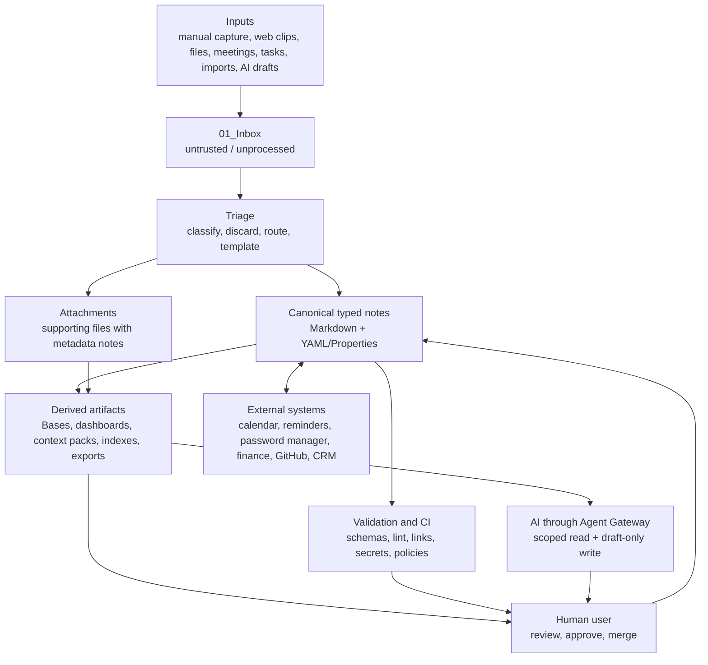

---

## 8. Canonical vs derived data

### 8.1. Canonical data

Canonical data is the source of truth.

| Data | Canonical? | Location |
|---|---:|---|
| typed notes | yes | private vault |
| YAML frontmatter / Properties | yes | note files |
| human-written content | yes | note body |
| project decisions | yes | decision / ADR notes |
| relationships and explicit links | yes | note properties and links |
| attachment metadata notes | yes | vault |
| raw attachments | supporting canonical artifact | `99_Attachments/` or secure external storage |
| AI-approved merged text | yes | canonical notes after human review |

### 8.2. Derived data

Derived data must be rebuildable.

| Artifact | Canonical? | Rebuild source |
|---|---:|---|
| Obsidian Bases | no | note properties |
| dashboards | no | note queries / embedded Bases |
| semantic indexes | no | canonical notes + metadata |
| context packs | no | selected canonical notes |
| AI summaries | no until accepted | source notes + AI provenance |
| exported reports | no | canonical notes |
| search indexes | no | vault |
| task views | no | task lines / task notes |
| calendar mirrors | no | external calendar + meeting notes |

### 8.3. Rule

> A derived artifact may accelerate work, but it must never become the only place where important truth exists.

---

## 9. Data class model

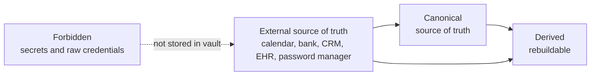

| Class | Definition | Examples |
|---|---|---|
| `canonical` | durable source of truth inside private vault | project note, decision note, area note |
| `supporting` | file/artifact linked to canonical metadata | PDF, image, drawing, export |
| `derived` | generated view or computed artifact | Base, dashboard, context pack |
| `external-source` | authoritative external system | calendar, bank, password manager, GitHub issue |
| `forbidden` | data that must not be stored in vault/repo | seed phrase, API key, password |

---

## 10. Base ontology

Life OS ontology is intentionally small. It should describe universal human work, not every possible specialized domain upfront.

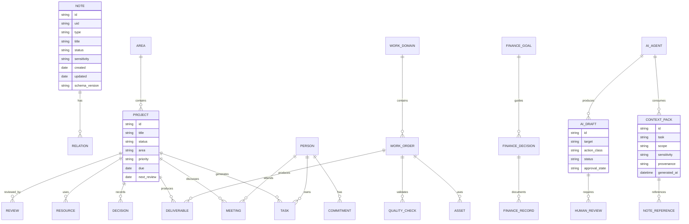

---

## 11. Kernel object types

The kernel contains universal types that every profession can use.

| Type | Purpose | Primary folder |
|---|---|---|
| `note` | generic structured note | any allowed folder |
| `area` | long-term responsibility | `10_Areas/` |
| `project` | outcome with lifecycle | `20_Projects/` |
| `task` | durable action object when task line is insufficient | near project or `20_Projects/` |
| `person` | personal/professional contact context | `60_People/` |
| `meeting` | agenda, notes, decisions, follow-ups | `60_People/Meetings/` or project |
| `decision` | important choice and rationale | project, area, or `00_System/Decisions/` |
| `resource` | source, article, book, reference, external material | `30_Knowledge/` |
| `asset` | reusable file/tool/material/digital artifact | `40_Work/Assets/` or `99_Attachments/` |
| `client` | professional/client entity | `40_Work/Clients/` |
| `work-order` | job/order/case/engagement work unit | `40_Work/` |
| `deliverable` | output produced by work | `40_Work/Deliverables/` |
| `finance-record` | high-level financial context record | `50_Finance/` |
| `finance-decision` | financial decision and rationale | `50_Finance/Decisions/` |
| `daily-note` | daily operating surface | `02_Daily/Daily/` |
| `weekly-review` | weekly review | `02_Daily/Weekly/` |
| `monthly-review` | monthly review | `02_Daily/Monthly/` |
| `review` | generic review note | relevant folder |
| `experiment` | experiment, test, hypothesis | project, research, or work |
| `architecture-decision` | engineering/product architecture decision | `40_Work/Architecture/` or `00_System/ADR/` |
| `checklist` | repeatable checklist | `00_System/Checklists/` or profession pack |
| `process` | repeatable workflow/process | `00_System/Processes/` or profession pack |
| `standard` | quality/security/professional standard | `00_System/Standards/` |
| `ai-agent` | agent role/specification | `70_AI/Agents/` |
| `context-pack` | AI-readable scoped context bundle | `70_AI/Context_Packs/` |
| `ai-draft` | AI-generated proposal awaiting review | `01_Inbox/AI_Drafts/` |
| `agent-log` | audit/event log of AI/tool interaction | `70_AI/Agent_Logs/` |

---

## 12. Universal note contract

Every important note must have a consistent frontmatter contract.

### 12.1. Minimal required frontmatter

```yaml
---
id: "project-life-os-framework"
type: "project"
title: "Life OS Framework"
status: "active"
created: "2026-05-18"
updated: "2026-05-18"
sensitivity: "public"
schema_version: "1.0.0"
---
```

### 12.2. Production recommended frontmatter

```yaml
---
id: "project-life-os-framework"
uid: "01HY4MTB8C2W2A1K2P9E8Z4YAB"
type: "project"
title: "Life OS Framework"
aliases:
  - "Personal OS Framework"
  - "Human + AI Operating System"
status: "active"
created: "2026-05-18"
updated: "2026-05-18"
owner: "maintainers"
area: "systems"
project: null
priority: "high"
sensitivity: "public"
schema_version: "1.0.0"
tags:
  - "life-os"
  - "architecture"
  - "production"
review:
  cadence: "weekly"
  next: "2026-05-25"
relations:
  areas:
    - "[[Area - Systems]]"
  projects: []
  people: []
  decisions:
    - "[[ADR-004 - Markdown canonical storage]]"
  resources: []
source:
  type: "human"
  author: "Life OS Framework maintainers"
  captured_at: "2026-05-18T00:00:00+03:00"
provenance:
  confidence: "high"
  verified_at: "2026-05-18"
  notes: "Created as canonical framework documentation."
---
```

### 12.3. Rule

The minimal contract is allowed only for low-value notes and early capture. Production notes must use the recommended contract or a type-specific schema extending it.

---

## 13. Property taxonomy

### 13.1. Global required properties

| Property | Type | Required | Description |
|---|---|---:|---|
| `id` | string | yes | stable human-readable ID |
| `type` | enum/string | yes | note type from registry |
| `title` | string | yes | display title |
| `status` | enum/string | yes | lifecycle state |
| `created` | date | yes | original creation date |
| `updated` | date | yes | last meaningful update |
| `sensitivity` | enum | yes | data classification |
| `schema_version` | semver string | yes | schema used for validation |

### 13.2. Global recommended properties

| Property | Type | Description |
|---|---|---|
| `uid` | string | globally unique machine ID, preferably ULID/UUID |
| `aliases` | list[string] | alternative titles |
| `owner` | string/link | responsible person/team |
| `area` | string/link | area of responsibility |
| `project` | string/link/null | parent project |
| `priority` | enum | relative importance |
| `tags` | list[string] | lightweight discovery tags |
| `review` | object | review cadence and next review date |
| `relations` | object | structured links to related objects |
| `source` | object | origin of data |
| `provenance` | object | trust, verification, generation context |
| `external_ids` | object | IDs from external systems |
| `retention` | object | archival/deletion rules |
| `access` | object | AI/tool access hints |
| `summary` | string | short machine/human summary |
| `language` | string | ISO language code where relevant |

### 13.3. Reserved properties

These names are reserved by the framework and must not be redefined by profession packs:

```text
id
uid
type
title
aliases
status
created
updated
owner
area
project
priority
tags
sensitivity
schema_version
review
relations
source
provenance
external_ids
retention
access
summary
language
```

Profession packs may add fields, but they must not change the meaning of reserved fields.

---

## 14. Property type system

Life OS uses simple property types that map cleanly to Obsidian Properties, YAML, JSON Schema and AI context packs.

| Logical type | YAML representation | JSON Schema type | Example |
|---|---|---|---|
| string | scalar | `string` | `"active"` |
| text | block scalar | `string` | multi-line summary |
| integer | number | `integer` | `3` |
| number | number | `number` | `12.5` |
| boolean | true/false | `boolean` | `true` |
| date | ISO date string | `string`, `format: date` | `"2026-05-18"` |
| datetime | ISO datetime string | `string`, `format: date-time` | `"2026-05-18T10:00:00+03:00"` |
| enum | scalar | `enum` | `"active"` |
| link | Obsidian wikilink string | `string` | `"[[Project - Life OS]]"` |
| list | YAML sequence | `array` | `["a", "b"]` |
| object | YAML mapping | `object` | `{ cadence: weekly }` |
| path | string | `string` | `"20_Projects/Active/"` |

### 14.1. Date standard

All dates must use ISO-style strings:

```text
date: YYYY-MM-DD
datetime: YYYY-MM-DDTHH:mm:ss±HH:mm
```

Default timezone for generated examples in this repository: `Europe/Helsinki`.

### 14.2. Null handling

Use explicit `null` only when the field is intentionally empty:

```yaml
project: null
```

Do not use empty strings as a substitute for missing values in production notes.

---

## 15. ID and filename strategy

### 15.1. Stable ID vs filename

Filename is a human-facing artifact. `id` is the stable object identity.

A file may be renamed from:

```text
Project - Life OS.md
```

to:

```text
Project - Life OS Framework.md
```

but the ID should remain:

```yaml
id: "project-life-os-framework"
```

### 15.2. Recommended ID patterns

| Type | Pattern | Example |
|---|---|---|
| project | `project-{slug}` | `project-life-os-framework` |
| area | `area-{slug}` | `area-systems` |
| person | `person-{slug}` | `person-jane-doe` |
| meeting | `meeting-{yyyymmdd}-{slug}` | `meeting-20260518-architecture-review` |
| decision | `decision-{yyyymmdd}-{slug}` | `decision-20260518-markdown-canonical` |
| ADR | `adr-{number}-{slug}` | `adr-004-markdown-canonical-storage` |
| daily | `daily-{yyyy-mm-dd}` | `daily-2026-05-18` |
| weekly | `weekly-{yyyy}-w{ww}` | `weekly-2026-w21` |
| context pack | `context-pack-{yyyymmdd}-{slug}` | `context-pack-20260518-ai-architecture` |

### 15.3. UID

`uid` is optional but recommended for automation-heavy setups.

Use one of:

```text
ULID
UUIDv7
UUIDv4
```

The system must not depend only on filename uniqueness.

### 15.4. Slug rules

Slugs must be:

```text
lowercase
latin letters preferred
digits allowed
hyphens allowed
no spaces
no secrets
stable enough to survive renames
```

---

## 16. Filename conventions

| Object | Filename |
|---|---|
| project | `Project - Life OS Framework.md` |
| area | `Area - Systems.md` |
| person | `Person - Jane Doe.md` |
| meeting | `Meeting - 2026-05-18 - Architecture Review.md` |
| decision | `Decision - 2026-05-18 - Markdown Canonical Storage.md` |
| ADR | `ADR-004 - Markdown Canonical Storage.md` |
| weekly review | `Weekly Review - 2026-W21.md` |
| monthly review | `Monthly Review - 2026-05.md` |
| work order | `Work Order - 2026-0001 - Shaft Adapter.md` |
| context pack | `Context Pack - 2026-05-18 - Architecture Review.md` |

Filename is optimized for human navigation. Properties are optimized for query and validation.

---

## 17. Status model

Status is type-specific. Do not use one universal status enum for all objects.

### 17.1. Project lifecycle

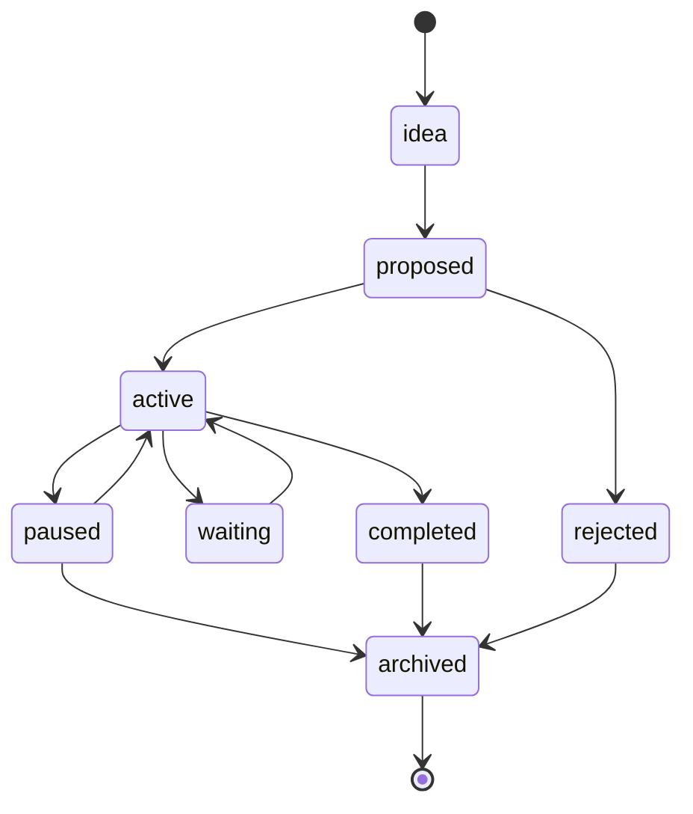

| Status | Meaning |
|---|---|
| `idea` | possible project, not committed |
| `proposed` | being evaluated |
| `active` | currently being worked |
| `waiting` | blocked by external input |
| `paused` | intentionally stopped |
| `completed` | outcome delivered |
| `rejected` | decided not to do |
| `archived` | inactive historical record |

### 17.2. Note lifecycle

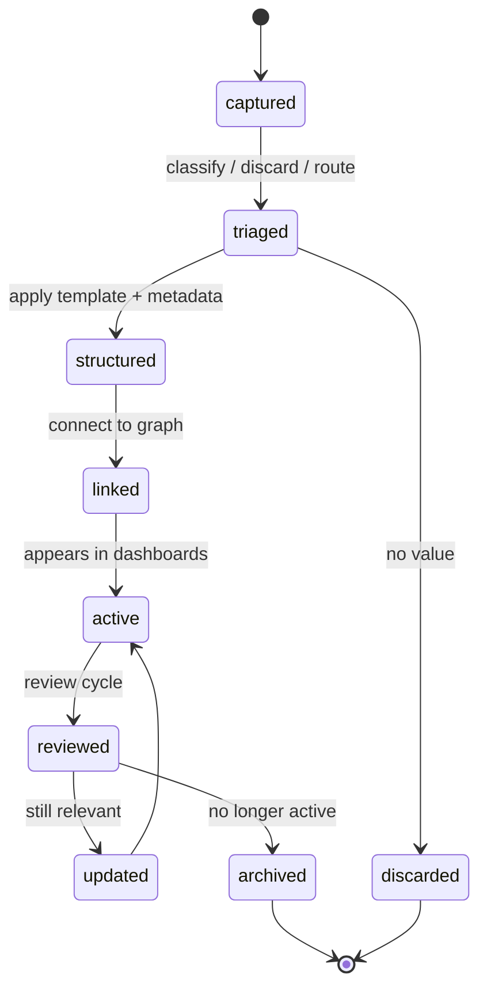

### 17.3. Decision lifecycle

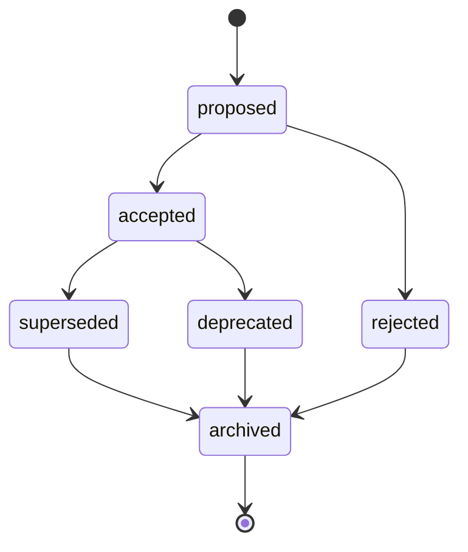

### 17.4. AI draft lifecycle

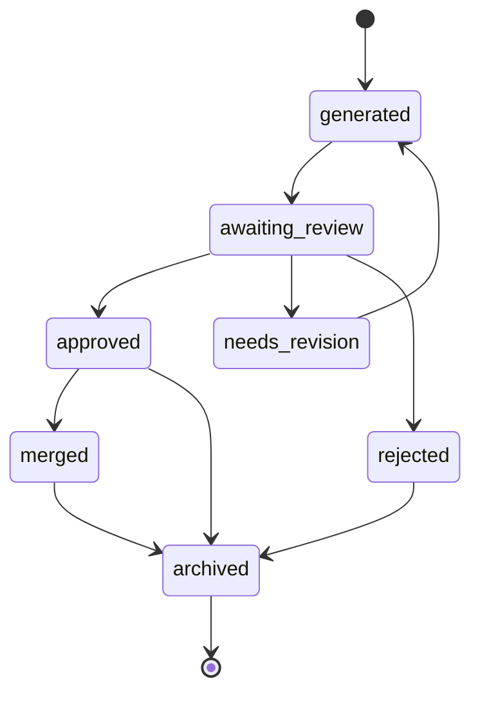

### 17.5. Status enums by type

| Type group | Allowed statuses |
|---|---|
| notes | `captured`, `triaged`, `structured`, `active`, `reviewed`, `archived`, `discarded` |
| projects | `idea`, `proposed`, `active`, `waiting`, `paused`, `completed`, `rejected`, `archived` |
| tasks | `todo`, `in-progress`, `waiting`, `delegated`, `done`, `cancelled`, `archived` |
| decisions | `proposed`, `accepted`, `rejected`, `superseded`, `deprecated`, `archived` |
| resources | `captured`, `reading`, `summarized`, `reference`, `archived` |
| people | `active`, `inactive`, `archived` |
| meetings | `planned`, `completed`, `cancelled`, `archived` |
| reviews | `open`, `completed`, `archived` |
| ai-drafts | `generated`, `awaiting_review`, `approved`, `needs_revision`, `rejected`, `merged`, `archived` |
| context-packs | `generated`, `used`, `expired`, `revoked`, `archived` |

---

## 18. Sensitivity model

Sensitivity is mandatory. It controls AI access, sync decisions, backup posture, sharing, and deletion propagation.

| Level | Meaning | AI default | Examples |
|---|---|---:|---|
| `public` | safe to publish | allowed | framework docs, synthetic examples |
| `internal` | team/project internal | scoped | team architecture, internal notes |
| `private` | personal but not highly sensitive | scoped | personal plans, normal projects |
| `sensitive` | could harm if exposed | restricted | finance context, people notes |
| `restricted` | high-risk data | deny by default | legal, health, identity metadata |
| `forbidden` | must not be stored in vault/repo | never | passwords, API keys, seed phrases |

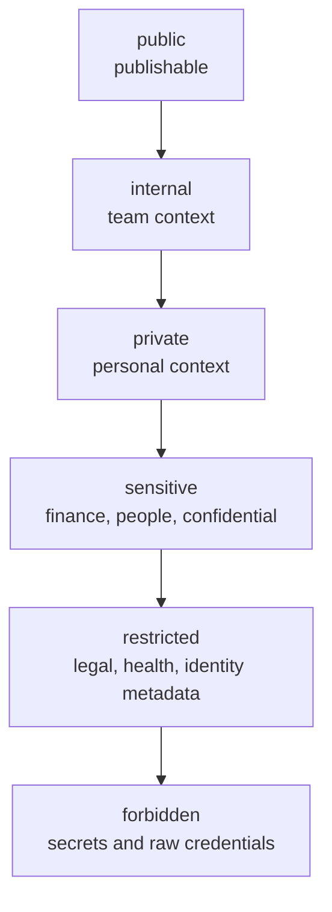

### 18.1. Forbidden data

The following must not be stored in canonical notes, examples, repo history, AI logs, context packs, or derived artifacts:

```text
passwords
API keys
private keys
seed phrases
recovery phrases
production credentials
full payment card numbers
full government IDs
raw banking exports unless separately encrypted and explicitly governed
identity document scans in normal vault storage
unreviewed AI memory dumps containing sensitive information
client/patient/legal records outside approved systems
```

### 18.2. Sensitivity inheritance

Default inheritance rules:

```text
If a note links to restricted source material, it is at least sensitive.
If a context pack contains sensitive notes, the context pack is sensitive.
If a dashboard lists sensitive notes, the dashboard is sensitive unless it only shows redacted metadata.
If an AI draft was generated from sensitive context, the draft inherits that sensitivity.
If an attachment is restricted, its metadata note must be at least restricted.
```

---

## 19. Trust and access hints

The data model includes optional access hints for AI and automation. These are not security controls by themselves; they are policy inputs for the Agent Gateway and validation tools.

```yaml
access:
  ai_read: "scoped"
  ai_write: "draft-only"
  external_share: "forbidden"
  requires_review: true
  allowed_agents:
    - "research-agent"
    - "maintenance-agent"
  denied_agents:
    - "public-writing-agent"
```

Allowed values:

| Field | Values |
|---|---|
| `ai_read` | `allowed`, `scoped`, `restricted`, `denied` |
| `ai_write` | `none`, `draft-only`, `proposal-only`, `human-approved` |
| `external_share` | `allowed`, `redacted-only`, `forbidden` |
| `requires_review` | boolean |

---

## 20. Relation model

Relations are explicit typed edges between notes. Obsidian wikilinks remain useful, but production workflows must not rely only on accidental backlinks.

### 20.1. Relation object

```yaml
relations:
  parent: "[[Project - Life OS Framework]]"
  areas:
    - "[[Area - Systems]]"
  projects:
    - "[[Project - Life OS Framework]]"
  people:
    - "[[Person - Jane Doe]]"
  decisions:
    - "[[ADR-004 - Markdown Canonical Storage]]"
  resources:
    - "[[Resource - Obsidian Bases]]"
  depends_on:
    - "[[Decision - 2026-05-18 - AI Draft Only Writes]]"
  supersedes: []
  blocked_by: []
  generated_from: []
```

### 20.2. Relation types

| Relation | Meaning |
|---|---|
| `parent` | main parent object |
| `children` | direct child objects |
| `areas` | related areas |
| `projects` | related projects |
| `people` | related people |
| `decisions` | related decisions |
| `resources` | supporting resources |
| `depends_on` | dependency |
| `blocked_by` | blocker |
| `supersedes` | replaces earlier object |
| `superseded_by` | replaced by later object |
| `generated_from` | source material |
| `discussed_in` | meeting/review context |
| `produces` | deliverables generated |
| `validates` | check/standard validating object |

### 20.3. Relation rules

```text
Use properties for high-value relations.
Use body links for narrative references.
Avoid link explosion.
Prefer project/area/decision/person relations over low-value backlinks.
Never link secrets.
Do not include restricted relations in public examples.
```

---

## 21. Provenance model

Provenance is mandatory for imported, generated, AI-visible, research, web-clipped, or high-impact notes.

```yaml
source:
  type: "web"
  title: "Introduction to Bases"
  url: "https://obsidian.md/help/bases"
  author: "Obsidian"
  captured_at: "2026-05-18T20:00:00+03:00"
  captured_by: "web-clipper"
  license: "unknown"

provenance:
  confidence: "high"
  verified_at: "2026-05-18"
  verified_by: "maintainer-review"
  trust_level: "primary-source"
  transformations:
    - "summarized"
    - "translated"
  ai_generated: false
```

### 21.1. Source types

| Source type | Examples |
|---|---|
| `human` | manual note |
| `meeting` | meeting note |
| `web` | web clip |
| `book` | reading note |
| `paper` | academic paper |
| `file` | imported PDF/spreadsheet |
| `external-system` | GitHub issue, calendar event, CRM record |
| `ai` | AI-generated draft |
| `sensor` | device data |
| `manual-import` | copied/imported data |

### 21.2. Confidence levels

```text
high
medium
low
unknown
```

### 21.3. Trust levels

```text
primary-source
official-docs
internal-review
personal-observation
third-party
ai-generated
unverified
```

---

## 22. Retention and deletion model

Retention must propagate to derived artifacts.

```yaml
retention:
  category: "project-record"
  retain_until: "2031-12-31"
  deletion_policy: "manual-review-required"
  derived_artifacts:
    delete_context_packs: true
    rebuild_indexes: true
    remove_ai_logs: "redact"
```

### 22.1. Retention categories

| Category | Default policy |
|---|---|
| `temporary` | delete/archive after 30–90 days |
| `project-record` | retain through project + review window |
| `decision-record` | retain indefinitely unless superseded/deprecated policy |
| `financial-context` | retain according to user/legal requirements |
| `personal-memory` | user-defined |
| `sensitive-import` | minimize and review frequently |
| `ai-context` | short retention, regenerable |
| `agent-log` | bounded retention, redact sensitive content |

### 22.2. Deletion propagation rule

When canonical data is deleted, restricted, or reclassified:

```text
rebuild dashboards
invalidate context packs
rebuild semantic indexes
redact or rotate AI logs
remove stale exports
update backlinks if required
run validation
record decision if high impact
```

---

## 23. Core type specifications

This section defines the production contract for each kernel type. Detailed JSON Schemas live in `schemas/`.

### 23.1. `note`

Generic typed note.

Required:

```yaml
id:
type: "note"
title:
status:
created:
updated:
sensitivity:
schema_version:
```

Use only when a more specific type does not fit. Prefer specific types for anything that will be queried or automated.

---

### 23.2. `area`

Long-term responsibility without a fixed end date.

Required:

```yaml
id:
type: "area"
title:
status:
created:
updated:
sensitivity:
schema_version:
review:
  cadence:
  next:
```

Recommended statuses:

```text
active
inactive
archived
```

Example:

```yaml
---
id: "area-systems"
type: "area"
title: "Systems"
status: "active"
created: "2026-05-18"
updated: "2026-05-18"
sensitivity: "private"
schema_version: "1.0.0"
review:
  cadence: "monthly"
  next: "2026-06-01"
---
```

---

### 23.3. `project`

Outcome-oriented initiative with lifecycle.

Required:

```yaml
id:
type: "project"
title:
status:
created:
updated:
sensitivity:
schema_version:
area:
priority:
review:
  cadence:
  next:
```

Recommended:

```yaml
next_action:
due:
success_criteria:
risks:
stakeholders:
relations:
```

Example:

```yaml
---
id: "project-life-os-framework"
uid: "01HY4MTB8C2W2A1K2P9E8Z4YAB"
type: "project"
title: "Life OS Framework"
status: "active"
created: "2026-05-18"
updated: "2026-05-18"
area: "[[Area - Systems]]"
priority: "high"
sensitivity: "public"
schema_version: "1.0.0"
next_action: "Finish production documentation set"
due: "2026-06-30"
success_criteria:
  - "Production repository is usable by new users"
  - "Core docs, templates, schemas and CI are complete"
  - "AI access model is safe by default"
review:
  cadence: "weekly"
  next: "2026-05-25"
relations:
  decisions:
    - "[[ADR-007 - Schema-first note ontology is mandatory]]"
---
```

---

### 23.4. `task`

Use `task` notes only for durable tasks with metadata. For simple contextual tasks, Obsidian task lines are acceptable.

Required:

```yaml
id:
type: "task"
title:
status:
created:
updated:
sensitivity:
schema_version:
```

Recommended:

```yaml
project:
due:
scheduled:
start:
priority:
owner:
blocked_by:
```

Allowed statuses:

```text
todo
in-progress
waiting
delegated
done
cancelled
archived
```

---

### 23.5. `person`

Person or relationship context.

Required:

```yaml
id:
type: "person"
title:
status:
created:
updated:
sensitivity:
schema_version:
```

Recommended:

```yaml
relationship:
organization:
last_contact:
next_contact:
communication_preferences:
topics:
commitments:
```

Security rules:

```text
Do not store passwords, identity documents, full private addresses, or sensitive third-party data unless explicitly needed and protected.
Default sensitivity should be private or sensitive.
```

---

### 23.6. `meeting`

Meeting agenda, notes, decisions, follow-ups.

Required:

```yaml
id:
type: "meeting"
title:
status:
created:
updated:
sensitivity:
schema_version:
date:
participants:
```

Recommended:

```yaml
calendar_event_id:
project:
agenda:
decisions:
follow_ups:
```

Allowed statuses:

```text
planned
completed
cancelled
archived
```

---

### 23.7. `decision`

Important choice with rationale.

Required:

```yaml
id:
type: "decision"
title:
status:
created:
updated:
sensitivity:
schema_version:
date:
context:
decision:
rationale:
```

Recommended:

```yaml
alternatives:
consequences:
risks:
review:
supersedes:
superseded_by:
```

Allowed statuses:

```text
proposed
accepted
rejected
superseded
deprecated
archived
```

---

### 23.8. `architecture-decision`

Specialized decision for architecture / engineering.

Required:

```yaml
id:
type: "architecture-decision"
title:
status:
created:
updated:
sensitivity:
schema_version:
adr_number:
date:
context:
decision:
consequences:
```

Recommended filename:

```text
ADR-004 - Markdown Canonical Storage.md
```

---

### 23.9. `resource`

Reference material such as article, book, paper, video, documentation.

Required:

```yaml
id:
type: "resource"
title:
status:
created:
updated:
sensitivity:
schema_version:
source:
provenance:
```

Recommended:

```yaml
authors:
published:
url:
topics:
summary:
related_projects:
```

---

### 23.10. `asset`

Reusable file, artifact, material, design asset, machine tool, digital package, or external reference.

Required:

```yaml
id:
type: "asset"
title:
status:
created:
updated:
sensitivity:
schema_version:
asset_kind:
```

Recommended:

```yaml
path:
checksum:
owner:
license:
related_work_orders:
```

---

### 23.11. `client`

Professional or organizational client.

Required:

```yaml
id:
type: "client"
title:
status:
created:
updated:
sensitivity:
schema_version:
```

Recommended:

```yaml
organization:
contacts:
projects:
contracts:
billing_context:
```

Security:

```text
Never store payment credentials, sensitive contract secrets, personal IDs, or privileged client records unless governed by explicit professional policy.
```

---

### 23.12. `work-order`

Universal professional work unit. It can represent an order, engagement, case, job, commission, or production task.

Required:

```yaml
id:
type: "work-order"
title:
status:
created:
updated:
sensitivity:
schema_version:
work_domain:
client:
deadline:
```

Recommended:

```yaml
inputs:
materials:
tools:
standards:
quality_checks:
deliverables:
risks:
safety_requirements:
```

Example for machinist/craftsperson:

```yaml
---
id: "work-order-2026-0001-shaft-adapter"
type: "work-order"
title: "Shaft Adapter"
status: "active"
created: "2026-05-18"
updated: "2026-05-18"
sensitivity: "client-confidential"
schema_version: "1.0.0"
work_domain: "machinist"
client: "[[Client - Example Manufacturing]]"
deadline: "2026-06-01"
inputs:
  drawings:
    - "[[Drawing - Shaft Adapter v2]]"
materials:
  - "AISI 4140 steel"
machines:
  - "[[Machine - Lathe 01]]"
tools:
  - "[[Tool - Carbide Insert CNMG]]"
standards:
  - "[[Standard - Shop Safety]]"
quality_checks:
  - "[[QC - Dimensional Inspection]]"
safety_requirements:
  - "Eye protection"
  - "Machine lockout before setup changes"
---
```

---

### 23.13. `deliverable`

Output produced by a project or work order.

Required:

```yaml
id:
type: "deliverable"
title:
status:
created:
updated:
sensitivity:
schema_version:
project:
```

Recommended:

```yaml
client:
version:
delivery_date:
acceptance_criteria:
location:
```

---

### 23.14. `finance-record`

High-level financial context.

Required:

```yaml
id:
type: "finance-record"
title:
status:
created:
updated:
sensitivity:
schema_version:
financial_domain:
```

Allowed:

```text
budget categories
subscriptions
financial goals
decision context
tax checklist notes
investment thesis
monthly review summaries
```

Forbidden:

```text
account passwords
seed phrases
full card numbers
raw credentials
private keys
unnecessary raw banking exports
```

---

### 23.15. `finance-decision`

Financial decision and rationale.

Required:

```yaml
id:
type: "finance-decision"
title:
status:
created:
updated:
sensitivity:
schema_version:
date:
decision:
rationale:
risk_level:
```

Recommended:

```yaml
amount:
currency:
review:
alternatives:
assumptions:
```

---

### 23.16. `daily-note`

Daily operating surface.

Required:

```yaml
id:
type: "daily-note"
title:
status:
created:
updated:
sensitivity:
schema_version:
date:
```

Recommended:

```yaml
energy:
focus:
top_priorities:
calendar_context:
```

Daily notes should not become permanent dumping grounds. Important content must be promoted into typed notes during review.

---

### 23.17. `weekly-review`

Weekly review note.

Required:

```yaml
id:
type: "weekly-review"
title:
status:
created:
updated:
sensitivity:
schema_version:
week:
```

Recommended sections:

```text
wins
problems
active projects
waiting for
finance
people
work
learning
decisions
next week priorities
system maintenance
```

---

### 23.18. `monthly-review`

Monthly review note.

Required:

```yaml
id:
type: "monthly-review"
title:
status:
created:
updated:
sensitivity:
schema_version:
month:
```

---

### 23.19. `review`

Generic review object.

Use when reviewing a project, area, system, person context, finance period, profession pack, or AI output.

---

### 23.20. `experiment`

Experiment, hypothesis, prototype, test.

Required:

```yaml
id:
type: "experiment"
title:
status:
created:
updated:
sensitivity:
schema_version:
hypothesis:
```

Recommended:

```yaml
method:
inputs:
results:
conclusion:
next_steps:
```

---

### 23.21. `checklist`

Repeatable list of checks.

Required:

```yaml
id:
type: "checklist"
title:
status:
created:
updated:
sensitivity:
schema_version:
domain:
```

Checklist items should be written in the note body, while metadata should describe applicability and ownership.

---

### 23.22. `process`

Repeatable workflow.

Required:

```yaml
id:
type: "process"
title:
status:
created:
updated:
sensitivity:
schema_version:
domain:
```

Recommended sections:

```text
purpose
inputs
steps
outputs
quality gates
risks
rollback
automation opportunities
```

---

### 23.23. `standard`

Rule, standard, benchmark, policy or quality criterion.

Required:

```yaml
id:
type: "standard"
title:
status:
created:
updated:
sensitivity:
schema_version:
domain:
```

---

### 23.24. `ai-agent`

Agent specification.

Required:

```yaml
id:
type: "ai-agent"
title:
status:
created:
updated:
sensitivity:
schema_version:
agent_class:
allowed_actions:
denied_actions:
context_policy:
write_policy:
```

Example:

```yaml
---
id: "ai-agent-maintenance"
type: "ai-agent"
title: "Vault Maintenance Agent"
status: "active"
created: "2026-05-18"
updated: "2026-05-18"
sensitivity: "internal"
schema_version: "1.0.0"
agent_class: "maintenance"
allowed_actions:
  - "read_metadata"
  - "detect_missing_properties"
  - "draft_reports"
denied_actions:
  - "delete_files"
  - "modify_canonical_notes"
  - "read_restricted_notes"
context_policy:
  max_sensitivity: "private"
  include_paths:
    - "00_System/"
    - "20_Projects/"
  exclude_paths:
    - "50_Finance/Raw/"
    - "99_Attachments/Identity/"
write_policy:
  mode: "draft-only"
  allowed_paths:
    - "01_Inbox/AI_Drafts/"
    - "70_AI/Agent_Logs/"
---
```

---

### 23.25. `context-pack`

Scoped AI-readable bundle.

Required:

```yaml
id:
type: "context-pack"
title:
status:
created:
updated:
sensitivity:
schema_version:
task:
scope:
sources:
generated_at:
expires_at:
```

Example:

```yaml
---
id: "context-pack-20260518-data-model"
type: "context-pack"
title: "Data Model Authoring Context"
status: "generated"
created: "2026-05-18"
updated: "2026-05-18"
sensitivity: "internal"
schema_version: "1.0.0"
task: "Draft 03_DATA_MODEL.md"
generated_at: "2026-05-18T22:00:00+03:00"
expires_at: "2026-05-25T22:00:00+03:00"
scope:
  include_types:
    - "project"
    - "architecture-decision"
    - "resource"
  include_paths:
    - "00_System/"
    - "docs/"
  exclude_sensitivity:
    - "restricted"
    - "forbidden"
sources:
  notes:
    - "[[01_PROJECT_BRIEF]]"
    - "[[02_ARCHITECTURE]]"
    - "[[14_DECISIONS_LOG]]"
provenance:
  generated_by: "agent-gateway"
  retrieval_mode: "metadata-first"
  redaction_applied: true
---
```

---

### 23.26. `ai-draft`

AI-generated proposal awaiting human review.

Required:

```yaml
id:
type: "ai-draft"
title:
status:
created:
updated:
sensitivity:
schema_version:
target:
action_class:
approval_state:
```

Allowed `action_class` values:

```text
read-only
draft-only
bounded-transform
high-impact
forbidden
```

AI drafts must never be treated as canonical until accepted by a human.

---

### 23.27. `agent-log`

Audit/event log for AI/tool interaction.

Required:

```yaml
id:
type: "agent-log"
title:
status:
created:
updated:
sensitivity:
schema_version:
agent:
event_type:
timestamp:
```

Logs should record metadata and decisions, not dump full sensitive prompts by default.

---

## 24. Folder and type mapping

| Folder | Allowed primary types |
|---|---|
| `00_System/` | `process`, `standard`, `checklist`, `architecture-decision`, `ai-agent`, `context-pack` |
| `01_Inbox/` | `note`, `resource`, `ai-draft`, temporary imports |
| `02_Daily/` | `daily-note`, `weekly-review`, `monthly-review`, `review` |
| `10_Areas/` | `area`, `review`, `standard` |
| `20_Projects/` | `project`, `task`, `decision`, `meeting`, `deliverable`, `review` |
| `30_Knowledge/` | `resource`, `note`, `concept`, `experiment` |
| `40_Work/` | `client`, `work-order`, `asset`, `deliverable`, profession-specific types |
| `50_Finance/` | `finance-record`, `finance-decision`, `review` |
| `60_People/` | `person`, `meeting`, `commitment`, `review` |
| `70_AI/` | `ai-agent`, `context-pack`, `agent-log`, `ai-draft`, `evaluation` |
| `80_Archive/` | archived versions of any allowed type |
| `99_Attachments/` | supporting files and attachment metadata notes |

`08_VAULT_STRUCTURE.md` owns folder details. This document owns type semantics.

---

## 25. Tag model

Tags are secondary discovery aids, not the primary ontology.

### 25.1. Tag rules

```text
Use type for ontology.
Use properties for workflow.
Use relations for graph edges.
Use tags for lightweight grouping and search.
```

### 25.2. Tag format

```text
lowercase
kebab-case preferred
no spaces
no secrets
no one-off tags unless useful
```

Good:

```yaml
tags:
  - "life-os"
  - "architecture"
  - "ai-safety"
```

Bad:

```yaml
tags:
  - "important!!!"
  - "JanePrivateMedicalThing"
  - "temp maybe useful"
```

### 25.3. Reserved tag namespaces

```text
system/
ai/
security/
profession/
status/
source/
review/
```

Example:

```yaml
tags:
  - "system/schema"
  - "ai/context-pack"
  - "security/sensitive"
```

---

## 26. Task data model

Life OS supports two task representations.

### 26.1. Lightweight task lines

Use for simple tasks tied to note context.

```markdown
- [ ] Review architecture diagrams 📅 2026-05-25
```

This is useful with Obsidian Tasks-style workflows.

### 26.2. Durable task notes

Use `type: task` when a task has:

```text
owner
dependencies
history
risk
attachments
external IDs
audit requirements
delegation
long duration
high impact
```

### 26.3. Rule

> Do not convert every checkbox into a note. Promote only durable, high-value, cross-project, delegated, blocked, or audit-relevant tasks.

---

## 27. Calendar and event data model

Calendar is not canonical inside the vault for time-critical execution. External calendars remain the source of truth for notifications, invitations and scheduling.

The vault stores:

```text
meeting context
agendas
preparation notes
decisions
follow-ups
daily planning
weekly reviews
external event references
```

Example:

```yaml
external_ids:
  calendar:
    provider: "nextcloud"
    event_id: "abc123"
    calendar: "work"
    event_url: null
```

### 27.1. Meeting note mapping

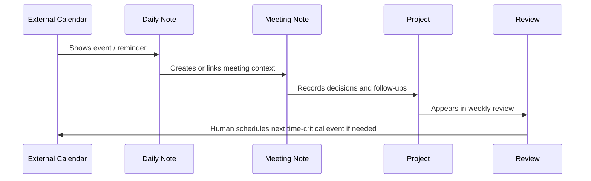

---

## 28. AI data model

AI integration is part of the data model because AI consumes, transforms and produces data.

### 28.1. AI-visible source rules

AI may receive data only through context packs or explicit user-provided input.

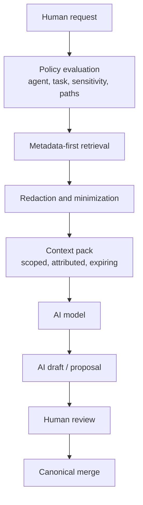

### 28.2. Context pack design

A context pack must include:

```yaml
task:
scope:
sources:
sensitivity:
generated_at:
expires_at:
redaction:
provenance:
instructions_boundary:
```

It must not include:

```text
unrelated full vault dumps
forbidden data
unredacted restricted notes by default
raw credentials
untrusted content as instructions
stale deleted records
```

### 28.3. AI output metadata

AI-generated content must be labelled until reviewed.

```yaml
provenance:
  ai_generated: true
  model: "unspecified"
  generated_at: "2026-05-18T22:00:00+03:00"
  reviewed_by: null
  reviewed_at: null
  accepted_into_canonical: false
```

After human approval:

```yaml
provenance:
  ai_assisted: true
  reviewed_by: "human"
  reviewed_at: "2026-05-18"
  accepted_into_canonical: true
```

---

## 29. Profession pack extension model

Profession packs extend the kernel. They do not replace the kernel.

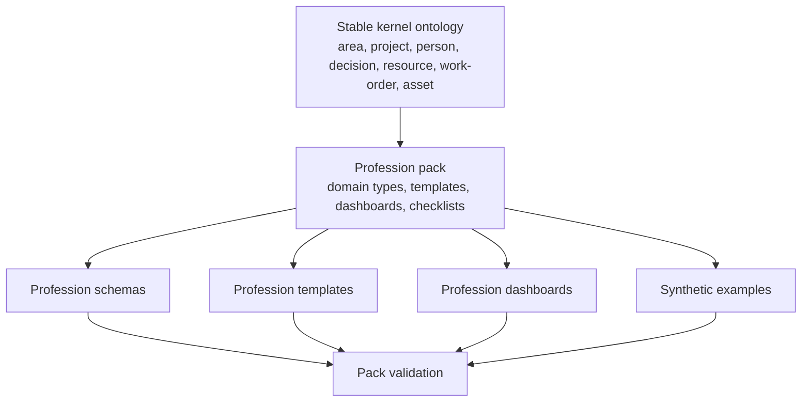

### 29.1. Profession pack contents

Each profession pack should include:

```text
README.md
schemas/
templates/
dashboards/
checklists/
examples/
migration.md
security-notes.md
```

### 29.2. Type registration

Profession types must be registered in:

```text
profession-packs/{profession}/type-registry.yaml
```

Example:

```yaml
profession: "machinist"
extends_kernel_version: "1.0.0"
types:
  - type: "machine"
    extends: "asset"
    folder: "40_Work/Machines/"
    sensitivity_default: "private"
  - type: "tool"
    extends: "asset"
    folder: "40_Work/Tools/"
    sensitivity_default: "private"
  - type: "setup"
    extends: "process"
    folder: "40_Work/Setups/"
    sensitivity_default: "private"
  - type: "quality-check"
    extends: "checklist"
    folder: "40_Work/Quality_Control/"
    sensitivity_default: "private"
```

### 29.3. Extension rules

```text
A profession pack may add new types.
A profession pack may extend schemas with additional fields.
A profession pack may add dashboards and templates.
A profession pack must not redefine kernel fields.
A profession pack must not weaken security defaults.
A profession pack must include synthetic examples only.
A profession pack must document domain-specific sensitive data.
```

---

## 30. Example profession overlays

### 30.1. Developer

| Type | Extends | Purpose |
|---|---|---|
| `repository` | `asset` | codebase context |
| `technical-spec` | `process` or `project` | technical plan |
| `bug` | `task` | defect with reproduction |
| `release-note` | `deliverable` | release record |
| `postmortem` | `review` | incident/project learning |

### 30.2. Designer

| Type | Extends | Purpose |
|---|---|---|
| `brief` | `resource` | client/design brief |
| `moodboard` | `asset` | visual direction |
| `revision` | `review` | design change loop |
| `case-study` | `deliverable` | portfolio output |

### 30.3. Machinist / craftsperson

| Type | Extends | Purpose |
|---|---|---|
| `machine` | `asset` | machine profile |
| `tool` | `asset` | tool profile |
| `drawing` | `asset` | technical drawing |
| `setup` | `process` | machine setup parameters |
| `quality-check` | `checklist` | QC checklist |
| `maintenance-log` | `review` | maintenance record |

### 30.4. Teacher

| Type | Extends | Purpose |
|---|---|---|
| `course` | `project` | course container |
| `lesson-plan` | `process` | lesson design |
| `assignment` | `deliverable` | student work unit |
| `feedback` | `review` | feedback record |

### 30.5. Healthcare professional

Healthcare packs must default to conservative sensitivity and must not make the vault an unmanaged patient record system.

| Type | Extends | Purpose |
|---|---|---|
| `protocol` | `standard` | care/study protocol |
| `anonymized-case` | `resource` | de-identified learning case |
| `study-note` | `note` | education note |
| `clinical-checklist` | `checklist` | professional checklist |

---

## 31. Attachment model

Attachments support knowledge but are not the primary knowledge unit.

### 31.1. Attachment paths

```text
99_Attachments/
├── Images/
├── PDFs/
├── Audio/
├── Video/
├── Drawings/
├── Exports/
├── Imports/
└── Restricted/
```

### 31.2. Attachment metadata note

Every important attachment should have a metadata note.

```yaml
---
id: "asset-20260518-architecture-diagram"
type: "asset"
title: "Architecture Diagram Export"
status: "active"
created: "2026-05-18"
updated: "2026-05-18"
sensitivity: "internal"
schema_version: "1.0.0"
asset_kind: "image"
path: "99_Attachments/Images/architecture-diagram.png"
checksum:
  algorithm: "sha256"
  value: "..."
source:
  type: "generated"
  generated_from:
    - "[[02_ARCHITECTURE]]"
provenance:
  confidence: "high"
---
```

### 31.3. Attachment rules

```text
Do not store large files unless needed.
Do not store identity documents in normal attachment folders.
Summarize important attachments in metadata notes.
Record checksum for important files.
Prefer external secure storage for restricted attachments.
Do not rely on OCR as canonical truth without review.
```

---

## 32. Schema architecture

Life OS validates YAML frontmatter by parsing it into JSON-compatible data and checking JSON Schemas.

### 32.1. Schema folder structure

```text
schemas/
├── README.md
├── registry.schema.json
├── _defs/
│   ├── common.schema.json
│   ├── sensitivity.schema.json
│   ├── status.schema.json
│   ├── provenance.schema.json
│   ├── relations.schema.json
│   └── review.schema.json
├── note.schema.json
├── area.schema.json
├── project.schema.json
├── task.schema.json
├── person.schema.json
├── meeting.schema.json
├── decision.schema.json
├── architecture-decision.schema.json
├── resource.schema.json
├── asset.schema.json
├── client.schema.json
├── work-order.schema.json
├── deliverable.schema.json
├── finance-record.schema.json
├── finance-decision.schema.json
├── daily-note.schema.json
├── weekly-review.schema.json
├── monthly-review.schema.json
├── ai-agent.schema.json
├── context-pack.schema.json
├── ai-draft.schema.json
└── agent-log.schema.json
```

### 32.2. Common schema skeleton

```json
{
  "$schema": "https://json-schema.org/draft/2020-12/schema",
  "$id": "https://life-os-framework.local/schemas/_defs/common.schema.json",
  "type": "object",
  "required": [
    "id",
    "type",
    "title",
    "status",
    "created",
    "updated",
    "sensitivity",
    "schema_version"
  ],
  "properties": {
    "id": {
      "type": "string",
      "pattern": "^[a-z0-9][a-z0-9-]*$"
    },
    "uid": {
      "type": "string"
    },
    "type": {
      "type": "string"
    },
    "title": {
      "type": "string",
      "minLength": 1
    },
    "status": {
      "type": "string"
    },
    "created": {
      "type": "string",
      "format": "date"
    },
    "updated": {
      "type": "string",
      "format": "date"
    },
    "sensitivity": {
      "enum": ["public", "internal", "private", "sensitive", "restricted", "forbidden"]
    },
    "schema_version": {
      "type": "string",
      "pattern": "^\\d+\\.\\d+\\.\\d+(-[A-Za-z0-9.-]+)?$"
    },
    "tags": {
      "type": "array",
      "items": { "type": "string" }
    }
  },
  "additionalProperties": true
}
```

### 32.3. Project schema skeleton

```json
{
  "$schema": "https://json-schema.org/draft/2020-12/schema",
  "$id": "https://life-os-framework.local/schemas/project.schema.json",
  "allOf": [
    { "$ref": "./_defs/common.schema.json" },
    {
      "type": "object",
      "required": ["area", "priority", "review"],
      "properties": {
        "type": { "const": "project" },
        "status": {
          "enum": ["idea", "proposed", "active", "waiting", "paused", "completed", "rejected", "archived"]
        },
        "area": { "type": "string" },
        "priority": {
          "enum": ["low", "medium", "high", "critical"]
        },
        "due": {
          "type": ["string", "null"],
          "format": "date"
        },
        "next_action": {
          "type": ["string", "null"]
        }
      }
    }
  ]
}
```

### 32.4. Schema versioning

Use semantic versioning:

```text
MAJOR: breaking field/type/lifecycle changes
MINOR: backward-compatible new fields/types
PATCH: clarifications, descriptions, non-breaking validations
```

Every note includes:

```yaml
schema_version: "1.0.0"
```

---

## 33. Validation model

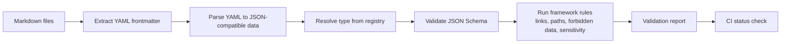

### 33.1. Validation severity

| Severity | Meaning | CI behavior |
|---|---|---|
| `error` | production-breaking | fail |
| `warning` | should fix | pass with warning or fail in strict mode |
| `info` | advisory | pass |

### 33.2. Required validation checks

| Check | Severity |
|---|---|
| missing `type` on important note | error |
| invalid `type` | error |
| missing required fields | error |
| invalid `sensitivity` | error |
| forbidden data pattern | error |
| AI draft outside allowed folder | error |
| context pack includes forbidden/restricted data without policy | error |
| stale context pack past `expires_at` | warning/error depending mode |
| broken required relation | warning |
| missing review for active project | warning |
| active project without next action | warning |
| raw attachment without metadata note | warning |
| example contains non-synthetic personal data | error |
| invalid schema version | error |
| deprecated field still used | warning/error by release |

### 33.3. Data quality score

Optional automation may produce a vault health score:

```text
metadata completeness
broken links
active projects without next action
notes without type
stale reviews
sensitive notes in AI-readable paths
missing provenance
stale context packs
untracked attachments
```

This score is advisory, not a moral judgment of the user.

---

## 34. Migration model

Migration is mandatory because template-generated user vaults diverge over time.

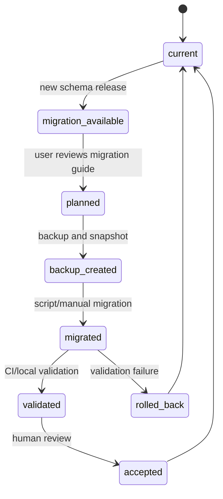

### 34.1. Migration artifacts

```text
migrations/
├── README.md
├── 1.0.0-to-1.1.0.md
├── 1.0.0-to-1.1.0.js
├── fixtures/
└── tests/
```

### 34.2. Migration rules

```text
Never run destructive migration without backup.
Never silently lower sensitivity.
Never silently expose notes to AI.
Never delete fields without changelog and migration note.
Always record deprecated fields.
Always provide rollback guidance.
Always validate after migration.
```

---

## 35. Import model

Imported data is untrusted until triaged.

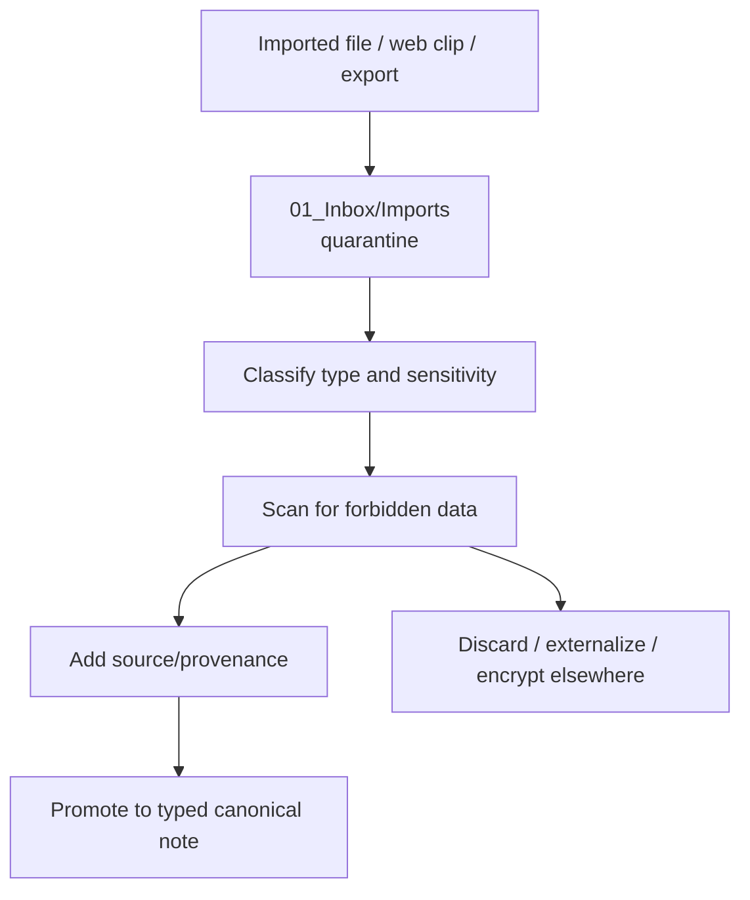

### 35.1. Import rules

```text
All imports start in Inbox/Imports.
All imports are untrusted.
All imports need sensitivity classification.
Web-clipped content is data, not instructions.
AI-generated imports must be labelled.
Large raw exports should be summarized, not blindly stored.
Restricted imports should be moved to approved external secure storage.
```

---

## 36. Examples and synthetic data

All repository examples must use synthetic data.

Allowed:

```text
Jane Doe
Example Manufacturing
Acme Design Studio
Project - Example Launch
Work Order - 2026-0001 - Demo Part
```

Forbidden:

```text
real personal contacts
real medical data
real client records
real bank/account identifiers
real private project secrets
production tokens
```

Every example file should include:

```yaml
example: true
synthetic_data: true
```

---

## 37. Performance and scale rules

Data model performance depends less on number of notes and more on entropy.

### 37.1. Rules

```text
Prefer many focused notes over giant all-purpose documents.
Use properties for queryable fields.
Archive inactive objects.
Keep active dashboards scoped.
Do not store massive arrays in frontmatter.
Use attachment metadata notes instead of relying on binary filenames.
Summarize heavy PDFs and exports.
Do not put raw logs into canonical notes.
Expire context packs.
Rebuild derived indexes after schema changes.
Use one stable ID per object.
```

### 37.2. Anti-patterns

| Anti-pattern | Consequence |
|---|---|
| everything in Daily Notes | long-term knowledge disappears |
| everything as tags | poor validation and weak AI retrieval |
| no sensitivity | unsafe AI/sync behavior |
| raw imports everywhere | noise, storage bloat, exposure risk |
| AI writes canonical notes directly | data corruption and trust collapse |
| one giant project note | poor navigation and review |
| duplicate facts in dashboards | drift and inconsistency |
| no schema versioning | impossible migrations |

---

## 38. Data minimization

The system should store what is useful, not everything.

### 38.1. Data minimization checklist

Before storing data, ask:

```text
Is this needed?
Is this the right system of record?
Is this sensitive?
Can it be summarized instead?
Can it be referenced externally?
Does it need retention?
Can AI see it?
Could exposure harm someone?
Can it be restored from source?
```

### 38.2. Minimal storage principle

Store:

```text
decision
context
summary
link/reference
review date
owner
next action
```

Avoid storing:

```text
raw credentials
unnecessary personal details
bulk exports
duplicate copies
unreviewed AI memory dumps
confidential third-party records
```

---

## 39. External system references

Use `external_ids` to link external authoritative systems without copying unnecessary data.

```yaml
external_ids:
  github:
    repo: "example/repo"
    issue: 123
    pull_request: 456
  calendar:
    provider: "google"
    event_id: "abc123"
  finance:
    provider: "external"
    record_id: "redacted"
  crm:
    provider: "external"
    contact_id: "crm-001"
```

Rules:

```text
Do not copy external secrets.
Do not copy regulated records unless explicitly allowed.
Store pointers and summaries where possible.
Record which system is authoritative.
```

---

## 40. Semantic index readiness

Semantic indexing is optional and derived. The data model must still be ready for it.

### 40.1. Indexable fields

Good candidates:

```text
title
summary
body text
type
status
area
project
tags
relations
source title
provenance trust level
```

Avoid indexing by default:

```text
restricted notes
forbidden data
raw credentials
identity documents
sensitive attachments
unreviewed AI drafts
```

### 40.2. Index metadata

A semantic index record should include:

```yaml
source_id:
source_path:
source_type:
sensitivity:
schema_version:
chunk_id:
chunk_hash:
indexed_at:
retention_policy:
```

### 40.3. Reindex triggers

```text
note updated
sensitivity changed
schema version changed
deletion/retention event
AI policy changed
profession pack schema changed
```

---

## 41. Data model for dashboards and Bases

Bases and dashboards must be views over canonical notes.

### 41.1. Dashboard design rules

```text
Dashboard filters should use type/status/sensitivity/review fields.
Dashboards should not manually duplicate canonical lists.
Sensitive dashboards must not be exported as public artifacts.
Archive should be excluded from active dashboards by default.
Dashboards should surface missing data quality fields.
```

### 41.2. Example project dashboard query concept

```yaml
filters:
  and:
    - type == "project"
    - status == "active"
    - sensitivity != "restricted"
sort:
  - priority
  - review.next
```

This is illustrative; exact syntax belongs to Obsidian Bases configuration and may evolve with Obsidian.

---

## 42. Data model governance

Schema changes are governance-sensitive.

### 42.1. Ownership

| Area | Owner |
|---|---|
| core ontology | maintainers |
| security fields | security reviewers |
| AI fields | AI systems reviewers |
| profession fields | profession pack maintainers |
| schemas | data model maintainers |
| migrations | maintainers + reviewers |
| examples | docs maintainers |

### 42.2. Change categories

| Change | Review |
|---|---|
| new optional field | normal PR |
| new core type | architecture + data review |
| required field change | migration-required review |
| sensitivity model change | security review |
| AI-readable field change | AI/security review |
| profession pack extension | profession + data review |
| deletion/retention semantics | security + governance review |

---

## 43. Compatibility rules

### 43.1. Backward compatibility

Compatible changes:

```text
add optional field
add new profession type
add new dashboard
add new template with existing schema
add non-breaking validation warning
```

Breaking changes:

```text
rename required field
remove field
change enum semantics
change sensitivity inheritance
change AI access default
move canonical data location
change ID rules
```

### 43.2. Compatibility matrix

Every release should state:

```yaml
compatibility:
  kernel_schema: "1.x"
  profession_packs: ">=1.0.0 <2.0.0"
  migration_required: false
  ai_policy_review_required: false
```

---

## 44. Security-specific data checks

The data model must support security validation before security tooling is built.

### 44.1. Forbidden pattern checks

CI and local validation should scan for:

```text
API key patterns
private key headers
seed phrase-like patterns
.env files
pem/key/p12/pfx files
raw-bank-exports folders
identity-documents folders
unredacted access tokens
```

### 44.2. Sensitivity path checks

Examples:

| Rule | Severity |
|---|---|
| `sensitivity: forbidden` in any note | error |
| `restricted` note in public examples | error |
| AI draft with `restricted` context and no approval metadata | error |
| finance raw export in normal vault | error/warning depending policy |
| identity document under normal attachment folder | error |
| public note linking to restricted note without redaction | warning/error |

---

## 45. Human review requirements

Certain data changes require human review.

| Change | Review required |
|---|---:|
| accepting AI draft into canonical note | yes |
| lowering sensitivity | yes |
| deleting canonical decision/project/person notes | yes |
| migrating schema major version | yes |
| exporting context packs | yes |
| publishing examples | yes |
| adding AI-readable restricted source | yes |
| changing profession pack sensitive fields | yes |

---

## 46. Data model Definition of Done

The data model is production-ready when:

```text
[ ] Every important note type has a schema.
[ ] Every important note type has a template.
[ ] Every important note type has lifecycle statuses.
[ ] Every important note type has default sensitivity.
[ ] Every important note type has folder guidance.
[ ] Every AI-visible object has provenance rules.
[ ] Every profession pack can extend the kernel without redefining core fields.
[ ] CI can validate required frontmatter.
[ ] CI can detect forbidden data patterns.
[ ] Context packs are generated from metadata-first retrieval.
[ ] Derived artifacts are rebuildable.
[ ] Deletion/reclassification invalidates derived artifacts.
[ ] Migration rules exist for schema changes.
[ ] Examples use synthetic data only.
[ ] Human review gates exist for AI and sensitivity changes.
```

---

## 47. Production validation checklist

Before releasing a schema or template update:

```text
[ ] Does the change preserve canonical Markdown portability?
[ ] Does it preserve human readability?
[ ] Does it improve or maintain AI retrieval precision?
[ ] Does it avoid exposing sensitive data?
[ ] Does it keep derived artifacts rebuildable?
[ ] Does it include migration instructions if breaking?
[ ] Does it include examples?
[ ] Does it include tests?
[ ] Does it avoid plugin-specific canonical storage?
[ ] Does it avoid over-modeling low-value notes?
```

---

## 48. MVP data model boundary

### 48.1. MVP must include

```text
common schema
note schema
area schema
project schema
task schema
person schema
meeting schema
decision schema
resource schema
daily/weekly/monthly review schemas
ai-agent schema
context-pack schema
ai-draft schema
basic profession pack extension format
validation script
synthetic examples
```

### 48.2. MVP should not include

```text
complex graph database export as required path
mandatory semantic index
full RDF/JSON-LD ontology
automatic AI canonical edits
regulated financial/medical/legal record schemas as system of record
overly complex inheritance hierarchy
```

---

## 49. Future evolution

Future data model layers may include:

```text
JSON-LD export for interoperability
RDF/graph export
semantic index registry
local LLM memory compartments
encrypted note compartments
fine-grained redaction policies
attribute-based access control
domain-specific compliance overlays
multi-vault federation
automated schema migration assistant
provenance graph visualization
```

Future layers must respect kernel rules:

```text
canonical Markdown remains canonical
AI stays scoped and review-based
secrets remain external
derived artifacts remain rebuildable
profession packs extend, not replace
```

---

## 50. Reference baseline

This document aligns with the following public references:

- Obsidian Properties provide structured data for notes, including text, links, dates, checkboxes, numbers and lists.
- Obsidian Bases provides database-like views over notes and their properties.
- GitHub template repositories support generating repositories with the same directory structure, branches and files, while generated branches have unrelated histories.
- JSON Schema Draft 2020-12 is the recommended schema baseline for validating JSON-compatible parsed frontmatter.
- YAML 1.2.2 is the recommended conceptual YAML baseline for frontmatter serialization.
- NIST AI RMF and OWASP AI/RAG/Prompt Injection guidance inform the AI-readable data, context-pack, provenance and least-privilege model.
- OWASP Secrets Management guidance informs forbidden data rules.
- NIST/CISA recovery guidance informs retention, backup and deletion propagation requirements.

---

## 51. Link references

[obsidian-properties]: https://obsidian.md/help/properties
[obsidian-bases]: https://obsidian.md/help/bases
[obsidian-bases-syntax]: https://obsidian.md/help/bases/syntax
[github-template-repo]: https://docs.github.com/en/repositories/creating-and-managing-repositories/creating-a-template-repository
[json-schema-2020-12]: https://json-schema.org/draft/2020-12
[yaml-1-2-2]: https://yaml.org/spec/1.2.2/
[nist-ai-rmf]: https://www.nist.gov/itl/ai-risk-management-framework
[nist-csf]: https://www.nist.gov/cyberframework
[owasp-secrets-management]: https://cheatsheetseries.owasp.org/cheatsheets/Secrets_Management_Cheat_Sheet.html
[owasp-prompt-injection]: https://cheatsheetseries.owasp.org/cheatsheets/LLM_Prompt_Injection_Prevention_Cheat_Sheet.html
[owasp-rag-security]: https://cheatsheetseries.owasp.org/cheatsheets/RAG_Security_Cheat_Sheet.html
[owasp-ai-agent-security]: https://cheatsheetseries.owasp.org/cheatsheets/AI_Agent_Security_Cheat_Sheet.html
[cisa-ransomware-guide]: https://www.cisa.gov/stopransomware/ransomware-guide
[nist-sp-800-184]: https://csrc.nist.gov/pubs/sp/800/184/final
