# 06_SYNC_BACKUP_RECOVERY

## Life OS Framework — production sync, backup and recovery model

> **Strategic promise:** Life OS must feel effortless across devices, but survive device loss, sync conflicts, accidental deletion, provider outage, ransomware, corrupted plugins, failed migrations and human mistakes.
>
> The premium experience is not “everything syncs somehow.” The premium experience is: **your life’s operating context is available, understandable, recoverable and under your control.**

---

## 1. Purpose

This document defines the production-grade sync, backup and recovery architecture for the Life OS Framework.

It specifies:

- how a private Life OS vault is synchronized across devices;
- how Git, Obsidian Sync, Nextcloud, Syncthing, Gitea, Forgejo and hybrid profiles fit into one coherent model;
- how live sync differs from versioning, backup and disaster recovery;
- which storage and transport modes are appropriate for each sensitivity level;
- how to prevent, detect and resolve conflicts;
- how to protect vault data from deletion, corruption, ransomware and provider failure;
- how to define RPO/RTO targets for individuals and teams;
- how to design encrypted backup, restore testing, retention and recovery playbooks;
- how AI agents may assist recovery without owning credentials or canonical state.

This file is an operational contract. It is not a generic recommendation article.

---

## 2. Executive summary

Life OS has one canonical truth: the user’s private vault.

Sync makes that vault convenient.

Backup makes that vault survivable.

Recovery makes backup real.

The production model is built on four hard rules:

1. **Use one primary live sync method per vault.**
   Multiple live-sync engines writing the same files concurrently create avoidable corruption and conflict risk.

2. **Sync is not backup.**
   Sync propagates good changes and bad changes. It can replicate deletion, corruption, ransomware-encrypted files and accidental overwrites.

3. **Backup is not real until restore is tested.**
   A backup that has never been restored is only a belief.

4. **Secrets do not belong in the vault or backup set unless encrypted by an external secret system.**
   Passwords, API keys, private keys, seed phrases and raw credentials must remain in a password manager or secret manager.

The recommended default profiles are:

| User profile | Primary live sync | Versioning | Backup | Notes |
|---|---|---|---|---|
| Personal simple | Obsidian Sync | Obsidian Sync history + optional Git snapshots | Encrypted local + encrypted offsite | Best default for most users. |
| Developer | Obsidian Sync or Syncthing | Private Git repository | Encrypted local + offsite | Git is review/history, not the only live-sync default. |
| Self-hosted privacy | Syncthing or Nextcloud | Gitea/Forgejo private Git | Restic/Borg/Kopia to encrypted offsite | Requires administration discipline. |
| Team template | GitHub/Gitea/Forgejo framework repo | Protected branches + releases | Repository backups + release artifacts | No personal data in shared repo. |
| High sensitivity | Local-first with selective sync | Encrypted snapshots | Offline/immutable encrypted backup | Exclude restricted compartments from broad sync. |
| Mobile-first | Obsidian Sync | Version history | Encrypted server/local backup from desktop or server node | Mobile is capture/review, not sole admin surface. |

---

## 3. North Star

The sync and recovery north star:

> **A Life OS vault must remain usable offline, synchronized intentionally, backed up independently, restored routinely and recoverable after realistic failure.**

This means:

- the user must not be trapped in one SaaS vendor;
- the user must not confuse sync convenience with disaster recovery;
- the framework must support cloud, self-hosted and hybrid deployment;
- the framework must remain useful for non-technical users and powerful for engineers;
- sensitive data must have stricter sync, retention and backup rules;
- AI may help diagnose and draft recovery steps but must not hold backup keys, secret manager passwords or irreversible authority.

---

## 4. Architectural dependencies

This document implements and operationalizes the following existing project decisions.

| Source | Dependency |
|---|---|
| `01_PROJECT_BRIEF.md` | Life OS is local-first, human-owned and profession-adaptable. |
| `14_DECISIONS_LOG.md` | ADR-017, ADR-018, ADR-019 and ADR-020 define the sync/backup core. |
| `02_ARCHITECTURE.md` | Sync and recovery are separate architectural planes around the private vault. |
| `03_DATA_MODEL.md` | Sensitivity, retention and derived artifact rules influence backup scope. |
| `04_SECURITY_MODEL.md` | Backup is a security capability; secrets are forbidden in the vault. |
| `05_AI_AGENT_MODEL.md` | AI can assist recovery only through constrained, human-reviewed workflows. |

Relevant ADRs:

| ADR | Decision |
|---|---|
| ADR-003 | Each user owns a private canonical vault. |
| ADR-014 | Sensitivity zones are mandatory. |
| ADR-015 | Secrets and raw credentials are forbidden in vault and framework repo. |
| ADR-016 | Secrets belong in external password or secret managers. |
| ADR-017 | Use one primary live sync method per vault. |
| ADR-018 | Sync is not backup. |
| ADR-019 | Backup must be encrypted and restore-tested. |
| ADR-020 | Git is versioning/review, not the only live sync default. |
| ADR-021 | Calendar and reminders own time-critical execution. |
| ADR-025 | Branch protection, CODEOWNERS, secret scanning and push protection are baseline controls. |
| ADR-026 | Template updates require release and migration process. |
| ADR-034 | Retention and deletion must propagate to derived artifacts. |
| ADR-035 | Mobile is a capture and review client, not the only administration surface. |

---

## 5. Scope

### 5.1. In scope

This document covers:

- live sync architecture;
- version history architecture;
- backup architecture;
- restore architecture;
- device onboarding and offboarding;
- vault migration between sync providers;
- conflict management;
- storage provider risk;
- self-hosted deployment implications;
- backup encryption and key custody;
- recovery drills;
- AI-assisted recovery boundaries;
- operational dashboards and health checks;
- profiles for individual, developer, self-hosted, high-sensitivity and team-template use.

### 5.2. Out of scope

This document does not define:

- note ontology itself, covered by `03_DATA_MODEL.md`;
- full threat model, covered by `04_SECURITY_MODEL.md`;
- AI agent internals, covered by `05_AI_AGENT_MODEL.md`;
- installation details for every operating system, covered by `07_INSTALLATION.md`;
- full self-hosted server hardening, covered later by `SELF_HOSTED_REFERENCE_STACK.md`.

### 5.3. Non-goals

The framework does not promise:

- zero data loss under all possible scenarios;
- automatic conflict-free multi-user editing of plain Markdown files;
- unlimited storage without cost;
- compliance certification by default;
- perfect confidentiality when a user stores sensitive data in inappropriate locations;
- recovery without keys, credentials, tested backups or restore discipline.

The production promise is more honest and stronger:

> **The framework gives users a clear, tested, security-aware operating model for keeping their Life OS available and recoverable.**

---

## 6. Core terminology

| Term | Meaning | Source-of-truth role |
|---|---|---|
| Canonical vault | User’s private Markdown-based Life OS vault. | Primary truth. |
| Live sync | Propagation of file changes between devices. | Convenience layer. |
| Version history | Time-based or change-based previous versions. | Useful recovery layer, not full backup. |
| Git snapshot | Commit-based record of selected vault files. | Versioning/review layer. |
| Backup | Independent copy designed for recovery. | Recovery layer. |
| Offsite backup | Backup stored outside primary device/location/provider. | Disaster recovery layer. |
| Offline backup | Backup not continuously reachable from compromised devices. | Ransomware resilience layer. |
| Immutable backup | Backup protected from modification/deletion for retention period. | Strong ransomware and insider-risk control. |
| Restore test | Controlled recovery exercise proving backup usability. | Validation layer. |
| RPO | Recovery Point Objective: maximum acceptable data loss window. | Planning target. |
| RTO | Recovery Time Objective: maximum acceptable restore duration. | Planning target. |
| Recovery runbook | Step-by-step procedure for a failure scenario. | Operational guide. |
| Sync conflict | Divergent edits to the same file or path. | Requires human resolution. |
| Restore sandbox | Temporary restore location used to inspect recovered data before replacing canonical data. | Safety layer. |

---

## 7. System overview

The sync, backup and recovery system has five planes.

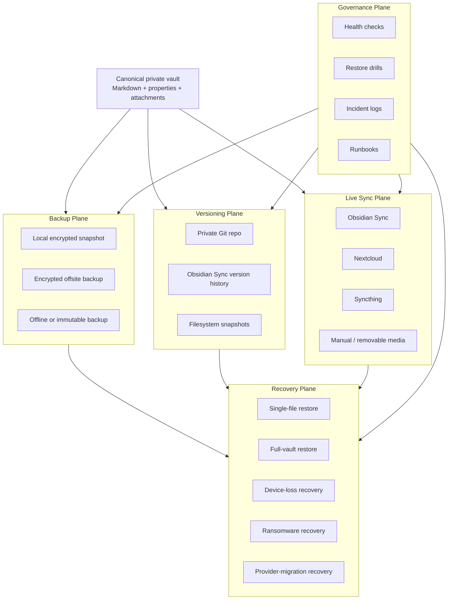

Production rule:

> **Only one live sync method should actively mutate the same vault at a time. Versioning, backup and monitoring can be layered around it.**

---

## 8. Design principles

### 8.1. One primary live sync method

A vault can have many protection layers, but only one live file transport should be primary.

Allowed:

```text
Obsidian Sync + Git snapshot + encrypted offsite backup
Syncthing + private Git snapshot + encrypted offsite backup
Nextcloud + server backup + optional Git snapshot
```

Risky:

```text
Obsidian Sync + Nextcloud live sync on the same folder
Syncthing + Dropbox/Drive live sync on the same folder
Multiple always-on sync clients rewriting .obsidian and notes concurrently
```

### 8.2. Sync is convenience, backup is survival

Sync systems optimize availability across devices. Backup systems optimize recovery after failure.

Sync can propagate:

- accidental deletion;
- bad AI-generated edits if applied to canonical notes;
- corrupted plugin config;
- ransomware-encrypted files;
- malformed imports;
- mistaken mass rename;
- user error.

Therefore sync is never the final recovery control.

### 8.3. Restore testing is mandatory

A backup policy without restore testing is incomplete.

Production restore testing must cover:

- one note;
- one folder;
- one attachment;
- `.obsidian` settings recovery;
- full vault restore into a sandbox;
- recovery on a new device;
- loss of backup server access;
- loss of primary sync provider;
- loss of password manager access procedure.

### 8.4. Sensitive data changes the sync profile

Not all vault zones require the same treatment.

A general reading note and a legal/health/finance record do not have the same sync, retention, sharing or recovery profile.

### 8.5. Human controls recovery

AI can assist with diagnostics and draft recovery steps.

AI must not:

- hold backup encryption keys;
- execute destructive restore actions without explicit approval;
- delete canonical data;
- rotate secrets;
- approve its own recovery plan;
- access forbidden data.

### 8.6. Recovery must be comprehensible under stress

Recovery documentation must be understandable when the user is tired, panicked, travelling, offline or using a new device.

This is why the framework requires runbooks, checklists and restore drills.

---

## 9. Plane separation

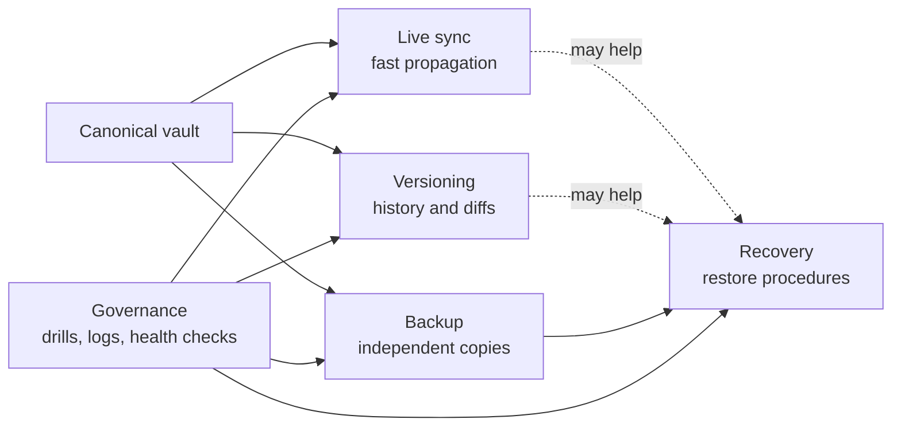

| Plane | Optimizes for | Not optimized for |
|---|---|---|
| Live sync | Multi-device availability | Ransomware recovery, long-term retention, legal preservation |
| Versioning | Change history, diff, rollback | Disaster recovery by itself |
| Backup | Independent recoverability | Real-time access |
| Recovery | Restoring known-good state | Daily note-taking convenience |
| Governance | Reliability and proof | Speed of capture |

---

## 10. Data classification and sync policy

The data model defines sensitivity levels. Sync and backup must honor them.

| Sensitivity | Examples | Live sync | Backup | Special rule |
|---|---|---|---|---|
| `public` | published notes, public docs | Any approved profile | Normal encrypted backup | Can be included in framework examples only if synthetic or public. |
| `internal` | framework docs, non-personal team standards | Git/GitHub/Gitea/Forgejo | Repository backup | No real personal data. |
| `private` | personal projects, learning notes, plans | Obsidian Sync, Syncthing, Nextcloud | Encrypted local + offsite | Default personal vault class. |
| `sensitive` | finance context, people notes, client context | Approved encrypted sync only | Encrypted backup with stricter retention | Minimize data before encrypting. |
| `restricted` | identity docs, legal/health records, high-risk client files | Prefer excluded compartment or dedicated encrypted storage | Offline/immutable encrypted backup | Store references in vault, not raw sensitive files unless explicitly justified. |
| `forbidden` | passwords, API keys, private keys, seed phrases | Never | Never as normal vault backup | Store only in password/secret manager. |

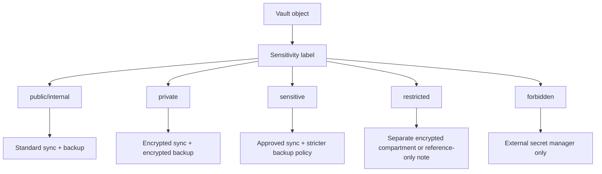

---

## 11. Sync selection model

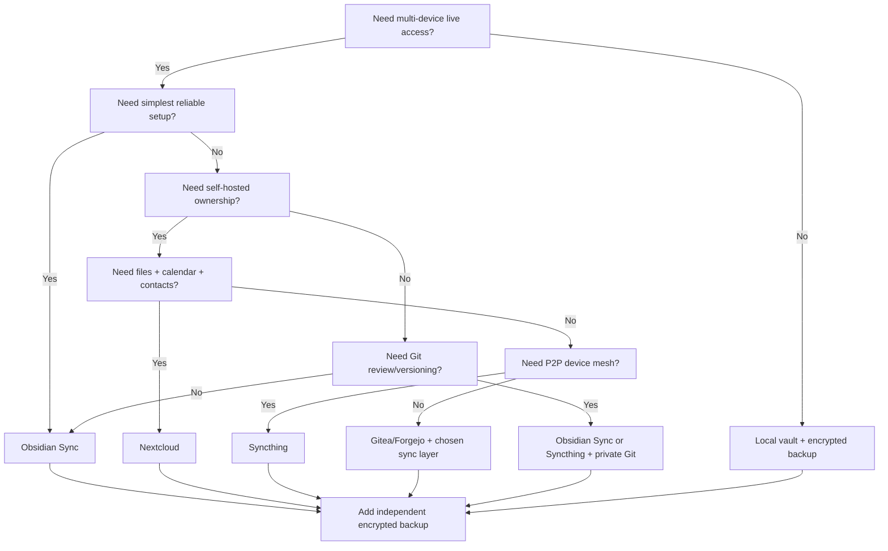

### Default recommendation

| Scenario | Recommended default |
|---|---|
| Most users | Obsidian Sync + encrypted backup. |
| Developers | Obsidian Sync or Syncthing + private Git + encrypted backup. |
| Privacy-first self-hosters | Syncthing or Nextcloud + Gitea/Forgejo + encrypted offsite backup. |
| Team framework repository | GitHub/Gitea/Forgejo with branch protection, releases and no personal data. |
| High-risk compartments | Separate encrypted storage; vault stores reference metadata only. |
| Mobile-heavy use | Obsidian Sync for live sync; desktop/server handles backup and administration. |

---

## 12. Sync profile matrix

| Profile | Skill level | Primary live sync | Versioning | Backup | Best for | Avoid when |
|---|---:|---|---|---|---|---|
| `personal-simple` | Low | Obsidian Sync | Sync version history | Encrypted local + offsite | Most users | Need full self-hosting. |
| `developer-hybrid` | Medium | Obsidian Sync or Syncthing | Private Git | Encrypted backup | Developers, engineers, technical founders | User cannot manage Git conflicts. |
| `self-hosted-nextcloud` | Medium-high | Nextcloud | Optional Git | Server + offsite backup | People wanting files/calendar/contacts on own server | Admin burden is unacceptable. |
| `self-hosted-syncthing` | Medium-high | Syncthing | Optional Git | Encrypted local/offsite | Privacy-first P2P sync | Need web-based collaboration. |
| `team-template` | Medium | Git provider | Releases + protected branches | Repo backup | Shared framework docs and code | Personal data is involved. |
| `high-sensitivity` | High | Selective or no live sync | Encrypted snapshots | Offline/immutable backup | Legal, health, identity, client-confidential | User needs frictionless all-device access. |
| `air-gapped` | High | Manual transfer | Offline snapshots | Offline encrypted media | Extreme privacy/safety | Daily multi-device work is required. |

---

## 13. Supported storage and sync components

### 13.1. Obsidian Sync

Purpose:

- first-party multi-device sync for Obsidian vaults;
- strong default for ordinary users;
- good for mobile and desktop consistency;
- appropriate when simplicity matters more than self-hosting.

Production posture:

```yaml
profile: obsidian-sync
primary_live_sync: true
recommended_for:
  - personal-simple
  - mobile-first
  - developer-hybrid
requires:
  - independent_backup
  - device_encryption
  - account_2fa
  - selective_sync_review
not_sufficient_for:
  - full_disaster_recovery_by_itself
  - forbidden_data_storage
  - untested_backup_substitute
```

Strengths:

- simple setup across desktop and mobile;
- local vault copies remain useful offline;
- first-party integration;
- supports version-history use cases;
- reduces operational burden for non-technical users.

Risks and constraints:

- sync can replicate bad changes;
- provider account compromise is still a risk;
- metadata and service-level behavior must be understood for high-sensitivity use;
- broad sync of restricted compartments may be inappropriate;
- hidden folders, plugin state and configuration behavior must be reviewed.

Required controls:

- enable account MFA where available;
- use strong vault encryption password where applicable;
- store recovery credentials outside the vault;
- review selective sync settings;
- exclude high-risk raw exports and forbidden folders;
- keep independent encrypted backup;
- test restore independently of Sync.

### 13.2. GitHub private repository

Purpose:

- versioning;
- diff/review;
- branch-based changes;
- CI validation;
- release management;
- template repository distribution.

Production posture:

```yaml
profile: github-private
primary_live_sync: false_for_most_users
recommended_role:
  - versioning
  - review
  - framework_repository
  - optional_private_vault_history
requires:
  - private_repository_for_personal_vaults
  - secret_scanning_or_equivalent
  - branch_protection_for_framework_repo
  - .gitignore
  - no_forbidden_data
```

Strengths:

- excellent history and diff model;
- strong fit for framework repository;
- supports pull request review;
- enables CI validation;
- easy release tagging and changelog management.

Risks and constraints:

- Git is not a real-time sync engine;
- mobile Git workflows can be fragile;
- large binary attachments bloat history;
- secrets committed once remain in history unless actively removed;
- force pushes and history rewrites require discipline;
- Git merge conflicts can be intimidating for non-technical users.

Recommended use:

- use Git for framework docs, templates, schemas, policies, examples and automation;
- use Git snapshots for private vaults only if the user understands Git;
- avoid storing large attachments in Git unless deliberately managed;
- use `.gitignore` for volatile, generated and high-risk files;
- keep private vault repository private by default.

### 13.3. Gitea / Forgejo

Purpose:

- self-hosted Git forge;
- private repository hosting;
- issue tracking and release management;
- team-controlled alternative to GitHub.

Production posture:

```yaml
profile: self-hosted-git-forge
providers:
  - gitea
  - forgejo
primary_live_sync: false
recommended_role:
  - framework_repo_hosting
  - private_git_history
  - release_management
requires:
  - server_backup
  - database_backup
  - repository_backup
  - admin_security
  - TLS
  - monitoring
```

Strengths:

- infrastructure sovereignty;
- private control over repositories;
- compatible with Git workflows;
- good fit for privacy-first teams.

Risks and constraints:

- server administration burden;
- database and repository backup are separate concerns;
- admin compromise can compromise all repositories;
- update and patch cadence matters;
- availability depends on self-hosted infrastructure quality.

### 13.4. Nextcloud

Purpose:

- self-hosted file sync;
- files, calendar, contacts and collaboration in one platform;
- good fit for users who want a personal cloud.

Production posture:

```yaml
profile: nextcloud
primary_live_sync: true_when_selected
recommended_for:
  - self-hosted-files
  - calendar_contacts_integration
  - users_who_accept_admin_burden
requires:
  - server_backup
  - database_backup
  - file_storage_backup
  - conflict_monitoring
  - TLS
  - update_process
```

Strengths:

- self-hosted file platform;
- supports calendar/contact ecosystem;
- useful beyond Obsidian;
- can integrate with mobile and desktop clients.

Risks and constraints:

- conflict files require user resolution;
- server-side encryption and end-to-end encryption have different threat models;
- admin compromise remains significant unless client-side encryption is used appropriately;
- simultaneous edits across devices still create conflict risk;
- server maintenance is mandatory.

Required controls:

- do not use another live sync engine on the same folder;
- enable server backups and database backups;
- enable TLS;
- monitor client conflict files;
- document E2EE limitations and recovery procedure before using it;
- test restore from server backup and from client copy.

### 13.5. Syncthing

Purpose:

- peer-to-peer file synchronization;
- privacy-first device mesh;
- strong option for users who do not want central cloud storage.

Production posture:

```yaml
profile: syncthing
primary_live_sync: true_when_selected
recommended_for:
  - privacy_first
  - p2p_sync
  - always_on_home_server
requires:
  - device_approval
  - conflict_monitoring
  - file_versioning_review
  - independent_backup
  - device_key_protection
```

Strengths:

- peer-to-peer design;
- no central required storage provider;
- explicit device relationship model;
- strong privacy fit;
- can use always-on node for availability;
- can use untrusted/encrypted node patterns for some topologies.

Risks and constraints:

- conflict files still require human handling;
- file versioning is not a full backup strategy;
- device keys and config require protection;
- mobile behavior depends on platform constraints;
- deletions and corruptions can still propagate;
- untrusted node still exposes some metadata such as file size/change timing depending on mode.

Required controls:

- enable file versioning where appropriate;
- keep independent backup outside Syncthing;
- use encrypted disks on trusted devices;
- revoke lost devices quickly;
- monitor `.sync-conflict` files;
- prefer an always-on node if availability matters;
- do not combine Syncthing with another live sync tool on the same vault folder.

### 13.6. Manual/offline transfer

Purpose:

- high-sensitivity workflows;
- air-gapped use;
- rare archival movement;
- disaster recovery seed transfer.

Strengths:

- minimal network exposure;
- simple threat boundary;
- useful for restricted compartments.

Risks:

- inconvenient;
- more human error;
- easy to forget backups;
- media can be lost or damaged;
- version drift between devices.

---

## 14. Hybrid architectures

### 14.1. Recommended default hybrid

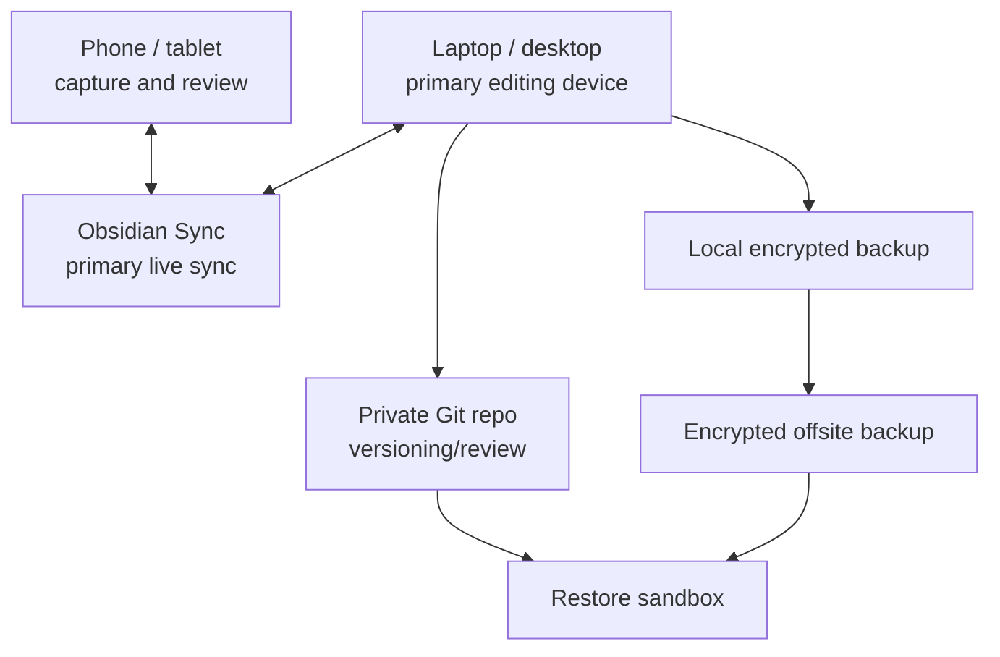

Best for:

- most serious users;
- developers who want history;
- founders and operators;
- users who need mobile access with strong recovery.

### 14.2. Self-hosted Nextcloud hybrid

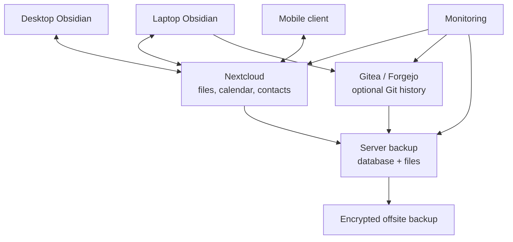

Best for:

- self-hosted users;
- users who want integrated files/calendar/contacts;
- teams that already run Nextcloud.

### 14.3. Syncthing privacy-first hybrid

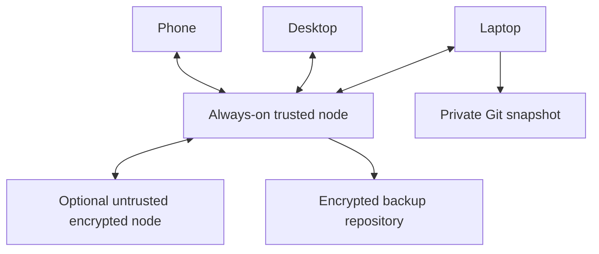

Best for:

- privacy-first users;
- technical users;
- users who want P2P sync and server-assisted availability.

### 14.4. High-sensitivity compartment hybrid

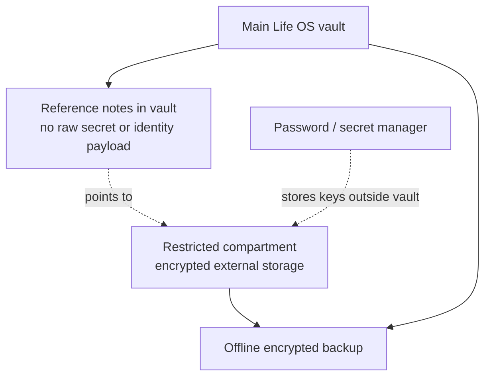

Best for:

- legal, health, identity, financial raw exports;
- client-confidential artifacts;
- regulated professions;
- people with elevated threat models.

---

## 15. Backup architecture

### 15.1. Backup objectives

The backup layer must protect against:

- accidental deletion;
- sync propagation of bad edits;
- plugin/config corruption;
- vault migration failure;
- ransomware;
- device theft/loss;
- provider outage;
- repository compromise;
- mistaken Git history rewrite;
- attachment loss;
- self-hosted server failure;
- AI-generated destructive changes after human error;
- retention/deletion mismatch.

### 15.2. Backup layers

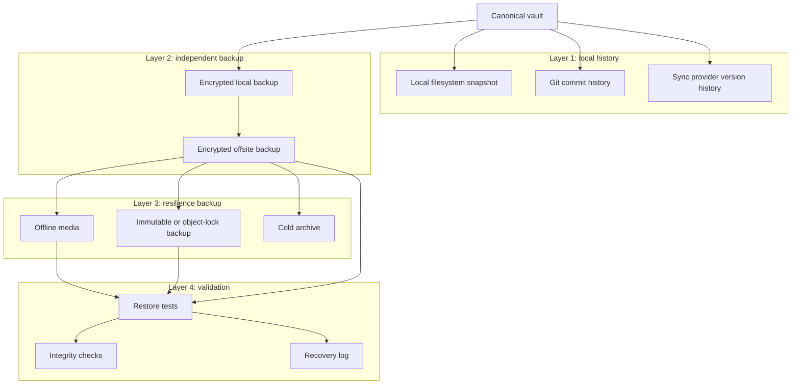

### 15.3. Minimum production backup standard

Every production Life OS vault must have:

1. **At least one local recoverable copy.**
2. **At least one encrypted offsite copy.**
3. **At least one restore-tested workflow.**
4. **Backup keys stored outside the vault.**
5. **A documented restore runbook.**
6. **A conflict and deletion recovery process.**

### 15.4. Strong production backup standard

A mature profile adds:

- immutable or offline backup;
- quarterly full-vault restore drill;
- annual device-loss exercise;
- automated backup health dashboard;
- independent checksum/integrity verification;
- separate backup credentials;
- backup repository monitoring;
- retention policy by sensitivity class;
- disaster recovery contact and credential plan.

### 15.5. What does not count as backup by itself

The following are useful but insufficient alone:

| Mechanism | Why insufficient |
|---|---|
| Live sync | Propagates bad changes and deletion. |
| Trash folder | May be emptied or synced away. |
| Version history | May expire, may be provider-dependent, may not cover every file. |
| RAID | Protects disk failure, not deletion, corruption or ransomware. |
| Git alone | May omit attachments, secrets-safe exclusions, local uncommitted changes. |
| Single external disk always connected | Can be encrypted/deleted by malware. |
| Cloud drive alone | Same account/provider compromise can affect primary and backup. |
| Screenshot/export of dashboards | Derived artifact, not recoverable canonical vault. |

---

## 16. Backup scope

### 16.1. Include by default

Back up:

```text
vault/**/*.md
vault/**/*.canvas
vault/**/*.base
vault/99_Attachments/**
vault/00_System/Templates/**
vault/00_System/Schemas/**
vault/00_System/Dashboards/**
vault/00_System/Policies/**
vault/70_AI/Context_Packs/** when allowed by sensitivity
vault/70_AI/Agent_Logs/** when allowed by retention policy
```

### 16.2. Include conditionally

Back up only with explicit policy:

```text
vault/.obsidian/**
vault/50_Finance/Raw/**
vault/60_People/Private/**
vault/99_Attachments/Identity/**
vault/70_AI/Memory_Exports/**
vault/01_Inbox/Imports/**
```

### 16.3. Exclude by default

Exclude:

```text
vault/.obsidian/workspace.json
vault/.obsidian/workspace-mobile.json
vault/.trash/**
vault/.git/** from file-level backups when repository backup exists
vault/node_modules/**
vault/.cache/**
vault/tmp/**
vault/.DS_Store
vault/Thumbs.db
vault/derived/**
vault/generated/**
vault/secrets/**
vault/private-keys/**
vault/raw-credentials/**
```

### 16.4. Backup exclude file

Recommended `policies/backup-excludes.txt`:

```gitignore
# OS and temporary files
.DS_Store
Thumbs.db
*.tmp
*.temp
*.swp

# Obsidian volatile state
.obsidian/workspace.json
.obsidian/workspace-mobile.json

# Generated artifacts
/derived/
/generated/
/.cache/

# Dependency folders
node_modules/
.venv/

# Forbidden or externally managed content
secrets/
private-keys/
raw-credentials/
*.pem
*.key
*.p12
*.pfx
.env
.env.*

# Optional high-risk compartments managed separately
50_Finance/Raw/
99_Attachments/Identity/
70_AI/Memory_Exports/
```

### 16.5. Git ignore baseline

Recommended `.gitignore` for private vault repositories:

```gitignore
# OS
.DS_Store
Thumbs.db

# Obsidian volatile state
.obsidian/workspace.json
.obsidian/workspace-mobile.json

# Plugin local state that may contain tokens or machine-specific config
.obsidian/plugins/*/data.json

# Local environment and secrets
.env
.env.*
*.pem
*.key
*.p12
*.pfx
secrets/
private-keys/
raw-credentials/

# Generated / derived artifacts
derived/
generated/
.cache/

# High-risk raw exports by default
50_Finance/Raw/
99_Attachments/Identity/
70_AI/Memory_Exports/
```

---

## 17. RPO and RTO model

### 17.1. Default targets

| Vault class | RPO | RTO | Notes |
|---|---:|---:|---|
| Framework repository | 24h | 4h | Can be reconstructed from Git hosting plus backups. |
| Personal general vault | 24h | 4h | Good default for normal users. |
| Active work/projects | 4h | 2h | Important for professional use. |
| Critical daily operations | 1h | 2h | Requires more frequent snapshots. |
| Restricted compartments | 24h | 8h | Privacy may matter more than speed. |
| Archive/cold history | 7d | 24–72h | Lower urgency; integrity matters most. |
| Mobile-only captures | 24h | 4h | Sync quickly; backup from desktop/server. |

### 17.2. Target by profile

| Profile | Recommended RPO | Recommended RTO | Required maturity |
|---|---:|---:|---|
| `personal-simple` | 24h | 4h | Daily backup, monthly restore. |
| `developer-hybrid` | 4h | 2h | Git snapshots plus encrypted backup. |
| `self-hosted-nextcloud` | 4–24h | 4–8h | Server backup and database restore drills. |
| `self-hosted-syncthing` | 4–24h | 4h | Always-on node plus independent backup. |
| `high-sensitivity` | 24h | 8–24h | Offline/immutable backup and key recovery. |
| `team-template` | 24h | 4h | Git provider backup, releases, CI artifacts. |

### 17.3. RPO/RTO decision rule

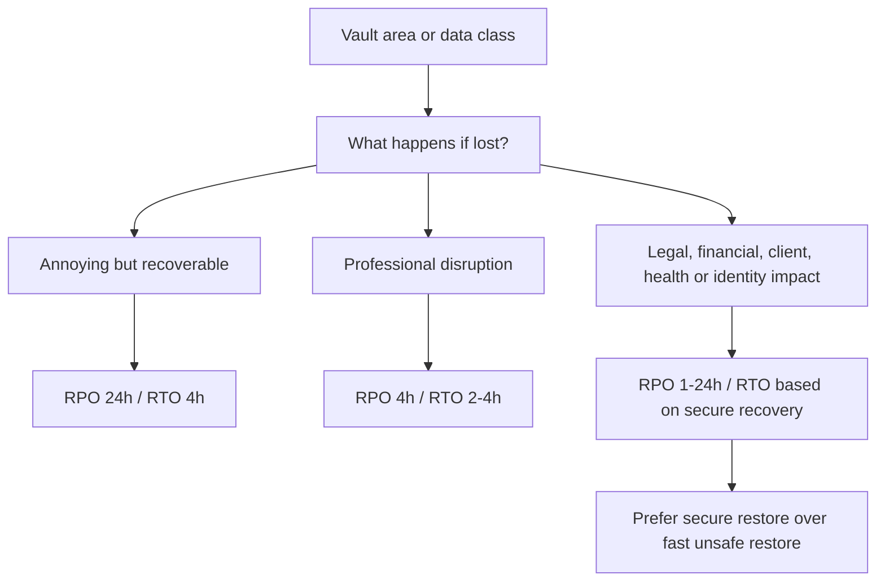

---

## 18. Backup retention model

### 18.1. Default retention schedule

| Backup type | Retention | Purpose |
|---|---:|---|
| Hourly snapshots | 24–48 hours | Recover from immediate mistakes. |
| Daily backups | 14–30 days | Normal operational recovery. |
| Weekly backups | 8–12 weeks | Recover from delayed discovery. |
| Monthly backups | 12 months | Long-term continuity. |
| Yearly archive | 3–7 years where appropriate | Legal, tax or historical needs. |

### 18.2. Sensitivity-aware retention

| Data class | Retention posture |
|---|---|
| Public/internal framework docs | Keep long-term; useful for project history. |
| Private personal notes | Keep according to user preference and storage capacity. |
| Sensitive finance/people notes | Keep enough for purpose; reduce raw data. |
| Restricted files | Keep only when justified; document legal/security basis. |
| Forbidden data | Not retained in vault backups. |
| AI drafts | Short retention unless accepted into canonical notes. |
| Agent logs | Retain only as long as required for audit and debugging. |

### 18.3. Deletion propagation rule

Deletion must propagate to derived artifacts and backup retention where legally and technically possible.

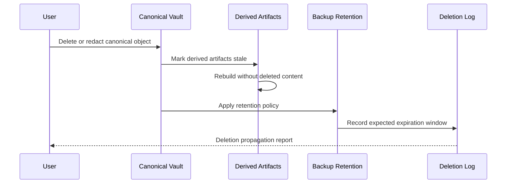

The framework must not falsely claim instant deletion from immutable or historical backups. It must document the expiration window.

---

## 19. Backup encryption and key management

### 19.1. Encryption requirements

Backups containing private, sensitive or restricted data must be encrypted before leaving the trusted device or trusted server.

Minimum requirements:

- strong encryption provided by backup tool or storage layer;
- backup key stored outside the vault;
- recovery key accessible during device-loss scenario;
- key rotation procedure documented;
- no backup keys in Markdown notes;
- no backup keys in Git repository;
- no backup keys in AI context packs.

### 19.2. Key custody model

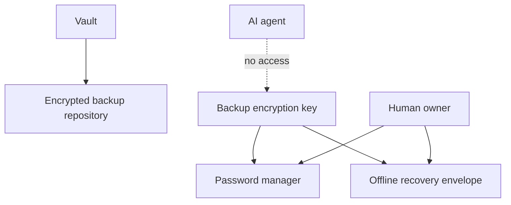

### 19.3. Recovery credential pack

A user must maintain a recovery credential pack outside the vault.

It should include:

- password manager recovery instructions;
- backup repository location names;
- device account recovery methods;
- sync provider account recovery methods;
- Git provider recovery information;
- self-hosted server emergency access method;
- emergency contact or trusted executor instructions where appropriate.

It must not be stored only inside the Life OS vault.

### 19.4. Key rotation

Rotate backup keys when:

- backup key is suspected exposed;
- device is compromised;
- team maintainer leaves and had access;
- backup provider account is compromised;
- switching backup tools;
- completing major security hardening.

Key rotation workflow:


---

## 20. Conflict management model

### 20.1. Conflict prevention

Most conflicts are preventable.

Rules:

- avoid editing the same note simultaneously on multiple devices;
- allow sync to complete before switching devices;
- keep daily notes date-based and device-neutral;
- avoid storing volatile plugin state in Git;
- use one live sync engine only;
- do not run headless sync and desktop sync on the same folder/device unless the tool explicitly supports it;
- do not let AI write canonical notes directly;
- keep generated artifacts out of canonical paths.

### 20.2. Conflict detection

Detect:

- `sync-conflict` files;
- duplicate notes with timestamp suffixes;
- Git merge conflicts;
- Nextcloud conflict copies;
- unexpected deletions;
- `.obsidian` config divergences;
- attachment hash mismatches;
- daily note duplicates;
- changed file count spikes;
- backup diff anomalies.

### 20.3. Conflict resolution flow

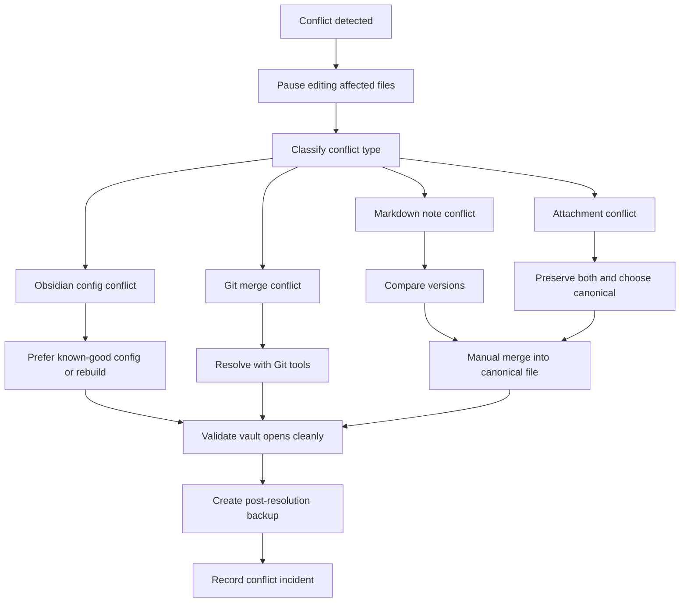

### 20.4. Conflict triage folder

Use:

```text
00_System/Maintenance/Sync_Conflicts/
```

Each conflict incident should record:

```yaml
---
type: sync-incident
status: resolved
created: 2026-05-19
source: syncthing | nextcloud | git | obsidian-sync | manual
files_affected: []
root_cause: concurrent-edit | provider-delay | migration | plugin | unknown
recovery_action: manual-merge | restore | preserve-both | rollback
validated: true
---
```

### 20.5. Merge policy

| Conflict type | Default policy |
|---|---|
| Note text conflict | Manual diff and merge. |
| Daily note duplicate | Merge by timestamp; preserve both until reviewed. |
| Attachment conflict | Preserve both, select canonical, archive rejected version. |
| `.obsidian` config conflict | Prefer known-good config; avoid blind merge. |
| AI draft conflict | Preserve both; AI drafts are non-canonical. |
| Git conflict | Resolve via Git tools; commit resolution. |
| Unknown conflict | Restore sandbox before modifying canonical copy. |

---

## 21. Restore architecture

### 21.1. Restore types

| Restore type | Use case | Risk | Required validation |
|---|---|---|---|
| Single note restore | Accidental edit/delete | Low | Open note, check metadata, backlinks. |
| Folder restore | Project/area loss | Medium | Check links, attachments, dashboard views. |
| Attachment restore | Lost file/PDF/image | Medium | Hash/size check and metadata note. |
| `.obsidian` restore | Plugin/settings corruption | Medium-high | Start with safe mode or backup config. |
| Full vault restore | Device loss/corruption | High | Restore into sandbox first. |
| Provider migration restore | Move sync/hosting provider | High | Compare inventory before cutover. |
| Ransomware recovery | Malicious encryption/deletion | Critical | Isolate, identify clean point, restore offline. |

### 21.2. Safe restore workflow

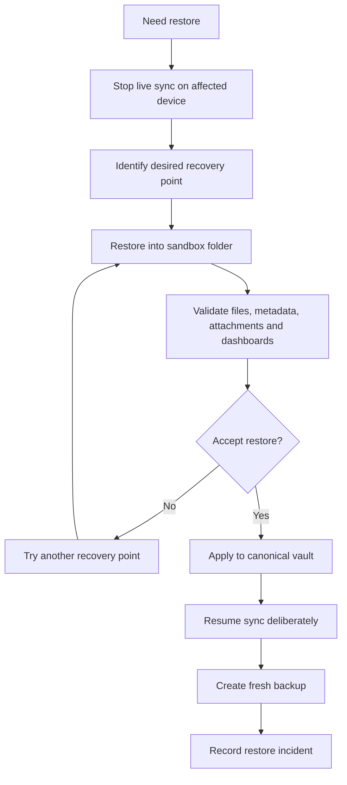

### 21.3. Full-vault restore runbook

1. Disconnect or pause the affected sync client.
2. Preserve the damaged vault as evidence if compromise is possible.
3. Identify the last known-good recovery point.
4. Restore the candidate backup into a sandbox folder.
5. Open the sandbox as a separate Obsidian vault.
6. Verify core folders exist.
7. Verify sample notes from each sensitivity class.
8. Verify attachments.
9. Verify `.base`, `.canvas` and dashboard files.
10. Verify `.obsidian` settings only after inspecting plugin risks.
11. Compare file inventory against latest known manifest.
12. Decide whether to replace canonical vault or selectively merge.
13. Apply restore.
14. Resume live sync only after confirming canonical state.
15. Create a fresh backup from recovered state.
16. Record incident and lessons learned.

### 21.4. Single-note restore runbook

1. Locate note ID or filename.
2. Search version history, Git history or backup snapshot.
3. Restore the note into a sandbox path.
4. Compare frontmatter, body, links and attachments.
5. Merge if current note has valid newer content.
6. Update `updated` property.
7. Rebuild derived dashboards if needed.
8. Log the restore if sensitive or high-impact.

### 21.5. Attachment restore runbook

1. Identify attachment path from metadata note or backlinks.
2. Restore file into sandbox.
3. Verify file opens.
4. Compare size and checksum where available.
5. Restore companion metadata note.
6. Rebuild or update attachment references.
7. Check whether any context packs or derived artifacts need regeneration.

---

## 22. Incident-specific recovery playbooks

### 22.1. Accidental deletion

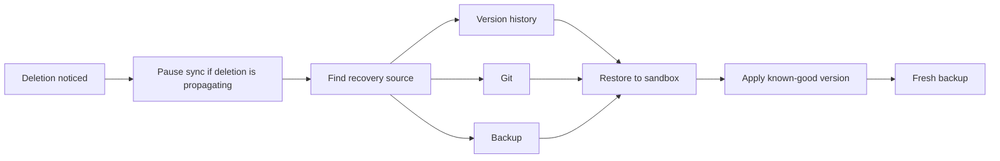

Controls:

- do not immediately empty trash;
- do not mass-restore without checking deletion intent;
- verify whether deletion was required by retention policy;
- check derived artifacts for stale references.

### 22.2. Ransomware or malware

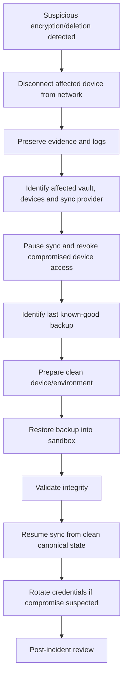

Rules:

- never restore over an infected device;
- never trust files modified after suspected compromise time;
- revoke device access before rejoining sync mesh;
- rotate relevant credentials stored outside the vault;
- record incident and improve controls.

### 22.3. Lost or stolen device

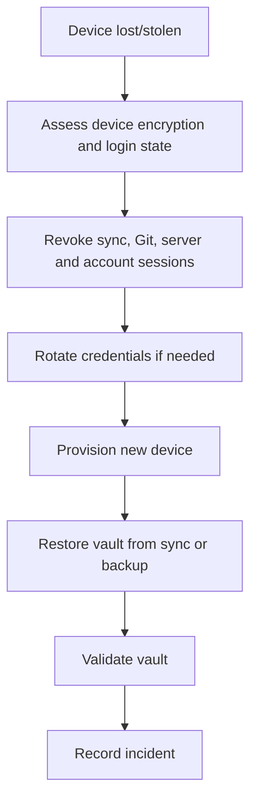

Controls:

- device encryption required;
- account MFA required;
- no vault-stored secrets;
- remote wipe where available;
- backup keys not stored only on lost device.

### 22.4. Sync provider outage

1. Keep local vault usable offline.
2. Avoid making large structural changes during outage unless necessary.
3. Capture new notes normally.
4. Create local snapshot before provider resumes.
5. Resume sync and inspect conflicts.
6. If provider outage becomes permanent, migrate to another profile.

### 22.5. Provider compromise or account compromise

1. Freeze live sync.
2. Revoke sessions and tokens.
3. Rotate credentials.
4. Inspect audit logs where available.
5. Restore from known-good independent backup if integrity is uncertain.
6. Migrate provider if trust is lost.
7. Record incident.

### 22.6. Corrupted `.obsidian` configuration

1. Copy current vault to sandbox.
2. Move `.obsidian` aside in sandbox.
3. Open vault with default configuration.
4. Re-enable core plugins first.
5. Re-enable community plugins one by one.
6. Restore known-good plugin settings only if trusted.
7. Create fresh configuration backup.

### 22.7. Git repository corruption or bad history rewrite

1. Preserve current repository directory.
2. Clone fresh copy from remote.
3. Compare latest valid commit and reflog where available.
4. Restore missing files from backup if needed.
5. Disable force push on protected branches for framework repository.
6. Record incident and update repository controls.

### 22.8. Failed migration

1. Preserve pre-migration backup.
2. Stop new changes during rollback window.
3. Restore pre-migration vault into sandbox.
4. Compare file inventory and sample notes.
5. Roll back sync provider state or create new clean remote.
6. Resume from known-good source.

---

## 23. Provider-specific production guidance

### 23.1. Obsidian Sync checklist

```text
[ ] Use one remote vault per Life OS vault.
[ ] Enable strong account security.
[ ] Review selective sync settings.
[ ] Decide whether attachments sync on all devices.
[ ] Avoid syncing forbidden folders.
[ ] Keep independent encrypted backup.
[ ] Confirm version history behavior.
[ ] Test deletion restore.
[ ] Test new-device restore.
[ ] Document recovery password outside vault.
```

Recommended settings posture:

| Setting area | Recommendation |
|---|---|
| Notes | Sync. |
| Attachments | Sync unless storage or sensitivity policy says otherwise. |
| Configuration | Sync only if user understands plugin state risks. |
| Hidden folders | Do not assume every hidden folder syncs. Verify behavior. |
| Large files | Keep large raw data out of vault or manage separately. |
| Restricted data | Prefer separate compartment or selective exclusion. |

### 23.2. GitHub / Git checklist

```text
[ ] Repository is private for personal vaults.
[ ] Framework repository uses branch protection.
[ ] Framework repository uses CODEOWNERS.
[ ] Secret scanning or equivalent is enabled where available.
[ ] Push protection or local secret scanning is enabled where available.
[ ] .gitignore excludes secrets, volatile state and high-risk raw data.
[ ] Large attachments are managed deliberately.
[ ] Git is not the only backup.
[ ] Recovery from clone has been tested.
[ ] Force push is restricted on protected branches.
```

Branch model for personal vaults:

| Branch | Purpose |
|---|---|
| `main` | Stable canonical vault history. |
| `migration/*` | Sync provider or schema migrations. |
| `ai-draft/*` | Optional AI-generated branch for review. |
| `archive/*` | Long-running archival experiments only when needed. |

### 23.3. Gitea / Forgejo checklist

```text
[ ] Server TLS configured.
[ ] Admin accounts protected with MFA where available.
[ ] Repository backups configured.
[ ] Database backups configured.
[ ] Attachments/packages backed up if used.
[ ] Restore test performed on separate instance.
[ ] Update process documented.
[ ] Monitoring configured.
[ ] Offsite encrypted backup configured.
[ ] Personal data policy documented.
```

### 23.4. Nextcloud checklist

```text
[ ] Desktop/mobile clients configured for one vault folder only.
[ ] No second live sync engine writes the same folder.
[ ] Server database backup configured.
[ ] File storage backup configured.
[ ] Calendar/contact backup considered if used.
[ ] Conflict file monitoring enabled operationally.
[ ] E2EE/SSE threat model understood before use.
[ ] Server updates documented.
[ ] Restore test performed.
[ ] External storage configuration documented if used.
```

### 23.5. Syncthing checklist

```text
[ ] Devices approved explicitly.
[ ] Folder ID and path documented.
[ ] Always-on node configured if needed.
[ ] File versioning selected deliberately.
[ ] Conflict files monitored.
[ ] Trusted devices use full-disk encryption.
[ ] Device config and keys protected.
[ ] Lost-device revocation tested.
[ ] Independent backup configured.
[ ] Untrusted node model documented if used.
```

---

## 24. Mobile architecture

Mobile is critical for capture and review, but it should not be the only administration surface.

### 24.1. Mobile responsibilities

Mobile should support:

- quick capture;
- reading and review;
- daily note updates;
- light task updates;
- meeting notes;
- emergency reference;
- offline access to essential notes.

Mobile should not be the only place for:

- full-vault backup administration;
- Git conflict resolution;
- plugin debugging;
- large migrations;
- self-hosted server administration;
- bulk restore;
- key rotation.

### 24.2. Mobile sync pattern

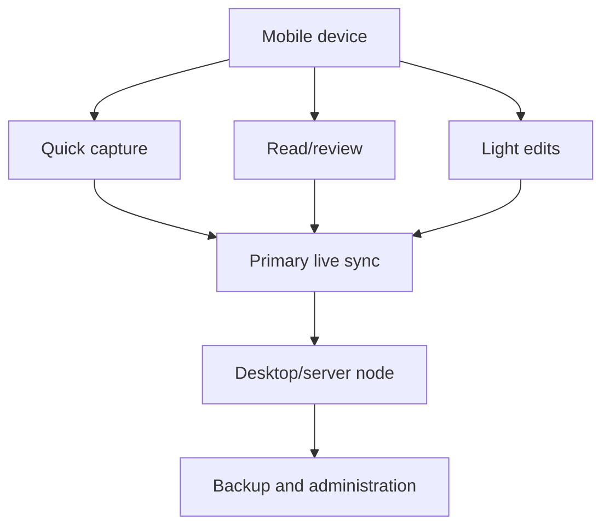

### 24.3. Mobile-first safeguards

- keep a desktop/server node for backup;
- do not rely on mobile filesystem access for recovery;
- keep emergency notes selectively available offline;
- avoid heavy attachments on mobile unless needed;
- verify mobile sync after changing folder structure;
- ensure device lock, encryption and account recovery are configured.

---

## 25. Migration model

Migration is moving from one sync/storage profile to another.

Examples:

- Obsidian Sync → Syncthing;
- Syncthing → Obsidian Sync;
- Nextcloud → Obsidian Sync;
- Git-only → hybrid sync;
- local-only → self-hosted;
- personal vault → new private repo;
- framework template version upgrade.

### 25.1. Migration principles

1. Backup before migration.
2. Stop active editing during cutover.
3. Select one source of truth.
4. Restore or copy into a new clean target.
5. Validate inventory.
6. Connect secondary devices one at a time.
7. Watch conflicts after first sync.
8. Keep old source read-only until migration is validated.

### 25.2. Migration workflow

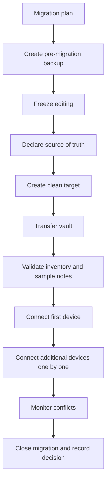

### 25.3. Migration validation checklist

```text
[ ] File count matches expected range.
[ ] Core folders exist.
[ ] Sample notes open.
[ ] Attachments open.
[ ] Daily notes path works.
[ ] Templates work.
[ ] Bases/dashboards render.
[ ] Search works.
[ ] Plugins load safely.
[ ] No duplicate vault roots exist.
[ ] No conflict files exist after initial sync.
[ ] Backup after migration completed.
```

---

## 26. Self-hosted reference architecture

This document defines the sync/backup posture. The full implementation guide belongs in `SELF_HOSTED_REFERENCE_STACK.md`.

A production self-hosted stack may include:

| Component | Role |
|---|---|
| Gitea / Forgejo | Git forge and release repository. |
| Nextcloud | Files, calendar, contacts and WebDAV. |
| Syncthing | P2P vault sync. |
| Restic / Borg / Kopia | Encrypted backups. |
| Caddy / Traefik / Nginx | TLS reverse proxy. |
| Tailscale / WireGuard | Private network access. |
| Uptime Kuma / Prometheus | Monitoring. |
| Fail2ban / firewall | Basic perimeter controls. |
| Password manager | Key and credential custody. |

```mermaid
flowchart TB
    User["User devices"]
    VPN["Tailscale / WireGuard"]
    Proxy["Reverse proxy + TLS"]

    subgraph Server["Self-hosted server"]
        Nextcloud["Nextcloud"]
        Forge["Gitea / Forgejo"]
        Sync["Syncthing node"]
        BackupJob["Backup jobs"]
        Monitor["Monitoring"]
    end

    Offsite["Encrypted offsite backup"]
    Offline["Offline recovery media"]

    User <--> VPN
    VPN --> Proxy
    Proxy --> Nextcloud
    Proxy --> Forge
    User <--> Sync
    Nextcloud --> BackupJob
    Forge --> BackupJob
    Sync --> BackupJob
    BackupJob --> Offsite
    BackupJob --> Offline
    Monitor --> Nextcloud
    Monitor --> Forge
    Monitor --> Sync
    Monitor --> BackupJob
```

Self-hosted minimum:

```text
[ ] TLS enabled.
[ ] Admin MFA where available.
[ ] Server patch process documented.
[ ] Backups include app data and databases.
[ ] Restore tested on separate host.
[ ] Offsite encrypted backup configured.
[ ] Monitoring alerts configured.
[ ] Server secrets stored outside the vault.
[ ] Emergency access documented outside the vault.
```

---

## 27. Backup tooling posture

The framework does not mandate one backup tool. It defines requirements.

### 27.1. Backup tool requirements

A production backup tool should support:

- encryption;
- authenticated integrity checks;
- incremental backups;
- retention pruning;
- restore of individual files and full directories;
- non-interactive operation for scheduled backups;
- logs;
- exit codes suitable for monitoring;
- cross-platform support where needed;
- ability to back up to local and remote targets.

### 27.2. Suitable tool classes

| Tool class | Examples | Notes |
|---|---|---|
| Encrypted deduplicating backup | Restic, Borg, Kopia | Strong general fit for power users/self-hosted. |
| OS backup | Time Machine, Windows File History, system snapshots | Useful local layer; not sufficient alone. |
| Cloud backup | Backblaze, object storage, cloud drives with encrypted backup tool | Good offsite target if encrypted client-side. |
| NAS snapshot | ZFS/Btrfs snapshots, NAS snapshots | Useful local/server layer; still needs offsite. |
| Offline media | External SSD/HDD, encrypted USB, archival media | Strong ransomware resilience if disconnected. |

### 27.3. Example backup command pattern

The repository may include examples like this, but users must adapt paths and storage targets:

```bash
export VAULT_PATH="$HOME/LifeOS/vault"
export EXCLUDE_FILE="$HOME/LifeOS/policies/backup-excludes.txt"

restic -r sftp:backup.example:/srv/restic/lifeos \
  backup "$VAULT_PATH" \
  --exclude-file "$EXCLUDE_FILE" \
  --tag lifeos \
  --tag vault
```

Prune pattern:

```bash
restic -r sftp:backup.example:/srv/restic/lifeos forget \
  --keep-hourly 24 \
  --keep-daily 30 \
  --keep-weekly 12 \
  --keep-monthly 12 \
  --keep-yearly 7 \
  --prune
```

Restore test pattern:

```bash
mkdir -p "$HOME/LifeOS_restore_test"
restic -r sftp:backup.example:/srv/restic/lifeos restore latest \
  --target "$HOME/LifeOS_restore_test"
```

Rules:

- credentials for backup commands must not be committed;
- scripts must use environment variables or secret manager integration;
- examples must not include real hostnames, tokens or keys;
- restore tests must never overwrite canonical vault directly.

---

## 28. Backup manifests and integrity

### 28.1. Manifest purpose

A backup manifest helps answer:

- what was backed up;
- when it was backed up;
- how many files existed;
- what paths were excluded;
- which version of the schema was in use;
- whether a restore test passed;
- which backup repository contains the snapshot.

### 28.2. Manifest schema

```yaml
---
type: backup-manifest
status: complete
created: 2026-05-19T10:00:00+03:00
vault_id: lifeos-personal-main
vault_schema_version: "1.0.0"
backup_tool: restic
backup_profile: developer-hybrid
source_path: "$HOME/LifeOS/vault"
repository_alias: lifeos-offsite-primary
snapshot_id: "example-snapshot-id"
file_count: 12500
attachment_count: 840
excluded_paths:
  - ".obsidian/workspace.json"
  - "derived/"
  - "secrets/"
sensitivity_max: sensitive
restore_test:
  required: true
  status: passed
  tested_at: 2026-05-19T10:30:00+03:00
---
```

### 28.3. Integrity checks

Recommended checks:

- backup tool integrity check;
- file count comparison;
- random sample restore;
- attachment open test;
- note frontmatter parse test;
- dashboard render check;
- schema validation after restore;
- secret scan after restore;
- conflict file scan after restore.

---

## 29. Health dashboard model

Create a dashboard note:

```text
00_System/Dashboards/Recovery Dashboard.md
```

It should display:

| Signal | Target |
|---|---|
| Last successful live sync | Within expected period. |
| Last local backup | Within RPO. |
| Last offsite backup | Within RPO. |
| Last restore test | Within policy. |
| Last full-vault restore drill | Within quarter or year based on profile. |
| Conflict file count | 0 unresolved. |
| Backup repository check | Passing. |
| Secret scan | Passing. |
| Derived artifact staleness | No stale critical artifacts. |
| Device inventory | All devices known and approved. |

```mermaid
flowchart LR
    Checks["Health checks"] --> Sync["Sync freshness"]
    Checks --> Backup["Backup freshness"]
    Checks --> Restore["Restore test age"]
    Checks --> Conflicts["Conflict count"]
    Checks --> Secrets["Secret scan"]
    Checks --> Devices["Device inventory"]
    Checks --> Report["Recovery dashboard"]
```

---

## 30. Device lifecycle

### 30.1. Device onboarding

```mermaid
flowchart TB
    New["New device"] --> Secure["Enable device encryption and OS updates"]
    Secure --> Accounts["Sign in to sync/Git/provider accounts"]
    Accounts --> Restore["Download or restore vault"]
    Restore --> Verify["Verify core folders, notes and attachments"]
    Verify --> Configure["Configure plugins and exclusions"]
    Configure --> Backup["Ensure backup responsibility assigned"]
    Backup --> Register["Register device in device inventory"]
```

Device onboarding checklist:

```text
[ ] Device encryption enabled.
[ ] OS updated.
[ ] Screen lock enabled.
[ ] Account MFA configured.
[ ] Sync provider configured.
[ ] Vault opens offline.
[ ] Attachments verified.
[ ] Community plugins reviewed.
[ ] Backup role defined.
[ ] Device recorded in inventory.
```

### 30.2. Device offboarding

```mermaid
flowchart TB
    Old["Device retired/lost/sold"] --> Backup["Confirm latest data synced/backed up"]
    Backup --> Revoke["Revoke sync/device access"]
    Revoke --> Tokens["Revoke Git/provider sessions"]
    Tokens --> Wipe["Secure wipe device"]
    Wipe --> Inventory["Update device inventory"]
    Inventory --> Test["Validate remaining devices"]
```

Device offboarding checklist:

```text
[ ] Data synced or backed up.
[ ] Device removed from sync mesh.
[ ] Provider sessions revoked.
[ ] SSH keys/tokens removed if applicable.
[ ] Local vault securely deleted if device leaves control.
[ ] Device inventory updated.
[ ] Recovery path still works from remaining devices.
```

---

## 31. AI-assisted sync and recovery boundaries

AI can help with:

- explaining recovery options;
- generating checklists;
- classifying backup logs;
- drafting incident reports;
- detecting stale backup manifests;
- suggesting conflict resolution steps;
- comparing non-sensitive file lists;
- creating migration plans;
- producing restore runbook drafts.

AI must not:

- receive backup keys;
- receive password manager exports;
- execute destructive restore commands without explicit approval;
- delete backups;
- prune backups;
- rotate keys;
- revoke devices;
- decide data retention alone;
- mark recovery complete without human validation;
- access forbidden or restricted raw data unless a separate explicit policy permits it.

```mermaid
sequenceDiagram
    participant H as Human
    participant A as AI Assistant
    participant G as Agent Gateway
    participant Logs as Non-sensitive logs/manifests
    participant B as Backup system

    H->>A: Ask for recovery help
    A->>G: Request allowed context
    G->>Logs: Read backup manifests and incident notes
    Logs-->>G: Return scoped non-secret context
    G-->>A: Provide redacted context
    A-->>H: Draft recovery plan
    H->>B: Execute approved restore manually or via controlled tool
    H->>A: Provide outcome summary
    A-->>H: Draft incident log and improvements
```

AI recovery outputs must be treated as recommendations until human-validated.

---

## 32. Calendar and notification recovery

Calendar/reminder systems are execution systems and may live outside the vault.

Recovery must cover:

- event source of truth;
- calendar provider access;
- reminder app data;
- meeting note links;
- recurring review reminders;
- time-critical alerts.

Rules:

- do not rely on Obsidian alone for critical notifications;
- backup calendar/export where provider permits;
- store meeting context in vault, not only in calendar description;
- keep recurring Life OS reviews in calendar/reminder source of truth;
- document provider recovery credentials outside vault.

```mermaid
flowchart LR
    Calendar["External calendar/reminders"] --> Events["Time-critical events"]
    Vault["Life OS vault"] --> Context["Agendas, notes, decisions"]
    Events --> Notifications["Notifications"]
    Context --> Review["Review and memory"]
    Calendar --> CalBackup["Calendar export/provider recovery"]
    Vault --> VaultBackup["Vault backup"]
```

---

## 33. Profession-specific recovery considerations

### 33.1. Developer

Key assets:

- specs;
- ADRs;
- release notes;
- repo notes;
- issue drafts;
- postmortems.

Recovery rules:

- code repositories have their own backup and remote strategy;
- Life OS stores context around code, not necessarily full code history;
- avoid duplicating production secrets into vault;
- preserve ADR history.

### 33.2. Designer

Key assets:

- briefs;
- client feedback;
- moodboards;
- export checklists;
- portfolio metadata;
- asset references.

Recovery rules:

- large design binaries may need external asset backup;
- vault stores metadata, decisions and links;
- client-confidential assets may require stricter backup encryption.

### 33.3. Machinist / craftsperson

Key assets:

- work orders;
- drawings;
- machine setups;
- materials;
- tolerances;
- quality-control records;
- maintenance logs.

Recovery rules:

- drawings and measurements can be safety-critical;
- offline access may be important in workshop environments;
- photo attachments need backup validation;
- quality records should have retention policy.

### 33.4. Teacher

Key assets:

- lesson plans;
- course materials;
- student feedback notes;
- assignment rubrics.

Recovery rules:

- real student personal data may be regulated;
- anonymize or store in approved systems when required;
- calendar and assignment deadlines require external reminder recovery.

### 33.5. Healthcare / legal / finance

Key assets:

- protocols;
- anonymized study notes;
- case references;
- deadlines;
- compliance checklists.

Recovery rules:

- do not store unmanaged patient/client records unless explicitly permitted and secured;
- prefer reference-only notes to official systems;
- audit trail and retention matter;
- use restricted compartment model.

---

## 34. Monitoring and alerting

### 34.1. Required signals

| Signal | Severity when failing |
|---|---|
| Backup older than RPO | High |
| Offsite backup missing | High |
| Restore test overdue | Medium-high |
| Conflict files detected | Medium |
| Sudden mass deletion | Critical |
| Sudden mass file rewrite/encryption | Critical |
| Secret scan failure | Critical |
| Device inventory mismatch | Medium-high |
| Backup integrity check failure | Critical |
| Self-hosted server backup failure | High |

### 34.2. Alert routing

| Alert | Destination |
|---|---|
| Critical backup failure | System notification + email or messaging. |
| Restore test overdue | Weekly review dashboard. |
| Conflict detected | Maintenance dashboard. |
| Secret scan failure | Immediate security review. |
| Device lost | Incident runbook. |

### 34.3. Recovery dashboard note contract

```yaml
---
type: recovery-dashboard
status: active
created: 2026-05-19
updated: 2026-05-19
review:
  cadence: weekly
  next: 2026-05-26
metrics:
  backup_rpo_status: pass
  restore_test_status: pass
  conflicts_open: 0
  secret_scan_status: pass
---
```

---

## 35. CI/CD and validation for sync/backup docs

The framework repository must validate sync/backup documentation and examples.

### 35.1. Validation gates

| Gate | Requirement |
|---|---|
| Markdown lint | Docs render cleanly. |
| Mermaid validation | Diagrams parse. |
| Secret scan | No real credentials in examples. |
| Path policy check | Excludes forbidden paths. |
| Config syntax check | YAML and examples parse. |
| Reference check | Links to official docs remain valid where possible. |
| Synthetic data check | Examples contain no real personal data. |
| Backup script safety check | Scripts do not delete or overwrite canonical vault by default. |

### 35.2. Example CI workflow structure

```yaml
name: Validate Sync Backup Recovery Docs

on:
  pull_request:
  push:
    branches:
      - main

jobs:
  validate-sync-backup-recovery:
    runs-on: ubuntu-latest
    steps:
      - uses: actions/checkout@v4
      - name: Validate markdown
        run: echo "Run markdown lint"
      - name: Validate mermaid diagrams
        run: echo "Run mermaid validation"
      - name: Scan for secrets
        run: echo "Run secret scan"
      - name: Validate YAML examples
        run: echo "Parse YAML blocks where applicable"
      - name: Check forbidden backup paths
        run: echo "Verify examples exclude forbidden paths"
```

The workflow example is intentionally non-destructive. Real implementations must select concrete tools and pin versions.

---

## 36. Operational cadence

### 36.1. Daily

```text
[ ] Confirm vault sync appears healthy on active devices.
[ ] Resolve obvious conflicts before continuing work.
[ ] Let scheduled backup run.
[ ] Keep new high-risk imports in Inbox until classified.
```

### 36.2. Weekly

```text
[ ] Review Recovery Dashboard.
[ ] Check unresolved sync conflicts.
[ ] Check backup freshness.
[ ] Check offsite backup freshness.
[ ] Review failed jobs.
[ ] Confirm no forbidden paths entered backup/Git.
```

### 36.3. Monthly

```text
[ ] Restore one note into sandbox.
[ ] Restore one attachment into sandbox.
[ ] Verify backup key access.
[ ] Review device inventory.
[ ] Review sync provider sessions.
[ ] Review retention policy.
```

### 36.4. Quarterly

```text
[ ] Full-vault restore drill into sandbox.
[ ] Validate dashboards and attachments.
[ ] Review self-hosted server backup if applicable.
[ ] Review backup repository integrity.
[ ] Update recovery runbooks.
```

### 36.5. Annual

```text
[ ] Device-loss simulation.
[ ] Account recovery simulation.
[ ] Backup provider migration review.
[ ] Long-term retention review.
[ ] Emergency access review.
```

---

## 37. Failure mode matrix

| Failure mode | Primary control | Recovery source | Human action |
|---|---|---|---|
| Accidental note edit | Version history / Git | Previous version | Restore or merge. |
| Accidental deletion | Version history / backup | Snapshot | Restore after checking intent. |
| Sync conflict | Conflict monitoring | Both versions | Manual merge. |
| Plugin corruption | Config backup / safe mode | Known-good `.obsidian` | Rebuild or restore settings. |
| Device loss | Device encryption / backup | Sync or backup | Revoke and restore. |
| Ransomware | Offline/immutable backup | Clean backup | Isolate, restore on clean device. |
| Provider outage | Local-first vault | Local copy | Work offline, snapshot before reconnect. |
| Provider compromise | Independent backup | Clean backup | Revoke, rotate, migrate. |
| Git force-push damage | Branch protection / remote backup | Clone/backup/reflog | Restore history. |
| Server disk failure | Server backup | Offsite backup | Restore server or migrate. |
| Backup key loss | Recovery credential pack | Offline recovery process | Recover from password manager/offline envelope. |
| AI bad edit accepted | Draft-first policy / Git | Previous version | Roll back and improve review. |
| Retention error | Manifests / deletion logs | Policy records | Correct retention and derived artifacts. |

---

## 38. Anti-patterns

Do not do these:

```text
- Treat sync as backup.
- Use two live sync engines on the same folder.
- Store backup passwords inside the vault being backed up.
- Store API keys, seed phrases or private keys in Markdown.
- Let AI run restore/prune/delete commands autonomously.
- Restore directly over the canonical vault without sandbox validation.
- Keep the only backup drive always connected.
- Assume Git history captures every attachment and uncommitted note.
- Assume self-hosted means secure without maintenance.
- Assume server-side encryption equals zero administrator visibility.
- Ignore conflict files.
- Keep restricted raw data in broad mobile sync by default.
- Make mobile the only recovery administration surface.
```

---

## 39. Production profiles

### 39.1. `personal-simple`

```yaml
profile: personal-simple
primary_live_sync: obsidian-sync
versioning:
  - sync-version-history
backup:
  local: encrypted-daily
  offsite: encrypted-weekly-or-better
restore_tests:
  single_file: monthly
  full_vault: quarterly_or_semiannual
security:
  device_encryption: required
  secrets_in_vault: forbidden
```

### 39.2. `developer-hybrid`

```yaml
profile: developer-hybrid
primary_live_sync: obsidian-sync_or_syncthing
versioning:
  - private-git-repo
  - tagged-migration-commits
backup:
  local: encrypted-daily
  offsite: encrypted-daily_or_weekly
restore_tests:
  single_file: monthly
  full_vault: quarterly
security:
  git_secret_scan: required
  branch_protection_for_framework: required
```

### 39.3. `self-hosted-nextcloud`

```yaml
profile: self-hosted-nextcloud
primary_live_sync: nextcloud
versioning:
  - optional-private-git
backup:
  nextcloud_files: required
  nextcloud_database: required
  offsite_encrypted: required
restore_tests:
  server_restore: quarterly
  vault_restore: quarterly
security:
  tls: required
  admin_mfa: recommended
  update_process: required
```

### 39.4. `self-hosted-syncthing`

```yaml
profile: self-hosted-syncthing
primary_live_sync: syncthing
versioning:
  - optional-private-git
  - syncthing-file-versioning-where-appropriate
backup:
  always_on_node: encrypted-daily
  offsite: encrypted-daily_or_weekly
restore_tests:
  single_file: monthly
  full_vault: quarterly
security:
  trusted_device_encryption: required
  lost_device_revocation: required
```

### 39.5. `high-sensitivity`

```yaml
profile: high-sensitivity
primary_live_sync: selective_or_none
versioning:
  - encrypted-local-snapshots
backup:
  offline: required
  immutable_or_cold: recommended
restore_tests:
  restricted_restore: quarterly
security:
  raw_secret_storage: forbidden
  reference_only_notes: preferred
  human_review: mandatory
```

### 39.6. `team-template`

```yaml
profile: team-template
primary_storage: github_or_gitea_or_forgejo
contains_personal_data: false
versioning:
  - protected-main-branch
  - releases
  - changelog
backup:
  repository_backup: required
  release_artifacts: recommended
security:
  codeowners: required
  secret_scanning: required_where_available
  branch_protection: required
```

---

## 40. Example repository files

The framework repository should include:

```text
policies/
├── sync-profiles.yaml
├── backup-policy.yaml
├── backup-excludes.txt
├── restore-drill-policy.md
├── device-inventory.schema.json
└── recovery-incident.schema.json

automations/
├── scripts/
│   ├── backup-vault.example.sh
│   ├── restore-test.example.sh
│   ├── check-backup-health.example.sh
│   ├── detect-sync-conflicts.example.py
│   └── generate-backup-manifest.example.py
└── config/
    ├── backup-profile.personal-simple.yaml
    ├── backup-profile.developer-hybrid.yaml
    └── backup-profile.self-hosted.yaml

docs/
├── 06_SYNC_BACKUP_RECOVERY.md
└── runbooks/
    ├── restore-single-note.md
    ├── restore-full-vault.md
    ├── lost-device.md
    ├── ransomware-recovery.md
    └── sync-conflict-resolution.md
```

---

## 41. Example policy files

### 41.1. `policies/sync-profiles.yaml`

```yaml
profiles:
  personal-simple:
    primary_live_sync: obsidian-sync
    allow_secondary_live_sync: false
    git_allowed: optional_snapshot_only
    backup_required: true
    restore_test_required: true

  developer-hybrid:
    primary_live_sync: obsidian-sync_or_syncthing
    allow_secondary_live_sync: false
    git_allowed: true
    git_role: versioning_and_review
    backup_required: true
    restore_test_required: true

  self-hosted-nextcloud:
    primary_live_sync: nextcloud
    allow_secondary_live_sync: false
    git_allowed: optional_snapshot_only
    backup_required: true
    server_backup_required: true
    restore_test_required: true

  high-sensitivity:
    primary_live_sync: selective_or_none
    allow_secondary_live_sync: false
    restricted_compartment_required: true
    offline_backup_required: true
    restore_test_required: true
```

### 41.2. `policies/backup-policy.yaml`

```yaml
backup_policy:
  version: "1.0.0"
  default_rpo: "24h"
  default_rto: "4h"
  encryption_required: true
  restore_test_required: true
  backup_keys_in_vault: forbidden
  forbidden_paths:
    - "secrets/"
    - "private-keys/"
    - "raw-credentials/"
  retention:
    hourly: 24
    daily: 30
    weekly: 12
    monthly: 12
    yearly: 7
  restore_tests:
    single_file: monthly
    full_vault: quarterly
    device_loss: annual
```

### 41.3. `policies/recovery-incident.schema.json`

```json
{
  "$schema": "https://json-schema.org/draft/2020-12/schema",
  "title": "Life OS Recovery Incident",
  "type": "object",
  "required": ["id", "type", "status", "created", "incident_class", "impact", "resolution"],
  "properties": {
    "id": { "type": "string" },
    "type": { "const": "recovery-incident" },
    "status": { "enum": ["open", "mitigated", "resolved", "archived"] },
    "created": { "type": "string" },
    "incident_class": {
      "enum": [
        "accidental-deletion",
        "sync-conflict",
        "device-loss",
        "provider-outage",
        "provider-compromise",
        "ransomware",
        "migration-failure",
        "backup-failure",
        "unknown"
      ]
    },
    "impact": { "enum": ["low", "medium", "high", "critical"] },
    "files_affected": { "type": "array", "items": { "type": "string" } },
    "recovery_source": { "type": "string" },
    "resolution": { "type": "string" },
    "validated": { "type": "boolean" },
    "lessons_learned": { "type": "array", "items": { "type": "string" } }
  }
}
```

---

## 42. Restore drill templates

### 42.1. Monthly single-file restore drill

```markdown
---
type: restore-drill
status: completed
drill_type: single-file
created: 2026-05-19
backup_source: offsite-primary
result: passed
---

# Restore Drill - Single File

## Objective
Restore one randomly selected note and one attachment into a sandbox.

## Steps performed
- Selected sample note.
- Restored to sandbox.
- Opened note.
- Validated frontmatter.
- Validated links.
- Restored sample attachment.
- Opened attachment.

## Result
Passed.

## Issues
None.

## Improvements
None required.
```

### 42.2. Quarterly full-vault restore drill

```markdown
---
type: restore-drill
status: completed
drill_type: full-vault
created: 2026-05-19
backup_source: offsite-primary
result: passed
---

# Restore Drill - Full Vault

## Objective
Restore full vault into sandbox and validate operational readiness.

## Validation checklist
- [x] Core folders exist.
- [x] Random notes open.
- [x] Attachments open.
- [x] Bases render.
- [x] Canvas files open.
- [x] Templates available.
- [x] No forbidden data found in restored sample.
- [x] No unresolved conflict files found.

## Result
Passed.

## Recovery time
2h 15m.

## Improvements
Increase attachment sampling in next drill.
```

---

## 43. Security considerations

### 43.1. Sync security rules

- All sync providers must be treated as trust boundaries.
- Provider credentials must be in a password manager.
- Account MFA is required where available.
- Device encryption is required for devices holding private/sensitive vaults.
- Lost device revocation must be possible.
- Restricted compartments should not be broadly synced by default.
- No forbidden data in sync paths.

### 43.2. Backup security rules

- Backup encryption is required for private/sensitive/restricted data.
- Backup key must not be inside the backup set only.
- Backup repositories must have separate credentials where possible.
- Offsite backup must not share the exact same blast radius as primary provider.
- Offline/immutable backup is recommended for ransomware resilience.
- Restore must happen into sandbox first.

### 43.3. Self-hosted security rules

- Patch the server.
- Back up both files and databases.
- Use TLS.
- Protect admin accounts.
- Monitor disk space.
- Monitor backup job failures.
- Document emergency access outside the vault.
- Test restore to a different host.

### 43.4. AI security rules

- AI cannot see backup keys.
- AI cannot prune backups.
- AI cannot delete backups.
- AI cannot approve restore completion.
- AI may draft runbooks and incident reports.
- AI-visible manifests must not contain secrets.

---

## 44. Privacy and compliance considerations

This framework is not a compliance certification.

Users in regulated environments must map Life OS storage to their obligations.

Potentially regulated categories:

- patient data;
- student data;
- client legal files;
- financial account data;
- tax records;
- identity documents;
- employer confidential information;
- controlled technical data.

Rules:

- when in doubt, store official records in approved systems;
- use Life OS for metadata, notes, checklists and references;
- avoid raw regulated data unless policy allows it;
- document retention and deletion rules;
- use restricted compartments for high-risk files;
- ensure backups follow the same sensitivity requirements as primary storage.

---

## 45. Performance and scalability

### 45.1. Scale risks

| Risk | Cause | Mitigation |
|---|---|---|
| Slow sync | Too many large files or frequent plugin writes | Keep raw large files outside vault; exclude generated state. |
| Git repository bloat | Large attachments in history | Use external asset storage or deliberate LFS-like strategy outside template repo. |
| Backup duration grows | Attachments and raw imports | Classify imports; archive cold data separately. |
| Mobile storage pressure | Full attachment sync | Selective attachment sync or external asset references. |
| Conflict frequency | Multi-device simultaneous edits | One-device editing discipline; sync completion before switching. |
| Restore time too long | No RTO planning | Separate hot, warm and cold data. |

### 45.2. Hot/warm/cold data model

| Data temperature | Examples | Sync | Backup |
|---|---|---|---|
| Hot | active projects, daily notes, current tasks | All active devices | Frequent backup. |
| Warm | reference notes, completed recent projects | Main devices | Normal backup. |
| Cold | archives, old attachments, historical exports | Optional/selective | Long retention, slower restore acceptable. |
| Restricted cold | identity/legal/medical archives | Separate encrypted storage | Offline/immutable backup. |

```mermaid
flowchart LR
    Hot["Hot data<br/>active work"] --> Fast["Fast sync + frequent backup"]
    Warm["Warm data<br/>reference"] --> Normal["Normal sync + backup"]
    Cold["Cold data<br/>archive"] --> Archive["Selective sync + long retention"]
    Restricted["Restricted cold data"] --> Secure["Separate encrypted storage"]
```

### 45.3. Optimization rules

- Do not put raw media libraries into the main vault.
- Create metadata notes for large files.
- Keep attachments organized and named.
- Archive completed projects out of active dashboards.
- Keep generated artifacts rebuildable and excluded from backup when safe.
- Do not sync every attachment to every mobile device unless needed.
- Use Git for text-heavy structured data, not arbitrary binary archives.
- Keep backup retention balanced against storage cost.

---

## 46. Repository release and migration impact

Because the shared framework repository is a template, users’ private vaults will diverge.

Therefore:

- framework releases must include migration notes;
- schema changes must include compatibility notes;
- backup policies must include migration backup step;
- profession pack updates must not overwrite personal data;
- users must back up before applying framework upgrades;
- updates should be applied as patches, not blindly overwritten.

Release/migration sequence:

```mermaid
flowchart TB
    Release["Framework release"] --> Notes["Read migration notes"]
    Notes --> Backup["Backup private vault"]
    Backup --> Branch["Create migration branch or sandbox copy"]
    Branch --> Apply["Apply schema/templates/policies"]
    Apply --> Validate["Run validation"]
    Validate --> Accept{Accept migration?}
    Accept -->|No| Rollback["Rollback from backup/branch"]
    Accept -->|Yes| Merge["Merge to canonical vault"]
    Merge --> Fresh["Fresh post-migration backup"]
```

---

## 47. Production rollout roadmap

```mermaid
gantt
    title Sync Backup Recovery Production Roadmap
    dateFormat YYYY-MM-DD

    section P0 Foundation
    Define profiles and policies       :a1, 2026-05-19, 3d
    Create backup exclude baseline     :a2, after a1, 2d
    Create restore runbooks            :a3, after a2, 3d
    Create recovery dashboard template :a4, after a3, 2d

    section P1 Automation
    Backup manifest generator          :b1, after a4, 4d
    Conflict detector                  :b2, after b1, 3d
    Restore drill checklist tooling    :b3, after b2, 3d
    CI validation gates                :b4, after b3, 3d

    section P2 Advanced Resilience
    Self-hosted reference stack        :c1, after b4, 5d
    Immutable/offline backup guide     :c2, after c1, 4d
    Provider migration toolkit         :c3, after c2, 5d
    Recovery simulation suite          :c4, after c3, 5d
```

---

## 48. MVP boundary

The v1.0 framework must include:

```text
[ ] This document.
[ ] Sync profile matrix.
[ ] Backup policy file.
[ ] Backup exclude baseline.
[ ] Restore runbooks.
[ ] Conflict resolution process.
[ ] RPO/RTO defaults.
[ ] Recovery dashboard template.
[ ] Device lifecycle checklist.
[ ] AI recovery boundaries.
[ ] Security rules for sync/backup.
```

The v1.0 framework should not attempt to include:

```text
[ ] Fully automated destructive restore.
[ ] Universal self-hosted installer.
[ ] Compliance certification.
[ ] Real-time collaborative editing engine.
[ ] AI-owned backup credentials.
[ ] Built-in secret manager.
```

---

## 49. Definition of Done

This document is production-ready when:

```text
[ ] It distinguishes sync, versioning, backup and recovery.
[ ] It defines one-primary-live-sync rule.
[ ] It includes supported sync profiles.
[ ] It includes RPO/RTO defaults.
[ ] It includes backup scope and exclusion rules.
[ ] It includes encryption and key management requirements.
[ ] It includes restore runbooks.
[ ] It includes conflict management.
[ ] It includes migration rules.
[ ] It includes mobile constraints.
[ ] It includes self-hosted considerations.
[ ] It includes AI recovery boundaries.
[ ] It includes failure mode matrix.
[ ] It aligns with ADR-017, ADR-018, ADR-019 and ADR-020.
[ ] It does not require storing secrets in the vault.
[ ] It does not falsely claim sync is backup.
[ ] It does not promise impossible recovery guarantees.
```

---

## 50. Production validation checklist

Before marking a Life OS deployment production-ready:

```text
[ ] User selected exactly one primary live sync profile.
[ ] User has independent encrypted backup.
[ ] User has restore-tested at least one note.
[ ] User has restore-tested at least one attachment.
[ ] User knows where backup keys live.
[ ] Backup keys are outside the vault.
[ ] Forbidden paths are excluded.
[ ] Device encryption is enabled.
[ ] Provider account MFA is enabled where available.
[ ] Conflict detection process exists.
[ ] Recovery Dashboard exists.
[ ] Lost-device runbook exists.
[ ] Ransomware runbook exists.
[ ] Full-vault restore drill is scheduled.
[ ] AI cannot access backup credentials.
[ ] High-sensitivity compartments are handled deliberately.
```

---

## 51. Claims policy

Allowed claims:

- “Life OS separates sync from backup.”
- “Life OS supports cloud, self-hosted and hybrid sync profiles.”
- “Life OS uses restore-tested backup as a production requirement.”
- “Life OS is designed to reduce data-loss risk.”
- “Life OS keeps the human in control of recovery.”

Forbidden claims:

- “Life OS guarantees zero data loss.”
- “Sync alone is enough.”
- “Self-hosted automatically means secure.”
- “AI can safely manage recovery without human approval.”
- “Backups are secure without tested key recovery.”
- “All sensitive data can safely live in the vault.”

Premium positioning:

> Life OS is premium because it treats continuity as a first-class design goal. It does not merely make notes available across devices; it designs for survival, auditability, recovery and human control.

---

## 52. Source baseline

This document should be maintained against current primary documentation for the selected tools and security frameworks.

Recommended source baseline:

- Obsidian Help — Sync, Sync security, Sync settings, Version history, Headless Sync.
- Obsidian Help — Properties, Bases, Daily Notes and core plugins.
- GitHub Docs — template repositories, protected branches, CODEOWNERS, secret scanning, push protection, CodeQL and Dependabot.
- Gitea Docs — installation, backup and administration.
- Forgejo Docs — installation, administration and backup.
- Nextcloud Docs — Desktop Client conflicts, server-side encryption, end-to-end encryption, Calendar/CalDAV and backup guidance.
- Syncthing Docs — synchronization, conflicts, file versioning, untrusted devices and security principles.
- Restic/Borg/Kopia Docs — backup, restore, encryption, pruning and repository checks.
- NIST Cybersecurity Framework 2.0 — Govern, Identify, Protect, Detect, Respond, Recover.
- NIST SP 800-184 — Guide for Cybersecurity Event Recovery.
- CISA ransomware guidance — offline encrypted backups and restore testing.
- OWASP Secrets Management Cheat Sheet.
- OWASP AI Agent Security, RAG Security and Prompt Injection Prevention guidance.

---

## 53. Closing principle

The final production rule is simple:

> **A Life OS vault is not production-ready when it syncs. It is production-ready when it can be restored.**

Sync gives continuity.

Backup gives resilience.

Restore gives proof.

Human ownership gives meaning.
