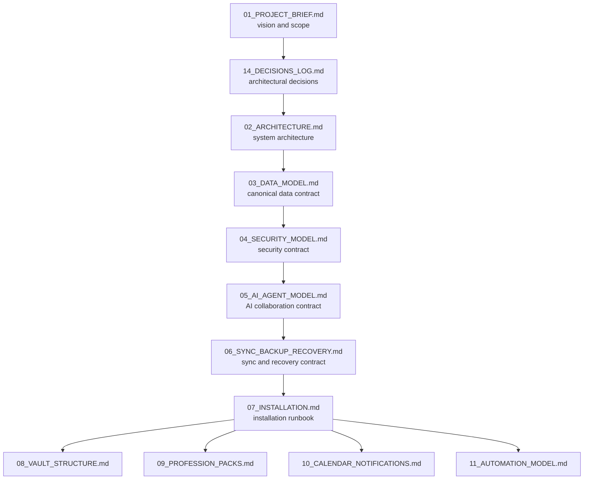
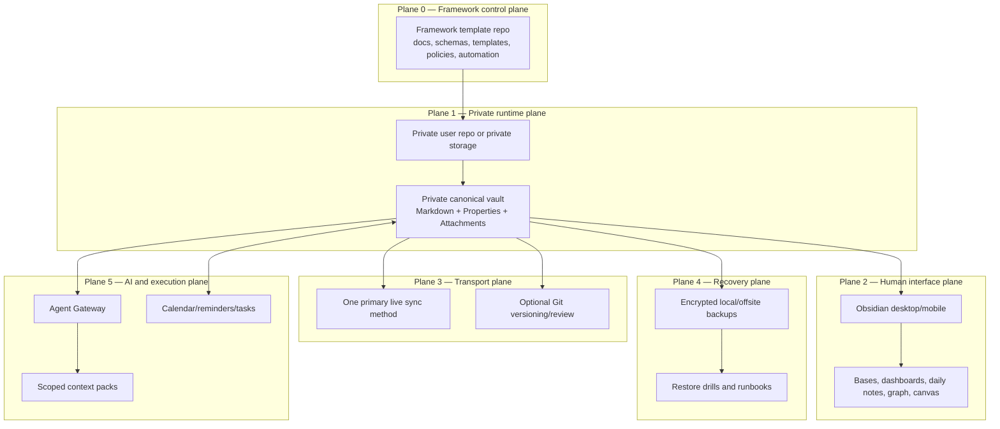
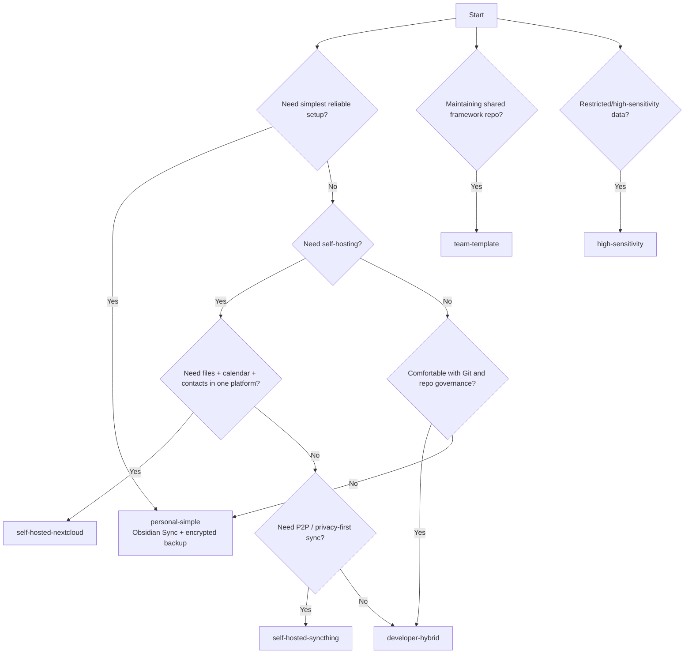
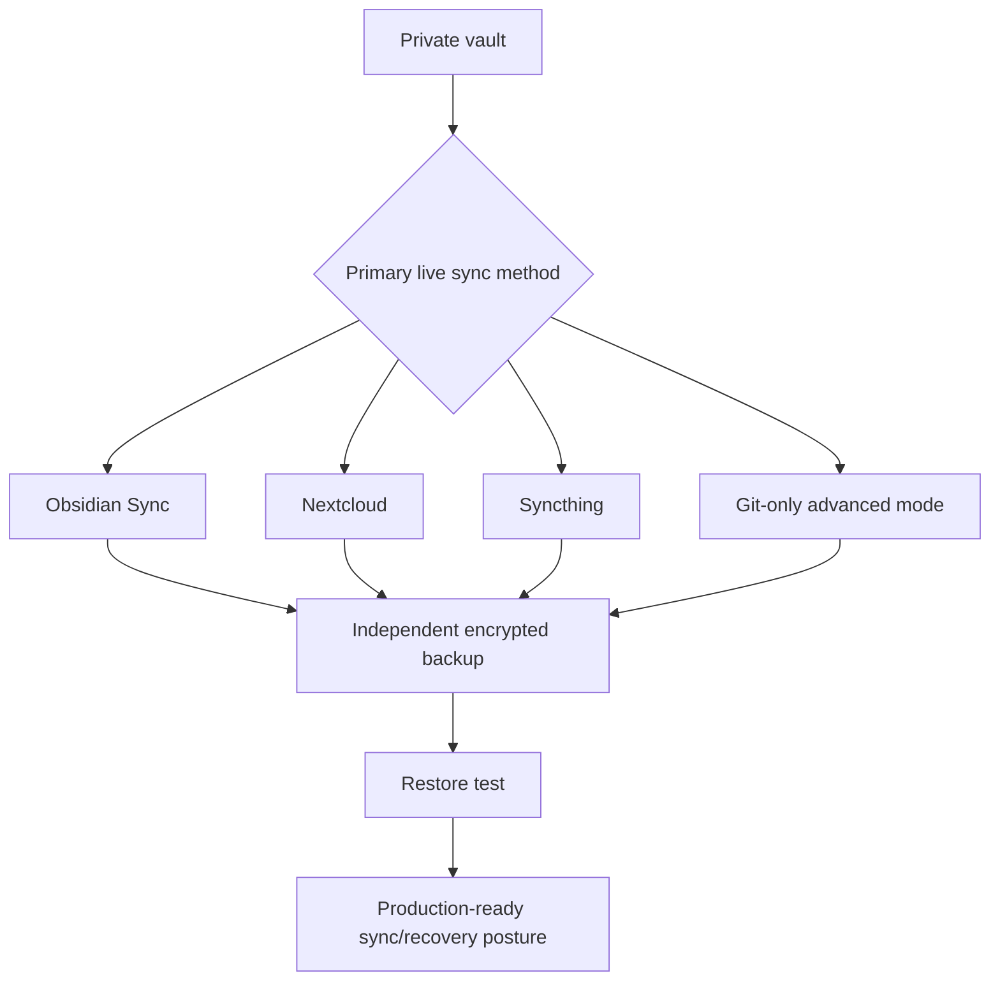
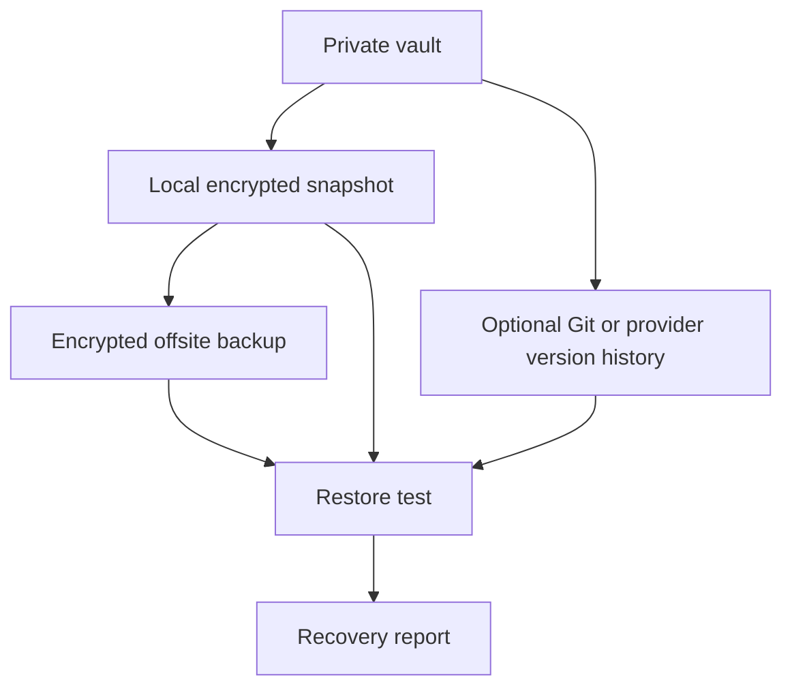
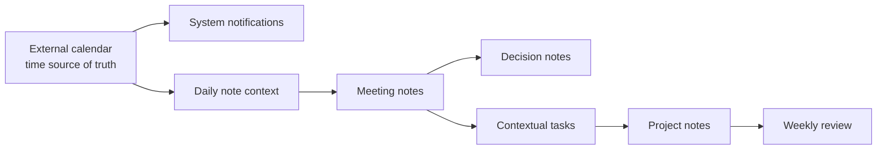
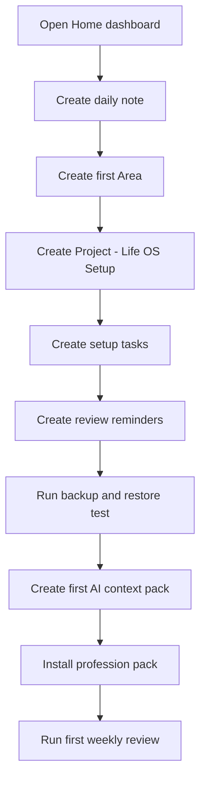
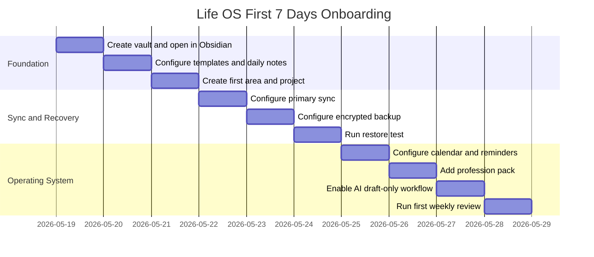

# 07_INSTALLATION

## Life OS Framework — production installation and onboarding runbook

> **Strategic promise:** installing Life OS must not feel like copying a folder of notes. It must feel like deploying a personal operating system: private by default, recoverable by design, AI-ready by policy, and adaptable to the user’s actual life and profession.
>
> **Truthful premium claim:** Life OS Framework is not the only possible way to organize personal knowledge. It is the project’s recommended production line: a disciplined, local-first, schema-first, human-owned, AI-assisted architecture that is designed to remain useful even when tools, devices, sync providers, AI models and professional requirements change.

---

## 1. Purpose

This document defines the production-grade installation process for the Life OS Framework.

It converts the architecture from `01_PROJECT_BRIEF.md`, `14_DECISIONS_LOG.md`, `02_ARCHITECTURE.md`, `03_DATA_MODEL.md`, `04_SECURITY_MODEL.md`, `05_AI_AGENT_MODEL.md` and `06_SYNC_BACKUP_RECOVERY.md` into operational setup steps.

It covers:

- how to choose the correct installation profile;
- how to create a private user vault from the shared framework;
- how to initialize Obsidian as the primary human interface;
- how to configure required core plugins and optional community plugins;
- how to choose exactly one primary live sync method per vault;
- how to configure GitHub, Git, Gitea, Forgejo, Nextcloud, Syncthing or hybrid operation;
- how to establish backup and restore before trusting the vault;
- how to connect calendar, reminders and tasks safely;
- how to enable AI collaboration without giving AI ownership of canonical state;
- how to adapt the system through profession packs;
- how to verify that the installation is production-ready.

This is not a casual quickstart. It is a repeatable runbook for safe personal and team deployment.

---

## 2. Installation north star

The installation north star is:

> **A Life OS installation is complete only when the user has a private canonical vault, a working human interface, one primary sync path, independent backup, restore-tested recovery, safe calendar/reminder integration, and AI limited to scoped drafts and reviewed actions.**

A vault that opens in Obsidian is not yet production-ready.

A vault that syncs is not yet production-ready.

A vault that AI can read is not yet production-ready.

A production-ready vault must be:

- local-first;
- private by default;
- schema-compatible;
- recoverable;
- reviewable;
- security-zoned;
- AI-safe;
- profession-adapted;
- maintainable over time.

---

## 3. Architecture dependency map



This file must not contradict upstream documents. If an installation path requires breaking an ADR, the installation path is invalid.

---

## 4. Production installation model

Life OS installation has six planes.



Installation is the process of bringing these planes online in the right order.

The order matters:

1. create private runtime;
2. initialize canonical vault;
3. enable human interface;
4. choose sync;
5. establish backup and recovery;
6. connect calendar/tasks;
7. enable AI with constraints;
8. adapt profession layer;
9. run validation;
10. begin operating cadence.

---

## 5. Scope

### 5.1. In scope

This document covers installation for:

- individual personal vaults;
- developer/hybrid vaults;
- privacy-first self-hosted vaults;
- team framework/template repositories;
- high-sensitivity installations;
- mobile-first users;
- AI-assisted but human-reviewed workflows;
- profession-pack onboarding.

### 5.2. Out of scope

This document does not provide:

- full server hardening for every self-hosted stack component;
- legal, medical, tax or financial compliance advice;
- exhaustive operating-system-specific GUI screenshots;
- instructions for storing passwords or secrets in the vault;
- a guarantee that any third-party plugin is safe;
- an instruction to give AI unrestricted access to personal data.

Detailed follow-up documents:

| Topic | Document |
|---|---|
| Vault folder semantics | `08_VAULT_STRUCTURE.md` |
| Profession-specific adaptation | `09_PROFESSION_PACKS.md` |
| Calendar and reminders | `10_CALENDAR_NOTIFICATIONS.md` |
| Automation boundaries | `11_AUTOMATION_MODEL.md` |
| CI/CD and validation | `12_CI_CD_VALIDATION.md` |
| Roadmap | `13_ROADMAP.md` |
| Self-hosting deep dive | `SELF_HOSTED_REFERENCE_STACK.md` |
| MCP details | `MCP_INTEGRATION.md` |
| Semantic index details | `SEMANTIC_INDEX.md` |

---

## 6. Installation principles

### 6.1. Install the architecture, not the tool

The goal is not to install Obsidian only. The goal is to install:

- a private canonical data plane;
- a safe human interface;
- a controlled sync path;
- a tested recovery path;
- a scoped AI collaboration path;
- a profession-adapted operating model.

### 6.2. Keep shared and private data separate

The shared framework repository contains:

- documentation;
- schemas;
- templates;
- policies;
- profession packs;
- examples with synthetic data;
- automation scripts;
- CI workflows;
- release artifacts.

The private user vault contains:

- personal notes;
- projects;
- private reviews;
- people notes;
- financial context;
- work/client context;
- AI drafts;
- personal attachments.

These must not be mixed.

### 6.3. Use one primary live sync method

The installation must select exactly one primary live sync method per vault:

- Obsidian Sync;
- Nextcloud;
- Syncthing;
- Git-only for advanced technical users;
- another carefully reviewed transport.

Git may be added as versioning and review, but it should not be blindly combined with another live sync engine without conflict discipline.

### 6.4. Backup before trust

A vault is not trusted until:

- it is backed up independently from live sync;
- backup encryption is configured;
- restore has been tested;
- the user knows where recovery keys live;
- the recovery runbook has been executed at least once.

### 6.5. AI starts disabled or draft-only

AI integration begins in one of two states:

- disabled;
- draft-only with scoped context packs.

AI must not directly edit canonical files, delete notes, move files, create critical reminders, send messages, change permissions, access secrets or alter backups without explicit human approval.

### 6.6. Profession packs extend; they do not rewrite the kernel

The vault kernel remains stable.

Profession packs add overlays:

- templates;
- dashboards;
- checklists;
- note types;
- review cadences;
- quality criteria;
- AI workflows.

They must not break core sensitivity, ID, status, relation, backup or AI policies.

---

## 7. Installation profiles

Choose one profile before installing.

| Profile | Recommended for | Primary sync | Versioning | Backup | Difficulty |
|---|---|---|---|---|---|
| `personal-simple` | Most users | Obsidian Sync | Sync history + optional snapshots | Encrypted local/offsite | Low |
| `developer-hybrid` | Developers, technical founders, engineers | Obsidian Sync or Syncthing | Private GitHub/Gitea/Forgejo repo | Encrypted local/offsite | Medium |
| `self-hosted-nextcloud` | Users wanting files/calendar/contacts under one server | Nextcloud Desktop/Mobile | Optional Gitea/Forgejo | Server + offsite encrypted backup | Medium-high |
| `self-hosted-syncthing` | Privacy-first users wanting P2P sync | Syncthing | Optional Git | Encrypted local/offsite | Medium-high |
| `team-template` | Teams maintaining the framework | GitHub/Gitea/Forgejo template repo | Protected branches/releases | Repository backups | Medium |
| `high-sensitivity` | Legal, health, security, private finance, confidential work | Selective local-first or compartmented sync | Encrypted snapshots | Offline/immutable backup | High |
| `mobile-first` | Users who capture mostly on phone/tablet | Obsidian Sync | Optional desktop snapshots | Backup from desktop/server node | Low-medium |

### 7.1. Profile decision tree



---

## 8. Required accounts and tools by profile

### 8.1. Common requirements

All users need:

- Obsidian installed on at least one primary desktop or laptop device;
- a local filesystem folder for the vault;
- enough disk space for notes and attachments;
- a password manager;
- device encryption enabled;
- a backup target;
- a calendar/reminder system for critical notifications.

### 8.2. Optional but recommended tools

| Tool | Use |
|---|---|
| Git | versioning, review, migration, framework contribution |
| GitHub Desktop or command-line Git | easier Git workflow for non-experts |
| Gitea or Forgejo | self-hosted Git |
| Nextcloud | files, calendar, contacts and self-hosted sync |
| Syncthing | P2P sync |
| Restic, Borg or Kopia | encrypted backup |
| Tailscale or WireGuard | private access to self-hosted services |
| Uptime Kuma or equivalent | self-hosted monitoring |
| Password manager | secrets and recovery-key custody |

### 8.3. Tools that are explicitly not storage for secrets

Do not store secrets in:

- Markdown notes;
- Obsidian properties;
- examples;
- issue templates;
- GitHub Actions logs;
- AI drafts;
- context packs;
- semantic indexes;
- exported memory files;
- unencrypted backups.

Secrets belong in a password manager or secret manager.

---

## 9. Pre-installation security checklist

Before creating the vault, complete this checklist.

```markdown
# Pre-installation Security Checklist

- [ ] I understand that the shared framework repo must not contain real personal data.
- [ ] I have a password manager.
- [ ] I will not store passwords, API keys, private keys, seed phrases, production credentials or raw banking credentials in the vault.
- [ ] My primary device has disk encryption enabled.
- [ ] I know where my backup encryption key or recovery phrase will be stored.
- [ ] I have chosen one primary live sync method.
- [ ] I have chosen an independent backup method.
- [ ] I have chosen my calendar/reminder source of truth.
- [ ] I understand that AI outputs go to draft/review zones first.
- [ ] I understand that critical reminders must not rely on Obsidian alone.
```

If any item is unchecked, install the minimal vault only and defer AI/sync expansion until the gap is closed.

---

## 10. Folder naming and local paths

Use boring, durable names.

Recommended local paths:

| OS | Example path |
|---|---|
| macOS | `~/LifeOS/vault` |
| Linux | `~/LifeOS/vault` |
| Windows | `C:\Users\Account\LifeOS\vault` |
| Self-hosted server node | `/srv/lifeos/vaults/account/vault` |

Avoid:

- emoji in filesystem paths;
- special characters in root folder names;
- storing the vault only inside an unstable temporary folder;
- placing the vault inside two live-sync providers at once;
- using a work-managed folder for deeply personal data unless policy allows it.

Recommended root layout for a private user repository:

```text
my-life-os/
├── README.md
├── vault/
├── backups/
│   └── README.md
├── docs/
│   └── local-notes.md
├── scripts/
│   └── README.md
└── .gitignore
```

Recommended root layout for a non-Git local install:

```text
LifeOS/
├── vault/
├── backups/
├── exports/
└── recovery/
```

---

## 11. Framework repository setup

This section applies to maintainers and users creating private repositories from the framework.

### 11.1. Shared framework repository

The shared framework repository should be named clearly.

Recommended names:

```text
life-os-framework
personal-os-framework
life-os-template
```

It contains framework assets only:

```text
life-os-framework/
├── README.md
├── SECURITY.md
├── CONTRIBUTING.md
├── CHANGELOG.md
├── ROADMAP.md
├── docs/
├── vault-template/
├── schemas/
├── templates/
├── profession-packs/
├── policies/
├── automations/
├── examples/
├── tests/
└── .github/
```

It must not contain real personal data.

### 11.2. Convert repository to template

For GitHub-based framework distribution:

1. Open repository settings.
2. Enable template repository behavior.
3. Keep example data synthetic.
4. Enable branch protection or repository rulesets on the default branch.
5. Enable secret scanning and push protection where available.
6. Add `SECURITY.md`.
7. Add `CODEOWNERS`.
8. Add CI validation.
9. Tag releases.
10. Publish migration notes for every release.

### 11.3. Private user repository from template

For a private user instance:

1. Create a new private repository from the framework template.
2. Name it with a private, non-revealing name.
3. Do not make it public.
4. Clone it locally.
5. Copy or instantiate `vault-template/` into `vault/`.
6. Open `vault/` in Obsidian.
7. Configure sync and backup.
8. Commit only framework configuration and personal notes you intentionally want in Git.

Example:

```bash
git clone git@github.com:account/my-life-os.git
cd my-life-os
cp -R vault-template vault
git status --short
```

If the repository created from template already includes a `vault/` folder, do not duplicate it.

### 11.4. Manual local install without Git

For users who do not want Git:

1. Download a release archive of the framework.
2. Extract it locally.
3. Copy `vault-template/` to a private `vault/` folder.
4. Open that folder in Obsidian.
5. Configure Obsidian Sync, Nextcloud or Syncthing.
6. Configure encrypted backup separately.
7. Keep the extracted framework release outside the personal vault if possible.

Example:

```bash
mkdir -p ~/LifeOS
cp -R ./vault-template ~/LifeOS/vault
```

---

## 12. Create the private vault

### 12.1. Minimum vault structure

The installed private vault must contain this kernel:

```text
vault/
├── 00_System/
├── 01_Inbox/
├── 02_Daily/
├── 10_Areas/
├── 20_Projects/
├── 30_Knowledge/
├── 40_Work/
├── 50_Finance/
├── 60_People/
├── 70_AI/
├── 80_Archive/
└── 99_Attachments/
```

Required system subfolders:

```text
00_System/
├── Dashboards/
├── Templates/
├── Schemas/
├── Bases/
├── Policies/
├── Checklists/
├── Maintenance/
└── Operating_Manuals/
```

Required AI subfolders:

```text
70_AI/
├── Agents/
├── Context_Packs/
├── Prompts/
├── AI_Drafts/
├── Agent_Logs/
├── Evaluations/
└── Memory_Exports/
```

Required inbox subfolders:

```text
01_Inbox/
├── Quick/
├── Web/
├── Voice/
├── Imports/
├── Files_To_Process/
└── AI_Drafts/
```

### 12.2. Create missing folders

If manual setup is needed:

```bash
mkdir -p vault/00_System/{Dashboards,Templates,Schemas,Bases,Policies,Checklists,Maintenance,Operating_Manuals}
mkdir -p vault/01_Inbox/{Quick,Web,Voice,Imports,Files_To_Process,AI_Drafts}
mkdir -p vault/02_Daily/{Daily,Weekly,Monthly,Yearly}
mkdir -p vault/10_Areas
mkdir -p vault/20_Projects/{Active,Waiting,Someday,Completed}
mkdir -p vault/30_Knowledge/{Concepts,Books,Articles,Research,Maps}
mkdir -p vault/40_Work
mkdir -p vault/50_Finance/{Dashboard,Budget,Goals,Decisions,Taxes,Subscriptions,Reviews}
mkdir -p vault/60_People/{CRM,Meetings,Commitments,Relationship_Notes}
mkdir -p vault/70_AI/{Agents,Context_Packs,Prompts,AI_Drafts,Agent_Logs,Evaluations,Memory_Exports}
mkdir -p vault/80_Archive
mkdir -p vault/99_Attachments
```

### 12.3. Required first notes

Create or verify these notes:

```text
vault/00_System/Home.md
vault/00_System/Operating_Manuals/Life OS Operating Manual.md
vault/00_System/Policies/AI Policy.md
vault/00_System/Policies/Security Policy.md
vault/00_System/Policies/Sync Backup Recovery Policy.md
vault/00_System/Maintenance/System Health.md
vault/10_Areas/Area - Systems.md
vault/20_Projects/Active/Project - Life OS Setup.md
vault/70_AI/Context_Packs/Context Pack - Life OS Setup.md
```

### 12.4. Required first metadata

Every required first note must include at least:

```yaml
---
id: ""
type: ""
title: ""
status: "active"
created: "2026-05-19"
updated: "2026-05-19"
sensitivity: "private"
tags: []
relations:
  people: []
  projects: []
  decisions: []
  resources: []
review:
  cadence: "monthly"
  next: ""
---
```

Use the final data contract from `03_DATA_MODEL.md` where available.

---

## 13. Open the vault in Obsidian

### 13.1. Desktop first

The first installation should happen on a desktop or laptop, not only on mobile.

Recommended flow:

1. Install Obsidian from the official distribution channel for the operating system.
2. Open Obsidian.
3. Select `Open folder as vault`.
4. Choose the `vault/` folder.
5. Confirm that the file explorer shows the kernel folders.
6. Open `00_System/Home.md`.
7. Create or open today’s daily note.
8. Verify that Markdown files are visible in the filesystem outside Obsidian.

Desktop-first installation is recommended because:

- it is easier to inspect files;
- it is easier to configure Git;
- it is easier to set up backup;
- it is easier to resolve conflicts;
- it is easier to install plugins deliberately;
- mobile clients should not be the only administration surface.

### 13.2. Mobile later

Mobile is installed after desktop is stable.

Mobile is primarily for:

- quick capture;
- reading;
- review;
- lightweight edits;
- calendar context;
- inbox processing.

Mobile should not be the first place where backup, Git, migration or AI access is configured.

---

## 14. Required Obsidian core configuration

Enable the minimum core plugins needed for the framework.

| Core feature | Required | Purpose |
|---|---:|---|
| Properties | Yes | structured metadata |
| Bases | Yes | database-like dashboards over notes and properties |
| Daily notes | Yes | temporal operating layer |
| Templates | Yes | repeatable note creation |
| Backlinks | Yes | graph navigation |
| Search | Yes | retrieval and maintenance |
| Graph view | Recommended | knowledge graph visualization |
| Canvas | Recommended | strategy, architecture and planning maps |
| Sync | Profile-dependent | primary live sync when using Obsidian Sync |

### 14.1. Daily Notes settings

Recommended settings:

| Setting | Value |
|---|---|
| Date format | `YYYY-MM-DD` |
| New file location | `02_Daily/Daily` |
| Template file | `00_System/Templates/daily-note.md` |

Recommended daily note filename:

```text
2026-05-19.md
```

### 14.2. Templates settings

Recommended template folder:

```text
00_System/Templates
```

Template installation must include at least:

```text
area.md
project.md
daily-note.md
weekly-review.md
monthly-review.md
meeting.md
decision.md
person.md
resource.md
finance-record.md
ai-agent.md
context-pack.md
ai-draft.md
agent-log.md
```

### 14.3. Bases settings

Recommended base files:

```text
00_System/Bases/projects.base
00_System/Bases/areas.base
00_System/Bases/decisions.base
00_System/Bases/people.base
00_System/Bases/finance.base
00_System/Bases/ai-drafts.base
00_System/Bases/system-health.base
```

Initial dashboards must use Bases or equivalent queries derived from note metadata.

Do not manually duplicate project lists in multiple dashboards.

---

## 15. Community plugin policy

Community plugins can be powerful. They also expand the attack surface.

The installation policy is:

1. install only plugins required by the chosen profile;
2. prefer plugins with clear documentation and active maintenance;
3. do not install plugins that require broad network access unless the use case is explicit;
4. do not give plugins access to secrets;
5. configure AI-related plugins as read-only or draft-only unless mediated by policy;
6. review plugin settings before syncing `.obsidian` across devices;
7. record installed plugins in `00_System/Maintenance/System Health.md`.

### 15.1. Recommended plugin tiers

| Tier | Plugin type | Default |
|---|---|---|
| P0 | No community plugins | acceptable minimal install |
| P1 | Tasks | recommended for contextual actions |
| P1 | Obsidian Git | recommended for developer/versioning profiles |
| P1 | Linter | recommended for maintainers |
| P2 | Dataview | optional when Bases are insufficient |
| P2 | Full Calendar / calendar mirror | optional context mirror, not notification source |
| P2 | Local REST API / MCP bridge | advanced, gateway-protected only |
| P2 | Web Clipper | recommended for research capture with provenance discipline |

### 15.2. Community plugin record

Track plugin decisions:

```markdown
# Plugin Register

| Plugin | Version | Purpose | Network access | Data access | Required by profile | Review date | Decision |
|---|---:|---|---|---|---|---|---|
| Tasks |  | contextual tasks | no | vault tasks | P1 |  | accepted |
| Obsidian Git |  | versioning | git remote | vault files | developer |  | accepted |
| Local REST API / MCP bridge |  | automation gateway | local API | scoped vault access | advanced AI |  | restricted |
```

### 15.3. Plugins that require special care

Any plugin that can:

- read the whole vault;
- write files;
- execute commands;
- expose an HTTP server;
- connect to cloud AI models;
- sync files;
- import external content;
- access calendars, email or Git remotes;
- run custom JavaScript;

must be treated as security-sensitive.

---

## 16. Git and repository configuration

### 16.1. Recommended `.gitignore`

For private user vault repositories:

```gitignore
# OS files
.DS_Store
Thumbs.db
Desktop.ini

# Local editor state
.vscode/
.idea/

# Obsidian volatile workspace state
vault/.obsidian/workspace.json
vault/.obsidian/workspace-mobile.json
vault/.obsidian/cache/

# Plugin local state that may be device-specific
vault/.obsidian/plugins/*/data.json

# Secrets and sensitive raw exports
.env
.env.*
*.pem
*.key
*.p12
*.pfx
*.kdbx
secrets/
private/
raw-bank-exports/
identity-documents/
medical-records-raw/
legal-records-raw/

# Generated artifacts
vault/70_AI/Generated_Context_Packs/
vault/70_AI/Semantic_Index/
vault/70_AI/Exports/
exports/
.tmp/
tmp/

# Local backups inside repository are forbidden
backups/*.zip
backups/*.tar
backups/*.tar.gz
backups/*.7z
backups/*.age
backups/*.gpg
```

This `.gitignore` is intentionally conservative. A user may deliberately version selected `.obsidian` configuration, but volatile workspace state should not be treated as canonical knowledge.

### 16.2. Recommended repository settings

For framework repositories:

- private or internal by default until public release is intentional;
- branch protection or rulesets on default branch;
- required status checks;
- required reviews;
- CODEOWNERS;
- secret scanning;
- push protection where available;
- CodeQL or equivalent code scanning for automation code;
- Dependabot or equivalent dependency monitoring;
- release tags;
- `SECURITY.md`;
- signed releases when feasible.

For private personal repositories:

- private visibility;
- two-factor authentication on provider account;
- secret scanning where available;
- no personal secrets in repo;
- no public forks;
- no shared links to private attachments;
- clear device access list;
- backup independent from provider.

### 16.3. Initial commit sequence

Recommended sequence for a new personal repository:

```bash
git status --short
git add README.md .gitignore vault/00_System vault/01_Inbox vault/02_Daily vault/10_Areas vault/20_Projects vault/30_Knowledge vault/40_Work vault/50_Finance vault/60_People vault/70_AI vault/80_Archive vault/99_Attachments
git commit -m "Initialize Life OS vault"
git push origin main
```

Before pushing, run a local secret scan if tooling exists.

Do not push if the vault already contains:

- passwords;
- API keys;
- private keys;
- seed phrases;
- raw bank exports;
- identity document scans;
- confidential client files that should not be in Git.

---

## 17. Sync setup overview

The sync setup is selected by profile.



Rules:

- choose one primary live sync method;
- configure backup separately;
- test restore before relying on the vault;
- do not allow AI to configure sync or backup without human review;
- do not store backup keys inside the vault.

---

## 18. Profile A — personal-simple installation

### 18.1. Best for

Use `personal-simple` when:

- the user wants the least operational complexity;
- desktop and mobile sync must be comfortable;
- self-hosting is not required;
- Git is not central to the workflow;
- AI will be manual or draft-only.

### 18.2. Stack

```yaml
profile: personal-simple
human_interface: Obsidian
primary_sync: Obsidian Sync
versioning:
  - Obsidian Sync version history
  - optional manual snapshots
backup:
  - encrypted local backup
  - encrypted offsite backup
calendar: external calendar
reminders: system reminders
ai: disabled_or_draft_only
```

### 18.3. Installation steps

1. Create the private vault locally.
2. Open the vault in Obsidian desktop.
3. Enable required core plugins.
4. Configure Daily Notes and Templates.
5. Create the first system notes.
6. Enable Obsidian Sync.
7. Create or connect a remote vault.
8. Configure selective sync intentionally.
9. Add mobile devices.
10. Configure encrypted backup from the desktop device.
11. Perform a restore test.
12. Add calendar/reminder workflow.
13. Enable AI only after the AI policy exists.

### 18.4. Acceptance checklist

```markdown
# personal-simple Acceptance Checklist

- [ ] Vault opens on desktop.
- [ ] Vault opens on mobile.
- [ ] Daily note works.
- [ ] Templates folder is configured.
- [ ] Bases or dashboards are visible.
- [ ] Obsidian Sync completes without errors.
- [ ] Only expected files are synced.
- [ ] Encrypted backup exists outside Obsidian Sync.
- [ ] Restore test was completed.
- [ ] Calendar/reminders are configured outside Obsidian.
- [ ] AI writes only to draft/review zones or is disabled.
```

---

## 19. Profile B — developer-hybrid installation

### 19.1. Best for

Use `developer-hybrid` when:

- the user is comfortable with Git;
- auditability and diffs matter;
- framework contributions are likely;
- the user wants version history beyond sync history;
- the user may use local automation or AI tooling.

### 19.2. Stack

```yaml
profile: developer-hybrid
human_interface: Obsidian
primary_sync: Obsidian Sync or Syncthing
versioning: private Git repository
provider: GitHub or Gitea or Forgejo
backup:
  - encrypted local backup
  - encrypted offsite backup
ai:
  gateway: required before write access
  writes: draft_only
```

### 19.3. Recommended repository layout

```text
my-life-os/
├── README.md
├── vault/
├── scripts/
├── docs/
├── tests/
├── .github/
└── .gitignore
```

### 19.4. Installation steps

1. Create private repository.
2. Clone repository locally.
3. Instantiate `vault/` from `vault-template/`.
4. Open `vault/` in Obsidian.
5. Configure core plugins.
6. Install Obsidian Git only if using Git from Obsidian.
7. Configure `.gitignore` before the first commit.
8. Run local secret check.
9. Commit the empty framework-aligned vault.
10. Push to private remote.
11. Configure primary live sync.
12. Confirm Git and live sync are not fighting over the same edits.
13. Configure encrypted backup.
14. Run restore test.
15. Configure AI gateway only after security policy exists.

### 19.5. Git discipline

Recommended:

- commit after review sessions;
- use descriptive commit messages;
- avoid auto-committing every few minutes if notes contain sensitive transient content;
- review diffs before pushing sensitive zones;
- keep Git remote private;
- use protected branches for shared framework work;
- never commit secrets.

### 19.6. Developer acceptance checklist

```markdown
# developer-hybrid Acceptance Checklist

- [ ] Private repository exists.
- [ ] `.gitignore` is installed before personal data is added.
- [ ] First commit contains only safe framework/vault structure.
- [ ] Secret scanning or local equivalent is configured where possible.
- [ ] Primary live sync method is chosen.
- [ ] Git is treated as versioning/review, not uncontrolled sync magic.
- [ ] Backup exists outside Git.
- [ ] Restore test was completed.
- [ ] AI tool access is gateway-restricted.
```

---

## 20. Profile C — self-hosted-nextcloud installation

### 20.1. Best for

Use `self-hosted-nextcloud` when:

- the user wants a self-hosted platform for files, calendar and contacts;
- the user or team can administer a server;
- CalDAV/CardDAV integration matters;
- web access and file sharing are useful;
- operational responsibility is acceptable.

### 20.2. Stack

```yaml
profile: self-hosted-nextcloud
human_interface: Obsidian
primary_sync: Nextcloud Desktop/Mobile sync
calendar: Nextcloud Calendar via CalDAV
contacts: Nextcloud Contacts via CardDAV
versioning: optional Gitea/Forgejo
backup: server backup + encrypted offsite backup
network: HTTPS + private access where appropriate
```

### 20.3. Installation steps

1. Deploy or choose a trusted Nextcloud server.
2. Configure HTTPS.
3. Configure user account and strong authentication.
4. Configure server backup before storing valuable vault data.
5. Install Nextcloud Desktop Client on primary computer.
6. Create a dedicated `LifeOS/Vault` folder.
7. Sync the folder to local disk.
8. Open the local synced folder in Obsidian.
9. Configure Obsidian core settings.
10. Add mobile sync only after desktop sync is stable.
11. Configure Nextcloud Calendar if using self-hosted calendar.
12. Configure backup of server storage and database.
13. Test file conflict behavior with a safe test note.
14. Test restore from server backup.

### 20.4. Nextcloud conflict discipline

Rules:

- avoid editing the same note on two devices at the same time;
- resolve conflict files manually;
- never ignore conflict files in active folders;
- create a maintenance dashboard for conflict files;
- do not rely on Nextcloud alone as backup;
- back up both data files and server configuration/database where relevant.

### 20.5. Nextcloud acceptance checklist

```markdown
# self-hosted-nextcloud Acceptance Checklist

- [ ] Server is accessible over HTTPS.
- [ ] Account security is configured.
- [ ] Desktop client syncs the vault folder.
- [ ] Obsidian opens the local synced folder.
- [ ] Mobile sync works if needed.
- [ ] Calendar and contacts are configured if used.
- [ ] Conflict file behavior was tested.
- [ ] Server backup exists.
- [ ] Encrypted offsite backup exists.
- [ ] Restore test was completed.
```

---

## 21. Profile D — self-hosted-syncthing installation

### 21.1. Best for

Use `self-hosted-syncthing` when:

- the user wants peer-to-peer sync;
- privacy-first sync is more important than web UI collaboration;
- an always-on device or server node is available;
- the user can handle device pairing and conflict files;
- calendar/contact hosting is handled separately.

### 21.2. Stack

```yaml
profile: self-hosted-syncthing
human_interface: Obsidian
primary_sync: Syncthing
always_on_node: optional_but_recommended
versioning: optional Git
backup: encrypted local/offsite backup
calendar: external calendar or Nextcloud if separately deployed
ai: local_or_gateway_restricted
```

### 21.3. Installation steps

1. Install Syncthing on the primary desktop.
2. Create local `vault/` folder.
3. Open it in Obsidian and initialize Life OS.
4. Add Syncthing folder.
5. Pair the second device.
6. Share only the vault folder.
7. Wait for full sync.
8. Open synced folder in Obsidian on second device.
9. Add phone/tablet only after desktop-to-desktop sync is stable.
10. Configure file versioning if appropriate.
11. Configure independent encrypted backup.
12. Test conflict behavior with a safe note.
13. Test restore from backup.

### 21.4. Syncthing conflict discipline

Rules:

- do not edit the same file simultaneously on two devices;
- monitor `.sync-conflict` files;
- do not assume Syncthing versioning is complete backup;
- protect Syncthing device keys;
- revoke lost devices;
- use encrypted disks for trusted devices;
- treat untrusted encrypted devices as transport/storage, not as full recovery.

### 21.5. Syncthing acceptance checklist

```markdown
# self-hosted-syncthing Acceptance Checklist

- [ ] Devices are paired intentionally.
- [ ] Vault folder is shared only with expected devices.
- [ ] Initial sync completed.
- [ ] Conflict behavior was tested.
- [ ] Device loss revocation procedure is documented.
- [ ] Optional always-on node is configured.
- [ ] Independent encrypted backup exists.
- [ ] Restore test was completed.
```

---

## 22. Profile E — team-template installation

### 22.1. Best for

Use `team-template` when:

- a team maintains the framework;
- multiple users create private vaults from one shared standard;
- governance, releases and migration matter;
- examples must remain synthetic;
- personal data must never enter the shared repository.

### 22.2. Stack

```yaml
profile: team-template
repository: GitHub or Gitea or Forgejo
visibility: private_internal_or_public_when_ready
branch_protection: required
codeowners: required
ci: required
secret_scanning: required_where_available
release_process: required
migration_guides: required
personal_data: forbidden
```

### 22.3. Installation steps for maintainers

1. Create framework repository.
2. Add documentation set.
3. Add `vault-template/` with no personal data.
4. Add schemas and templates.
5. Add profession pack structure.
6. Add policies.
7. Add examples with synthetic data only.
8. Add CI validation.
9. Add `SECURITY.md` and `CONTRIBUTING.md`.
10. Add CODEOWNERS.
11. Protect default branch.
12. Enable secret scanning and push protection where available.
13. Create first tagged release.
14. Publish migration guide.
15. Test creating a private user repo from the template.

### 22.4. Installation steps for team members

1. Create private repository from team template.
2. Do not commit personal data to the team repo.
3. Instantiate private vault.
4. Choose individual sync profile.
5. Configure backup.
6. Adapt profession pack.
7. Contribute generic improvements back via PR.
8. Keep personal changes private.

### 22.5. Team-template acceptance checklist

```markdown
# team-template Acceptance Checklist

- [ ] Shared repository contains no real personal data.
- [ ] Examples are synthetic.
- [ ] Default branch is protected.
- [ ] CODEOWNERS exists.
- [ ] CI validates docs, schemas, links, secrets and templates.
- [ ] Security policy exists.
- [ ] Contribution policy exists.
- [ ] Release process exists.
- [ ] Migration guide exists.
- [ ] Creating a private user vault from the template was tested.
```

---

## 23. Profile F — high-sensitivity installation

### 23.1. Best for

Use `high-sensitivity` when the vault may contain:

- confidential client material;
- legal case context;
- health context;
- sensitive finance context;
- research under embargo;
- private identity-adjacent notes;
- professional safety-critical records;
- personal information with high harm potential.

### 23.2. Stack

```yaml
profile: high-sensitivity
human_interface: Obsidian
primary_sync: selective_or_compartmented
restricted_compartments: local_first_or_separately_encrypted
versioning: encrypted_snapshots_or_private_git_with_strict_excludes
backup: encrypted_offline_plus_encrypted_offsite
ai: disabled_by_default_or_explicit_context_only
calendar: external_calendar_with_minimal_private_details
```

### 23.3. High-sensitivity installation rules

1. Start with local-only vault.
2. Define sensitivity zones before importing data.
3. Keep forbidden data out entirely.
4. Exclude restricted compartments from broad sync unless explicitly justified.
5. Do not use community plugins until reviewed.
6. Disable AI access by default.
7. Use explicit context packs only.
8. Do not index restricted zones semantically by default.
9. Use encrypted backups with external key custody.
10. Test restore to an isolated environment.
11. Keep device inventory and offboarding procedure.

### 23.4. High-sensitivity acceptance checklist

```markdown
# high-sensitivity Acceptance Checklist

- [ ] Sensitivity zones are defined.
- [ ] Forbidden data is excluded.
- [ ] Restricted folders are not broadly synced.
- [ ] AI access is disabled or explicit-context-only.
- [ ] Community plugins are reviewed.
- [ ] Backup encryption is configured.
- [ ] Backup keys are outside the vault.
- [ ] Restore test was performed in an isolated location.
- [ ] Lost-device procedure exists.
- [ ] Incident response note exists.
```

---

## 24. Profile G — mobile-first installation

### 24.1. Best for

Use `mobile-first` when:

- most capture happens on phone;
- desktop exists but is used less frequently;
- the user needs reliable quick capture;
- the user still accepts that administration should happen on desktop/server.

### 24.2. Stack

```yaml
profile: mobile-first
human_interface: Obsidian mobile + desktop admin node
primary_sync: Obsidian Sync
backup: desktop_or_server_node_encrypted_backup
calendar: mobile_native_calendar
reminders: mobile_native_reminders
ai: mobile_manual_or_draft_only
```

### 24.3. Installation steps

1. Install and configure desktop first.
2. Enable Obsidian Sync.
3. Install Obsidian mobile.
4. Connect to the same remote vault.
5. Configure mobile quick capture folder as `01_Inbox/Quick`.
6. Configure attachments path.
7. Test creating a daily note on mobile.
8. Test resolving a small edit on desktop.
9. Configure desktop/server backup.
10. Do not rely on mobile as the only backup node.

### 24.4. Mobile-first acceptance checklist

```markdown
# mobile-first Acceptance Checklist

- [ ] Desktop admin node exists.
- [ ] Mobile sync works.
- [ ] Quick capture goes to Inbox.
- [ ] Attachments sync as expected.
- [ ] Critical reminders use system reminders/calendar.
- [ ] Backup runs from desktop or server node.
- [ ] Restore test was completed from non-mobile backup.
```

---

## 25. Backup setup

Installation is incomplete until backup is configured.

### 25.1. Backup architecture



### 25.2. Backup minimum

Every installation must have:

- one local backup or snapshot;
- one offsite encrypted backup;
- backup key stored outside the vault;
- restore test;
- retention policy;
- backup health note.

### 25.3. Recommended backup include list

```text
vault/**/*.md
vault/**/*.canvas
vault/**/*.base
vault/99_Attachments/**
vault/.obsidian/app.json
vault/.obsidian/appearance.json
vault/.obsidian/core-plugins.json
vault/.obsidian/community-plugins.json
vault/.obsidian/hotkeys.json
```

### 25.4. Recommended backup exclude list

```text
vault/70_AI/Semantic_Index/**
vault/70_AI/Generated_Context_Packs/**
vault/70_AI/Exports/**
vault/.obsidian/workspace.json
vault/.obsidian/workspace-mobile.json
vault/.obsidian/cache/**
.tmp/**
tmp/**
```

### 25.5. Restore test procedure

```markdown
# Restore Test Procedure

1. Create a temporary restore folder outside the live vault.
2. Restore the latest backup into that folder.
3. Open restored folder as an Obsidian vault.
4. Confirm key folders exist.
5. Open `00_System/Home.md`.
6. Open latest daily note.
7. Open an attachment.
8. Search for a known project.
9. Confirm AI draft folders are present or intentionally excluded.
10. Record result in `00_System/Maintenance/Recovery Log.md`.
```

### 25.6. Recovery log template

```markdown
---
type: recovery-test
status: completed
date:
sensitivity: private
---

# Recovery Test

## Backup source

## Restore location

## Files restored

## Checks performed

## Problems found

## Actions taken

## Next recovery test
```

---

## 26. Calendar, tasks and notifications setup

### 26.1. Operating rule

Calendar owns time.

Vault owns context.

Tasks own contextual action.

System reminders own critical alerts.

### 26.2. Calendar architecture



### 26.3. Setup steps

1. Choose calendar provider:
   - Apple Calendar;
   - Google Calendar;
   - Outlook;
   - Nextcloud Calendar;
   - another trusted CalDAV provider.
2. Keep critical events in the external calendar.
3. Create meeting notes in Obsidian.
4. Link meeting notes to projects, people and decisions.
5. Use Tasks or equivalent for contextual tasks.
6. Use system reminders for critical personal alerts.
7. Do not rely on Obsidian alone for critical notifications.

### 26.4. Initial review events

Create recurring events or reminders for:

| Review | Cadence | Location |
|---|---|---|
| Daily planning | daily | calendar or daily note habit |
| Inbox processing | daily or every 2 days | calendar/reminder |
| Weekly review | weekly | calendar |
| Monthly review | monthly | calendar |
| Backup health review | weekly | calendar/reminder |
| Restore test | monthly or quarterly | calendar |
| Security review | quarterly | calendar |
| Profession pack review | quarterly | calendar |

---

## 27. AI setup

### 27.1. AI installation rule

AI is installed last, not first.

The required order is:

```mermaid
flowchart LR
    Vault["Vault initialized"] --> Data["Metadata and sensitivity model configured"]
    Data --> Security["Security policy exists"]
    Security --> Backup["Backup and restore tested"]
    Backup --> Drafts["AI_Drafts and Agent_Logs exist"]
    Drafts --> Context["Context pack template exists"]
    Context --> Gateway["Agent Gateway policy configured"]
    Gateway --> AI["AI integration enabled"]
```



### 27.2. AI folders required before enablement

```text
70_AI/
├── Agents/
├── Context_Packs/
├── Prompts/
├── AI_Drafts/
├── Agent_Logs/
├── Evaluations/
└── Memory_Exports/
```

### 27.3. Minimal AI policy

```yaml
ai_policy:
  default_mode: "draft-only"
  canonical_write: "forbidden_without_human_review"
  delete_files: "forbidden"
  read_scope: "task_specific_context_pack"
  write_allowed:
    - "01_Inbox/AI_Drafts"
    - "70_AI/AI_Drafts"
    - "70_AI/Agent_Logs"
  write_forbidden:
    - "50_Finance/Raw"
    - "60_People/Private"
    - "99_Attachments/Identity"
    - "secrets"
  requires_human_approval:
    - "canonical_file_changes"
    - "calendar_event_creation"
    - "external_messages"
    - "permissions_changes"
    - "backup_configuration_changes"
    - "finance_legal_health_security_actions"
```

### 27.4. Context pack setup

Create:

```text
70_AI/Context_Packs/Context Pack - Life OS Setup.md
```

Minimum frontmatter:

```yaml
---
id: "context-pack-life-os-setup"
type: "context-pack"
title: "Life OS Setup Context"
status: "active"
sensitivity: "private"
agent: "setup-assistant"
scope:
  include:
    - "00_System"
    - "20_Projects/Active/Project - Life OS Setup.md"
  exclude:
    - "50_Finance"
    - "60_People"
    - "99_Attachments"
policy:
  write_mode: "draft-only"
  human_review_required: true
---
```

### 27.5. AI enablement checklist

```markdown
# AI Enablement Checklist

- [ ] Security policy exists.
- [ ] Sensitivity levels exist.
- [ ] Forbidden data is not in the vault.
- [ ] Backup and restore test completed.
- [ ] AI_Drafts folder exists.
- [ ] Agent_Logs folder exists.
- [ ] Context pack template exists.
- [ ] AI can only access scoped context.
- [ ] AI writes only drafts by default.
- [ ] Human review process is documented.
- [ ] Tool/MCP access is disabled or gateway-mediated.
```

---

## 28. Profession pack setup

### 28.1. Purpose

Profession packs adapt Life OS to the user’s actual work without changing the stable kernel.

A profession pack may add:

- work object types;
- templates;
- dashboards;
- quality checklists;
- review workflows;
- process notes;
- AI agents;
- safety/security rules;
- examples with synthetic data.

### 28.2. Profession pack selection

Choose one starting pack:

| Pack | Use |
|---|---|
| `developer` | software, data, infrastructure, product engineering |
| `designer` | product design, brand, visual, UX/UI |
| `founder` | strategy, product, sales, hiring, investors |
| `researcher` | papers, hypotheses, experiments, datasets |
| `student` | courses, lectures, assignments, exams |
| `writer` | ideas, outlines, drafts, publishing |
| `manager` | teams, planning, meetings, decisions |
| `consultant` | clients, engagements, deliverables |
| `teacher` | courses, lessons, students, assignments |
| `machinist` | orders, drawings, machines, tools, tolerances, quality |
| `healthcare` | protocols, study notes, anonymized cases |
| `lawyer` | matters, deadlines, documents, precedent, confidentiality |
| `finance` | models, reports, risk, decisions |
| `custom` | any non-standard role |

### 28.3. Install profession pack

Manual install pattern:

```text
profession-packs/<pack>/templates/      → vault/00_System/Templates/<pack>/
profession-packs/<pack>/dashboards/     → vault/00_System/Dashboards/<pack>/
profession-packs/<pack>/checklists/     → vault/00_System/Checklists/<pack>/
profession-packs/<pack>/examples/       → optional, synthetic examples only
profession-packs/<pack>/README.md       → vault/40_Work/<pack>/README.md or docs reference
```

Profession pack overlays should create folders under `40_Work/`.

Example for machinist:

```text
40_Work/
├── Orders/
├── Drawings/
├── Materials/
├── Machines/
├── Tools/
├── Setups/
├── Tolerances/
├── Quality_Control/
├── Maintenance/
├── Suppliers/
└── Safety/
```

Example for developer:

```text
40_Work/
├── Products/
├── Repositories/
├── Specs/
├── ADR/
├── Bugs/
├── Experiments/
├── Releases/
└── Postmortems/
```

### 28.4. Profession pack acceptance checklist

```markdown
# Profession Pack Acceptance Checklist

- [ ] Pack adds overlays without changing kernel folders.
- [ ] Pack note types are compatible with `03_DATA_MODEL.md`.
- [ ] Templates include required metadata.
- [ ] Dashboards use derived views.
- [ ] Examples are synthetic.
- [ ] Safety/security constraints are documented.
- [ ] AI assistance boundaries are documented.
- [ ] Review cadence is defined.
- [ ] Quality criteria are explicit.
```

---

## 29. First-run operating workflow

After installation, the user should run the first operating workflow.



### 29.1. First area

Create:

```text
10_Areas/Area - Systems.md
```

Purpose:

- represents responsibility for maintaining Life OS itself;
- links to setup project;
- links to backup/recovery policy;
- links to AI policy;
- links to profession adaptation.

### 29.2. First project

Create:

```text
20_Projects/Active/Project - Life OS Setup.md
```

Minimum tasks:

```markdown
- [ ] Open vault in Obsidian
- [ ] Configure Daily Notes
- [ ] Configure Templates
- [ ] Configure dashboard
- [ ] Choose sync profile
- [ ] Configure backup
- [ ] Perform restore test
- [ ] Configure calendar/reminders
- [ ] Create AI policy
- [ ] Create first context pack
- [ ] Choose profession pack
- [ ] Run first weekly review
```

---

## 30. First 7 days onboarding plan



### 30.1. Day 1 — vault foundation

Outcome:

- vault exists;
- Obsidian opens it;
- kernel folders exist;
- Home dashboard exists.

### 30.2. Day 2 — metadata and templates

Outcome:

- templates installed;
- daily notes configured;
- first daily note created;
- first project exists.

### 30.3. Day 3 — sync

Outcome:

- primary sync method selected;
- second device connected if needed;
- conflict behavior understood.

### 30.4. Day 4 — backup

Outcome:

- encrypted backup configured;
- restore test completed;
- recovery log created.

### 30.5. Day 5 — calendar and tasks

Outcome:

- recurring reviews scheduled;
- critical reminders outside Obsidian;
- contextual tasks working.

### 30.6. Day 6 — profession adaptation

Outcome:

- profession pack chosen;
- `40_Work/` adapted;
- work templates installed.

### 30.7. Day 7 — AI and review

Outcome:

- AI policy exists;
- context pack exists;
- AI draft workflow tested;
- first weekly review completed.

---

## 31. System health dashboard

Create:

```text
00_System/Maintenance/System Health.md
```

Recommended content:

```markdown
---
type: system-health
status: active
sensitivity: private
review:
  cadence: weekly
  next:
---

# System Health

## Installation

- [ ] Vault opens on primary desktop
- [ ] Vault opens on secondary device
- [ ] Daily notes work
- [ ] Templates work
- [ ] Dashboards work

## Sync

- Primary sync method:
- Last sync check:
- Known conflicts:

## Backup

- Backup tool:
- Last backup:
- Last restore test:
- Next restore test:

## Security

- Secrets found in vault: no
- Restricted folders synced: no / approved
- Device inventory reviewed:

## AI

- AI mode: disabled / draft-only / gateway-mediated
- Last AI draft review:
- Open AI drafts:

## Profession pack

- Active pack:
- Last review:
```

---

## 32. Validation pipeline after installation

### 32.1. Manual validation

Run these checks:

```markdown
# Installation Validation

- [ ] `00_System/Home.md` opens.
- [ ] Today’s daily note can be created.
- [ ] A project note can be created from template.
- [ ] A decision note can be created from template.
- [ ] A person note can be created from template.
- [ ] A context pack note can be created from template.
- [ ] Search finds the setup project.
- [ ] Dashboards show active projects.
- [ ] Sync completes.
- [ ] Backup completes.
- [ ] Restore test succeeds.
- [ ] AI drafts are separated from canonical notes.
- [ ] Critical reminders exist outside Obsidian.
```

### 32.2. Command-line validation for technical users

From repository root:

```bash
find vault -type d | sort | sed -n '1,80p'
find vault -name '*.md' | wc -l
git status --short
```

Check for suspicious files:

```bash
find vault -type f \( -name '.env' -o -name '*.pem' -o -name '*.key' -o -name '*.p12' -o -name '*.pfx' \)
```

Check for conflict files:

```bash
find vault -type f \( -name '*conflict*' -o -name '*.sync-conflict-*' \)
```

Check for large attachments:

```bash
find vault/99_Attachments -type f -size +100M
```

These commands are not complete security scanners. They are first-pass operational checks.

---

## 33. Device onboarding

### 33.1. Device classes

| Device | Role | Notes |
|---|---|---|
| Primary desktop/laptop | admin and recovery node | preferred for setup, backup, migration |
| Secondary desktop/laptop | working node | useful for redundancy |
| Mobile phone | capture/review node | not sole admin surface |
| Tablet | reading/planning node | optional |
| Server node | sync/backup/automation node | advanced |
| AI automation node | context generation/drafts | gateway-restricted only |

### 33.2. Onboarding checklist

```markdown
# Device Onboarding Checklist

- [ ] Device owner verified.
- [ ] Device encryption enabled.
- [ ] OS updates applied.
- [ ] Password manager available.
- [ ] Sync client installed.
- [ ] Vault opened successfully.
- [ ] Attachments sync verified.
- [ ] Daily note creation tested.
- [ ] Device added to inventory.
- [ ] Backup impact understood.
```

### 33.3. Device offboarding checklist

```markdown
# Device Offboarding Checklist

- [ ] Sync disabled.
- [ ] Device removed from sync provider where applicable.
- [ ] Git credentials revoked where applicable.
- [ ] Local vault securely deleted if required.
- [ ] Password manager access revoked if required.
- [ ] Backup keys were not present or have been rotated.
- [ ] Device inventory updated.
- [ ] Incident review created if device was lost or compromised.
```

---

## 34. Migration from existing notes

### 34.1. Migration principle

Do not dump an existing note archive directly into canonical folders.

Use an import quarantine.

### 34.2. Migration flow


### 34.3. Migration rules

- import in batches;
- tag imports with source and date;
- do not import secrets;
- do not import raw banking or identity documents unless separately protected and explicitly needed;
- add metadata before moving to canonical folders;
- create summaries for heavy attachments;
- archive obsolete material rather than forcing it into active dashboards;
- avoid AI summarization until sensitivity is known.

### 34.4. Import note frontmatter

```yaml
---
type: imported-note
status: triage
source: "legacy-notes"
imported_at: "2026-05-19"
sensitivity: "private"
review:
  cadence: "once"
  next: ""
---
```

---

## 35. Installation anti-patterns

Avoid these patterns.

| Anti-pattern | Why it is dangerous | Safer pattern |
|---|---|---|
| Put everything into one shared team vault | mixes personal data and framework data | shared template repo + private vaults |
| Enable multiple live sync engines at once | conflict and corruption risk | one primary live sync method |
| Treat sync as backup | deletion and corruption propagate | independent encrypted backup |
| Install many plugins immediately | attack surface and instability | minimal core first, plugin register later |
| Give AI full vault write access | canonical state corruption and data exposure | draft-only via gateway |
| Store secrets in notes | catastrophic leakage | password/secret manager |
| Import all old notes directly | vault entropy and sensitive data leakage | import quarantine and triage |
| Rely on mobile only | weak recovery/admin path | desktop or server admin node |
| Use dashboards as source of truth | duplicate truth | typed notes as canonical data |
| Use real personal data in examples | privacy leak | synthetic examples only |

---

## 36. Installation failure modes and mitigations

| Failure mode | Cause | Impact | Mitigation |
|---|---|---|---|
| Vault opens but dashboards empty | missing metadata or Bases config | poor usability | install templates, validate required fields |
| Sync conflicts appear | simultaneous edits or multiple sync engines | duplicated/conflicting notes | one primary sync method, conflict review dashboard |
| Secrets accidentally added | unmanaged imports or careless notes | severe exposure | secret scanning, `.gitignore`, user training, incident response |
| Backup cannot restore | untested backup or missing key | data loss | restore drills, external key custody |
| Mobile misses files | selective sync misconfigured | incomplete context | sync checklist, attachment test |
| Git push exposes sensitive data | private data committed | privacy/security incident | scan before push, private repos, push protection |
| AI overwrites canonical notes | unsafe integration | data corruption | draft-only writes, human review |
| Calendar reminders missed | Obsidian used as notification source | missed commitments | external calendar/reminders source of truth |
| Profession pack breaks ontology | uncontrolled custom types | validation failure | extension rules and schema review |
| Plugin corrupts files | unstable plugin or unsafe settings | data loss | backup before plugin changes, plugin register |

---

## 37. Recovery from bad installation

### 37.1. If vault structure is wrong

1. Stop adding new personal data.
2. Back up current folder as-is.
3. Compare against required kernel folder tree.
4. Move files into correct folders manually.
5. Validate required system notes.
6. Reopen Obsidian.
7. Run installation validation.

### 37.2. If sync was configured incorrectly

1. Disable extra sync engines.
2. Choose one canonical device.
3. Back up all device copies.
4. Compare folder versions.
5. Merge manually.
6. Re-enable only one primary sync method.
7. Monitor conflicts for one week.

### 37.3. If personal data entered shared framework repo

1. Stop pushes immediately.
2. Make repository private if it is not already.
3. Notify maintainers/security owner.
4. Identify affected data.
5. Remove data from current tree.
6. Rotate any exposed secrets.
7. Purge history if required and feasible.
8. Create incident report.
9. Add prevention rule to CI or docs.

### 37.4. If AI was granted too much access

1. Revoke tool/API access.
2. Disable MCP/REST bridge.
3. Review modified files.
4. Restore from backup or Git where needed.
5. Recreate AI policy.
6. Re-enable only draft-only mode.
7. Add audit notes.

---

## 38. Production installation Definition of Done

A Life OS installation is production-ready when all of the following are true.

```markdown
# Installation Definition of Done

## Canonical vault
- [ ] Private vault exists.
- [ ] Kernel folders exist.
- [ ] Required system notes exist.
- [ ] Required templates exist.
- [ ] Required metadata model is used.

## Human interface
- [ ] Vault opens in Obsidian desktop.
- [ ] Daily Notes are configured.
- [ ] Templates are configured.
- [ ] Dashboards or Bases are available.
- [ ] User can create a project, decision and daily note.

## Sync
- [ ] One primary live sync method is selected.
- [ ] Sync works on expected devices.
- [ ] Conflict behavior is understood.
- [ ] Extra sync engines are not writing the same folder.

## Backup and recovery
- [ ] Independent encrypted backup exists.
- [ ] Backup key is outside the vault.
- [ ] Restore test was completed.
- [ ] Recovery log exists.

## Security
- [ ] Forbidden data is not in the vault.
- [ ] Password manager is used for secrets.
- [ ] Device encryption is enabled.
- [ ] Sensitive folders are identified.
- [ ] Plugin register exists if community plugins are used.

## AI
- [ ] AI policy exists.
- [ ] AI_Drafts folder exists.
- [ ] Context pack template exists.
- [ ] AI writes drafts only by default.
- [ ] Human review is required for canonical changes.

## Calendar and notifications
- [ ] External calendar/reminder system is configured.
- [ ] Critical reminders do not rely only on Obsidian.
- [ ] Weekly review is scheduled.
- [ ] Restore test reminder is scheduled.

## Profession adaptation
- [ ] Profession pack selected or custom pack started.
- [ ] `40_Work/` reflects actual work.
- [ ] Quality checklist exists for the user’s domain.

## Governance
- [ ] If using Git, repository is private or intentionally governed.
- [ ] `.gitignore` exists.
- [ ] Shared framework repo contains no personal data.
```

---

## 39. Installation quality levels

| Level | Name | Description |
|---:|---|---|
| L0 | Folder | files exist but no operating model |
| L1 | Vault | Obsidian opens the folder |
| L2 | Structured vault | templates, metadata and dashboards exist |
| L3 | Synced vault | one primary sync method works |
| L4 | Recoverable vault | encrypted backup and restore test exist |
| L5 | AI-safe vault | draft-only AI with context packs and review |
| L6 | Profession-ready vault | domain pack, quality checks and workflows exist |
| L7 | Production Life OS | all previous levels plus governance, cadence and recovery discipline |

Production starts at L7.

---

## 40. Minimum viable installation

The minimum viable installation is intentionally small.

It includes:

- local private vault;
- kernel folder structure;
- Obsidian desktop;
- core plugins;
- daily note template;
- project template;
- Home dashboard;
- one active setup project;
- one primary sync method;
- encrypted backup;
- restore test;
- external calendar/reminder review events;
- AI disabled or draft-only.

It does not require:

- local LLM;
- MCP server;
- semantic index;
- complex automations;
- all profession packs;
- public release;
- self-hosted stack;
- full CI in personal vault.

---

## 41. Advanced installation layers

Advanced layers must be added only after the baseline is stable.

| Layer | Add when | Required control |
|---|---|---|
| Git versioning | user understands Git or needs audit trail | `.gitignore`, private repo, secret scan |
| Nextcloud | user needs self-hosted files/calendar/contacts | server backup, conflict handling |
| Syncthing | user wants P2P/private sync | device inventory, conflict handling |
| Gitea/Forgejo | user/team wants self-hosted Git | backup, access control |
| Local REST/MCP bridge | user needs automation/AI tools | Agent Gateway, scoped policy |
| Semantic index | user needs advanced retrieval | sensitivity filtering, deletion propagation |
| Local LLM | user needs local inference | model/data policy, hardware review |
| Automated context packs | vault metadata mature enough | validation, audit logs |

---

## 42. Installation acceptance ceremony

For serious installations, perform an acceptance ceremony.

Participants:

- user;
- technical maintainer if available;
- security reviewer if high-sensitivity;
- AI reviewer if AI tools are enabled.

Agenda:

1. confirm profile;
2. confirm vault structure;
3. confirm sync;
4. confirm backup;
5. perform restore sample;
6. inspect forbidden data check;
7. review AI policy;
8. review calendar/reminders;
9. review profession pack;
10. sign off in System Health note.

Acceptance record:

```markdown
---
type: installation-acceptance
status: accepted
date:
sensitivity: private
---

# Installation Acceptance

## Profile

## Devices

## Sync method

## Backup method

## Restore test result

## AI mode

## Profession pack

## Open risks

## Accepted by
```

---

## 43. Source baseline

This installation runbook should be reviewed against the current documentation for the underlying tools before each major release.

Primary source categories:

| Area | Source baseline |
|---|---|
| Obsidian core model | Obsidian Help: vaults, Properties, Bases, Daily Notes, Canvas, Graph, Sync |
| Obsidian Sync | Obsidian Help: Sync setup, security/privacy, selective sync, version history, Headless Sync |
| Obsidian automation | Obsidian community plugin documentation for Local REST API / MCP bridge, if used |
| Obsidian Git | Obsidian Git plugin documentation, if used |
| GitHub template/governance | GitHub Docs: template repositories, protected branches/rulesets, CODEOWNERS, security policy, secret scanning, push protection, CodeQL, Dependabot |
| Gitea / Forgejo | official installation and administration docs |
| Nextcloud | official user/admin docs for Desktop Client, conflicts, Calendar/CalDAV, Contacts/CardDAV, encryption, backup |
| Syncthing | official docs for getting started, security, untrusted devices, file versioning, conflicts |
| Backup | CISA and NIST recovery guidance, plus selected backup tool documentation |
| AI security | NIST AI RMF, OWASP LLM Prompt Injection, RAG Security, AI Agent Security, MCP Security guidance |
| Secrets | OWASP Secrets Management, provider secret scanning documentation |

Relevant URLs to check during release review:

```text
https://obsidian.md/help
https://obsidian.md/help/bases
https://obsidian.md/help/properties
https://obsidian.md/help/sync/security
https://obsidian.md/help/sync/setup
https://docs.github.com/en/repositories/creating-and-managing-repositories/creating-a-template-repository
https://docs.github.com/en/code-security/getting-started/quickstart-for-securing-your-repository
https://docs.github.com/en/code-security/concepts/secret-security/about-secret-scanning
https://docs.github.com/en/code-security/how-tos/secure-your-secrets/prevent-future-leaks/enabling-push-protection-for-your-repository
https://docs.github.com/en/repositories/configuring-branches-and-merges-in-your-repository/managing-rulesets/about-rulesets
https://docs.github.com/en/repositories/managing-your-repositorys-settings-and-features/customizing-your-repository/about-code-owners
https://docs.nextcloud.com/
https://docs.nextcloud.com/server/latest/user_manual/en/desktop/conflicts.html
https://docs.syncthing.net/
https://docs.syncthing.net/users/security.html
https://docs.syncthing.net/users/syncing.html
https://docs.gitea.com/
https://forgejo.org/docs/latest/
https://www.cisa.gov/stopransomware
https://csrc.nist.gov/pubs/sp/800/184/final
https://www.nist.gov/itl/ai-risk-management-framework
https://cheatsheetseries.owasp.org/cheatsheets/LLM_Prompt_Injection_Prevention_Cheat_Sheet.html
https://cheatsheetseries.owasp.org/cheatsheets/RAG_Security_Cheat_Sheet.html
https://cheatsheetseries.owasp.org/cheatsheets/AI_Agent_Security_Cheat_Sheet.html
https://cheatsheetseries.owasp.org/cheatsheets/Secrets_Management_Cheat_Sheet.html
```

---

## 44. Release review requirements for this document

Before releasing a new version of `07_INSTALLATION.md`, maintainers must verify:

- tool names are current;
- installation profiles still match architecture decisions;
- no instructions encourage storing secrets in the vault;
- no profile encourages multiple uncontrolled live sync engines;
- backup and restore remain mandatory;
- AI remains draft-only or gateway-mediated by default;
- community plugin recommendations are still acceptable;
- source baseline URLs are current;
- commands are safe and do not delete user data;
- examples are synthetic;
- acceptance checklists match current project governance.

---

## 45. Final installation statement

A correct Life OS installation does not merely create a place to write notes.

It creates a durable personal operating environment:

- owned by the user;
- readable without a proprietary database;
- structured enough for dashboards and AI;
- safe enough for sensitive life/work context;
- recoverable after realistic failure;
- adaptable to any profession;
- constrained enough that AI can help without taking control.

The installation is complete only when the user can answer these questions confidently:

1. Where is my canonical vault?
2. What sync method is active?
3. Where is my backup?
4. Have I restored it?
5. What data is forbidden?
6. What can AI see?
7. Where do AI outputs go?
8. Where do critical reminders live?
9. What profession pack am I using?
10. What is my weekly review rhythm?

If the answer to any question is unclear, the installation is not finished.
