# 08_VAULT_STRUCTURE.md

## 0. Executive Summary

This document defines the production vault structure for the **Life OS Framework**.

The vault is the user-owned runtime environment of the system: a local-first, schema-driven, human-readable knowledge base where life, work, projects, decisions, learning, people, finances, profession-specific workflows, and AI collaboration context are organized into a durable operating system.

The vault is not merely a folder tree. It is a governed information architecture with explicit rules for:

- where canonical information lives;
- where unprocessed inputs are staged;
- where AI may and may not write;
- which folders can contain sensitive data;
- which folders must never contain secrets;
- how tasks, calendar context, projects, people, and profession-specific work are connected;
- how dashboards and derived views are generated;
- how sync, backup, recovery, and migration affect folder design;
- how every person can adapt the system without breaking the stable kernel.

The production goal is simple:

> A user should be able to open the vault on any trusted device and immediately understand what matters, what needs action, what is waiting, what is archived, what AI has proposed, and what must remain protected.

This structure is designed to feel premium because it removes cognitive friction. It makes the system feel like a personal command center rather than a pile of notes. The premium quality is not cosmetic; it comes from durability, clear ownership, security boundaries, predictable metadata, and the ability to scale from a simple personal vault to a sophisticated AI-assisted operating system without rewriting the foundation.

## 1. Positioning Statement

The Life OS vault is the **private operational memory layer** of the user.

It is designed to become the place where a person can reliably answer:

- What am I responsible for?
- What am I working on?
- What have I decided?
- What do I need to review?
- What do I know?
- Who matters?
- What needs attention?
- What can AI help with safely?
- What must remain outside AI and outside the vault?

The vault structure is intentionally opinionated. It offers a stable kernel because systems that are infinitely flexible at the beginning usually become chaotic later.

At the same time, the structure is not narrow. It supports software developers, designers, founders, students, researchers, writers, teachers, doctors, lawyers, machinists, craft workers, managers, consultants, operators, families, and custom professions through **profession overlays** rather than by changing the kernel.

## 2. Scope

This document defines the production structure of a private user vault generated from the Life OS Framework.

It covers:

- top-level folder architecture;
- folder contracts;
- allowed and forbidden note types per folder;
- canonical and derived data placement;
- metadata expectations;
- AI access policy by folder;
- sensitivity inheritance;
- sync and backup implications;
- profession overlay rules;
- archive and retention rules;
- attachment handling;
- hidden folders and configuration policy;
- validation rules;
- operational maintenance.

This document does not define the entire data schema in full detail. That is handled by `03_DATA_MODEL.md`.

This document does not define the full threat model. That is handled by `04_SECURITY_MODEL.md`.

This document does not define the full AI agent model. That is handled by `05_AI_AGENT_MODEL.md`.

This document does not define sync and recovery strategy in depth. That is handled by `06_SYNC_BACKUP_RECOVERY.md`.

## 3. Normative Language

The following words are used deliberately:

- **MUST** means required for production conformance.
- **MUST NOT** means forbidden for production conformance.
- **SHOULD** means strongly recommended unless there is a documented exception.
- **MAY** means allowed.
- **CAN** means technically possible, not necessarily recommended.

## 4. Architectural Role of the Vault

The Life OS architecture has two main planes:

1. **Control Plane**  
   The shared framework repository containing documentation, templates, schemas, policies, automations, tests, examples, and profession packs.

2. **Runtime Plane**  
   The private user vault containing the user’s real life and work information.

The vault belongs to the runtime plane.

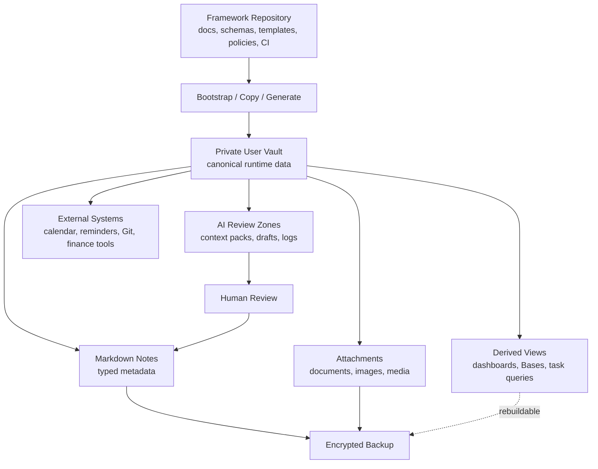

The framework repository is reusable and shareable.

The private vault is personal and sensitive.

The two MUST NOT be confused.

## 5. Production Vault Kernel

The canonical production vault kernel is:

```text
My-Life-OS/
├── 00_System/
├── 01_Inbox/
├── 02_Daily/
├── 10_Areas/
├── 20_Projects/
├── 30_Knowledge/
├── 40_Work/
├── 50_Finance/
├── 60_People/
├── 70_AI/
├── 80_Archive/
└── 99_Attachments/
```

Optional hidden or tool-specific folders MAY exist:

```text
My-Life-OS/
├── .obsidian/
├── .git/
├── .trash/
└── .stversions/
```

These hidden folders are not semantic zones. They are tool/configuration zones.

## 6. Why the Kernel Uses Numbered Folders

The top-level folders use numeric prefixes to keep ordering stable across operating systems, file managers, mobile clients, sync tools, and Git views.

The numbering creates a mental map:

```text
00 = system
01 = intake
02 = time
10 = responsibility
20 = execution
30 = knowledge
40 = profession/work
50 = finance
60 = people
70 = AI
80 = archive
99 = attachments
```

The gaps are intentional. Future top-level zones can be added without renumbering the kernel.

## 7. Kernel Invariants

The following invariants MUST hold in production vaults.

### 7.1 Canonical Notes Are Human-Readable

Canonical notes MUST be readable as Markdown files outside Obsidian.

No critical data may depend exclusively on a plugin-specific opaque database.

### 7.2 Every Important Note Has a Type

Every important note SHOULD have a `type` property defined in frontmatter.

Examples:

```yaml
---
type: project
status: active
sensitivity: private
---
```

### 7.3 Canonical and Derived Data Are Separated

Canonical data is manually meaningful and long-lived.

Derived data is generated or view-specific.

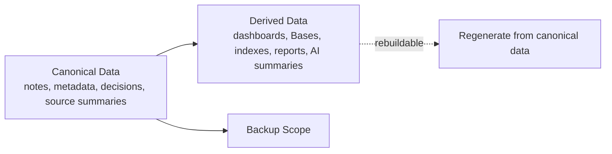

### 7.4 AI Writes Only to Review Zones

AI MUST NOT write directly into canonical folders by default.

Allowed AI write zones:

```text
01_Inbox/AI_Drafts/
70_AI/Agent_Logs/
70_AI/Evaluations/
```

Canonical folders may receive AI-produced content only after human review.

### 7.5 Secrets Are Forbidden

The vault MUST NOT contain:

- passwords;
- API keys;
- private keys;
- seed phrases;
- production credentials;
- full identity documents in unmanaged storage;
- raw banking credentials;
- uncontrolled credential exports.

References to external secret managers MAY be stored, but the secret value itself MUST NOT be stored.

### 7.6 Sync Is Not Backup

The vault MAY be synced across devices, but sync MUST NOT be treated as recovery.

Every production vault MUST have an independent encrypted backup and a restore-test procedure.

### 7.7 External Execution Systems Own Live Commitments

The vault stores context, plans, agenda, meeting notes, and decisions.

External calendar and reminder systems own time-critical notifications.

### 7.8 Profession Packs Extend, Not Replace, the Kernel

Profession-specific folders and templates SHOULD live under `40_Work/` or inside the relevant domain zone.

They MUST NOT redefine the base lifecycle, sensitivity model, forbidden data policy, or AI write policy.

## 8. Vault Structure Diagram

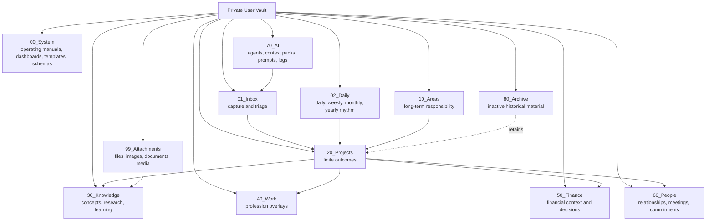

## 9. Folder Contract Template

Every top-level folder in this document is specified using the same contract.

Each contract includes:

- **Purpose**
- **Allowed content**
- **Forbidden content**
- **Expected subfolders**
- **Canonical note types**
- **Required metadata**
- **Dashboards / Bases**
- **AI access policy**
- **Sync and backup implications**
- **Lifecycle**
- **Examples**
- **Validation rules**

This structure makes each folder independently auditable.

---

# 10. `00_System/`

## 10.1 Purpose

`00_System/` is the operating layer of the vault.

It contains the instructions, dashboards, templates, schemas, policies, maintenance routines, local operating manuals, and vault-level configuration notes that make the vault governable.

This folder answers:

- How does this vault work?
- What are the rules?
- What dashboards exist?
- Which templates should be used?
- Which schemas define valid notes?
- Which maintenance checks must run?
- Which AI policies apply?

`00_System/` is the user-facing control center inside the vault.

## 10.2 Expected Structure

```text
00_System/
├── Home.md
├── Dashboards/
│   ├── Today.md
│   ├── This Week.md
│   ├── Projects.md
│   ├── Areas.md
│   ├── Work.md
│   ├── Finance.md
│   ├── People.md
│   ├── Knowledge.md
│   ├── AI.md
│   └── Maintenance.md
├── Bases/
│   ├── Projects.base
│   ├── Tasks.base
│   ├── Decisions.base
│   ├── People.base
│   ├── Finance.base
│   ├── Knowledge.base
│   └── AI_Drafts.base
├── Templates/
├── Schemas/
├── Policies/
├── Maintenance/
├── Manuals/
└── Changelog/
```

## 10.3 Allowed Content

Allowed content includes:

- vault home page;
- dashboard notes;
- Base definitions;
- local templates copied from the framework;
- local schema snapshots;
- vault policies;
- maintenance checklists;
- sync and backup instructions;
- plugin configuration notes;
- user-specific operating manuals;
- safe onboarding notes.

## 10.4 Forbidden Content

`00_System/` MUST NOT contain:

- passwords;
- tokens;
- API keys;
- raw credentials;
- full identity documents;
- unmanaged financial exports;
- private AI memory dumps;
- unreviewed imported content;
- profession work artifacts that belong under `40_Work/`;
- canonical personal journal entries that belong under `02_Daily/`;
- ordinary knowledge notes that belong under `30_Knowledge/`.

## 10.5 Canonical Note Types

Primary types:

```text
dashboard
base-view
template
schema
policy
manual
maintenance-checklist
system-log
configuration-note
```

## 10.6 Required Metadata

System notes SHOULD include:

```yaml
---
type: dashboard
title: "Projects"
status: active
sensitivity: private
owner: me
system_role: operational-view
updated: 2026-05-19
---
```

Policy notes SHOULD include:

```yaml
---
type: policy
title: "AI Write Policy"
status: active
sensitivity: private
applies_to:
  - vault
  - ai
review:
  cadence: monthly
---
```

## 10.7 Dashboards / Bases

`00_System/Dashboards/Home.md` is the default entry point.

It SHOULD link to:

- Today;
- This Week;
- Active Projects;
- Waiting For;
- Reviews;
- Finance Attention;
- People Follow-ups;
- AI Drafts;
- Maintenance.

## 10.8 AI Access Policy

AI MAY read most of `00_System/` when helping the user operate the vault.

AI MAY NOT rewrite policies, schemas, templates, or dashboards directly.

Allowed AI actions:

- explain current rules;
- detect inconsistencies;
- propose improvements;
- draft new templates;
- generate maintenance reports.

AI writes go to:

```text
01_Inbox/AI_Drafts/
70_AI/Agent_Logs/
```

## 10.9 Sync and Backup Implications

`00_System/` MUST be backed up.

`00_System/` SHOULD be synced across trusted devices because it contains the operating model.

However:

- plugin state files in `.obsidian/` require separate policy;
- generated logs may have retention limits;
- local machine-specific notes SHOULD be clearly marked.

## 10.10 Lifecycle

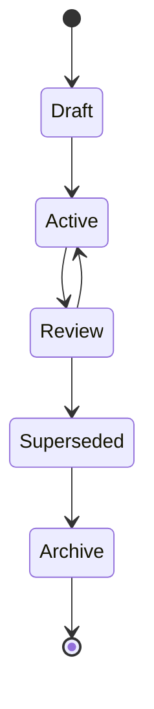

## 10.11 Examples

Good examples:

```text
00_System/Home.md
00_System/Dashboards/Projects.md
00_System/Policies/AI Write Policy.md
00_System/Maintenance/Weekly Vault Health Check.md
00_System/Templates/Project.md
```

Bad examples:

```text
00_System/My Bank Login.md
00_System/Random Article Clip.md
00_System/Client Contract Raw Scan.pdf
```

## 10.12 Validation Rules

Production validation SHOULD check that:

- `Home.md` exists;
- required dashboards exist;
- required templates exist;
- policy notes have `type: policy`;
- no secret-like patterns appear;
- no unreviewed AI outputs exist outside AI draft zones.

---

# 11. `01_Inbox/`

## 11.1 Purpose

`01_Inbox/` is the controlled intake zone.

Everything uncertain enters here first.

It prevents the rest of the vault from being polluted by raw, unclassified, duplicated, unsafe, or low-quality information.

The Inbox is not a storage location. It is a processing queue.

## 11.2 Expected Structure

```text
01_Inbox/
├── Quick/
├── Web/
├── Voice/
├── Imports/
├── Files/
├── Messages/
├── Ideas/
├── AI_Drafts/
└── Review_Queue/
```

## 11.3 Allowed Content

Allowed content includes:

- quick captures;
- unprocessed notes;
- clipped web pages;
- voice note transcripts;
- imported files waiting for classification;
- raw meeting notes before processing;
- untrusted external text;
- AI-generated drafts;
- proposed changes;
- review queue items.

## 11.4 Forbidden Content

`01_Inbox/` MUST NOT become permanent storage.

It MUST NOT contain:

- long-term project notes after processing;
- permanent financial records;
- unencrypted sensitive exports;
- credentials;
- final decisions without moving them to proper canonical folders;
- long-term people records;
- profession records after classification.

## 11.5 Canonical Note Types

Primary types:

```text
inbox-item
quick-capture
web-clip
voice-note
import-candidate
ai-draft
review-item
idea
```

## 11.6 Required Metadata

Inbox items SHOULD include:

```yaml
---
type: inbox-item
status: unprocessed
source: manual
captured: 2026-05-19
sensitivity: private
triage:
  required: true
  by: 2026-05-26
---
```

Web clips SHOULD include:

```yaml
---
type: web-clip
status: unprocessed
source_type: web
source_url: ""
captured: 2026-05-19
trust_level: untrusted
sensitivity: private
---
```

AI drafts SHOULD include:

```yaml
---
type: ai-draft
status: proposed
created_by: ai
human_review_required: true
target_folder: ""
target_note: ""
sensitivity: inherited
---
```

## 11.7 Inbox Triage Flow

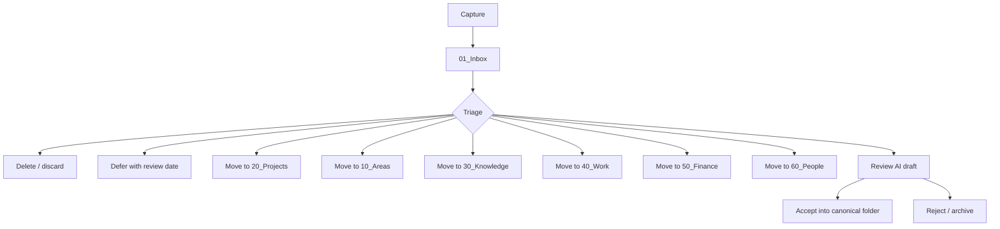

## 11.8 AI Access Policy

AI MAY write to `01_Inbox/AI_Drafts/`.

AI MAY write to `01_Inbox/Review_Queue/` if the output requires human review.

AI MUST NOT move an inbox item into a canonical folder without human approval.

AI MAY classify inbox items, but the classification is advisory until accepted.

## 11.9 Sync and Backup Implications

Inbox SHOULD be synced.

Inbox SHOULD be backed up, but retention MAY be shorter than canonical folders.

`01_Inbox/Imports/` MAY contain large temporary files. Users SHOULD process or remove these files regularly to avoid sync bloat.

## 11.10 Lifecycle

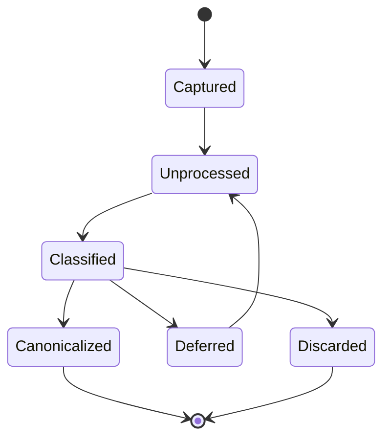

## 11.11 Processing Cadence

Recommended cadence:

```text
Daily: process quick captures and AI drafts.
Weekly: empty unprocessed inbox items older than 7 days.
Monthly: review import folders and remove stale raw files.
```

## 11.12 Validation Rules

Production validation SHOULD detect:

- inbox items older than configured threshold;
- AI drafts without `human_review_required: true`;
- imports with missing provenance;
- secret-like strings;
- files larger than configured limits;
- untrusted web clips referenced by AI context packs without review.

---

# 12. `02_Daily/`

## 12.1 Purpose

`02_Daily/` is the temporal operating layer.

It captures the rhythm of life and work:

- daily planning;
- daily logs;
- weekly reviews;
- monthly reviews;
- quarterly and yearly reflection;
- meeting anchors;
- recurring review routines;
- temporal context for calendar and tasks.

The daily system is the short-term working memory of the vault.

It MUST NOT replace projects, areas, decisions, or knowledge notes.

## 12.2 Expected Structure

```text
02_Daily/
├── Daily/
│   └── 2026/
│       └── 2026-05/
├── Weekly/
│   └── 2026/
├── Monthly/
│   └── 2026/
├── Quarterly/
│   └── 2026/
└── Yearly/
    └── 2026.md
```

## 12.3 Allowed Content

Allowed content includes:

- daily notes;
- daily plans;
- daily logs;
- daily captures;
- weekly reviews;
- monthly reviews;
- yearly plans;
- time-blocking context;
- meeting preparation links;
- recurring reflection;
- short-lived task context.

## 12.4 Forbidden Content

`02_Daily/` MUST NOT contain:

- permanent project specs as only copy;
- permanent financial decisions as only copy;
- final legal/medical documents;
- raw secrets;
- long-term contact records as only copy;
- unprocessed AI outputs outside a reviewed section.

## 12.5 Canonical Note Types

Primary types:

```text
daily-note
weekly-review
monthly-review
quarterly-review
yearly-review
daily-log
planning-note
```

## 12.6 Required Metadata

Daily notes SHOULD use:

```yaml
---
type: daily-note
date: 2026-05-19
status: active
sensitivity: private
energy:
focus:
reviewed: false
---
```

Weekly reviews SHOULD use:

```yaml
---
type: weekly-review
week: 2026-W21
status: active
sensitivity: private
review:
  cadence: weekly
---
```

## 12.7 Temporal Naming

Recommended file names:

```text
02_Daily/Daily/2026/2026-05/2026-05-19.md
02_Daily/Weekly/2026/Weekly Review - 2026-W21.md
02_Daily/Monthly/2026/Monthly Review - 2026-05.md
02_Daily/Yearly/2026.md
```

## 12.8 Daily Workflow

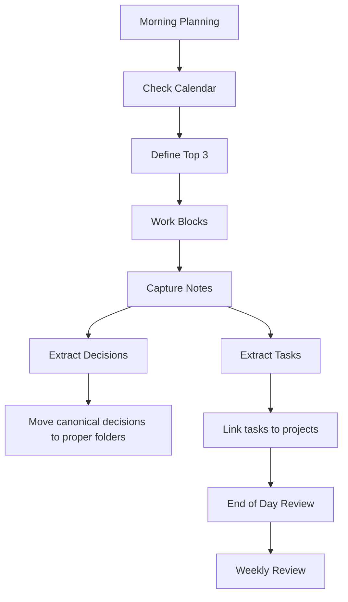

## 12.9 AI Access Policy

AI MAY read daily notes when relevant and allowed by sensitivity.

AI MAY summarize daily notes into weekly review drafts.

AI MUST NOT infer sensitive long-term memory from daily notes without explicit user approval.

AI MUST NOT create calendar events or send reminders without explicit approval.

AI-generated daily summaries MUST go to `01_Inbox/AI_Drafts/` or `70_AI/Agent_Logs/`.

## 12.10 Sync and Backup Implications

Daily notes SHOULD be synced across devices.

Daily notes MUST be backed up because they often contain the only record of recent work.

Daily notes MAY contain sensitive personal reflections. Users SHOULD apply sensitivity labels.

## 12.11 Lifecycle

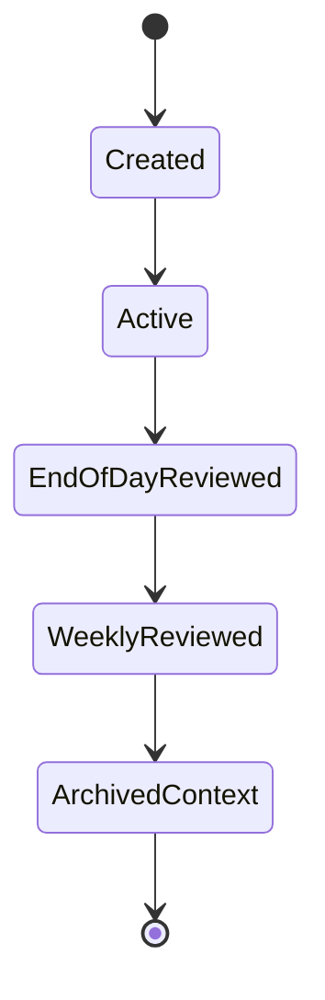

## 12.12 Validation Rules

Production validation SHOULD detect:

- daily notes missing `date`;
- weekly reviews missing `week`;
- unextracted decisions in daily notes;
- unprocessed AI sections;
- tasks without project or area when they persist across days.

---

# 13. `10_Areas/`

## 13.1 Purpose

`10_Areas/` stores long-term responsibilities that do not have a fixed end date.

Areas are ongoing domains of life or work.

Examples:

- Health;
- Finance;
- Relationships;
- Career;
- Learning;
- Home;
- Systems;
- Creativity;
- Spirituality;
- Professional Development.

Areas answer:

> What must I maintain over time?

## 13.2 Expected Structure

```text
10_Areas/
├── Health/
├── Finance/
├── Relationships/
├── Career/
├── Learning/
├── Home/
├── Systems/
├── Creativity/
└── Custom/
```

Each area SHOULD have an area index note:

```text
10_Areas/Health/Area - Health.md
10_Areas/Learning/Area - Learning.md
```

## 13.3 Allowed Content

Allowed content includes:

- area index notes;
- principles;
- standards;
- recurring routines;
- responsibility checklists;
- review notes;
- maintenance plans;
- area-level dashboards;
- links to related projects.

## 13.4 Forbidden Content

`10_Areas/` MUST NOT contain:

- finite projects as only copy;
- raw sensitive files;
- credentials;
- unclassified imports;
- AI drafts outside review zones;
- detailed finance records better stored under `50_Finance/`;
- relationship-specific records better stored under `60_People/`.

## 13.5 Canonical Note Types

Primary types:

```text
area
standard
routine
checklist
principle
area-review
system-note
```

## 13.6 Required Metadata

Area notes SHOULD include:

```yaml
---
type: area
title: "Health"
status: active
sensitivity: private
review:
  cadence: monthly
  next: 2026-06-01
owner: me
---
```

## 13.7 Area vs Project

An area is ongoing.

A project has an outcome.

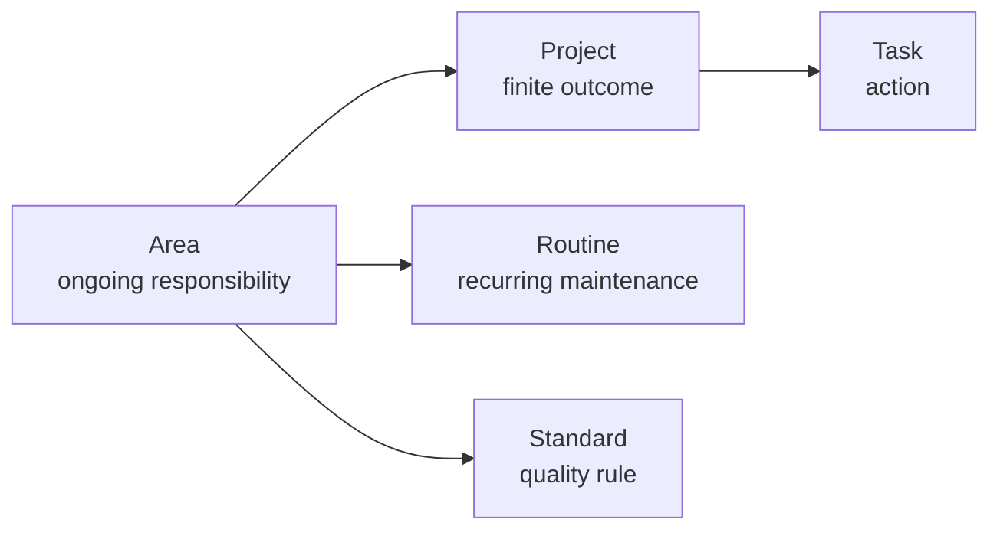

Examples:

```text
Area: Health
Project: Complete annual health check
Routine: Exercise three times per week
Standard: Sleep hygiene rules
```

## 13.8 AI Access Policy

AI MAY read area notes to understand user context when explicitly relevant.

AI MAY propose area reviews and maintenance checklists.

AI MUST NOT make sensitive health, finance, legal, or relationship conclusions without clearly labeling them as suggestions and requiring human review.

## 13.9 Sync and Backup Implications

Area notes are canonical and MUST be backed up.

Areas SHOULD sync across devices.

High-sensitivity subfolders MAY be selectively excluded from some sync providers and backed up through a stronger encrypted workflow.

## 13.10 Lifecycle

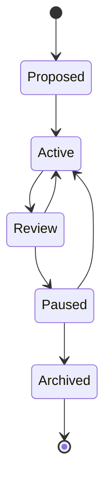

## 13.11 Validation Rules

Production validation SHOULD detect:

- active projects not linked to an area;
- areas without review cadence;
- areas with no recent review;
- tasks stored directly in areas without project/routine context.

---

# 14. `20_Projects/`

## 14.1 Purpose

`20_Projects/` stores finite outcomes.

Projects are the execution backbone of the vault.

A project exists when there is:

- a desired outcome;
- a current or future state;
- at least one next action;
- an owner;
- a status;
- a lifecycle.

Projects answer:

> What am I trying to complete?

## 14.2 Expected Structure

```text
20_Projects/
├── Active/
├── Waiting/
├── Paused/
├── Someday/
├── Completed/
└── Templates/
```

Optional project folder pattern:

```text
20_Projects/Active/Project - Life OS Framework/
├── Project - Life OS Framework.md
├── Notes/
├── Decisions/
├── Meetings/
├── Resources/
└── Attachments.md
```

For most users, a single project note is enough. Project folders SHOULD be used only when the project has multiple artifacts.

## 14.3 Allowed Content

Allowed content includes:

- project notes;
- project plans;
- project decisions;
- project meeting notes;
- project resources;
- project checklists;
- project retrospectives;
- project-specific context packs;
- links to tasks, people, areas, and work artifacts.

## 14.4 Forbidden Content

`20_Projects/` MUST NOT contain:

- long-term area-only content;
- raw credentials;
- unmanaged sensitive exports;
- permanent profession-specific records that belong in `40_Work/` unless tightly project-bound;
- unreviewed AI outputs;
- completed material that has not been closed and archived.

## 14.5 Canonical Note Types

Primary types:

```text
project
project-plan
project-review
project-retrospective
decision
meeting
resource
checklist
deliverable
```

## 14.6 Required Metadata

Project notes MUST include:

```yaml
---
type: project
title: ""
status: active
area: ""
priority: medium
created: 2026-05-19
updated: 2026-05-19
sensitivity: private
review:
  cadence: weekly
  next: 2026-05-26
next_action: ""
owner: me
---
```

## 14.7 Project Lifecycle

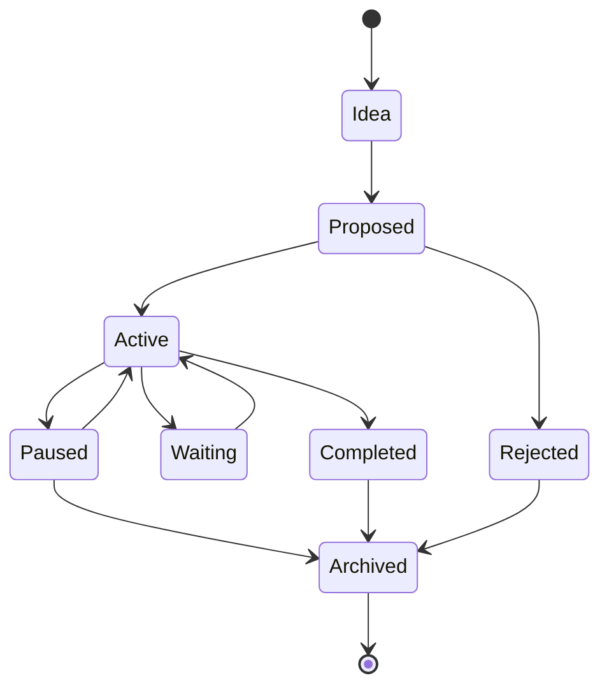

## 14.8 Project Placement

Recommended mapping:

```text
status: active     -> 20_Projects/Active/
status: waiting    -> 20_Projects/Waiting/
status: paused     -> 20_Projects/Paused/
status: someday    -> 20_Projects/Someday/
status: completed  -> 20_Projects/Completed/
status: archived   -> 80_Archive/Projects/
```

A project MAY remain in its folder even after status changes if the user uses dashboards as the source of operational visibility. However, production template defaults SHOULD keep folder and status aligned.

## 14.9 AI Access Policy

AI MAY help with:

- project decomposition;
- next-action generation;
- risk analysis;
- review summaries;
- draft project plans;
- meeting summary extraction;
- decision extraction.

AI MUST NOT:

- mark major projects completed without approval;
- delete project notes;
- move project folders;
- change priority for high-impact projects without approval;
- send external communications on behalf of the project without explicit approval.

## 14.10 Sync and Backup Implications

Project notes are canonical and MUST be backed up.

Project attachments may be large. Attachments SHOULD be referenced through `99_Attachments/` and summarized in project metadata notes.

## 14.11 Validation Rules

Production validation SHOULD detect:

- active projects without `next_action`;
- active projects without review date;
- projects without area;
- projects without status;
- project notes in wrong status folder;
- project folders with no index note;
- unreviewed AI proposals inside canonical project notes.

---

# 15. `30_Knowledge/`

## 15.1 Purpose

`30_Knowledge/` stores durable knowledge.

It contains concepts, research, books, articles, lessons, maps of content, source notes, distilled insights, and reusable understanding.

Knowledge notes answer:

> What do I know, and how is it connected?

## 15.2 Expected Structure

```text
30_Knowledge/
├── Concepts/
├── Books/
├── Articles/
├── Research/
├── Sources/
├── Literature/
├── Notes/
├── Maps/
├── Courses/
└── Glossary/
```

## 15.3 Allowed Content

Allowed content includes:

- evergreen notes;
- concept notes;
- literature notes;
- book notes;
- article notes;
- research summaries;
- study notes;
- course notes;
- glossaries;
- maps of content;
- source metadata notes;
- safe excerpts under applicable copyright and fair-use rules;
- internalized knowledge after processing.

## 15.4 Forbidden Content

`30_Knowledge/` MUST NOT contain:

- unprocessed web clips;
- full copyrighted works copied without rights;
- raw private credentials;
- client-confidential data unless explicitly classified and allowed;
- medical/legal/financial records that belong in sensitive zones;
- AI-generated claims that lack source/provenance.

## 15.5 Canonical Note Types

Primary types:

```text
concept
source
book
article
research-note
literature-note
course-note
map-of-content
glossary-entry
insight
```

## 15.6 Required Metadata

Knowledge notes SHOULD include:

```yaml
---
type: concept
title: ""
status: active
sensitivity: private
source:
  type: ""
  url: ""
  citation: ""
provenance:
  captured: 2026-05-19
  trust_level: reviewed
review:
  cadence: yearly
---
```

## 15.7 Knowledge Processing Flow

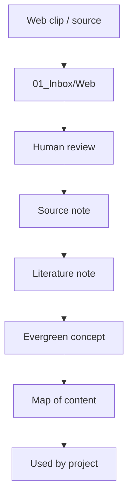

## 15.8 AI Access Policy

AI MAY read reviewed knowledge notes for research and synthesis.

AI MAY draft summaries and connection maps.

AI MUST distinguish between:

- user-authored knowledge;
- source-derived claims;
- AI-generated interpretations;
- uncertain hypotheses.

AI-generated knowledge MUST carry provenance and review status.

## 15.9 Sync and Backup Implications

Knowledge notes SHOULD be backed up and synced.

Large source files SHOULD be stored under `99_Attachments/` and linked from source notes.

Semantic indexes MAY be generated from reviewed knowledge notes, but they are derived artifacts and MUST be rebuildable.

## 15.10 Validation Rules

Production validation SHOULD detect:

- source notes without provenance;
- AI summaries without review status;
- claims marked as fact without source;
- large copied text blocks that may violate rights;
- source attachments without metadata notes.

---

# 16. `40_Work/`

## 16.1 Purpose

`40_Work/` is the professional adaptation layer.

It is the place where the vault becomes useful for different professions without changing the kernel.

For a developer, `40_Work/` may contain repositories, specs, ADRs, bugs, releases, and postmortems.

For a designer, it may contain briefs, clients, moodboards, assets, revisions, deliverables, and portfolio material.

For a machinist, it may contain orders, drawings, materials, machines, tools, setups, tolerances, quality checks, maintenance logs, and safety procedures.

`40_Work/` answers:

> How does this person’s profession operate?

## 16.2 Expected Structure

Generic structure:

```text
40_Work/
├── Dashboard.md
├── Clients/
├── Orders/
├── Products/
├── Services/
├── Processes/
├── Standards/
├── Assets/
├── Quality/
├── Deliverables/
├── Portfolio/
├── Tools/
├── Suppliers/
├── Safety/
└── Archive/
```

Profession overlays MAY redefine subfolders under `40_Work/`, but MUST preserve the meaning of the top-level folder.

## 16.3 Profession Overlay Pattern

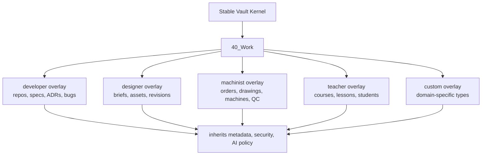

## 16.4 Allowed Content

Allowed content includes:

- profession-specific objects;
- client or customer records when appropriate;
- orders;
- cases;
- briefs;
- specifications;
- process notes;
- professional standards;
- quality checklists;
- deliverables;
- portfolio notes;
- tooling notes;
- supplier notes;
- safety notes;
- project-related work artifacts.

## 16.5 Forbidden Content

`40_Work/` MUST NOT contain:

- production credentials;
- client secrets;
- unmanaged regulated records;
- legally restricted data outside compliant systems;
- patient records unless the user has a compliant, explicitly authorized workflow;
- raw financial credentials;
- AI-produced client deliverables without human review;
- confidential material in a shared/template repo.

## 16.6 Canonical Note Types

Common types:

```text
client
order
case
brief
spec
process
standard
asset
deliverable
quality-check
work-log
tool
supplier
safety-checklist
portfolio-item
```

Profession-specific examples:

```text
repository
architecture-decision
bug
release-note
postmortem
design-project
revision
work-order
machine
machine-setup
material
lesson-plan
student-note
research-experiment
legal-matter
```

## 16.7 Required Metadata

Work objects SHOULD include:

```yaml
---
type: work-order
status: active
client: ""
project: ""
deadline: ""
sensitivity: client-confidential
quality:
  required: true
review:
  cadence: weekly
---
```

Developer ADR example:

```yaml
---
type: architecture-decision
status: accepted
project: ""
repository: ""
sensitivity: internal
decision_date: 2026-05-19
---
```

Designer brief example:

```yaml
---
type: brief
status: active
client: ""
project: ""
deadline: ""
sensitivity: client-confidential
---
```

## 16.8 AI Access Policy

AI MAY help with:

- drafting briefs;
- summarizing work context;
- generating checklists;
- preparing meeting notes;
- drafting specs;
- analyzing quality issues;
- creating first-pass deliverables for review.

AI MUST NOT:

- release professional work directly to clients;
- modify regulated records;
- provide professional conclusions as final without human expert review;
- access restricted folders unless explicitly scoped;
- use confidential client material in unrelated contexts.

## 16.9 Sync and Backup Implications

`40_Work/` may contain highly valuable professional context.

It MUST be backed up.

Client-confidential and regulated subfolders SHOULD have explicit sensitivity labels and may require stricter sync exclusions.

## 16.10 Validation Rules

Production validation SHOULD detect:

- professional objects without type;
- client-confidential notes missing sensitivity;
- deliverables without review status;
- safety notes without review cadence;
- work orders without status;
- professional records in wrong profession overlay.

---

# 17. `50_Finance/`

## 17.1 Purpose

`50_Finance/` stores financial context, goals, decisions, budgets, subscriptions, tax checklists, investment theses, and financial reviews.

It does not replace banks, accounting systems, password managers, tax software, brokerage accounts, or secure document storage.

`50_Finance/` answers:

> What is my financial context, and what decisions have I made?

## 17.2 Expected Structure

```text
50_Finance/
├── Dashboard.md
├── Goals/
├── Budget/
├── Reviews/
├── Decisions/
├── Subscriptions/
├── Taxes/
├── Investment_Theses/
├── Risk/
├── Accounts_Map/
└── External_References/
```

## 17.3 Allowed Content

Allowed content includes:

- financial goals;
- budget categories;
- spending reviews;
- subscription lists;
- tax checklists;
- investment theses;
- financial decisions;
- high-level account maps without account numbers;
- risk notes;
- links to external secure systems.

## 17.4 Forbidden Content

`50_Finance/` MUST NOT contain:

- bank passwords;
- full card numbers;
- raw authentication data;
- seed phrases;
- private keys;
- full account numbers unless explicitly encrypted outside normal vault storage;
- unencrypted tax identity documents;
- brokerage credentials;
- raw bank exports unless stored in an explicitly controlled and encrypted workflow.

## 17.5 Canonical Note Types

Primary types:

```text
finance-goal
budget
budget-category
finance-review
finance-decision
subscription
tax-checklist
investment-thesis
risk-note
account-map
external-reference
```

## 17.6 Required Metadata

Finance notes SHOULD include:

```yaml
---
type: finance-decision
status: accepted
date: 2026-05-19
sensitivity: sensitive
review:
  cadence: quarterly
amount:
currency:
external_system:
---
```

Subscription notes SHOULD include:

```yaml
---
type: subscription
status: active
vendor: ""
cost:
currency:
billing_cycle:
next_review:
sensitivity: private
---
```

## 17.7 Finance Data Boundary

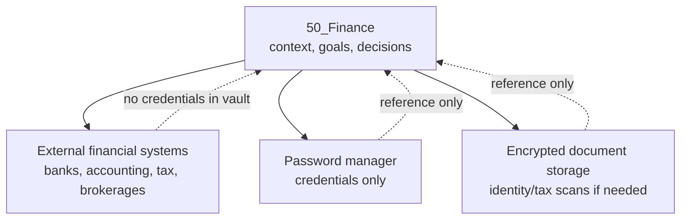

## 17.8 AI Access Policy

AI MAY help with:

- budget review drafts;
- subscription audits;
- financial decision summaries;
- risk checklists;
- tax preparation checklists;
- categorization suggestions.

AI MUST NOT:

- access credentials;
- move money;
- give final investment, legal, or tax advice;
- read restricted raw statements unless explicitly scoped and redacted;
- store financial secrets in context packs;
- write final financial decisions without human approval.

## 17.9 Sync and Backup Implications

`50_Finance/` is sensitive and MUST be backed up.

Some subfolders MAY be excluded from less-trusted sync methods.

High-sensitivity data SHOULD be referenced from encrypted external storage rather than embedded in the vault.

## 17.10 Validation Rules

Production validation SHOULD detect:

- secret-like patterns;
- full card/account-number patterns;
- finance notes without sensitivity;
- financial decisions without review date;
- raw exports in normal folders;
- AI drafts merged without review markers.

---

# 18. `60_People/`

## 18.1 Purpose

`60_People/` stores relationship context, personal CRM, meetings, commitments, follow-ups, and people-related notes.

It helps the user remember responsibly, follow through, and communicate with care.

`60_People/` answers:

> Who matters, what do I owe them, and what context should I remember?

## 18.2 Expected Structure

```text
60_People/
├── Dashboard.md
├── CRM/
├── Meetings/
├── Commitments/
├── Follow_Ups/
├── Groups/
├── Organizations/
└── Private/
```

## 18.3 Allowed Content

Allowed content includes:

- person notes;
- organization notes;
- meeting notes;
- relationship context;
- commitments;
- follow-ups;
- contact preferences;
- lightweight CRM records;
- professional stakeholder maps.

## 18.4 Forbidden Content

`60_People/` MUST NOT contain:

- passwords shared by people;
- private sensitive information that is unnecessary;
- medical/legal records about others unless compliant and authorized;
- surveillance-style notes;
- unconsented sensitive profiling;
- raw message exports without a clear legal and ethical basis;
- AI-generated judgments about people as fact.

## 18.5 Canonical Note Types

Primary types:

```text
person
organization
group
meeting
commitment
follow-up
relationship-note
stakeholder
```

## 18.6 Required Metadata

Person notes SHOULD include:

```yaml
---
type: person
name: ""
relationship: ""
sensitivity: private
last_contact:
next_contact:
contact_preferences:
tags:
  - person
---
```

Meeting notes SHOULD include:

```yaml
---
type: meeting
date: 2026-05-19
participants: []
project:
status: completed
sensitivity: private
follow_up_required: false
---
```

## 18.7 People Workflow

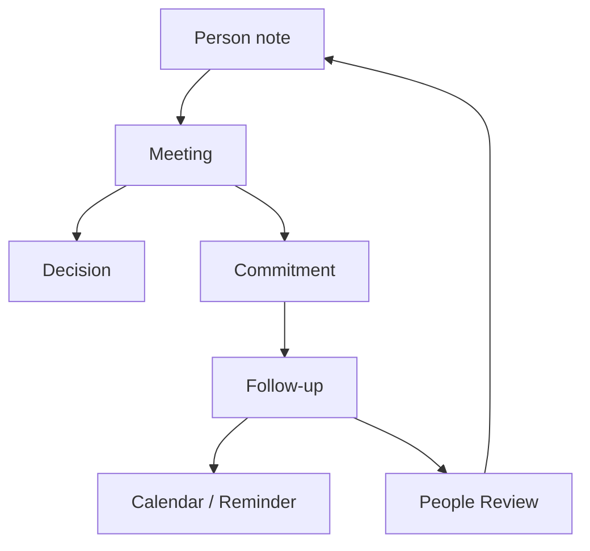

## 18.8 AI Access Policy

AI MAY help with:

- meeting summaries;
- follow-up drafts;
- commitment extraction;
- relationship review reminders;
- stakeholder maps.

AI MUST NOT:

- send messages without approval;
- infer sensitive personal attributes as fact;
- expose one person’s private context to unrelated contexts;
- make manipulative communication recommendations;
- access restricted people notes unless explicitly scoped.

## 18.9 Sync and Backup Implications

`60_People/` contains sensitive personal data and MUST be backed up.

Some subfolders, especially `Private/`, MAY have stricter sync restrictions.

## 18.10 Validation Rules

Production validation SHOULD detect:

- person notes missing sensitivity;
- commitments without owner or due/review date;
- meeting notes with follow-ups not extracted;
- AI summaries lacking review status;
- private people notes included in broad AI context packs.

---

# 19. `70_AI/`

## 19.1 Purpose

`70_AI/` stores the AI collaboration layer of the vault.

It contains:

- agent definitions;
- prompts;
- context pack specifications;
- memory exports;
- AI logs;
- AI evaluations;
- redaction rules;
- AI policies copied or localized from `00_System/Policies/`;
- experiment records.

`70_AI/` answers:

> How can AI help safely, and what did it do?

## 19.2 Expected Structure

```text
70_AI/
├── Dashboard.md
├── Agents/
├── Context_Packs/
├── Prompts/
├── Policies/
├── Agent_Logs/
├── Evaluations/
├── Memory_Exports/
├── Redaction_Rules/
├── Experiments/
└── Disabled/
```

## 19.3 Allowed Content

Allowed content includes:

- AI agent definitions;
- prompt templates;
- context pack specs;
- context pack manifests;
- AI run logs;
- AI evaluation notes;
- memory export summaries;
- redaction rules;
- agent behavior policies;
- AI experiment records;
- generated context packs if retention is intentional.

## 19.4 Forbidden Content

`70_AI/` MUST NOT contain:

- uncontrolled raw AI memory dumps;
- secrets;
- unredacted full sensitive exports;
- private data copied broadly without minimization;
- model outputs treated as canonical truth without review;
- unrestricted tool credentials.

## 19.5 Canonical Note Types

Primary types:

```text
ai-agent
context-pack
prompt
agent-log
ai-evaluation
ai-policy
redaction-rule
memory-export
ai-experiment
```

## 19.6 Required Metadata

AI agent notes SHOULD include:

```yaml
---
type: ai-agent
name: ""
status: active
permissions:
  read_scope: []
  write_scope:
    - "01_Inbox/AI_Drafts"
    - "70_AI/Agent_Logs"
  delete_allowed: false
  human_review_required: true
sensitivity: private
---
```

Context packs SHOULD include:

```yaml
---
type: context-pack
status: active
purpose: ""
scope:
  include: []
  exclude: []
max_sensitivity: private
generated: false
human_review_required: true
---
```

Agent logs SHOULD include:

```yaml
---
type: agent-log
agent: ""
date: 2026-05-19
action_class: A1
input_context_pack: ""
output_location: ""
sensitivity: private
---
```

## 19.7 AI Collaboration Flow

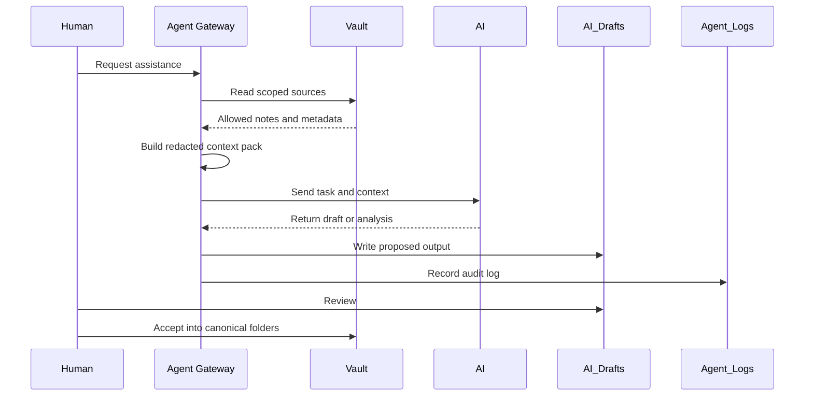

## 19.8 AI Access Policy

AI MAY write within `70_AI/Agent_Logs/` and `70_AI/Evaluations/` when configured.

AI MAY read `70_AI/Prompts/`, `70_AI/Context_Packs/`, and agent definitions.

AI MUST NOT edit its own permission policies or expand its own access.

AI MUST NOT move `Memory_Exports/` into active context without review.

## 19.9 Sync and Backup Implications

`70_AI/` may contain sensitive context.

Agent logs SHOULD be retained long enough for audit and debugging.

Generated context packs MAY have shorter retention because they are derived artifacts.

Memory exports require explicit minimization and retention controls.

## 19.10 Validation Rules

Production validation SHOULD detect:

- agents with broad read scopes;
- write scopes outside approved draft/log folders;
- generated context packs with high sensitivity and long retention;
- memory exports without review status;
- prompts that include secrets;
- agent logs missing action class.

---

# 20. `80_Archive/`

## 20.1 Purpose

`80_Archive/` stores inactive, completed, superseded, or historical material.

The archive preserves history without cluttering active dashboards.

It answers:

> What should be kept, but no longer drives daily operation?

## 20.2 Expected Structure

```text
80_Archive/
├── Projects/
├── Areas/
├── Knowledge/
├── Work/
├── Finance/
├── People/
├── AI/
├── System/
└── By_Year/
```

## 20.3 Allowed Content

Allowed content includes:

- completed projects;
- inactive areas;
- old reviews;
- superseded policies;
- deprecated templates;
- historical work records;
- closed client work;
- old AI experiments;
- retired context packs;
- previous system versions.

## 20.4 Forbidden Content

`80_Archive/` MUST NOT be used to hide unresolved sensitive or forbidden data.

It MUST NOT contain:

- secrets;
- raw credentials;
- unencrypted restricted records;
- unprocessed inbox content;
- AI drafts that require review;
- active obligations.

## 20.5 Canonical Note Types

Primary types:

```text
archived-project
archived-area
retrospective
superseded-policy
deprecated-template
historical-record
closed-work
archive-index
```

## 20.6 Required Metadata

Archived notes SHOULD include:

```yaml
---
type: archived-project
status: archived
archived: 2026-05-19
archive_reason: completed
sensitivity: private
retention:
  keep_until:
  review: yearly
---
```

## 20.7 Archive Lifecycle

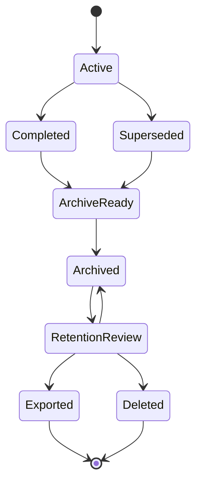

## 20.8 AI Access Policy

AI MAY search archive only when explicitly relevant.

Archive should not be included in default context packs.

AI MAY summarize archived projects for retrospectives.

AI MUST NOT revive archived content into active workflows without human approval.

## 20.9 Sync and Backup Implications

Archive may grow large.

Users MAY exclude low-value archive attachments from live sync if independent backup exists.

Archive metadata should remain searchable.

## 20.10 Validation Rules

Production validation SHOULD detect:

- active tasks in archive;
- notes with `status: active` under archive;
- archived notes without archive date;
- sensitive archived data lacking retention policy;
- AI context packs that include archive by default.

---

# 21. `99_Attachments/`

## 21.1 Purpose

`99_Attachments/` stores binary and external files referenced by notes.

Attachments are important but they are not self-describing. Every important attachment SHOULD have a metadata note somewhere in the vault that explains:

- what it is;
- where it came from;
- why it matters;
- how sensitive it is;
- which canonical note owns it;
- whether it should be backed up, synced, archived, or deleted.

## 21.2 Expected Structure

```text
99_Attachments/
├── Images/
├── PDFs/
├── Documents/
├── Audio/
├── Video/
├── Exports/
├── Scans/
├── Work/
├── Finance/
├── People/
├── Temporary/
└── Quarantine/
```

## 21.3 Allowed Content

Allowed content includes:

- images;
- screenshots;
- PDFs;
- scanned documents;
- audio notes;
- video files;
- exported reports;
- diagrams;
- source files;
- work artifacts;
- generated artifacts.

## 21.4 Forbidden Content

`99_Attachments/` MUST NOT contain:

- seed phrases;
- private keys;
- password exports;
- unencrypted identity scans unless explicitly allowed by the user’s high-sensitivity workflow;
- raw bank exports in normal storage;
- malware samples;
- unknown executable files;
- untrusted files promoted from quarantine without review.

## 21.5 Attachment Metadata

Important attachments SHOULD have a metadata note.

Example:

```yaml
---
type: attachment-record
title: ""
file: "[[99_Attachments/PDFs/example.pdf]]"
owner_note: ""
source: ""
captured: 2026-05-19
sensitivity: private
retention:
  keep_until:
  review: yearly
---
```

## 21.6 Attachment Processing Flow

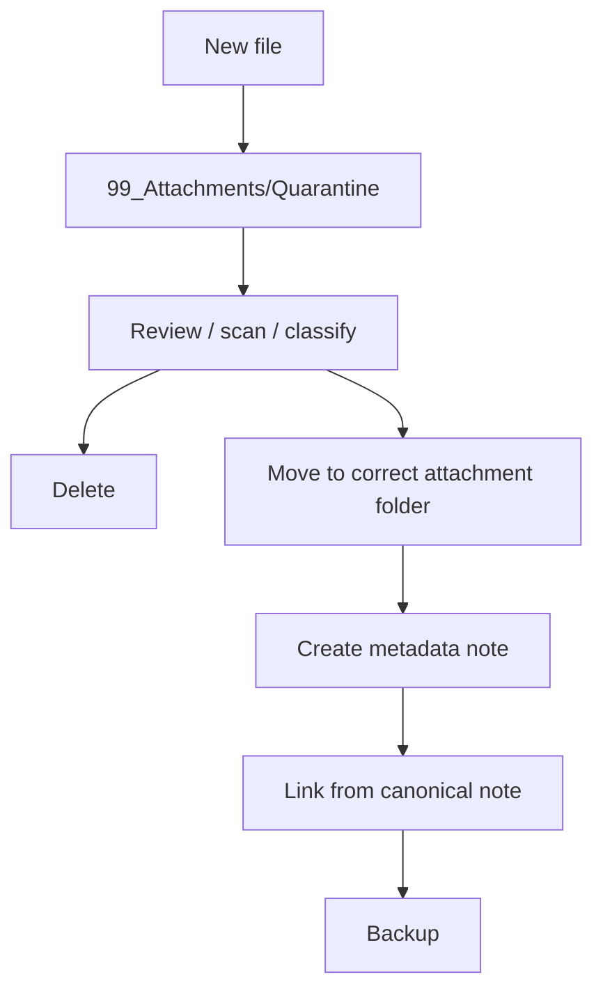

## 21.7 AI Access Policy

AI MAY read attachment metadata.

AI MUST NOT process sensitive attachments unless explicitly scoped.

AI SHOULD prefer summaries and metadata over raw binary content.

AI MUST NOT ingest unknown executables.

AI-generated summaries of attachments MUST include provenance and review status.

## 21.8 Sync and Backup Implications

Attachments often dominate vault size.

Users SHOULD decide which attachment folders sync live and which are backup-only.

`Temporary/` and `Quarantine/` MAY be excluded from long-term backup after processing, depending on policy.

Critical attachments MUST be backed up.

## 21.9 Validation Rules

Production validation SHOULD detect:

- orphan attachments;
- large attachments without metadata;
- restricted file types;
- attachments in quarantine older than policy threshold;
- sensitive attachments under public or low-sensitivity notes;
- missing owner notes.

---

# 22. Hidden and Tool-Specific Folders

## 22.1 `.obsidian/`

`.obsidian/` contains Obsidian vault configuration.

It may include:

- core plugin settings;
- community plugin settings;
- workspace state;
- hotkeys;
- themes;
- snippets;
- plugin data.

Policy:

```text
Sync: profile-dependent
Backup: yes, but with care
Git: selective
AI access: no direct editing by default
```

Recommended `.gitignore` exclusions include volatile workspace files:

```gitignore
.obsidian/workspace.json
.obsidian/workspace-mobile.json
```

Plugin-specific data files may contain sensitive paths, cached content, or tokens. They MUST be reviewed before committing or syncing broadly.

## 22.2 `.git/`

`.git/` contains Git history and internal repository state.

It is not part of the semantic vault.

Policy:

```text
Sync through Obsidian Sync: no
Backup: optional as part of repository clone strategy
Direct editing: never
AI access: no
```

## 22.3 `.trash/`

`.trash/` may contain deleted files depending on Obsidian settings.

Policy:

```text
Review periodically.
Do not rely on it for recovery.
Do not allow it to retain forbidden data.
```

## 22.4 `.stversions/`

Syncthing may use versioning folders such as `.stversions`.

Policy:

```text
Do not treat as canonical archive.
Do not index into AI context packs.
Include or exclude from backup according to recovery policy.
```

## 22.5 Tool Cache Folders

Any tool cache folder MUST be documented before production use.

Unreviewed cache folders SHOULD be excluded from AI context and Git.

---

# 23. Note Placement Decision Tree

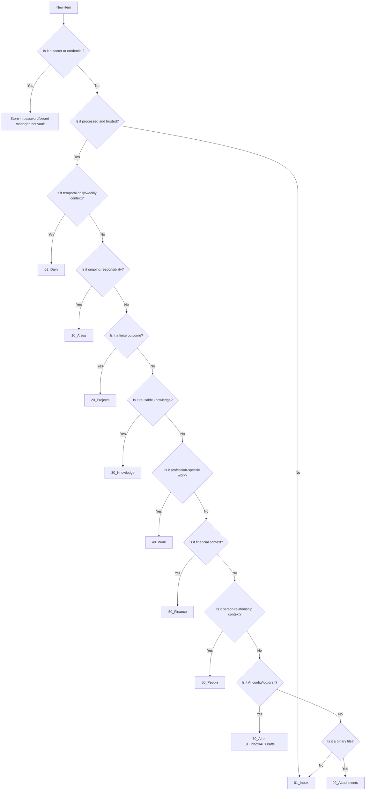

## 23.1 Placement Rules

When unsure, place the item in `01_Inbox/`.

When an item belongs in multiple places, create one canonical note and link it from other contexts.

Avoid duplicating canonical notes.

Use dashboards and links to create multiple views.

---

# 24. Type-to-Folder Mapping

| Type | Default Folder | Notes |
|---|---|---|
| `dashboard` | `00_System/Dashboards/` | Derived operational view |
| `policy` | `00_System/Policies/` | Requires review cadence |
| `template` | `00_System/Templates/` | May mirror framework template |
| `schema` | `00_System/Schemas/` | Local copy or generated |
| `inbox-item` | `01_Inbox/` | Temporary |
| `web-clip` | `01_Inbox/Web/` | Untrusted until reviewed |
| `ai-draft` | `01_Inbox/AI_Drafts/` | Human review required |
| `daily-note` | `02_Daily/Daily/` | Temporal |
| `weekly-review` | `02_Daily/Weekly/` | Periodic review |
| `area` | `10_Areas/` | Ongoing responsibility |
| `project` | `20_Projects/` | Finite outcome |
| `decision` | Near owning project or area | May also be indexed globally |
| `meeting` | Near project or `60_People/Meetings/` | Depends on primary purpose |
| `concept` | `30_Knowledge/Concepts/` | Evergreen knowledge |
| `source` | `30_Knowledge/Sources/` | Provenance required |
| `client` | `40_Work/Clients/` | Profession-specific |
| `work-order` | `40_Work/Orders/` | Profession-specific |
| `finance-decision` | `50_Finance/Decisions/` | Sensitive |
| `subscription` | `50_Finance/Subscriptions/` | Review required |
| `person` | `60_People/CRM/` | Sensitive by default |
| `ai-agent` | `70_AI/Agents/` | Cannot self-modify |
| `context-pack` | `70_AI/Context_Packs/` | Derived or spec |
| `attachment-record` | Near owning note or `99_Attachments/` | Metadata for binary |

---

# 25. Sensitivity by Folder

Default sensitivity levels are inherited unless overridden by note metadata.

| Folder | Default Sensitivity | Notes |
|---|---:|---|
| `00_System/` | `private` | Policies may reveal system design |
| `01_Inbox/` | `private` | Untrusted and unprocessed |
| `02_Daily/` | `private` | May contain personal reflections |
| `10_Areas/` | `private` | Area-dependent |
| `20_Projects/` | `private` | Project-dependent |
| `30_Knowledge/` | `private` | Can be internal/public per note |
| `40_Work/` | `private` or `sensitive` | Client/regulatory context possible |
| `50_Finance/` | `sensitive` | Strong default |
| `60_People/` | `sensitive` | Strong default |
| `70_AI/` | `private` or `sensitive` | Context packs inherit max sensitivity |
| `80_Archive/` | inherited | Retention required |
| `99_Attachments/` | inherited | Metadata required for important files |

## 25.1 Sensitivity Inheritance

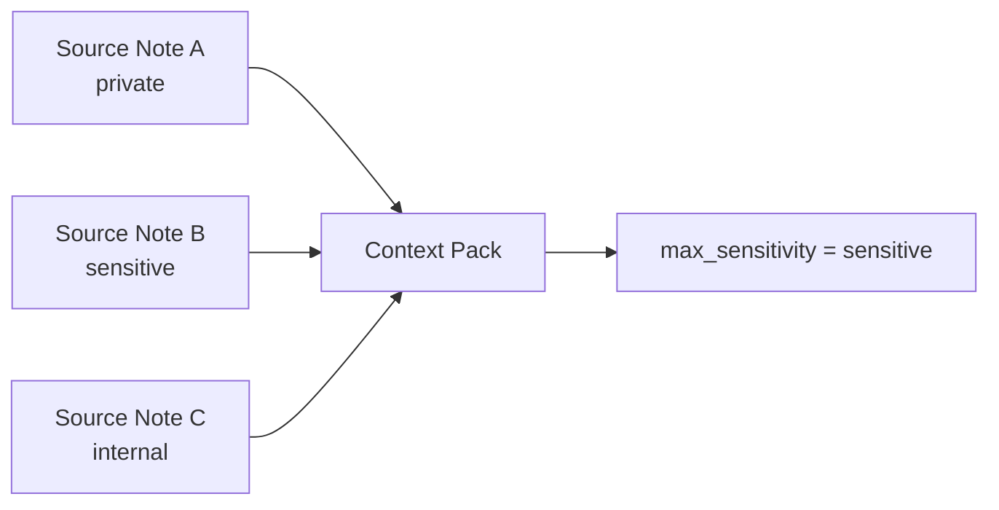

A context pack MUST inherit the highest sensitivity of included sources.

## 25.2 Sensitivity Rules

- Lower-sensitivity notes MUST NOT embed higher-sensitivity content.
- AI context packs MUST NOT downgrade sensitivity.
- Attachments inherit sensitivity from owner notes unless explicitly higher.
- Archive does not reduce sensitivity.
- Deleting a note does not automatically delete backups; recovery policy must cover deletion propagation.

---

# 26. AI Access Matrix

| Folder | AI Read Default | AI Write Default | Notes |
|---|---:|---:|---|
| `00_System/` | Scoped | Draft-only | May propose policy changes |
| `01_Inbox/Quick/` | Scoped | Draft-only | Classification allowed |
| `01_Inbox/AI_Drafts/` | Yes | Yes | Review zone |
| `02_Daily/` | Scoped | Draft-only | Sensitive by context |
| `10_Areas/` | Scoped | Draft-only | Area-specific |
| `20_Projects/` | Scoped | Draft-only | No direct canonical mutation |
| `30_Knowledge/` | Scoped | Draft-only | Reviewed sources preferred |
| `40_Work/` | Scoped | Draft-only | Client/regulatory constraints |
| `50_Finance/` | Restricted | Draft-only | No financial actions |
| `60_People/` | Restricted | Draft-only | No message sending without approval |
| `70_AI/Agents/` | Scoped | No self-escalation | Cannot edit permissions |
| `70_AI/Agent_Logs/` | Yes | Yes | Audit zone |
| `80_Archive/` | Explicit only | Draft-only | Not default context |
| `99_Attachments/` | Metadata first | No direct mutation | Raw processing requires scope |

## 26.1 AI Access Flow

```mermaid
flowchart TB
    Request["Human Request"] --> Policy["Policy Engine"]
    Policy --> Scope["Folder + type + sensitivity scope"]
    Scope --> Sources["Allowed source set"]
    Sources --> Redact["Redaction and provenance"]
    Redact --> Context["Context pack"]
    Context --> AI["AI model"]
    AI --> Draft["Draft output"]
    Draft --> Review["Human review"]
    Review --> Canonical["Canonical merge if accepted"]
```

---

# 27. Canonical vs Derived Folder Rules

## 27.1 Canonical Folders

Canonical folders include:

```text
02_Daily/
10_Areas/
20_Projects/
30_Knowledge/
40_Work/
50_Finance/
60_People/
```

They contain authoritative user knowledge and should be backed up.

## 27.2 Derived Folders

Derived or semi-derived folders include:

```text
00_System/Dashboards/
00_System/Bases/
70_AI/Context_Packs/generated/
70_AI/Agent_Logs/
```

Generated derived artifacts MAY be rebuilt.

## 27.3 Intake and Review Folders

Intake and review folders include:

```text
01_Inbox/
01_Inbox/AI_Drafts/
01_Inbox/Review_Queue/
99_Attachments/Quarantine/
```

They are not final storage.

## 27.4 Archive Folders

Archive folders preserve non-active history:

```text
80_Archive/
```

They remain canonical unless explicitly exported or deleted.

---

# 28. Folder Naming Rules

## 28.1 Top-Level Folders

Top-level folders MUST keep numeric prefixes.

New top-level folders SHOULD be avoided unless the kernel cannot support the use case.

## 28.2 Subfolders

Subfolders SHOULD use clear names.

Preferred pattern:

```text
Title_Case_With_Underscores
```

or:

```text
Title Case
```

The framework default uses underscores in machine-sensitive areas and spaces in user-facing notes.

Consistency inside a vault matters more than style preference.

## 28.3 Notes

Recommended note names:

```text
Project - Life OS Framework.md
Area - Health.md
Person - Jane Doe.md
Meeting - 2026-05-19 - Product Sync.md
Decision - 2026-05-19 - Use Context Packs.md
Weekly Review - 2026-W21.md
Finance Review - 2026-05.md
```

## 28.4 Attachments

Recommended attachment names:

```text
2026-05-19 - Screenshot - Project Dashboard.png
2026-05-19 - Contract - Client Name - Redacted.pdf
2026-05-19 - Voice Note - Weekly Review.m4a
```

Avoid names such as:

```text
scan.pdf
image.png
final-final-v3.pdf
untitled.md
```

---

# 29. Multi-Vault Strategy

The default is one primary vault.

Multiple vaults MAY be used when there are strong boundaries:

- legal separation;
- employer/client separation;
- regulated data;
- family/shared context;
- public publishing;
- extremely sensitive data;
- performance isolation;
- distinct sync providers.

## 29.1 When to Split

Split into multiple vaults when:

- a sync policy cannot safely apply to all data;
- AI access should never cross a boundary;
- legal confidentiality requires separation;
- one vault would become operationally overloaded;
- a user needs a public or publishable knowledge base.

## 29.2 When Not to Split

Do not split merely because there are many topics.

The Life OS kernel is designed to handle diverse life domains.

Splitting too early creates context fragmentation.

## 29.3 Multi-Vault Diagram

```mermaid
flowchart TB
    Main["Main Life OS Vault"] --> Public["Public Knowledge Vault"]
    Main --> Work["Work / Employer Vault"]
    Main --> Restricted["Restricted Sensitive Vault"]
    Main --> Family["Family Shared Vault"]

    Public -. "sanitized exports only" .-> Main
    Work -. "no employer secrets in personal vault" .-> Main
    Restricted -. "references only" .-> Main
    Family -. "shared items only" .-> Main
```

---

# 30. Profession Pack Integration

Profession packs extend `40_Work/` and may add templates, schemas, dashboards, and checklists.

A profession pack MUST include:

```text
profession-packs/<name>/
├── README.md
├── folder-overlay.md
├── templates/
├── schemas/
├── dashboards/
├── checklists/
├── ai-policy.md
└── examples/
```

Inside the user vault, a profession pack SHOULD map to:

```text
40_Work/<Profession_Area>/
00_System/Templates/<profession templates>
00_System/Dashboards/<profession dashboards>
00_System/Schemas/<profession schemas>
```

## 30.1 Developer Example

```text
40_Work/Development/
├── Repositories/
├── Specs/
├── ADR/
├── Bugs/
├── Experiments/
├── Releases/
└── Postmortems/
```

## 30.2 Designer Example

```text
40_Work/Design/
├── Clients/
├── Briefs/
├── Moodboards/
├── Assets/
├── Concepts/
├── Feedback/
├── Revisions/
├── Deliverables/
└── Portfolio/
```

## 30.3 Machinist Example

```text
40_Work/Machining/
├── Orders/
├── Drawings/
├── Materials/
├── Machines/
├── Tools/
├── Setups/
├── Tolerances/
├── Quality_Control/
├── Maintenance/
├── Suppliers/
└── Safety/
```

## 30.4 Teacher Example

```text
40_Work/Teaching/
├── Courses/
├── Lessons/
├── Students/
├── Assignments/
├── Feedback/
├── Exams/
├── Materials/
└── Reviews/
```

## 30.5 Healthcare Example

```text
40_Work/Healthcare/
├── Protocols/
├── Research/
├── Continuing_Education/
├── Checklists/
├── Anonymized_Cases/
└── Reviews/
```

Healthcare users MUST NOT store unmanaged patient records unless they have a compliant and authorized workflow.

---

# 31. Dashboard Architecture

Dashboards are operational entry points.

They should be derived from metadata, links, and queries rather than manually duplicated lists.

Recommended dashboards:

```text
00_System/Dashboards/Home.md
00_System/Dashboards/Today.md
00_System/Dashboards/This Week.md
00_System/Dashboards/Projects.md
00_System/Dashboards/Areas.md
00_System/Dashboards/Work.md
00_System/Dashboards/Finance.md
00_System/Dashboards/People.md
00_System/Dashboards/Knowledge.md
00_System/Dashboards/AI.md
00_System/Dashboards/Maintenance.md
```

## 31.1 Dashboard Flow

```mermaid
flowchart TB
    Metadata["Typed Notes + Properties"] --> Bases["Bases / Queries"]
    Bases --> Home["Home Dashboard"]
    Bases --> Today["Today"]
    Bases --> Projects["Projects"]
    Bases --> Finance["Finance"]
    Bases --> People["People"]
    Bases --> AI["AI Review"]
    Home --> Action["Human action"]
    Today --> Action
    Projects --> Action
    Finance --> Action
    People --> Action
    AI --> Review["Human review"]
```

## 31.2 Dashboard Rules

Dashboards SHOULD:

- show actionable context;
- link to canonical notes;
- avoid duplicating source data;
- filter out archive by default;
- show AI drafts needing review;
- show overdue reviews;
- show projects without next actions;
- show inbox backlog;
- show backup health.

Dashboards SHOULD NOT:

- become permanent data storage;
- hide important context behind plugin-only views;
- expose restricted data broadly.

---

# 32. Bases and Query Files

Base definitions SHOULD live in:

```text
00_System/Bases/
```

Recommended base files:

```text
Projects.base
Tasks.base
Decisions.base
Areas.base
People.base
Finance.base
Knowledge.base
Work.base
AI_Drafts.base
Maintenance.base
```

Base files are derived view definitions, but they are operationally important and SHOULD be backed up.

## 32.1 Base Naming

Use clear names that match dashboard intent.

Avoid base names like:

```text
test.base
new.base
random.base
```

## 32.2 Base Security

Bases that surface sensitive data SHOULD be clearly labeled.

Dashboards should not accidentally expose all finance or people notes.

---

# 33. Templates

Templates SHOULD live in:

```text
00_System/Templates/
```

Core templates:

```text
Project.md
Area.md
Daily Note.md
Weekly Review.md
Monthly Review.md
Meeting.md
Decision.md
Person.md
Finance Decision.md
Subscription.md
Concept.md
Source.md
AI Draft.md
Context Pack.md
Agent Log.md
Attachment Record.md
```

Profession templates SHOULD be grouped:

```text
00_System/Templates/Developer/
00_System/Templates/Designer/
00_System/Templates/Machinist/
00_System/Templates/Teacher/
```

## 33.1 Template Rules

Templates MUST:

- include valid frontmatter;
- define `type`;
- include `sensitivity`;
- include status where applicable;
- include review cadence where applicable;
- avoid secrets;
- avoid hardcoded personal data.

---

# 34. Schemas

Schemas SHOULD live in:

```text
00_System/Schemas/
```

The framework repository also contains canonical schemas under:

```text
schemas/
```

The vault may contain local copies for offline reference and user customization.

## 34.1 Schema Rules

Schemas SHOULD define:

- required properties;
- allowed types;
- allowed statuses;
- allowed sensitivity levels;
- relation fields;
- lifecycle constraints;
- AI access hints.

Schema changes are governed by `03_DATA_MODEL.md` and `14_DECISIONS_LOG.md`.

---

# 35. Policies

Policies SHOULD live in:

```text
00_System/Policies/
70_AI/Policies/
```

System-wide policies live in `00_System/Policies/`.

AI-specific operational policies may also be mirrored under `70_AI/Policies/`.

Required policies:

```text
AI Write Policy.md
Forbidden Data Policy.md
Sync Policy.md
Backup Policy.md
Retention Policy.md
Plugin Policy.md
Profession Pack Policy.md
Sensitive Data Policy.md
```

Policy notes are canonical and MUST be reviewed.

---

# 36. Attachment Ownership

Every important attachment SHOULD have exactly one primary owner note.

Examples:

```text
Project attachment -> project note
Finance attachment -> finance metadata note
People attachment -> meeting or person note
Knowledge attachment -> source note
Work attachment -> work order or client note
```

An attachment can be linked from multiple places, but ownership should remain clear.

## 36.1 Orphan Attachments

An orphan attachment is a file in `99_Attachments/` with no inbound links and no metadata record.

Production vault maintenance SHOULD detect orphans.

## 36.2 Sensitive Attachments

Sensitive attachments SHOULD be stored only if necessary.

If stored, they require:

- sensitivity label;
- owner note;
- retention policy;
- backup policy;
- AI exclusion by default.

---

# 37. Import Quarantine

All unknown or bulk imported content SHOULD enter:

```text
01_Inbox/Imports/
99_Attachments/Quarantine/
```

Import quarantine protects the vault from:

- accidental duplication;
- untrusted instructions;
- poisoned RAG content;
- large file bloat;
- forbidden data;
- malware;
- bad metadata.

## 37.1 Import Flow

```mermaid
flowchart TB
    Import["Bulk import"] --> Quarantine["Quarantine"]
    Quarantine --> Scan["Security and quality review"]
    Scan --> Classify["Classify type and sensitivity"]
    Classify --> Split["Split canonical vs attachment"]
    Split --> Metadata["Add metadata and provenance"]
    Metadata --> Destination["Move to destination folder"]
    Destination --> Index["Dashboards / indexes"]
```

## 37.2 Import Rules

Imports MUST NOT be added to AI context packs until reviewed.

Imports SHOULD have source and provenance.

Imports containing credentials MUST be removed and handled through incident response.

---

# 38. Archive and Retention

The archive preserves history but must not become unmanaged storage.

Retention policies SHOULD be defined by data type:

| Data Type | Default Retention |
|---|---:|
| Completed projects | indefinite or yearly review |
| Daily notes | indefinite or yearly review |
| AI drafts rejected | short retention |
| Agent logs | configured audit window |
| Financial decisions | long retention |
| Tax checklists | jurisdiction-dependent |
| People notes | user-defined, minimization preferred |
| Attachments | owner-note dependent |
| Raw imports | short retention |

## 38.1 Retention Review

Retention review SHOULD be part of monthly or quarterly maintenance.

AI MAY help identify stale content, but deletion requires human approval.

---

# 39. Sync and Backup Folder Policy

Every folder has sync and backup implications.

| Folder | Live Sync | Backup | Notes |
|---|---:|---:|---|
| `00_System/` | Yes | Yes | Required for operation |
| `01_Inbox/` | Yes | Yes | Shorter retention possible |
| `02_Daily/` | Yes | Yes | Recent context is critical |
| `10_Areas/` | Yes | Yes | Canonical |
| `20_Projects/` | Yes | Yes | Canonical |
| `30_Knowledge/` | Yes | Yes | Canonical |
| `40_Work/` | Profile-dependent | Yes | Client/regulatory sensitivity |
| `50_Finance/` | Restricted/profile-dependent | Yes | Sensitive |
| `60_People/` | Restricted/profile-dependent | Yes | Sensitive |
| `70_AI/` | Profile-dependent | Yes | Logs/context may be sensitive |
| `80_Archive/` | Optional partial sync | Yes | May be large |
| `99_Attachments/` | Selective | Yes for critical files | Size and sensitivity vary |

## 39.1 Sync Profile Implications

Personal-simple profile:

```text
Sync most folders.
Exclude only large temporary imports.
Use encrypted backup.
```

Developer-hybrid profile:

```text
Use Git for versioning.
Use live sync for devices.
Exclude `.git` from live sync where appropriate.
```

High-sensitivity profile:

```text
Sync minimally.
Back up encrypted.
Exclude restricted subfolders from broad cloud sync.
```

Self-hosted profile:

```text
Use Nextcloud or Syncthing according to 06_SYNC_BACKUP_RECOVERY.md.
Document conflicts and restore path.
```

---

# 40. Git Policy

If the vault is versioned with Git:

- Git SHOULD track Markdown notes, templates, schemas, and policies.
- Git MAY track lightweight attachments when appropriate.
- Git SHOULD NOT track large binary files unless deliberately configured.
- Git MUST NOT track secrets.
- `.gitignore` MUST exclude volatile and sensitive paths.

Recommended baseline:

```gitignore
# Operating system files
.DS_Store
Thumbs.db

# Obsidian volatile workspace state
.obsidian/workspace.json
.obsidian/workspace-mobile.json

# Local environment and secrets
.env
.env.*
*.pem
*.key
*.p12
*.pfx
secrets/
private/
raw-bank-exports/
identity-documents/

# Temporary and quarantine
01_Inbox/Imports/tmp/
99_Attachments/Temporary/
```

---

# 41. Plugin Configuration Policy

Community plugins can improve the vault but increase supply-chain and configuration risk.

Plugin configuration SHOULD be treated as code.

## 41.1 Recommended Plugin Classes

Allowed by default:

- task query plugins;
- calendar mirror plugins;
- linting plugins;
- Git plugins;
- diagram helpers;
- metadata utilities.

Review required:

- AI plugins;
- REST/MCP plugins;
- plugins that execute scripts;
- plugins that send data to cloud services;
- plugins that access the full vault;
- plugins that modify files automatically.

Forbidden by default:

- unmaintained plugins with broad file access;
- plugins requiring secrets stored in plaintext;
- plugins that upload vault data without clear consent;
- plugins that bypass review workflow.

## 41.2 Plugin Data

Plugin data may contain:

- file paths;
- cached note content;
- API endpoints;
- tokens;
- user preferences;
- private context.

Therefore plugin data must be reviewed before Git commit, sync broadening, or backup exposure.

---

# 42. Validation Architecture

The vault structure SHOULD be validated by automated and manual checks.

```mermaid
flowchart TB
    Vault["Vault"] --> Structure["Structure check"]
    Vault --> Metadata["Metadata check"]
    Vault --> Secrets["Secret scan"]
    Vault --> Links["Link check"]
    Vault --> AI["AI policy check"]
    Vault --> Attach["Attachment check"]
    Vault --> Sync["Sync/backup policy check"]

    Structure --> Report["Vault Health Report"]
    Metadata --> Report
    Secrets --> Report
    Links --> Report
    AI --> Report
    Attach --> Report
    Sync --> Report
```

## 42.1 Required Checks

Validation SHOULD detect:

- missing top-level folders;
- notes without `type`;
- invalid statuses;
- missing sensitivity;
- active projects without next actions;
- AI drafts outside allowed folders;
- forbidden data patterns;
- attachments without owner notes;
- stale inbox items;
- archive notes still marked active;
- context packs including restricted data without approval.

---

# 43. Maintenance Cadence

## 43.1 Daily

Daily maintenance:

- process quick captures;
- review AI drafts;
- update daily note;
- check calendar context;
- capture decisions;
- link new notes.

## 43.2 Weekly

Weekly maintenance:

- empty inbox;
- review active projects;
- check projects without next actions;
- review waiting-for items;
- process AI drafts;
- check people follow-ups;
- check finance attention items;
- run vault health check.

## 43.3 Monthly

Monthly maintenance:

- review areas;
- archive completed work;
- review subscriptions;
- review attachments;
- review plugin updates;
- test partial restore;
- inspect sensitive folders.

## 43.4 Quarterly

Quarterly maintenance:

- review vault structure;
- review profession overlays;
- update templates;
- review AI policies;
- review backup strategy;
- run full restore drill.

## 43.5 Maintenance Workflow

```mermaid
flowchart LR
    Daily["Daily Review"] --> Weekly["Weekly Review"]
    Weekly --> Monthly["Monthly Review"]
    Monthly --> Quarterly["Quarterly Review"]
    Quarterly --> Improve["Improve templates, policies, schemas"]
    Improve --> Daily
```

---

# 44. Failure Modes and Mitigations

| Failure Mode | Impact | Mitigation |
|---|---|---|
| Inbox becomes permanent storage | Vault becomes chaotic | Weekly inbox review and age checks |
| AI writes into canonical folders | Trust and provenance loss | Draft-only AI write policy |
| Finance data contains credentials | Severe security risk | Secret scans and forbidden data policy |
| Attachments become orphaned | Lost context and storage bloat | Attachment metadata and orphan checks |
| Project notes lack next actions | Execution stalls | Project dashboard validation |
| Archive contains active work | Hidden obligations | Archive status checks |
| Sync conflict creates duplicates | Data inconsistency | Conflict review workflow |
| Plugin cache leaks sensitive data | Privacy/security exposure | Plugin data review and `.gitignore` |
| Profession overlay changes kernel | Broken interoperability | Profession pack governance |
| Calendar context only in vault | Missed commitments | External calendar source of truth |

---

# 45. Vault Health Metrics

Recommended vault health metrics:

```text
inbox_items_count
inbox_items_older_than_7_days
active_projects_count
active_projects_without_next_action
notes_missing_type
notes_missing_sensitivity
unreviewed_ai_drafts
orphan_attachments
broken_links_count
archive_active_notes_count
last_backup_date
last_restore_test_date
restricted_context_pack_count
```

## 45.1 Health Dashboard

A production vault SHOULD include:

```text
00_System/Dashboards/Maintenance.md
```

It SHOULD show:

- inbox backlog;
- AI draft backlog;
- metadata violations;
- overdue reviews;
- backup health;
- restore test age;
- broken links;
- orphan attachments;
- sensitive notes missing policy.

---

# 46. Example Minimal Vault

A minimal production-ready vault may look like:

```text
My-Life-OS/
├── 00_System/
│   ├── Home.md
│   ├── Dashboards/
│   ├── Templates/
│   └── Policies/
├── 01_Inbox/
│   ├── Quick/
│   └── AI_Drafts/
├── 02_Daily/
│   ├── Daily/
│   └── Weekly/
├── 10_Areas/
├── 20_Projects/
├── 30_Knowledge/
├── 40_Work/
├── 50_Finance/
├── 60_People/
├── 70_AI/
├── 80_Archive/
└── 99_Attachments/
```

This is enough for a real user to start.

The system should grow by usage, not by premature complexity.

---

# 47. Example Advanced Vault

An advanced user may add:

```text
40_Work/Development/
40_Work/Design/
70_AI/Context_Packs/
70_AI/Evaluations/
00_System/Bases/
00_System/Schemas/
99_Attachments/Quarantine/
80_Archive/By_Year/
```

Advanced users may also use:

- Git versioning;
- Obsidian Sync or Syncthing;
- Nextcloud calendar;
- context pack generation;
- local semantic index;
- self-hosted Git;
- automated validation.

The kernel remains the same.

---

# 48. Vault Structure Definition of Done

A vault structure is production-ready when:

```text
[ ] All required top-level folders exist.
[ ] Home dashboard exists.
[ ] Inbox exists and is used only for intake.
[ ] AI draft zone exists.
[ ] Daily/weekly review folders exist.
[ ] Areas and projects are separated.
[ ] Knowledge has source/provenance rules.
[ ] Work supports profession overlays.
[ ] Finance and people folders default to sensitive handling.
[ ] AI folder contains agent/context/log structure.
[ ] Archive exists and is excluded from active dashboards by default.
[ ] Attachments have ownership rules.
[ ] Forbidden data policy is enforced.
[ ] Sync policy is documented.
[ ] Backup policy is documented.
[ ] Restore test procedure exists.
[ ] At least one profession pack can be installed without changing the kernel.
[ ] Validation can detect missing metadata and misplaced AI outputs.
```

---

# 49. Production Checklist

## 49.1 Folder Checklist

```text
[ ] 00_System/
[ ] 01_Inbox/
[ ] 02_Daily/
[ ] 10_Areas/
[ ] 20_Projects/
[ ] 30_Knowledge/
[ ] 40_Work/
[ ] 50_Finance/
[ ] 60_People/
[ ] 70_AI/
[ ] 80_Archive/
[ ] 99_Attachments/
```

## 49.2 Safety Checklist

```text
[ ] No secrets in vault.
[ ] No AI write access outside draft/log zones.
[ ] Finance and people folders default to sensitive.
[ ] Import quarantine exists.
[ ] Attachment metadata rules exist.
[ ] Backup and restore policy exists.
[ ] Sync profile is selected.
[ ] Plugin policy exists.
```

## 49.3 Operational Checklist

```text
[ ] Home dashboard links to Today, Projects, Finance, People, AI, Maintenance.
[ ] Weekly review template exists.
[ ] Project template exists.
[ ] Person template exists.
[ ] Decision template exists.
[ ] Context pack template exists.
[ ] AI draft template exists.
[ ] Maintenance dashboard exists.
```

---

# 50. Anti-Patterns

The following patterns are not production-grade:

## 50.1 One Giant Notes Folder

A flat folder with thousands of notes creates poor operational clarity and weak AI scoping.

## 50.2 Tags as the Only Structure

Tags are useful but insufficient for security, lifecycle, permissions, backup policy, and profession adaptation.

## 50.3 AI Full Vault Access by Default

This creates unnecessary risk and poor provenance.

## 50.4 Storing Secrets in Markdown

This violates the security model and exposes high-impact data to sync, backup, search, and AI.

## 50.5 Treating Archive as Trash

Archive is historical memory, not a dumping ground.

## 50.6 Treating Sync as Backup

Sync propagates both good and bad changes. Backup enables recovery.

## 50.7 Putting Everything in Daily Notes

Daily notes are temporal context, not the final home for projects, decisions, finance, people, or knowledge.

## 50.8 Profession-Specific Top-Level Explosion

Creating many top-level profession folders fragments the kernel. Use `40_Work/` overlays instead.

---

# 51. Migration from Existing Notes

Existing notes should be migrated in stages.

## 51.1 Migration Stages

```mermaid
flowchart TB
    Existing["Existing notes"] --> Import["01_Inbox/Imports"]
    Import --> Inventory["Inventory"]
    Inventory --> Classify["Classify type and sensitivity"]
    Classify --> Normalize["Normalize metadata"]
    Normalize --> Move["Move to kernel folder"]
    Move --> Link["Create relations"]
    Link --> Validate["Run validation"]
    Validate --> Review["Human review"]
```

## 51.2 Migration Rules

- Do not migrate everything at once.
- Migrate active material first.
- Keep old archives separate until reviewed.
- Add metadata before integrating into dashboards.
- Do not include imported material in AI context packs until reviewed.
- Remove secrets immediately if found.

---

# 52. Compatibility Requirements

The vault structure MUST remain compatible with:

- local file systems;
- Markdown editors;
- Obsidian;
- Git;
- common sync tools;
- encrypted backup tools;
- AI context pack generation;
- profession packs;
- future semantic indexes.

The structure SHOULD avoid features that make the vault unreadable without a specific plugin.

---

# 53. Future Extensions

Future versions MAY add:

```text
15_Goals/
25_Operations/
35_Research/
45_Assets/
55_Legal/
65_Family/
75_Automations/
90_Public/
```

However, new top-level zones require an ADR.

Default recommendation: extend inside existing kernel folders first.

---

# 54. Claims Policy

This vault structure is designed to be a strong foundation for a durable Life OS.

It does not claim to be perfect for every person without adaptation.

It does not claim to eliminate human judgment.

It does not claim to make AI safe by itself.

It does not claim to replace legal, medical, financial, accounting, or compliance systems.

Its production value comes from clear boundaries, stable ontology, human-readable storage, review workflows, and conservative security defaults.

## 55. Source Baseline

This document is aligned with the following project documents:

- `01_PROJECT_BRIEF.md`
- `14_DECISIONS_LOG.md`
- `02_ARCHITECTURE.md`
- `03_DATA_MODEL.md`
- `04_SECURITY_MODEL.md`
- `05_AI_AGENT_MODEL.md`
- `06_SYNC_BACKUP_RECOVERY.md`
- `07_INSTALLATION.md`

External reference baseline:

- Obsidian Help: vaults, local files, Properties, Bases, Daily Notes, Canvas, community plugins.
- GitHub Docs: template repositories, CODEOWNERS, protected branches, secret scanning, push protection.
- OWASP Cheat Sheet Series: Secrets Management, LLM Prompt Injection Prevention, RAG Security, AI Agent Security, Zero Trust.
- NIST Cybersecurity Framework and AI Risk Management Framework.
- CISA backup and ransomware resilience guidance.
- Syncthing and Nextcloud documentation for sync, conflicts, encryption, and self-hosted deployment.

## 56. Final Architectural Statement

The vault is the user’s private operational substrate.

The folder structure is not decoration. It is the set of boundaries that makes the Life OS Framework usable, secure, auditable, recoverable, and AI-compatible.

The strongest final model is:

```text
Stable vault kernel
+ typed metadata
+ controlled inbox
+ canonical project/area/knowledge/work/finance/people zones
+ restricted AI draft and log zones
+ explicit attachment ownership
+ archive with retention
+ independent backup
+ profession overlays
= durable human-owned operating system
```

The vault is production-ready when it remains clear under daily use, safe under AI assistance, recoverable after failure, adaptable across professions, and understandable years later by the human who owns it.
