# 09_PROFESSION_PACKS.md

## 1. Purpose

This document defines the production model for **Profession Packs** in the Life OS Framework.

A Profession Pack is a controlled extension layer that adapts the universal Life OS kernel to a specific profession, trade, role, craft, domain, or life context without breaking the canonical data model, security model, vault structure, AI permission model, sync/recovery model, or migration compatibility.

The goal is ambitious but precise:

> Life OS must feel custom-built for a designer, developer, founder, teacher, researcher, doctor, lawyer, consultant, machinist, craftsperson, operator, artist, student, or any custom role — while still remaining one coherent framework.

Profession Packs are the mechanism that makes the system universal without becoming chaotic.

They provide:

- domain-specific folder overlays;
- note types;
- templates;
- schemas;
- dashboards;
- checklists;
- review workflows;
- quality criteria;
- AI agent instructions;
- context-pack rules;
- safety constraints;
- migration guidance;
- example data.

They must not replace the core architecture. They extend it.

---

## 2. Executive Summary

The Life OS Framework uses a stable vault kernel:

```text
00_System/
01_Inbox/
02_Daily/
10_Areas/
20_Projects/
30_Knowledge/
40_Work/
50_Finance/
60_People/
70_AI/
80_Archive/
99_Attachments/
```

Profession Packs primarily extend `40_Work/` and related templates, schemas, dashboards, and AI policies. They may add profession-specific overlays to projects, knowledge, people, finance, and AI, but they must not modify the kernel in a way that breaks portability.

A good Profession Pack answers:

1. What work does this person actually do?
2. What objects does the work produce and consume?
3. What are the recurring processes?
4. What quality standards matter?
5. What should be tracked?
6. What should be reviewed?
7. What should AI be allowed to help with?
8. What must AI never do without human approval?
9. What data is sensitive or regulated?
10. How does this profession preserve knowledge over years?

A production-grade pack is not a decorative folder preset. It is an operational model.

---

## 3. Non-Goals

Profession Packs must not become uncontrolled mini-frameworks.

They must not:

- replace the core ontology;
- redefine universal status values incompatibly;
- store personal data in the shared framework repository;
- include real client, patient, student, financial, legal, employer, or identity data;
- weaken the security model;
- give AI broad write permissions;
- create hidden canonical stores outside Markdown + Properties;
- require one specific SaaS provider;
- make sync or backup assumptions that violate `06_SYNC_BACKUP_RECOVERY.md`;
- bypass human review for high-impact actions;
- use marketing claims that cannot be defended technically.

A Profession Pack may be powerful, polished, and premium. It must still be honest.

---

## 4. Core Principle

Profession Packs extend the framework through **overlays**, not forks.

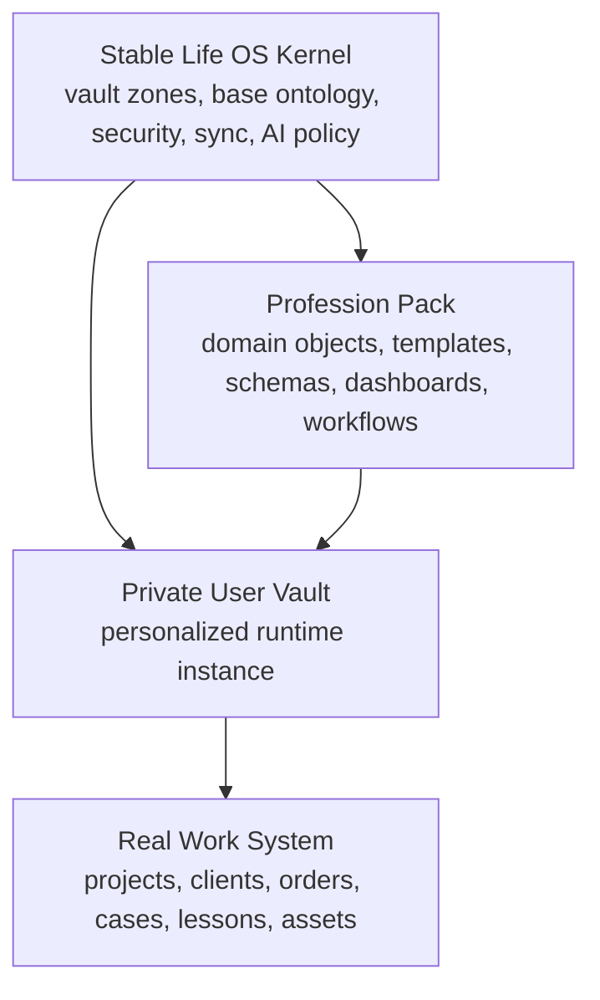

This preserves three production properties:

1. **Portability** — a user can migrate or update the framework without losing the profession layer.
2. **Interoperability** — dashboards, AI, validation, and migrations can reason over all packs.
3. **Safety** — security and AI permissions remain controlled by the framework kernel.

---

## 5. Pack Contract

Every Profession Pack MUST include a `pack.yaml` manifest.

Recommended directory structure:

```text
profession-packs/<pack-id>/
├── pack.yaml
├── README.md
├── templates/
├── schemas/
├── dashboards/
├── bases/
├── checklists/
├── workflows/
├── ai/
│   ├── agents/
│   ├── context-packs/
│   └── prompts/
├── examples/
├── migrations/
├── tests/
└── CHANGELOG.md
```

Minimal pack:

```text
profession-packs/<pack-id>/
├── pack.yaml
├── README.md
├── templates/
├── dashboards/
└── checklists/
```

Production pack:

```text
profession-packs/<pack-id>/
├── pack.yaml
├── README.md
├── templates/
├── schemas/
├── dashboards/
├── bases/
├── checklists/
├── workflows/
├── ai/
├── examples/
├── migrations/
├── tests/
└── CHANGELOG.md
```

---

## 6. `pack.yaml` Manifest

Every pack MUST define its identity, compatibility, object types, folder overlays, security assumptions, AI scope, and validation expectations.

```yaml
id: "developer"
name: "Developer Pack"
version: "1.0.0"
status: "production-draft"
description: "Profession Pack for software engineers, technical founders, automation engineers, and architecture-heavy knowledge workers."
compatible_framework_versions:
  - ">=1.0.0 <2.0.0"
extends:
  kernel: true
  folders:
    - "40_Work"
    - "20_Projects"
    - "30_Knowledge"
    - "70_AI"
owner: "Life OS Framework Maintainers"
maintainers:
  - "core-team"
license: "same-as-framework"
contains_real_personal_data: false
contains_synthetic_examples_only: true
requires_plugins:
  required:
    - "Properties"
    - "Bases"
    - "Templates"
  optional:
    - "Tasks"
    - "Dataview"
    - "Obsidian Git"
    - "Local REST API / MCP bridge"
object_types:
  - "repository"
  - "technical-spec"
  - "architecture-decision"
  - "bug"
  - "experiment"
  - "release-note"
  - "postmortem"
sensitivity_defaults:
  default: "private"
  client_work: "sensitive"
  credentials: "forbidden"
ai_policy:
  default_access: "draft_only"
  allowed_actions:
    - "summarize"
    - "classify"
    - "draft"
    - "propose_patch"
  forbidden_actions:
    - "commit_code_without_review"
    - "delete_canonical_notes"
    - "read_secrets"
    - "change_repository_permissions"
validation:
  requires_schema_tests: true
  requires_template_tests: true
  requires_security_review: true
  requires_example_data_review: true
```

### 6.1 Manifest Rules

The manifest MUST NOT contain real personal data.

It MUST define:

- `id`;
- `name`;
- `version`;
- `compatible_framework_versions`;
- `object_types`;
- `sensitivity_defaults`;
- `ai_policy`;
- `validation`.

It SHOULD define:

- maintainers;
- optional plugins;
- folder overlays;
- examples;
- migration notes;
- known risks;
- required review cadence.

---

## 7. Universal Profession Model

Every profession can be modeled using the same operating pattern:

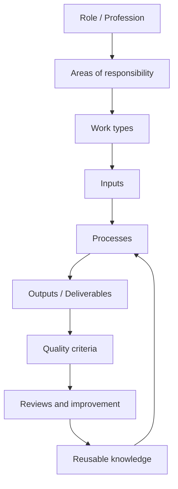

Universal components:

| Component | Meaning | Examples |
|---|---|---|
| Role | Who the user is in this context | developer, designer, machinist, teacher |
| Area | Long-running responsibility | health, clients, product, workshop, courses |
| Project | Temporary outcome-oriented effort | launch app, design brand, machine part batch |
| Input | What enters the workflow | brief, ticket, drawing, case, lesson topic |
| Process | How work is done | design iteration, machining setup, code review |
| Tool | Instrument used | Figma, lathe, GitHub, microscope, legal database |
| Asset | Reusable item | template, jig, component, dataset, lesson plan |
| Output | Deliverable | report, part, design, release, lesson, diagnosis note |
| Quality | Acceptance criteria | tolerances, tests, rubric, style guide |
| Review | Improvement loop | postmortem, QA check, retrospective |

---

## 8. Profession Pack Lifecycle

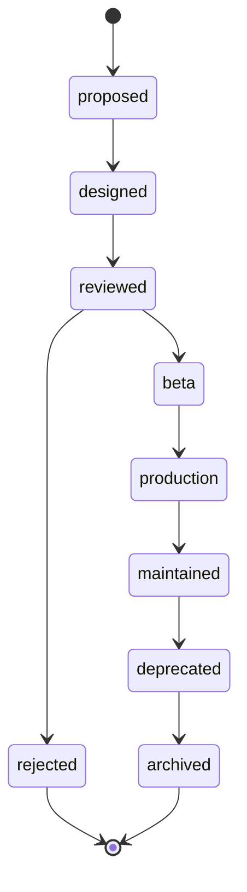

Lifecycle statuses:

| Status | Meaning | Allowed in main repo? |
|---|---|---|
| `proposed` | Idea exists, not designed | Yes, as proposal only |
| `designed` | Pack contract drafted | Yes |
| `reviewed` | Architecture/security review completed | Yes |
| `beta` | Usable, not fully stable | Yes, clearly marked |
| `production` | Stable and supported | Yes |
| `maintained` | Production with active support | Yes |
| `deprecated` | Replaced or no longer recommended | Yes, with migration path |
| `archived` | Historical only | Yes, but not recommended |
| `rejected` | Explicitly not accepted | In decisions log only |

---

## 9. Pack Installation Flow

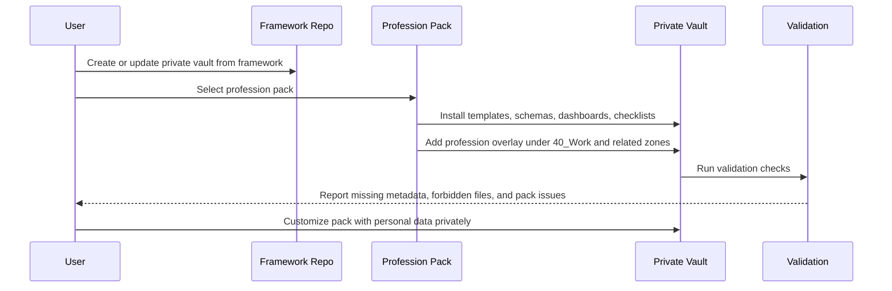

Installation MUST preserve the distinction between:

- shared framework files;
- profession pack files;
- user-private data.

---

## 10. Repository vs Private Vault Boundary

Profession Packs in the shared repository may include:

- generic templates;
- schemas;
- checklists;
- dashboards;
- examples with synthetic data;
- generic AI instructions;
- migration scripts;
- tests.

They must not include:

- real client data;
- real patient records;
- real student records;
- real legal matters;
- personal finance records;
- identity documents;
- private conversations;
- real employer confidential information;
- credentials;
- API keys;
- production secrets.

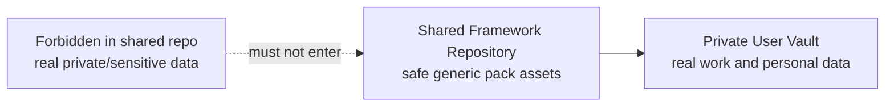

---

## 11. Folder Overlay Rules

The stable kernel remains unchanged. Profession Packs add overlays primarily inside `40_Work/`.

Example:

```text
40_Work/
├── Clients/
├── Projects/
├── Processes/
├── Assets/
├── Quality/
├── Reviews/
└── Archive/
```

Pack-specific overlays:

```text
40_Work/
├── Developer/
│   ├── Repositories/
│   ├── Specs/
│   ├── ADR/
│   ├── Bugs/
│   ├── Experiments/
│   ├── Releases/
│   └── Postmortems/
│
├── Designer/
│   ├── Briefs/
│   ├── Moodboards/
│   ├── Assets/
│   ├── Feedback/
│   ├── Revisions/
│   ├── Deliverables/
│   └── Portfolio/
│
└── Machinist/
    ├── Orders/
    ├── Drawings/
    ├── Materials/
    ├── Machines/
    ├── Tools/
    ├── Setups/
    ├── Tolerances/
    ├── Quality_Control/
    ├── Maintenance/
    └── Safety/
```

### 11.1 Overlay Constraints

A pack MAY add folders under:

- `40_Work/`;
- `30_Knowledge/`;
- `20_Projects/`;
- `70_AI/Agents/`;
- `70_AI/Context_Packs/`;
- `00_System/Dashboards/`;
- `00_System/Templates/`;
- `00_System/Schemas/`.

A pack MUST NOT replace:

- `00_System/` contract;
- `01_Inbox/` quarantine semantics;
- `50_Finance/` forbidden data policy;
- `70_AI/AI_Drafts` review requirement;
- `99_Attachments/` ownership rules;
- sensitivity model;
- forbidden data model.

---

## 12. Type Extension Rules

Profession Packs extend the base ontology with domain types.

Base ontology examples:

```text
note
area
project
task
person
meeting
decision
resource
asset
client
work-order
finance-record
finance-decision
daily-note
weekly-review
monthly-review
ai-agent
context-pack
review
experiment
architecture-decision
checklist
process
standard
deliverable
```

Pack-specific types MUST be namespaced or clearly domain-specific.

Good examples:

```text
repository
technical-spec
bug
release-note
brief
moodboard
revision
machine-setup
quality-check
lesson-plan
student-note
legal-matter
case-note
research-hypothesis
```

Bad examples:

```text
data
thing
misc
private
important
work
file
stuff
```

These names are too vague and harm validation, dashboards, AI retrieval, and migration.

---

## 13. Pack Schema Requirements

Every production pack SHOULD include schemas for its domain types.

Example `schemas/machine-setup.schema.json`:

```json
{
  "$schema": "https://json-schema.org/draft/2020-12/schema",
  "title": "Machine Setup",
  "type": "object",
  "required": [
    "id",
    "type",
    "title",
    "status",
    "created",
    "updated",
    "sensitivity",
    "machine",
    "operation",
    "material"
  ],
  "properties": {
    "id": { "type": "string" },
    "type": { "const": "machine-setup" },
    "title": { "type": "string" },
    "status": { "type": "string" },
    "created": { "type": "string", "format": "date" },
    "updated": { "type": "string", "format": "date" },
    "sensitivity": {
      "enum": ["public", "internal", "private", "sensitive", "restricted"]
    },
    "machine": { "type": "string" },
    "operation": { "type": "string" },
    "material": { "type": "string" },
    "spindle_speed": { "type": ["number", "string", "null"] },
    "feed_rate": { "type": ["number", "string", "null"] },
    "tooling": {
      "type": "array",
      "items": { "type": "string" }
    }
  },
  "additionalProperties": true
}
```

Schemas SHOULD be permissive enough for real work, but strict enough to power dashboards and AI context packs.

---

## 14. Template Requirements

Every template MUST include YAML frontmatter.

Minimum template contract:

```yaml
---
id: ""
type: ""
title: ""
status: ""
created: ""
updated: ""
sensitivity: "private"
area: ""
project: ""
tags: []
relations:
  people: []
  projects: []
  resources: []
  decisions: []
review:
  cadence: ""
  next: ""
---
```

Profession-specific fields MAY be added.

Templates SHOULD include:

- purpose;
- required inputs;
- workflow stage;
- quality checklist;
- next actions;
- related notes;
- review criteria;
- AI assistance block where safe.

---

## 15. Dashboard Requirements

Each pack SHOULD provide at least one dashboard.

Minimum dashboards:

```text
Dashboard - <Profession>.md
Dashboard - <Profession> Active Work.md
Dashboard - <Profession> Review.md
```

A dashboard SHOULD answer:

- What is active?
- What is waiting?
- What is blocked?
- What is due soon?
- What requires quality review?
- What requires client/customer/student/patient/manager response?
- What should be archived?
- What should AI help summarize, classify, or draft?

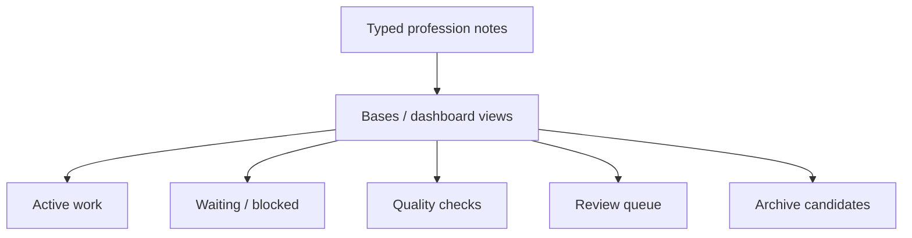

Dashboards MUST be derived from canonical notes. They MUST NOT become the only place where critical facts exist.

---

## 16. AI Model for Profession Packs

Each pack MAY define profession-specific AI agents.

Examples:

| Profession | Agent | Allowed Help | Forbidden Without Approval |
|---|---|---|---|
| Developer | Spec Review Agent | summarize specs, draft ADRs, classify bugs | merge PRs, change repo permissions, deploy |
| Designer | Brief Synthesis Agent | summarize briefs, organize feedback | send client files, approve final deliverables |
| Machinist | Setup Review Agent | draft setup checklist, compare tolerances | certify safety, override machine settings |
| Teacher | Lesson Planning Agent | draft lesson plans, summarize feedback | grade final marks automatically |
| Lawyer | Matter Summary Agent | summarize public notes, draft checklists | give final legal advice, file documents |
| Healthcare | Protocol Study Agent | summarize research, draft study notes | diagnose, treat, store unmanaged patient records |
| Founder | Strategy Review Agent | summarize priorities, draft investor updates | send commitments, change cap table, move money |

### 16.1 AI Permission Baseline

Profession packs inherit this baseline:

```yaml
ai_policy:
  default_mode: "draft_only"
  allowed_write_paths:
    - "01_Inbox/AI_Drafts"
    - "70_AI/Agent_Logs"
  forbidden_actions:
    - "delete_canonical_notes"
    - "modify_security_policy"
    - "read_forbidden_data"
    - "send_external_messages_without_review"
    - "execute_financial_actions"
    - "make_medical_legal_safety_certifications"
  human_review_required: true
```

Profession-specific agents may further restrict access. They must not broaden global permissions without explicit governance review.

---

## 17. Context Pack Rules for Professions

A Profession Pack MAY include context-pack definitions.

Example:

```yaml
id: "developer-weekly-review-context"
type: "context-pack-definition"
name: "Developer Weekly Review Context"
purpose: "Help AI summarize active engineering work for weekly review."
include:
  paths:
    - "40_Work/Developer/Specs"
    - "40_Work/Developer/ADR"
    - "40_Work/Developer/Bugs"
    - "20_Projects/Active"
  types:
    - "technical-spec"
    - "architecture-decision"
    - "bug"
    - "project"
exclude:
  paths:
    - "50_Finance"
    - "60_People/Private"
    - "99_Attachments/Identity"
    - "secrets"
max_sensitivity: "sensitive"
output_path: "01_Inbox/AI_Drafts"
requires_human_review: true
```

Rules:

- context packs MUST be task-specific;
- context packs MUST include provenance;
- context packs MUST inherit maximum source sensitivity;
- context packs MUST exclude forbidden data;
- context packs SHOULD use metadata filters before semantic retrieval;
- context packs SHOULD be disposable and regenerable.

---

## 18. Quality Criteria Model

Every Profession Pack MUST define what “good work” means for that profession.

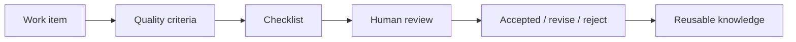

Quality criteria examples:

| Profession | Quality Criteria |
|---|---|
| Developer | tests pass, security reviewed, ADR updated, release notes drafted |
| Designer | brief matched, assets exported, feedback resolved, accessibility checked |
| Machinist | drawing current, material verified, tolerance checked, safety checklist complete |
| Teacher | learning objectives clear, materials ready, assessment aligned |
| Researcher | sources cited, hypothesis clear, method documented, limitations captured |
| Consultant | scope clear, assumptions explicit, recommendations actionable |

---

## 19. Safety-Critical Professions

Some professions have higher safety, legal, medical, regulatory, or physical-risk constraints.

Examples:

- healthcare;
- law;
- finance;
- machining / manufacturing;
- electrical work;
- aviation;
- construction;
- laboratory work;
- education involving minors;
- security operations.

For these packs:

- AI MUST be advisory and draft-only by default;
- real regulated records SHOULD remain in approved external systems;
- templates MUST clearly mark legal/safety boundaries;
- final professional judgment MUST remain human;
- quality checklists SHOULD include explicit safety gates;
- evidence/provenance MUST be captured;
- sensitive data MUST be minimized.

---

## 20. Pack Review Matrix

Every pack must pass review across five dimensions.

| Dimension | Question | Required for Production |
|---|---|---|
| Architecture | Does it preserve the kernel? | Yes |
| Data | Are note types and schemas valid? | Yes |
| Security | Does it avoid forbidden data and excessive AI scope? | Yes |
| UX | Can a real person use it daily? | Yes |
| Migration | Can it evolve without data loss? | Yes |

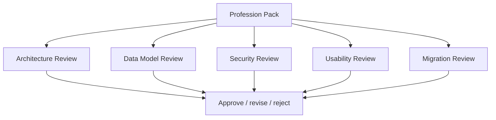

---

## 21. Pack Versioning

Profession Packs follow semantic versioning.

```text
MAJOR.MINOR.PATCH
```

Rules:

- MAJOR: breaking schema or folder changes;
- MINOR: new templates, dashboards, workflows, schemas;
- PATCH: fixes, wording, small validation improvements.

Each pack MUST include `CHANGELOG.md` for production status.

Example:

```markdown
# CHANGELOG

## 1.1.0

- Added project risk review dashboard.
- Added AI context pack for weekly review.
- Added schema for `quality-check`.

## 1.0.1

- Fixed metadata example in `work-order.md`.
```

---

## 22. Migration Model

Profession Packs MUST include migration guidance for breaking changes.

Example migration note:

```markdown
# Migration: Developer Pack 1.x to 2.0

## Breaking Changes

- `technical-design` type renamed to `technical-spec`.
- `repo` property renamed to `repository`.

## Manual Steps

1. Search for `type: technical-design`.
2. Replace with `type: technical-spec`.
3. Search for `repo:` and rename to `repository:`.
4. Run schema validation.
5. Review dashboards.

## Rollback

Restore from backup or Git snapshot taken before migration.
```

Migration MUST be human-reviewable. Automated migration may be provided, but must not be the only path.

---

## 23. Pack Validation

Validation SHOULD check:

- `pack.yaml` exists and is valid;
- no real personal data in examples;
- templates contain frontmatter;
- schemas are valid JSON Schema;
- dashboards do not reference missing properties;
- AI policies do not broaden global permissions;
- forbidden data patterns are absent;
- examples use synthetic identities;
- folder overlays do not modify kernel semantics;
- migration notes exist for breaking changes.

Example validation pipeline:

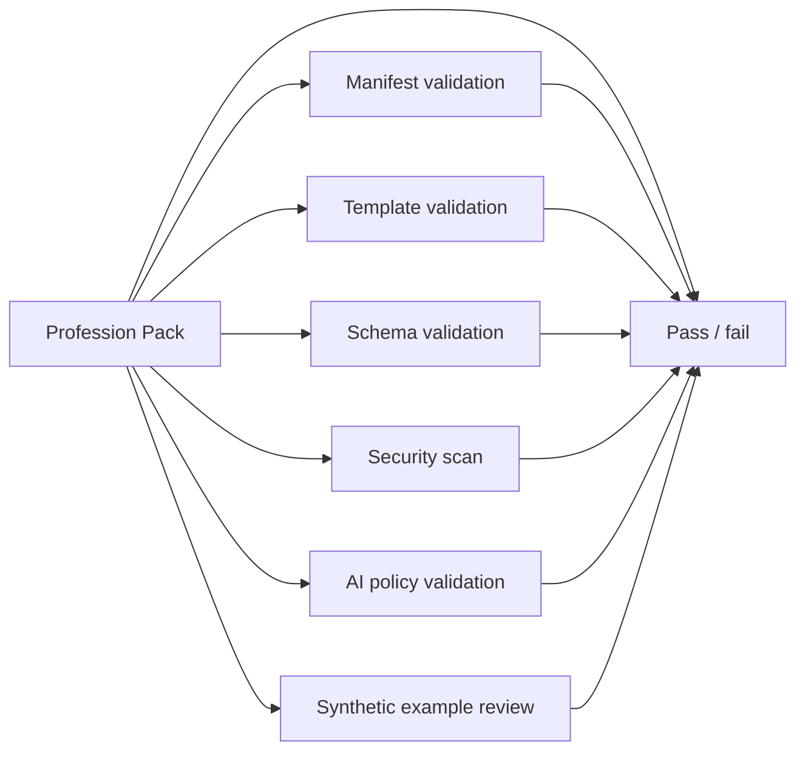

---

## 24. Profession Pack Taxonomy

The framework SHOULD ship with baseline packs across four broad categories.

### 24.1 Knowledge Work

```text
developer
designer
manager
founder
consultant
researcher
writer
lawyer
finance
student
teacher
```

### 24.2 Physical / Craft / Operations Work

```text
machinist
craftsperson
operator
technician
mechanic
electrician
builder
lab-technician
```

### 24.3 Care / Human Service Work

```text
healthcare-study
coach
therapist-notes-private
teacher
mentor
community-organizer
```

### 24.4 Creative Work

```text
artist
musician
filmmaker
photographer
content-creator
game-designer
```

---

## 25. Developer Pack

### 25.1 Purpose

For software engineers, automation engineers, technical founders, architects, data practitioners, and builders who need to preserve technical context across projects.

### 25.2 Folder Overlay

```text
40_Work/Developer/
├── Repositories/
├── Specs/
├── ADR/
├── Bugs/
├── Experiments/
├── Releases/
├── Postmortems/
├── Runbooks/
├── Security/
└── Archive/
```

### 25.3 Types

```text
repository
technical-spec
architecture-decision
bug
experiment
release-note
postmortem
runbook
security-review
api-contract
```

### 25.4 Template: Technical Spec

```yaml
---
id: ""
type: "technical-spec"
title: ""
status: "proposed"
created: ""
updated: ""
sensitivity: "private"
project: ""
repository: ""
owners: []
reviewers: []
related_adrs: []
risks: []
ai_access: "context_pack_allowed"
---
```

Sections:

```markdown
# Technical Spec

## Problem

## Goals

## Non-Goals

## Architecture

## Data Model

## Security Considerations

## Rollout Plan

## Testing

## Open Questions

## Decision Log
```

### 25.5 Dashboards

- Active specs;
- ADRs awaiting decision;
- bugs by severity;
- experiments in progress;
- releases pending notes;
- postmortems requiring action.

### 25.6 AI Agents

Allowed:

- summarize spec;
- draft ADR;
- classify bug;
- extract release notes;
- generate review checklist.

Forbidden without approval:

- merge code;
- deploy;
- change permissions;
- edit secrets;
- close production incident;
- delete canonical docs.

---

## 26. Designer Pack

### 26.1 Purpose

For product designers, brand designers, UX researchers, visual designers, creative directors, and design students.

### 26.2 Folder Overlay

```text
40_Work/Designer/
├── Clients/
├── Briefs/
├── Research/
├── Moodboards/
├── Concepts/
├── Assets/
├── Feedback/
├── Revisions/
├── Deliverables/
├── Portfolio/
└── Archive/
```

### 26.3 Types

```text
client
brief
design-project
moodboard
visual-reference
asset
feedback
revision
deliverable
case-study
style-guide
```

### 26.4 Template: Design Project

```yaml
---
id: ""
type: "design-project"
title: ""
status: "active"
created: ""
updated: ""
sensitivity: "client-confidential"
client: ""
deadline: ""
stage: "discovery"
tools: []
deliverables: []
review:
  cadence: "weekly"
  next: ""
ai_access: "draft_only"
---
```

### 26.5 Quality Checklist

```text
[ ] Brief understood
[ ] Constraints documented
[ ] References collected
[ ] Accessibility reviewed where applicable
[ ] Feedback logged
[ ] Revisions versioned
[ ] Deliverables exported
[ ] Portfolio decision made
```

### 26.6 AI Agents

Allowed:

- summarize brief;
- organize client feedback;
- draft revision notes;
- create portfolio case-study outline.

Forbidden without approval:

- send files to client;
- approve final deliverable;
- modify client commitments;
- expose confidential client materials.

---

## 27. Machinist / Craftsperson Pack

### 27.1 Purpose

For machinists, craftspeople, workshop operators, technicians, production specialists, and hands-on makers whose work involves orders, materials, tools, machines, setups, tolerances, safety, and quality control.

This pack is intentionally included to prove that Life OS is not only for knowledge workers.

### 27.2 Folder Overlay

```text
40_Work/Machinist/
├── Orders/
├── Drawings/
├── Materials/
├── Machines/
├── Tools/
├── Setups/
├── Operations/
├── Tolerances/
├── Quality_Control/
├── Maintenance/
├── Suppliers/
├── Safety/
└── Archive/
```

### 27.3 Types

```text
work-order
drawing
material
machine
tool
machine-setup
operation
quality-check
maintenance-log
supplier
safety-checklist
```

### 27.4 Template: Work Order

```yaml
---
id: ""
type: "work-order"
title: ""
status: "active"
created: ""
updated: ""
sensitivity: "client-confidential"
client: ""
part_name: ""
drawing: ""
material: ""
quantity: ""
deadline: ""
machine: ""
tools: []
tolerance_class: ""
quality_checks: []
safety_requirements: []
ai_access: "summary_only"
---
```

### 27.5 Template: Machine Setup

```yaml
---
id: ""
type: "machine-setup"
title: ""
status: "validated"
created: ""
updated: ""
sensitivity: "private"
machine: ""
operation: ""
material: ""
tooling: []
spindle_speed: ""
feed_rate: ""
depth_of_cut: ""
coolant: ""
validated_by: ""
validation_date: ""
ai_access: "read_only"
---
```

### 27.6 Safety Checklist

```text
[ ] Latest drawing confirmed
[ ] Material confirmed
[ ] Tolerance understood
[ ] Tools inspected
[ ] Machine setup verified
[ ] Safety equipment ready
[ ] First article checked
[ ] Quality result recorded
[ ] Deviations documented
```

### 27.7 AI Agents

Allowed:

- draft setup checklist;
- summarize order requirements;
- compare checklist against drawing notes;
- organize maintenance logs.

Forbidden without approval:

- certify safety;
- override machine setup;
- approve tolerance compliance;
- replace human inspection;
- modify real production instructions without review.

---

## 28. Teacher Pack

### 28.1 Purpose

For teachers, tutors, professors, course creators, trainers, and mentors.

### 28.2 Folder Overlay

```text
40_Work/Teacher/
├── Courses/
├── Lessons/
├── Students/
├── Assignments/
├── Materials/
├── Feedback/
├── Assessments/
├── Reviews/
└── Archive/
```

### 28.3 Types

```text
course
lesson-plan
student-note
assignment
assessment
feedback
teaching-resource
rubric
course-review
```

### 28.4 Sensitive Data Rule

Real student data may be sensitive or regulated depending on jurisdiction and institution. Store only what is appropriate, authorized, and necessary. Prefer anonymized or minimal notes where possible.

### 28.5 AI Agents

Allowed:

- draft lesson outlines;
- summarize feedback;
- generate study materials;
- suggest assessment rubrics.

Forbidden without approval:

- assign final grades;
- disclose student notes;
- make disciplinary decisions;
- send messages to students or parents without review.

---

## 29. Researcher Pack

### 29.1 Purpose

For researchers, analysts, scientists, students, independent scholars, and evidence-driven knowledge workers.

### 29.2 Folder Overlay

```text
40_Work/Researcher/
├── Questions/
├── Papers/
├── Literature_Reviews/
├── Hypotheses/
├── Experiments/
├── Datasets/
├── Findings/
├── Methods/
├── Limitations/
└── Archive/
```

### 29.3 Types

```text
research-question
paper-note
literature-review
hypothesis
experiment
dataset
finding
method-note
limitation
citation-note
```

### 29.4 AI Agents

Allowed:

- summarize papers;
- extract claims;
- build literature map;
- draft method comparison;
- identify limitations.

Forbidden without approval:

- fabricate citations;
- claim unsupported results;
- alter source interpretation without provenance;
- treat AI summary as primary evidence.

---

## 30. Founder / Operator Pack

### 30.1 Purpose

For founders, operators, executives, product owners, creators, and people coordinating strategy, product, sales, hiring, finance, legal, and operations.

### 30.2 Folder Overlay

```text
40_Work/Founder/
├── Strategy/
├── Product/
├── Sales/
├── Marketing/
├── Hiring/
├── Investors/
├── Operations/
├── Legal_Context/
├── Metrics/
└── Reviews/
```

### 30.3 Types

```text
strategy-note
product-initiative
sales-lead
marketing-campaign
hiring-candidate
investor-note
operating-review
metric-review
risk-note
```

### 30.4 AI Agents

Allowed:

- summarize strategy;
- draft investor update;
- organize sales notes;
- identify operational risks;
- prepare weekly review.

Forbidden without approval:

- send investor update;
- make legal commitments;
- move money;
- change cap table;
- hire/fire;
- publish external claims.

---

## 31. Lawyer / Legal Pack

### 31.1 Purpose

For legal professionals and people managing legal context. This pack is not a substitute for legal practice management software or jurisdiction-specific compliance.

### 31.2 Folder Overlay

```text
40_Work/Legal/
├── Matters/
├── Clients/
├── Documents/
├── Deadlines/
├── Research/
├── Precedents/
├── Checklists/
└── Archive/
```

### 31.3 Types

```text
legal-matter
legal-client
legal-document
legal-deadline
legal-research-note
precedent-note
filing-checklist
risk-note
```

### 31.4 Security Rule

Real client data may be highly confidential and regulated. Use only if authorized, minimize storage, apply restricted sensitivity, and prefer approved legal systems for official records.

### 31.5 AI Agents

Allowed:

- summarize internal notes;
- draft checklists;
- organize research;
- identify missing metadata.

Forbidden without approval:

- provide final legal advice;
- file documents;
- communicate with court/client/opposing party;
- rely on hallucinated citations;
- bypass attorney review.

---

## 32. Healthcare Study Pack

### 32.1 Purpose

For healthcare professionals, students, and researchers maintaining study notes, protocols, literature notes, and anonymized learning cases.

This pack is not an unmanaged patient record system.

### 32.2 Folder Overlay

```text
40_Work/Healthcare_Study/
├── Protocols/
├── Literature/
├── Study_Notes/
├── Anonymized_Cases/
├── Checklists/
├── Continuing_Education/
└── Reviews/
```

### 32.3 Types

```text
protocol-note
medical-literature-note
study-note
anonymized-case
clinical-checklist
education-log
```

### 32.4 Forbidden Use

Do not use this pack as a primary electronic medical record. Do not store unmanaged identifiable patient records unless explicitly authorized and protected under applicable rules.

### 32.5 AI Agents

Allowed:

- summarize literature;
- organize study notes;
- draft learning checklists;
- compare protocols for study.

Forbidden without approval:

- diagnose;
- prescribe;
- replace clinical judgment;
- store identifiable patient data casually;
- generate final medical instructions without professional review.

---

## 33. Finance Pack

### 33.1 Purpose

For personal finance planning, high-level budgeting, investment theses, subscriptions, tax checklists, and decision records.

It is not a banking system, broker, tax filing system, or password vault.

### 33.2 Folder Overlay

```text
50_Finance/
├── Dashboard/
├── Goals/
├── Budget/
├── Decisions/
├── Subscriptions/
├── Taxes/
├── Investment_Theses/
├── Reviews/
└── Archive/
```

### 33.3 Types

```text
finance-goal
budget-category
subscription
finance-decision
tax-checklist
investment-thesis
finance-review
risk-note
```

### 33.4 Forbidden Data

Do not store:

- passwords;
- seed phrases;
- full card numbers;
- full account numbers unless explicitly protected and necessary;
- private keys;
- raw bank exports by default;
- production financial credentials.

### 33.5 AI Agents

Allowed:

- summarize monthly review;
- identify subscriptions;
- draft budget categories;
- compare decisions to principles.

Forbidden without approval:

- move money;
- execute trades;
- file taxes;
- access credentials;
- provide regulated financial advice as final authority.

---

## 34. Student Pack

### 34.1 Purpose

For students managing courses, lectures, assignments, exams, study plans, projects, and learning resources.

### 34.2 Folder Overlay

```text
40_Work/Student/
├── Courses/
├── Lectures/
├── Assignments/
├── Exams/
├── Study_Plans/
├── Resources/
├── Projects/
└── Reviews/
```

### 34.3 Types

```text
course
lecture-note
assignment
exam
study-plan
learning-resource
student-project
study-review
```

### 34.4 AI Agents

Allowed:

- explain notes;
- draft study plan;
- summarize lecture;
- create practice questions.

Forbidden:

- cheat;
- plagiarize;
- submit AI work as human work against rules;
- fabricate sources.

---

## 35. Writer / Creator Pack

### 35.1 Purpose

For writers, creators, journalists, content strategists, screenwriters, newsletter authors, and creative operators.

### 35.2 Folder Overlay

```text
40_Work/Writer/
├── Ideas/
├── Research/
├── Outlines/
├── Drafts/
├── Edits/
├── Publications/
├── Submissions/
├── Feedback/
└── Archive/
```

### 35.3 Types

```text
writing-idea
outline
draft
scene
article
publication
submission
editorial-feedback
research-note
```

### 35.4 AI Agents

Allowed:

- organize ideas;
- draft outlines;
- summarize research;
- suggest edits;
- create publication calendar.

Forbidden without approval:

- publish;
- fabricate quotes;
- plagiarize;
- misrepresent sources;
- impersonate someone.

---

## 36. Artist / Creative Pack

### 36.1 Purpose

For artists, musicians, photographers, filmmakers, game designers, and multidisciplinary creators.

### 36.2 Folder Overlay

```text
40_Work/Creative/
├── Concepts/
├── References/
├── Sketches/
├── Works_In_Progress/
├── Assets/
├── Exhibitions/
├── Releases/
├── Portfolio/
└── Archive/
```

### 36.3 Types

```text
creative-concept
reference
sketch
work-in-progress
creative-asset
exhibition
release
portfolio-piece
```

### 36.4 AI Agents

Allowed:

- organize references;
- draft artist statement;
- summarize feedback;
- plan release schedule.

Forbidden without approval:

- publish final work;
- claim ownership of unlicensed material;
- expose private client/commercial work.

---

## 37. Consultant Pack

### 37.1 Purpose

For consultants, advisors, coaches, independent specialists, and service professionals.

### 37.2 Folder Overlay

```text
40_Work/Consultant/
├── Clients/
├── Engagements/
├── Discovery/
├── Meetings/
├── Recommendations/
├── Deliverables/
├── Followups/
├── Invoices_Context/
└── Archive/
```

### 37.3 Types

```text
consulting-client
engagement
discovery-note
recommendation
deliverable
followup
scope-note
```

### 37.4 AI Agents

Allowed:

- summarize discovery;
- draft recommendation outline;
- identify follow-ups;
- prepare meeting brief.

Forbidden without approval:

- send client recommendations;
- make commitments;
- expose other clients' data;
- create invoice/payment actions without review.

---

## 38. Pack Composition

Users often have multiple roles. Profession Packs must compose safely.

Example:

```text
User roles:
- founder
- developer
- writer
- finance-personal
```

Composition rules:

- packs may coexist under `40_Work/<PackName>/`;
- shared clients/projects may link across packs;
- sensitivity inheritance must use the maximum sensitivity of sources;
- AI context packs must remain task-specific;
- dashboards may aggregate across packs but not duplicate canonical data.

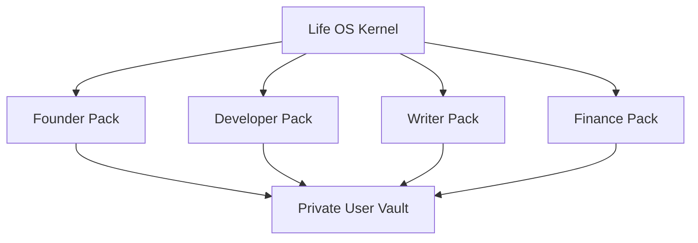

---

## 39. Custom Profession Pack Creation

To create a custom pack, answer the following questions.

### 39.1 Identity

```text
1. What is the role called?
2. What outcomes does this role produce?
3. Who receives or evaluates those outcomes?
4. What information is needed repeatedly?
5. What mistakes are expensive?
```

### 39.2 Objects

```text
1. What are the main work objects?
2. What is the lifecycle of each object?
3. Which objects link to projects?
4. Which objects link to people?
5. Which objects require attachments?
```

### 39.3 Workflows

```text
1. What begins a work cycle?
2. What are the stages?
3. What must be reviewed?
4. What must be archived?
5. What should become reusable knowledge?
```

### 39.4 Security

```text
1. What data is sensitive?
2. What data is regulated?
3. What data must never be stored?
4. What can AI see?
5. What can AI draft?
6. What requires human approval?
```

### 39.5 Output

```text
1. What templates are needed?
2. What dashboards are needed?
3. What checklists are needed?
4. What context packs are needed?
5. What validations are needed?
```

---

## 40. Custom Pack Template

```text
profession-packs/custom-<role>/
├── pack.yaml
├── README.md
├── templates/
│   ├── <role>-project.md
│   ├── <role>-client.md
│   ├── <role>-review.md
│   └── <role>-deliverable.md
├── schemas/
│   └── <role>-project.schema.json
├── dashboards/
│   ├── Dashboard - <Role>.md
│   └── Dashboard - <Role> Review.md
├── checklists/
│   ├── quality-checklist.md
│   └── safety-checklist.md
├── workflows/
│   └── workflow.md
├── ai/
│   ├── agents/<role>-assistant.md
│   └── context-packs/<role>-weekly-review.yaml
├── examples/
│   └── synthetic-example.md
└── CHANGELOG.md
```

---

## 41. Profession Pack README Template

```markdown
# <Profession> Pack

## Purpose

## Who This Is For

## What This Pack Adds

## Folder Overlay

## Note Types

## Templates

## Dashboards

## Checklists

## AI Assistance Model

## Security and Privacy Notes

## Installation

## First Week Setup

## Review Cadence

## Examples

## Migration Notes
```

---

## 42. Profession Pack Checklist

A pack is production-ready only if every item below is complete.

```text
[ ] pack.yaml exists
[ ] README.md exists
[ ] no real personal data
[ ] object types are defined
[ ] folder overlay does not break kernel
[ ] templates include frontmatter
[ ] schemas exist for core pack types
[ ] dashboards are derived from canonical properties
[ ] checklists cover quality criteria
[ ] AI policy is draft-only by default
[ ] context packs exclude forbidden data
[ ] safety constraints are documented
[ ] examples are synthetic
[ ] migration guidance exists
[ ] validation tests exist
[ ] CHANGELOG.md exists
[ ] security review completed
[ ] architecture review completed
[ ] data model review completed
```

---

## 43. Anti-Patterns

Avoid these patterns.

### 43.1 Folder Dump Pack

A pack that only creates folders and no metadata, templates, schemas, or workflows is not production-grade.

### 43.2 AI Autopilot Pack

A pack that lets AI modify canonical notes, send external messages, or execute high-impact actions without review violates the framework.

### 43.3 Vague Type Pack

A pack that uses vague types like `misc`, `thing`, `important`, or `work-note` harms long-term retrieval and validation.

### 43.4 SaaS-Locked Pack

A pack that only works with one external vendor is not portable enough for the framework. External integrations may be supported, but the canonical model must remain local-first.

### 43.5 Regulated Data Pack Without Boundaries

A pack for legal, healthcare, finance, education, or safety-critical work that lacks sensitivity rules and forbidden data boundaries is not acceptable.

---

## 44. Pack Risk Register

| Risk | Impact | Mitigation |
|---|---|---|
| Pack breaks kernel | migration failure | enforce folder/type extension rules |
| Pack stores real example data | privacy incident | synthetic data policy and review |
| AI scope too broad | data exposure or unsafe action | inherited AI baseline and security review |
| Pack schemas too strict | unusable in real work | staged schema maturity |
| Pack schemas too loose | dashboards and AI degrade | required core fields |
| Safety-critical pack overclaims | user harm | strict claims policy and human review |
| Multi-pack conflicts | inconsistent dashboards | namespace and compatibility checks |
| Unmaintained pack | stale workflows | lifecycle and deprecation policy |

---

## 45. Marketing and Claims Policy

Profession Packs may use premium positioning only when the claim is defensible.

Allowed:

```text
A structured operating layer for designers.
A local-first workflow system for machinists and craftspeople.
A production-ready extension model for professional knowledge work.
A safer human-reviewed AI workflow for domain-specific work.
```

Not allowed:

```text
The only correct system for every profession.
Guaranteed compliance.
Fully autonomous expert replacement.
Zero-risk AI automation.
Medical/legal/financial advice without professional review.
```

Preferred positioning:

> Profession Packs make Life OS feel native to your work without compromising portability, ownership, security, or human judgment.

---

## 46. Profession Pack Roadmap

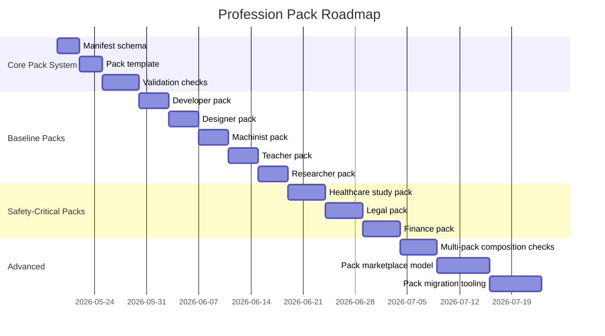

---

## 47. Production Definition of Done

A Profession Pack is production-ready when:

```text
[ ] It preserves the Life OS kernel.
[ ] It defines a clear domain model.
[ ] It provides templates with valid frontmatter.
[ ] It provides schemas for core domain types.
[ ] It provides useful dashboards.
[ ] It provides quality and review checklists.
[ ] It defines AI assistance boundaries.
[ ] It defines sensitivity and forbidden data rules.
[ ] It includes synthetic examples only.
[ ] It includes migration guidance.
[ ] It passes validation.
[ ] It is usable by a real practitioner.
[ ] It does not overclaim.
```

---

## 48. MVP Boundary

For v1.0, the framework SHOULD ship with:

```text
profession-packs/
├── developer/
├── designer/
├── machinist/
├── teacher/
├── researcher/
├── founder/
├── student/
└── custom/
```

Each MVP pack must include:

- `pack.yaml`;
- `README.md`;
- at least 3 templates;
- at least 1 dashboard;
- at least 1 quality checklist;
- AI policy notes;
- synthetic example;
- security notes.

P1 should add schemas and validation tests for every pack.

P2 should add advanced context packs, semantic index hints, migration scripts, and multi-pack composition tooling.

---

## 49. Relationship to Future Semantic Indexing

Profession Packs must be designed for future semantic retrieval without depending on it.

Required metadata for future readiness:

```yaml
id: ""
type: ""
title: ""
status: ""
sensitivity: ""
area: ""
project: ""
source: ""
provenance: ""
relations: {}
ai_access: ""
```

Semantic indexes MUST remain derived artifacts. They must not become canonical storage.

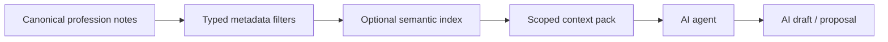

---

## 50. Closing Principle

A great Profession Pack does not merely organize files.

It translates a profession into an operating system:

```text
objects → workflows → standards → reviews → knowledge → AI assistance → human judgment
```

The best pack makes the system feel tailor-made while keeping the Life OS guarantees intact:

- local-first ownership;
- schema-first clarity;
- private canonical vaults;
- derived dashboards;
- safe AI collaboration;
- tested recovery;
- honest claims;
- long-term evolution.

That is the difference between a folder template and a professional operating layer.

---

## 51. Source Baseline

This document is aligned with:

- `01_PROJECT_BRIEF.md`;
- `14_DECISIONS_LOG.md`;
- `02_ARCHITECTURE.md`;
- `03_DATA_MODEL.md`;
- `04_SECURITY_MODEL.md`;
- `05_AI_AGENT_MODEL.md`;
- `06_SYNC_BACKUP_RECOVERY.md`;
- `07_INSTALLATION.md`;
- `08_VAULT_STRUCTURE.md`.

External source baseline used by the framework documentation set:

- Obsidian Help: Properties, Bases, Daily Notes, Canvas, Sync, Web Clipper;
- GitHub Docs: template repositories, protected branches, CODEOWNERS, secret scanning, push protection, CodeQL, Dependabot, Actions artifacts;
- NIST Cybersecurity Framework 2.0;
- NIST AI Risk Management Framework;
- NIST SP 800-184 recovery planning;
- OWASP LLM Prompt Injection Prevention Cheat Sheet;
- OWASP RAG Security Cheat Sheet;
- OWASP AI Agent Security Cheat Sheet;
- OWASP Secrets Management Cheat Sheet;
- CISA backup and ransomware recovery guidance;
- Nextcloud documentation for files, calendar, conflicts, encryption;
- Syncthing documentation for sync, conflicts, file versioning, untrusted devices, security.
