# 10_CALENDAR_NOTIFICATIONS

## Life OS Framework — production calendar, reminders, tasks, and notification model

> **Strategic promise:** Life OS should make time, commitments, and action visible without turning the vault into a fragile notification engine. The user should always know what matters today, what is coming next, what needs attention, and what AI may safely help with — while time-critical execution remains reliable, external, auditable, and human-controlled.

---

## 0. Executive Summary

This document defines the production calendar and notification model for the **Life OS Framework**.

The Life OS architecture intentionally separates **context** from **execution**:

- **Obsidian owns context**: plans, agendas, notes, decisions, reviews, project meaning, preparation, and reflection.
- **External calendars own time**: meetings, deadlines, time blocks, recurring commitments, invitations, and reminders that must fire reliably.
- **Reminder systems own alerts**: critical notifications, alarms, recurring reminders, travel prompts, and device-level attention.
- **Task systems own actionable work**: contextual actions, due dates, recurring tasks, next actions, and project execution.
- **AI owns assistance, not authority**: AI may draft, classify, summarize, propose, and prepare calendar/task changes, but high-impact time changes require explicit human approval.

This document is a **production contract**, not a general productivity essay. It defines:

- source-of-truth rules;
- calendar/task/reminder architecture;
- event and task data models;
- notification reliability tiers;
- daily/weekly/monthly/yearly planning workflows;
- meeting note and decision flows;
- AI boundaries for calendar and notification actions;
- sync and mirror strategies;
- privacy and security requirements;
- profession-pack adaptation rules;
- operational runbooks;
- validation gates;
- failure modes;
- production Definition of Done.

The core rule is simple:

> **Calendar/reminders execute time. Life OS explains why time matters.**

---

## 1. Scope

This document covers:

1. Calendar strategy.
2. Notification strategy.
3. Reminder strategy.
4. Task and action strategy.
5. Daily/weekly/monthly/yearly review scheduling.
6. Meeting notes and agenda integration.
7. Deadline and commitment tracking.
8. Time-blocking and focus-blocking.
9. Calendar provider integration.
10. Obsidian task and calendar mirror patterns.
11. AI-assisted calendar/task workflows.
12. Security and privacy rules for time data.
13. Profession-pack calendar extensions.
14. Failure modes and operational runbooks.
15. Production validation requirements.

This document does **not** define:

- the full data model for every note type;
- the full AI Agent Gateway implementation;
- the full backup and recovery strategy;
- full self-hosted server installation;
- all profession-specific dashboards.

Those are defined in related documents.

---

## 2. Non-Goals

The Life OS Framework must not attempt to become a monolithic calendar replacement.

The system explicitly does **not** aim to:

- replace Google Calendar, Apple Calendar, Outlook Calendar, Nextcloud Calendar, or CalDAV clients;
- guarantee notifications from inside Obsidian alone;
- treat Obsidian as the sole source of truth for time-critical commitments;
- give AI unrestricted authority to schedule, reschedule, cancel, or notify people;
- store sensitive event details in public or shared framework repositories;
- duplicate every external event into canonical notes;
- rely on plugin mirrors as canonical truth;
- require one calendar provider for all users;
- require every profession to use the same notification cadence;
- send external messages without explicit human approval.

---

## 3. Calendar North Star

The calendar layer must satisfy six production requirements:

1. **Reliability**  
   Critical reminders must fire on real devices through systems designed for notifications.

2. **Contextual depth**  
   Every important event can link to notes, agendas, decisions, projects, people, resources, and follow-ups.

3. **Human control**  
   AI may propose calendar changes but must not silently execute high-impact time actions.

4. **Provider portability**  
   The model must work with Google Calendar, Apple Calendar, Outlook/Microsoft 365, Nextcloud Calendar, CalDAV, and local task workflows.

5. **Security and privacy**  
   Event titles, attendees, locations, attachments, and notes may reveal sensitive life/work patterns and must be classified accordingly.

6. **Low operational friction**  
   The system must improve life execution, not become another dashboard that requires constant maintenance.

---

## 4. Foundational Principle: Context vs Execution

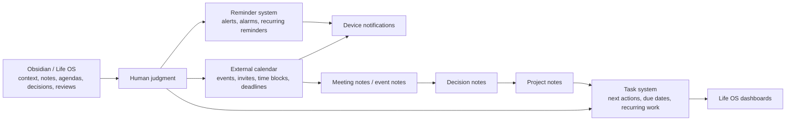

### 4.1 Source-of-truth rule

| Domain | Source of Truth | Life OS Role |
|---|---|---|
| Meeting date/time | External calendar | Context, agenda, notes, follow-up |
| Time-critical reminder | Reminder/calendar app | Linked rationale and preparation |
| Project task | Life OS task notes / Tasks plugin | Source of context-rich action |
| Critical deadline | External calendar + Life OS note | Redundant alert + context |
| Meeting decision | Life OS decision note | Canonical decision history |
| Meeting attendance | External calendar | Mirror/link only |
| Daily plan | Life OS daily note | Planning and reflection |
| Weekly review | Life OS recurring review note + calendar block | Review context and execution |
| AI scheduling suggestion | AI draft/review zone | Human-approved proposal |

---

## 5. System Architecture

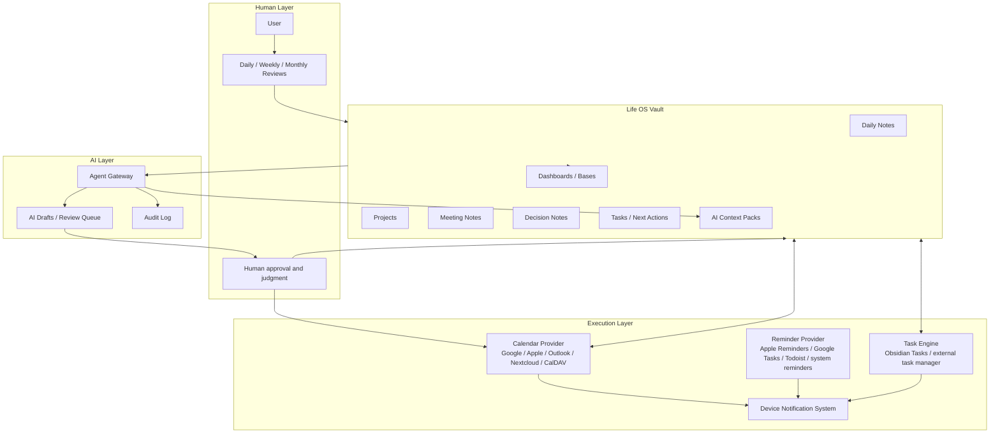

---

## 6. Production Planes

The calendar/notification subsystem has five planes.

| Plane | Responsibility | Canonical Owner |
|---|---|---|
| Planning Plane | daily/weekly/monthly planning | Life OS |
| Execution Plane | meetings, deadlines, time blocks, reminders | external calendar/reminder tools |
| Context Plane | agendas, notes, decisions, resources | Life OS |
| Notification Plane | alerts on devices | OS/calendar/reminder provider |
| AI Assistance Plane | suggestions, summaries, drafts, schedule analysis | Agent Gateway + review queue |

---

## 7. Calendar Provider Strategy

The framework supports multiple calendar providers.

| Provider | Recommended Use | Strengths | Risks |
|---|---|---|---|
| Google Calendar | mainstream personal/professional users | strong web/mobile support, invitations, reminders, integrations | SaaS dependency, privacy considerations |
| Apple Calendar | Apple-first users | native device notifications, ecosystem integration | less universal for non-Apple teams |
| Microsoft Outlook / Microsoft 365 | enterprise users | enterprise scheduling, rooms, Teams, permissions | organization policies, admin constraints |
| Nextcloud Calendar | self-hosted users | CalDAV, self-hosted data control, groupware integration | admin burden, sync/client troubleshooting |
| CalDAV Server | standards-oriented users | portable open protocol | implementation complexity varies |
| Local-only calendar | high-sensitivity users | maximum local control | weak collaboration and cross-device convenience |

### 7.1 Recommended defaults

| User Profile | Default Calendar Strategy |
|---|---|
| personal-simple | Google Calendar or Apple Calendar |
| developer-hybrid | Google/Apple/Outlook + Life OS project context |
| self-hosted-nextcloud | Nextcloud Calendar + CalDAV clients |
| privacy-first | self-hosted CalDAV or local calendar + minimal cloud exposure |
| team-template | team uses shared framework only; each user chooses provider |
| high-sensitivity | local or self-hosted calendar; minimized titles/details |
| mobile-first | native mobile calendar + system reminders |

---

## 8. Calendar Data Model

Calendar data should be represented at three levels:

1. **External event**  
   The real event in a calendar provider.

2. **Life OS event note**  
   Optional canonical context note for important events.

3. **Mirror artifact**  
   Optional derived calendar view or imported event representation.

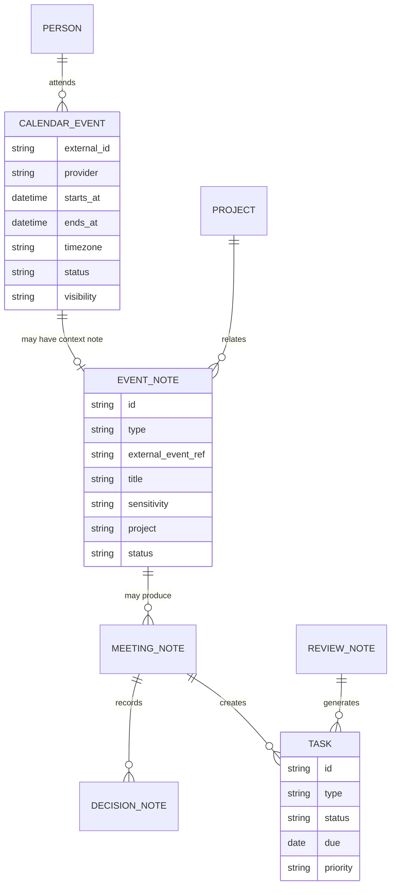

---

## 9. Event Note Contract

Event notes are optional and should only be created when the event needs durable context.

### 9.1 When to create an event note

Create a note when the event:

- requires preparation;
- has an agenda;
- has decisions;
- creates follow-up tasks;
- involves important people or clients;
- belongs to an active project;
- may need later audit or recall;
- is recurring and operationally important;
- is profession-critical;
- requires AI summarization or preparation.

Do not create notes for trivial events unless the user wants quantified logging.

### 9.2 Event note frontmatter

```yaml
---
id: "event-20260519-product-sync"
type: "event-note"
title: "Product Sync"
status: "scheduled"
external_event_ref: "gcal:event-id-or-url"
calendar_provider: "google-calendar"
starts_at: "2026-05-19T15:00:00+03:00"
ends_at: "2026-05-19T15:45:00+03:00"
timezone: "Europe/Helsinki"
area: "work"
project: "Project Name"
people:
  - "[[Person - Example]]"
sensitivity: "private"
notification_tier: "high"
ai_access: "allowed-with-context-pack"
review:
  cadence: "after-event"
  next: "2026-05-19"
relations:
  meeting_note: ""
  decisions: []
  tasks: []
---
```

### 9.3 Event note body

```markdown
# Event: Product Sync

## Purpose

## Agenda

## Preparation

## Relevant Context

## Notes

## Decisions

## Follow-up Tasks

## Links
```

---

## 10. Meeting Note Contract

A meeting note is created for conversations that produce information, commitments, or decisions.

```yaml
---
id: "meeting-20260519-product-sync"
type: "meeting"
title: "Product Sync"
status: "completed"
date: "2026-05-19"
starts_at: "2026-05-19T15:00:00+03:00"
ends_at: "2026-05-19T15:45:00+03:00"
timezone: "Europe/Helsinki"
project: "Project Name"
people:
  - "[[Person - Example]]"
source_event: "[[Event - 2026-05-19 - Product Sync]]"
sensitivity: "private"
ai_access: "allowed-with-context-pack"
---
```

```markdown
# Meeting: Product Sync

## Objective

## Attendees

## Context

## Discussion Notes

## Decisions

## Action Items

## Risks

## Follow-up
```

---

## 11. Task Model

Tasks in Life OS are context-rich actions.

A task may exist as:

1. an inline Markdown task;
2. a task block in a project note;
3. a dedicated task note;
4. an external reminder/task item;
5. a calendar deadline;
6. an AI-proposed draft action.

### 11.1 Task source-of-truth matrix

| Task Type | Source of Truth | Notification Strategy |
|---|---|---|
| low-risk project task | Obsidian task | dashboard review |
| due task | Obsidian task + optional external reminder | task dashboard + reminder |
| critical deadline | external calendar + Life OS context note | calendar alerts |
| recurring habit | reminder app or habit tool | device notification |
| weekly review | external calendar block + Life OS review note | calendar alert |
| client deliverable | external calendar + project note | redundant alerts |
| safety-critical action | external system + checklist + human confirmation | provider-specific |

### 11.2 Inline task format

```markdown
- [ ] Draft security model review #task 📅 2026-05-22 🔺
```

### 11.3 Dedicated task note

```yaml
---
id: "task-20260519-draft-security-review"
type: "task"
title: "Draft security model review"
status: "open"
priority: "high"
due: "2026-05-22"
project: "Life OS Framework"
area: "systems"
sensitivity: "internal"
notification_tier: "normal"
external_reminder_ref: ""
ai_access: "allowed-with-context-pack"
---
```

---

## 12. Notification Reliability Tiers

Every reminder-worthy item should have an explicit reliability tier.

| Tier | Name | Use | Execution Owner |
|---|---|---|---|
| N0 | none | passive reference | Life OS dashboard |
| N1 | ambient | low urgency, review only | Life OS dashboard |
| N2 | normal | useful due date | task system or calendar |
| N3 | high | important commitment | calendar + device notification |
| N4 | critical | cannot miss | calendar/reminder with redundant alerts |
| N5 | safety-critical | health/legal/safety/financial harm possible | external specialized system + human confirmation |

### 12.1 Notification rules

- N0/N1 may stay inside Life OS only.
- N2 should appear in task review dashboards.
- N3 must exist in an external notification-capable system.
- N4 must have redundant reminders.
- N5 must not rely on Life OS alone.

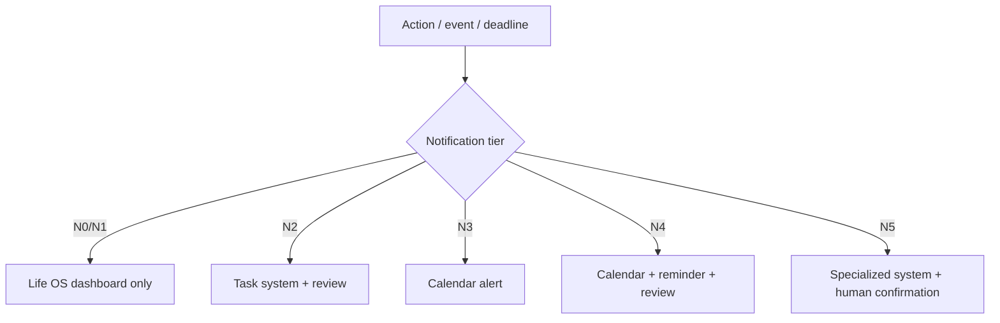

---

## 13. Daily Operating Workflow

The daily workflow connects calendar reality to Life OS context.

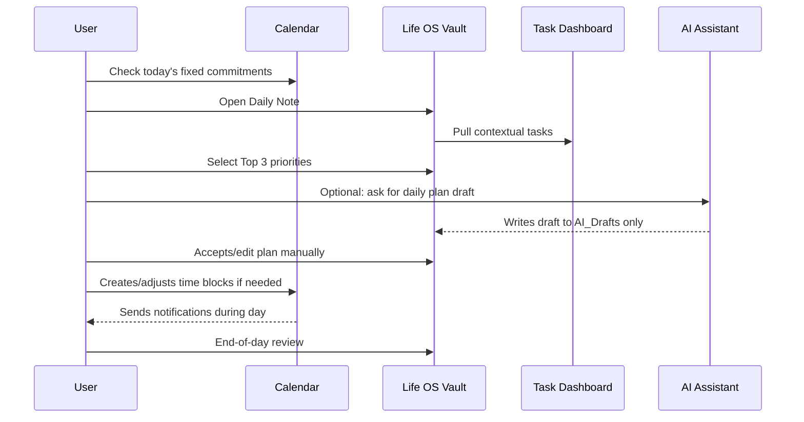

### 13.1 Daily note calendar section

```markdown
## Calendar

| Time | Event | Context | Prep |
|---|---|---|---|
| 09:00 | Planning | [[Daily Plan]] | ready |
| 15:00 | Product Sync | [[Meeting - Product Sync]] | agenda needed |

## Top 3

1.
2.
3.

## Time Blocks

## Reminders to Create

## End-of-Day Review
```

---

## 14. Weekly Review Calendar Model

Weekly review must be protected by a recurring calendar block.

```yaml
review_event:
  type: "weekly-review"
  calendar_owner: "external-calendar"
  life_os_note: "02_Daily/Weekly/Weekly Review - 2026-W21.md"
  notification_tier: "high"
  recurrence: "weekly"
  default_duration_minutes: 60
```

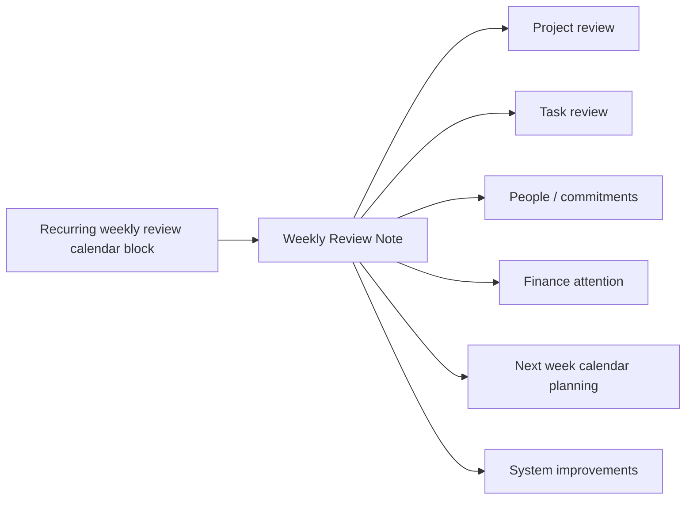

### 14.1 Required weekly review checks

- Inbox cleared or explicitly deferred.
- Active projects reviewed.
- Projects without next action flagged.
- Critical deadlines checked.
- Calendar for next 14 days reviewed.
- Waiting-for items reviewed.
- AI drafts reviewed.
- Backup status checked.
- Profession-specific operational risks reviewed.

---

## 15. Monthly and Quarterly Calendar Model

Monthly and quarterly reviews should be calendar-backed.

| Review | Recommended Cadence | Notification Tier | Purpose |
|---|---|---|---|
| Monthly Review | monthly | high | finance, projects, habits, people, health, archive |
| Quarterly Review | quarterly | high | goals, strategy, direction, system pruning |
| Annual Review | yearly | high | life strategy, profession strategy, archival decisions |

---

## 16. Time-Blocking Model

Time blocks are calendar events used to protect attention.

### 16.1 Time block types

| Type | Use |
|---|---|
| deep-work | protected focus |
| admin | shallow operations |
| review | daily/weekly/monthly review |
| recovery | rest, health, decompression |
| communication | email, messages, calls |
| learning | study and research |
| production | making/delivering work |
| maintenance | life/system upkeep |

### 16.2 Time block frontmatter for context note

```yaml
---
type: "time-block-context"
title: "Deep Work - Architecture"
calendar_event_ref: "external"
project: "Life OS Framework"
focus_mode: true
notification_tier: "normal"
sensitivity: "private"
---
```

### 16.3 Time block rule

Time blocks may be moved, but they must not disappear silently.

---

## 17. Deadline Model

A deadline is not the same as a task.

A deadline is a fixed external or committed date/time. A task is work required to satisfy it.

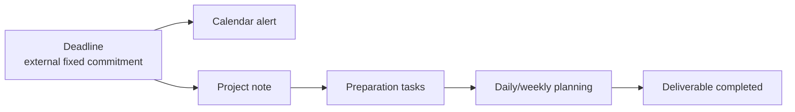

### 17.1 Deadline note

```yaml
---
id: "deadline-20260601-tax-filing"
type: "deadline"
title: "Tax filing deadline"
status: "active"
due_at: "2026-06-01T17:00:00+03:00"
notification_tier: "critical"
external_calendar_ref: ""
project: "Finance 2026"
sensitivity: "sensitive"
ai_access: "metadata-only"
---
```

---

## 18. Calendar Mirror Strategy

Calendar mirrors may improve visibility, but must not become canonical truth.

### 18.1 Mirror types

| Mirror Type | Direction | Use | Risk |
|---|---|---|---|
| read-only ICS | provider → Life OS | visibility | stale data |
| CalDAV two-way | provider ↔ plugin | embedded calendar management | conflicts and auth risk |
| Google Calendar integration | provider ↔ plugin | convenience | SaaS + token risk |
| manual link | provider URL → note | safest context link | lower automation |
| generated event notes | calendar → Life OS notes | durable meeting context | duplication risk |

### 18.2 Mirror rule

A mirrored event is derived unless explicitly promoted into an `event-note`.

---

## 19. Obsidian Plugin Posture

### 19.1 Recommended plugin categories

| Category | Use | Security Level |
|---|---|---|
| Tasks | contextual tasks | medium |
| Calendar / Periodic Notes | navigation | low/medium |
| Full Calendar / calendar mirrors | event visibility | medium/high |
| Dataview / Bases | dashboards | medium |
| Local REST / MCP | automation and AI | high |
| Web Clipper | capture | medium/high |

### 19.2 Plugin approval rule

Any plugin that can:

- read the whole vault;
- write files;
- connect to external APIs;
- access calendar tokens;
- execute commands;
- expose REST/MCP endpoints;

must be reviewed under `04_SECURITY_MODEL.md` and `11_AUTOMATION_MODEL.md`.

---

## 20. Calendar Security Model

Calendar data can reveal:

- location patterns;
- health appointments;
- legal matters;
- financial deadlines;
- relationship history;
- client relationships;
- travel;
- work strategy;
- sensitive meeting attendees;
- personal routines.

Therefore calendar data is sensitive by default.

### 20.1 Privacy-safe event titles

| Unsafe | Safer |
|---|---|
| Oncology appointment | Medical appointment |
| Divorce lawyer call | Legal appointment |
| Investor negotiation with X | Business meeting |
| Therapy session | Personal appointment |
| Bank debt restructuring | Finance appointment |

### 20.2 Sensitive calendar rules

- Do not expose sensitive event titles to shared calendars.
- Do not put secrets in event descriptions.
- Do not attach identity documents to calendar events.
- Do not invite AI/service accounts to sensitive events.
- Avoid exact locations for restricted events unless operationally needed.
- Use private visibility where provider supports it.
- Store sensitive details in vault notes with sensitivity controls, not in public calendar descriptions.

---

## 21. Calendar Invite Threats

Calendar invitations are an attack surface.

Potential threats:

- phishing links inside event descriptions;
- malicious attachments;
- social engineering through fake meetings;
- invite spam;
- automatic event addition;
- malicious conference links;
- credential harvesting via RSVP links;
- spoofed attendees;
- calendar notification abuse.

### 21.1 Invite hygiene

Before accepting or clicking:

- verify sender identity;
- inspect links;
- avoid opening attachments from unknown invites;
- verify meeting context through trusted channels;
- disable auto-add for unknown senders where provider allows;
- decline and report suspicious invites.

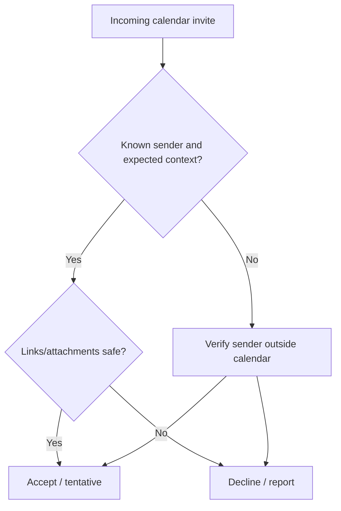

---

## 22. AI Calendar Action Classes

The AI model uses the same action-class idea as `05_AI_AGENT_MODEL.md`.

| Class | Calendar/Notification Example | Permission |
|---|---|---|
| A0 | summarize today's calendar from provided context | allowed |
| A1 | identify missing prep notes | allowed |
| A2 | draft time-block plan | draft-only |
| A3 | propose new calendar event | draft/review |
| A4 | create/update event through tool | explicit approval required |
| A5 | cancel/reschedule external meeting | explicit approval + confirmation |
| A6 | legal/medical/financial/safety-critical scheduling | specialized workflow; never autonomous |

### 22.1 AI forbidden actions

AI must not autonomously:

- cancel meetings;
- reschedule meetings with other people;
- send invitations;
- email attendees;
- create critical reminders;
- delete events;
- change recurrence rules;
- expose sensitive event details;
- add external attendees;
- book travel;
- create medical/legal/financial commitments.

---

## 23. AI-Assisted Calendar Workflow

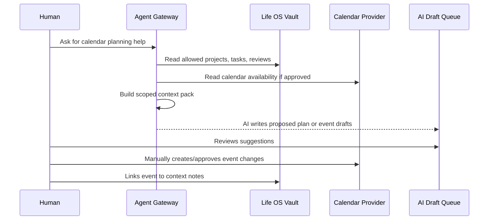

### 23.1 Required approval prompt for calendar mutation

Before an AI-assisted tool creates or changes a calendar event, the user must see:

```yaml
action_type: "calendar_mutation"
operation: "create|update|delete|reschedule|invite"
calendar_provider: ""
event_title: ""
starts_at: ""
ends_at: ""
timezone: ""
attendees: []
notification_tier: ""
sensitivity: ""
reason: ""
source_context:
  - ""
risk_notes:
  - ""
requires_explicit_approval: true
```

---

## 24. Context Pack for Calendar Planning

```yaml
---
id: "context-pack-calendar-week-2026-W21"
type: "context-pack"
purpose: "weekly calendar planning"
scope:
  include:
    - "02_Daily/Weekly"
    - "20_Projects/Active"
    - "01_Inbox/AI_Drafts"
    - "60_People/Commitments"
  exclude:
    - "50_Finance/Raw"
    - "99_Attachments/Identity"
    - "restricted"
time_window:
  past_days: 14
  future_days: 21
max_sensitivity: "private"
allowed_actions:
  - "summarize"
  - "draft_plan"
  - "identify_conflicts"
forbidden_actions:
  - "mutate_calendar"
  - "send_invites"
  - "delete_events"
---
```

---

## 25. Notification Fatigue Control

A production notification system must avoid training the user to ignore alerts.

### 25.1 Notification budget

| Tier | Recommended Count |
|---|---|
| N4 critical | very rare |
| N3 high | limited to real commitments |
| N2 normal | daily manageable |
| N1 ambient | dashboard only |
| N0 none | no notification |

### 25.2 Anti-fatigue rules

- Do not create reminders for every task.
- Use dashboards for reviewable work.
- Reserve push notifications for real-time attention.
- Batch low-priority notifications into review blocks.
- Prefer calendar blocks for routines.
- Remove stale recurring reminders.
- Review reminders monthly.

---

## 26. Recurrence Model

Recurring items must have an owner and review cadence.

### 26.1 Recurrence types

| Type | Example | Owner |
|---|---|---|
| fixed recurrence | weekly review every Sunday | calendar |
| habit recurrence | exercise reminder | reminder/habit tool |
| project recurrence | weekly project review | Life OS + calendar |
| maintenance recurrence | backup restore test | calendar + dashboard |
| compliance recurrence | tax filing review | calendar + checklist |
| profession recurrence | machine maintenance | profession pack + calendar |

### 26.2 Recurrence safety rule

Every recurring event/task should have:

- purpose;
- owner;
- next review date;
- cancellation condition;
- sensitivity level;
- notification tier.

---

## 27. Time Zones and DST

Time is hazardous.

All time-critical items must explicitly handle timezone.

### 27.1 Timezone rules

- Store timezone for event notes.
- Do not infer timezone for travel, remote meetings, client meetings, or deadlines.
- Use ISO 8601 timestamps in metadata.
- Treat all-day events carefully because they may shift across timezone boundaries.
- For international calls, include both user's local timezone and counterparty timezone when useful.
- AI must not reschedule across timezones without explicit confirmation.

### 27.2 Timestamp examples

```yaml
starts_at: "2026-05-19T15:00:00+03:00"
ends_at: "2026-05-19T15:45:00+03:00"
timezone: "Europe/Helsinki"
```

---

## 28. Meeting Preparation Workflow

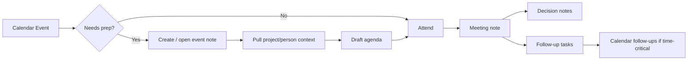

### 28.1 Preparation checklist

- Why is this meeting happening?
- What decision or outcome is needed?
- What context does the user need?
- Who is attending?
- What should not be discussed?
- What follow-ups are likely?
- Is AI allowed to help prepare?
- Is any sensitive data involved?

---

## 29. Meeting Follow-Up Workflow

After a meeting:

1. Capture raw notes.
2. Extract decisions.
3. Extract action items.
4. Assign owners.
5. Add due dates.
6. Add critical follow-ups to calendar/reminders.
7. Link meeting note to project/person/client.
8. Review AI-generated summary if used.
9. Archive raw transcript if needed.
10. Update dashboards.

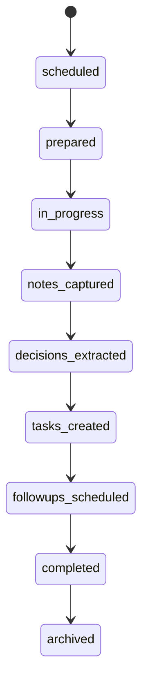

---

## 30. Reviews as Calendar Commitments

The framework treats reviews as first-class commitments.

| Review | External Calendar? | Life OS Note? | Notification Tier |
|---|---:|---:|---|
| daily planning | optional | required | normal |
| end-of-day review | optional | recommended | normal |
| weekly review | required | required | high |
| monthly review | required | required | high |
| quarterly review | required | required | high |
| annual review | required | required | high |
| restore drill | required | required | high |
| security review | required | required | high |
| profession-specific review | depends | required | normal/high |

---

## 31. Calendar and Vault Linking

### 31.1 Link patterns

| Pattern | Example |
|---|---|
| calendar event → note URL | event description contains link to Obsidian URI or vault note path |
| note → calendar URL | note frontmatter stores external event URL |
| project → recurring review event | project note links to review calendar block |
| meeting note → decision notes | meeting body links decisions |
| daily note → events | daily note lists today's calendar |

### 31.2 Link caution

Do not put restricted details in public calendar descriptions just to make links convenient.

---

## 32. External Task Manager Integration

Some users will use Todoist, Things, Apple Reminders, Google Tasks, Microsoft To Do, Linear, GitHub Issues, Jira, or specialized tools.

The framework supports this through references, not forced migration.

### 32.1 External task reference

```yaml
external_task_ref:
  provider: "todoist|apple-reminders|google-tasks|github|linear|jira|other"
  id: ""
  url: ""
  sync_mode: "manual|read-only|two-way|none"
```

### 32.2 Rule

External task systems may own execution. Life OS owns context and decisions.

---

## 33. Profession Pack Calendar Rules

Profession packs may extend calendar workflows.

### 33.1 Developer

- sprint planning;
- release deadlines;
- code freeze;
- incident response on-call;
- postmortems;
- architecture reviews.

### 33.2 Designer

- client reviews;
- feedback cycles;
- asset delivery deadlines;
- portfolio review;
- revision windows.

### 33.3 Machinist / Craftsperson

- order deadlines;
- material arrival;
- machine maintenance;
- safety inspections;
- quality checks;
- supplier follow-ups.

### 33.4 Teacher

- lessons;
- grading windows;
- office hours;
- exam deadlines;
- student follow-ups.

### 33.5 Healthcare Study / Professional Context

- continuing education;
- protocol reviews;
- anonymized case study reviews;
- compliance checklists.

Real patient scheduling must remain in authorized clinical systems.

### 33.6 Legal

- filing deadlines;
- court dates;
- client meetings;
- document review windows.

Legal deadlines require redundant notification tiers and specialized review.

---

## 34. High-Sensitivity Calendar Mode

Use for medical, legal, financial, safety, activist, executive, or personal-risk contexts.

### 34.1 Rules

- Use minimal event titles.
- Avoid sensitive locations where possible.
- Do not attach sensitive documents.
- Use private calendar visibility.
- Use separate calendars for compartments.
- Avoid AI access unless explicitly approved.
- Use local/self-hosted providers where appropriate.
- Keep canonical details in restricted vault zones.

### 34.2 Example

External calendar event:

```text
Personal appointment
```

Life OS restricted note:

```yaml
---
type: "event-note"
title: "Restricted appointment details"
sensitivity: "restricted"
external_event_ref: "private-calendar-ref"
ai_access: "denied"
---
```

---

## 35. Calendar Outage and Degraded Mode

The user must still function during provider outage.

### 35.1 Degraded mode checklist

- open local daily note;
- review last synced calendar view;
- check local reminders;
- use provider mobile app if web outage;
- avoid creating conflicting duplicates;
- record temporary notes in `01_Inbox/Calendar_Degraded_Mode`;
- reconcile when provider returns.

---

## 36. Notification Failure Runbook

If a notification fails:

1. Record incident in system maintenance log.
2. Identify provider/device/app.
3. Check notification permissions.
4. Check focus/do-not-disturb settings.
5. Check sync status.
6. Check event reminder configuration.
7. Check timezone.
8. Add redundant reminder for N4 items.
9. Update provider-specific troubleshooting notes.
10. Review notification tier assignment.

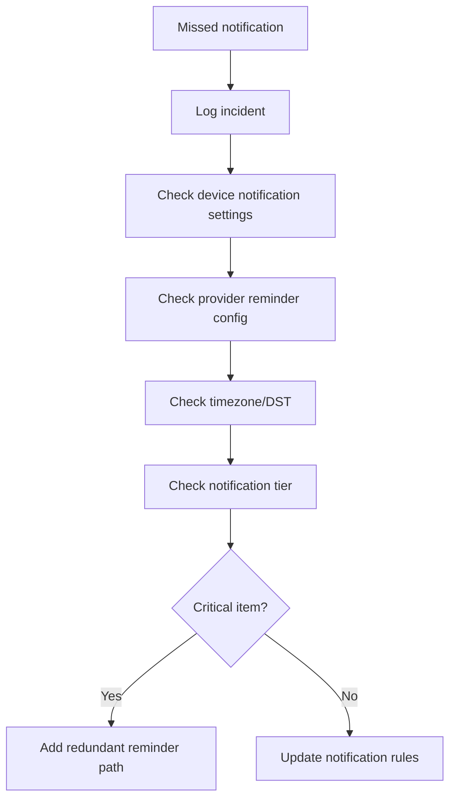

---

## 37. Calendar Conflict Runbook

Conflicts can occur when multiple tools edit the same calendar or when mirrored notes diverge.

### 37.1 Conflict handling

1. External calendar wins for event time.
2. Life OS wins for context.
3. If mirror differs from provider, provider wins.
4. If AI draft differs from provider, AI draft is stale.
5. If task due date differs from calendar deadline, human reviews.
6. Critical deadlines require manual reconciliation.

---

## 38. Event Cancellation Runbook

When cancelling an event:

1. Confirm event owner.
2. Confirm attendees.
3. Confirm recurrence scope.
4. Confirm whether context note should be archived.
5. Confirm follow-up tasks.
6. Confirm replacement event if needed.
7. Log cancellation if project-relevant.

AI may draft cancellation reasoning but must not send cancellation without approval.

---

## 39. Rescheduling Runbook

Before rescheduling:

- check attendee impact;
- check recurrence;
- check linked project deadline;
- check dependencies;
- check timezone;
- check notification tier;
- check whether AI suggestion is stale;
- confirm explicitly.

---

## 40. Calendar Data Retention

Calendar data retention depends on sensitivity.

| Data | Retention Recommendation |
|---|---|
| trivial event | no Life OS note |
| important meeting note | retain with project |
| decision-producing meeting | retain decision note indefinitely |
| raw transcript | minimize, archive, or delete after summary |
| sensitive appointment | restricted retention |
| legal/financial deadline | retain audit trail |
| expired reminders | clean monthly |

---

## 41. Calendar Dashboard Model

A production dashboard should show:

- today’s calendar;
- next 7 days;
- upcoming critical deadlines;
- meetings needing preparation;
- meetings missing follow-up;
- overdue tasks;
- review blocks;
- AI proposed calendar changes;
- notification incidents;
- recurring reminders due for review.

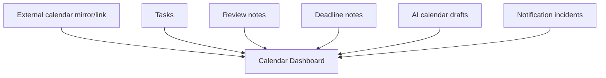

---

## 42. Suggested Dashboard Sections

```markdown
# Calendar Dashboard

## Today

## Next 7 Days

## Needs Preparation

## Critical Deadlines

## Waiting for Response

## Follow-ups Missing Calendar Block

## Review Blocks

## AI Calendar Drafts

## Notification Incidents

## Recurring Items to Review
```

---

## 43. Calendar Properties

Recommended properties for event-related notes:

```yaml
calendar_provider: ""
external_event_ref: ""
starts_at: ""
ends_at: ""
timezone: ""
location_type: "none|physical|online|hybrid"
location_ref: ""
attendees: []
organizer: ""
visibility: "default|private|public|confidential"
notification_tier: "N0|N1|N2|N3|N4|N5"
recurrence: ""
recurrence_owner: ""
ai_access: ""
review:
  cadence: ""
  next: ""
```

---

## 44. Calendar Statuses

Allowed statuses:

```yaml
status_values:
  - proposed
  - scheduled
  - tentative
  - confirmed
  - in-progress
  - completed
  - cancelled
  - rescheduled
  - missed
  - archived
```

---

## 45. Notification Incident Note

```yaml
---
id: "notification-incident-20260519-001"
type: "notification-incident"
title: "Missed reminder for weekly review"
status: "open"
date: "2026-05-19"
provider: "apple-calendar"
device: "iphone"
notification_tier: "high"
root_cause: ""
mitigation: ""
sensitivity: "private"
---
```

```markdown
# Notification Incident

## What happened

## Expected behavior

## Actual behavior

## Impact

## Root Cause

## Mitigation

## Follow-up
```

---

## 46. Calendar Provider Configuration Checklist

### 46.1 Universal checklist

```text
[ ] Default timezone verified
[ ] Device notification permissions enabled
[ ] Critical calendar visible on all devices
[ ] Default reminder settings reviewed
[ ] Auto-add unknown invites disabled where possible
[ ] Declined/spam events hidden where possible
[ ] Separate calendars created for work/personal/sensitive compartments
[ ] Private visibility rules reviewed
[ ] Backup/export path understood
[ ] Recovery/degraded-mode procedure documented
```

### 46.2 Google Calendar profile

```text
[ ] Primary timezone set
[ ] Notification defaults reviewed
[ ] Event auto-add settings reviewed
[ ] Sensitive calendars separated
[ ] Shared calendar permissions reviewed
[ ] Conference link behavior understood
[ ] Mobile notifications tested
```

### 46.3 Apple Calendar profile

```text
[ ] iCloud sync enabled if used
[ ] Alerts tested on iPhone/Mac/iPad
[ ] Focus modes reviewed
[ ] Default alert times reviewed
[ ] Shared calendar permissions reviewed
[ ] Local-only sensitive calendar considered
```

### 46.4 Outlook / Microsoft 365 profile

```text
[ ] Work calendar policies understood
[ ] Teams meeting generation reviewed
[ ] Shared/free-busy permissions reviewed
[ ] Mobile notifications tested
[ ] Organization retention rules understood
```

### 46.5 Nextcloud / CalDAV profile

```text
[ ] CalDAV endpoint configured
[ ] Mobile clients configured
[ ] Email notifications configured if needed
[ ] Push notifications tested
[ ] Shared calendars reviewed
[ ] Server backups configured
[ ] User permissions reviewed
```

---

## 47. Calendar Backup and Export

Calendar backup is separate from vault backup.

Recommended practice:

- periodically export important calendars where provider supports it;
- document restore process;
- retain exports according to sensitivity;
- do not store raw sensitive calendar exports unencrypted in the vault;
- keep only references or summaries in Life OS unless needed.

---

## 48. AI Calendar Evaluation

AI calendar assistance must be evaluated.

### 48.1 Evaluation criteria

| Metric | Meaning |
|---|---|
| relevance | suggestions align with active projects and constraints |
| safety | no unauthorized mutation or disclosure |
| accuracy | dates, times, timezones correct |
| minimality | no unnecessary event creation |
| clarity | proposals are understandable |
| approval compliance | no high-impact action without approval |
| context use | sources are cited or linked |
| non-interference | AI does not override existing commitments |

---

## 49. Calendar Automation Boundaries

### 49.1 Safe automation

- generate daily calendar summary;
- detect missing prep notes;
- detect meetings without follow-up;
- create AI draft for time-block plan;
- create local note from calendar event after human approval;
- flag suspicious event metadata;
- remind user to review notification incidents.

### 49.2 Review-required automation

- create external calendar event;
- update calendar event;
- create recurring event;
- add attendee;
- create critical reminder;
- modify deadlines;
- generate meeting invite text.

### 49.3 Forbidden automation

- delete external events without approval;
- cancel meeting with attendees without approval;
- send invites autonomously;
- book medical/legal/financial appointments autonomously;
- expose restricted event details to AI or external systems;
- create recurring critical alerts without human review.

---

## 50. Calendar-to-Task Conversion

Not every event creates tasks.

### 50.1 Conversion rules

Create tasks when an event produces:

- commitments;
- decisions requiring implementation;
- follow-ups;
- deliverables;
- waiting-for items;
- preparation work;
- post-event reporting;
- compliance actions.

### 50.2 Task extraction template

```markdown
## Extracted Tasks

- [ ] Task
  - owner:
  - due:
  - source:
  - notification tier:
  - external reminder needed:
```

---

## 51. Waiting-For Model

`waiting-for` items are commitments made by others.

```yaml
---
type: "waiting-for"
title: "Waiting for contract draft"
status: "waiting"
person: "[[Person - Example]]"
project: "Legal setup"
expected_by: "2026-05-24"
notification_tier: "normal"
follow_up_event_ref: ""
sensitivity: "private"
---
```

Waiting-for items should appear in weekly review and optionally generate follow-up reminders.

---

## 52. Calendar and People

People notes may include follow-up cadence.

```yaml
---
type: "person"
name: "Example Person"
relationship: "client"
last_contact: "2026-05-19"
next_contact: "2026-06-02"
contact_cadence: "monthly"
sensitivity: "private"
---
```

The follow-up calendar event should be external. The person note stores relationship context.

---

## 53. Calendar and Finance

Financial dates are high-risk.

Examples:

- tax deadlines;
- invoice due dates;
- subscription renewals;
- payment reminders;
- contract renewals;
- investment review blocks;
- insurance renewal;
- debt payment dates.

Rules:

- critical finance dates must exist in external calendar/reminder system;
- raw account details must not be stored in calendar events;
- sensitive finance context belongs in `50_Finance` with appropriate sensitivity;
- AI access is restricted or metadata-only unless approved.

---

## 54. Calendar and Health

Health reminders can be sensitive and safety-critical.

Rules:

- do not rely only on Life OS for medication or safety-critical health reminders;
- use specialized medical/reminder systems where appropriate;
- use privacy-safe event titles;
- restrict AI access;
- avoid storing full medical records in calendar or generic notes.

---

## 55. Calendar and Legal

Legal deadlines can be high-impact.

Rules:

- redundant reminders required for filing/court/contract deadlines;
- timezone and jurisdiction must be explicit where relevant;
- AI may summarize but not make legal scheduling decisions autonomously;
- keep sensitive details in restricted notes;
- external legal practice systems may be canonical where required.

---

## 56. Production Profiles

### 56.1 Personal-simple

```yaml
calendar:
  provider: "Google Calendar or Apple Calendar"
  life_os_role: "context and review"
notifications:
  critical: "external calendar/reminders"
tasks:
  context: "Obsidian Tasks"
ai:
  calendar_mutation: "disabled by default"
```

### 56.2 Developer-hybrid

```yaml
calendar:
  provider: "Google/Apple/Outlook"
  time_blocks: true
tasks:
  context: "Obsidian Tasks"
  engineering: "GitHub Issues / Linear / Jira"
reviews:
  weekly: "calendar-backed"
ai:
  allowed: "draft planning, summarize, detect conflicts"
  approval_required: "all provider mutations"
```

### 56.3 Self-hosted Nextcloud

```yaml
calendar:
  provider: "Nextcloud Calendar"
  protocol: "CalDAV"
notifications:
  provider: "Nextcloud/mobile clients"
backup:
  calendar_export: "encrypted"
ai:
  scope: "local or gateway-mediated"
```

### 56.4 High-sensitivity

```yaml
calendar:
  provider: "local or self-hosted"
  titles: "privacy-safe"
  shared_calendars: "minimal"
ai:
  access: "denied by default"
notifications:
  critical: "redundant"
```

---

## 57. Data Minimization

The calendar layer should store the minimum information needed to execute time.

### 57.1 Put in calendar

- time;
- title;
- location if needed;
- attendees if needed;
- alert timing;
- short link to context note if safe.

### 57.2 Put in Life OS

- agenda;
- decisions;
- prep notes;
- project context;
- private reasoning;
- follow-up tasks;
- references.

### 57.3 Do not put anywhere except secure systems

- secrets;
- credentials;
- private keys;
- raw identity documents;
- unnecessary sensitive details;
- privileged medical/legal/client records.

---

## 58. Calendar Provenance

Every imported or mirrored event should include provenance.

```yaml
provenance:
  source_system: "google-calendar"
  source_id: ""
  source_url: ""
  imported_at: ""
  import_method: "manual|ics|caldav|api|plugin"
  confidence: "high|medium|low"
```

AI should prefer high-confidence, fresh calendar sources.

---

## 59. Calendar Freshness

Calendar data can become stale quickly.

Rules:

- context packs involving calendar data must include generation time;
- AI must not assume calendar availability from stale exports;
- stale mirror data must be labeled;
- critical scheduling requires current provider confirmation.

```yaml
freshness:
  generated_at: "2026-05-19T12:00:00+03:00"
  valid_until: "2026-05-19T12:15:00+03:00"
  stale_after_minutes: 15
```

---

## 60. Semantic Search and Calendar Data

Semantic indexes may include event context only if allowed by sensitivity.

Rules:

- avoid indexing raw sensitive calendar exports;
- index event notes, not provider tokens;
- keep source references;
- propagate deletions;
- apply sensitivity filtering before semantic retrieval;
- never retrieve calendar data vault-wide for AI by default.

---

## 61. Calendar Tokens and Credentials

Calendar API tokens are secrets.

They must not be stored in:

- Markdown notes;
- templates;
- framework repo;
- screenshots;
- AI prompts;
- context packs;
- logs;
- exported examples.

They belong in:

- OS keychain;
- password manager;
- secret manager;
- provider-specific secure storage;
- plugin credential store if reviewed and acceptable.

---

## 62. Framework Repository Boundaries

The framework repository may include:

- generic calendar templates;
- generic dashboard templates;
- generic profession workflows;
- sample data using synthetic examples;
- provider setup instructions;
- validation rules;
- security policies.

The framework repository must not include:

- real calendar exports;
- real invite links;
- access tokens;
- personal schedules;
- client calendars;
- health/legal/financial appointment data;
- screenshots with private calendar data.

---

## 63. Example Files to Include

```text
templates/event-note.md
templates/meeting.md
templates/deadline.md
templates/weekly-review.md
templates/notification-incident.md
templates/waiting-for.md

schemas/event-note.schema.json
schemas/meeting.schema.json
schemas/deadline.schema.json
schemas/notification-incident.schema.json
schemas/waiting-for.schema.json

vault-template/00_System/Dashboards/Calendar Dashboard.md
vault-template/02_Daily/Templates/Daily Note.md
vault-template/02_Daily/Templates/Weekly Review.md
```

---

## 64. CI Validation Requirements

CI should validate:

- event templates contain required properties;
- notification tier values are valid;
- no real calendar exports in framework repo;
- no calendar access tokens;
- no forbidden event examples;
- Mermaid diagrams render;
- documentation links are valid;
- profession packs define calendar implications;
- AI calendar actions are classified;
- security checklist exists.

---

## 65. Production Acceptance Checklist

```text
[ ] Calendar is not treated as canonical knowledge store.
[ ] Life OS is not treated as notification engine.
[ ] Critical reminders exist in external provider.
[ ] Weekly review has recurring calendar block.
[ ] Backup/restore review has calendar block.
[ ] AI cannot mutate calendar without approval.
[ ] Calendar tokens are not stored in vault/repo.
[ ] Sensitive event titles have privacy-safe guidance.
[ ] Provider setup checklist exists.
[ ] Calendar dashboard exists.
[ ] Notification incident workflow exists.
[ ] Profession packs include calendar requirements.
[ ] High-sensitivity mode exists.
[ ] Calendar mirror data is marked as derived.
[ ] Timezone rules are documented.
```

---

## 66. Failure Modes and Mitigations

| Failure Mode | Impact | Mitigation |
|---|---|---|
| missed notification | commitment failure | redundant reminders for N4/N5 |
| stale calendar mirror | wrong planning | provider confirmation for critical scheduling |
| AI schedules wrong time | missed meeting | human approval and timezone validation |
| invite phishing | credential loss | invite hygiene and auto-add controls |
| too many reminders | alert fatigue | notification budget |
| sync conflict in event note | context confusion | external event wins time; note wins context |
| provider outage | loss of visibility | degraded mode and local daily note |
| sensitive title exposed | privacy breach | privacy-safe titles |
| token leak | account compromise | secret manager and token rotation |
| recurring reminder drift | noise or missed action | monthly recurring review |

---

## 67. Runbook: First Calendar Setup

1. Choose provider.
2. Set timezone.
3. Create calendar compartments.
4. Configure default reminders.
5. Configure mobile notifications.
6. Disable risky auto-add settings where possible.
7. Create weekly review recurring event.
8. Create monthly review recurring event.
9. Create backup restore-test recurring event.
10. Create Calendar Dashboard in Life OS.
11. Add first event note.
12. Test notification on every device.
13. Document provider setup in `00_System/Maintenance`.

---

## 68. Runbook: Creating a New Important Event

1. Create event in external calendar.
2. Add safe title.
3. Add location/meeting link if needed.
4. Add alerts according to tier.
5. Create event note if context is needed.
6. Link event note to project/person.
7. Add agenda.
8. Add preparation tasks.
9. Confirm calendar notification.
10. Review after event.

---

## 69. Runbook: AI-Assisted Weekly Planning

1. Human opens weekly review.
2. Human approves calendar read context.
3. Agent Gateway builds context pack:
   - active projects;
   - upcoming deadlines;
   - waiting-for items;
   - review notes;
   - non-sensitive calendar availability.
4. AI drafts weekly plan.
5. AI writes to `AI_Drafts`.
6. Human reviews.
7. Human creates or edits calendar blocks.
8. Human updates weekly review note.

---

## 70. Roadmap

### P0

- Calendar principles.
- Event note template.
- Meeting note template.
- Deadline template.
- Weekly review calendar block.
- Notification tier model.
- AI calendar action classes.
- Provider setup checklist.

### P1

- Calendar Dashboard.
- Notification incident template.
- Waiting-for model.
- Profession-specific calendar overlays.
- Calendar mirror guidance.
- High-sensitivity mode.

### P2

- Optional provider integrations.
- Context pack generator for weekly planning.
- Calendar stale-data detector.
- AI scheduling proposal evaluator.
- Notification fatigue dashboard.
- Restore-test reminder automation.

### P3

- Policy-based calendar mutation gateway.
- Local-first calendar availability index.
- Multi-provider reconciliation.
- Privacy-preserving calendar analytics.
- Cross-profession scheduling intelligence.

---

## 71. Definition of Done

The calendar/notification model is production-ready when:

```text
[ ] External calendars own time-critical commitments.
[ ] Life OS stores context, not just dates.
[ ] Critical notifications fire through real device notification systems.
[ ] Weekly/monthly/restore reviews are calendar-backed.
[ ] AI can draft and analyze but cannot silently mutate calendars.
[ ] Sensitive event data is minimized and compartmented.
[ ] Calendar provider setup is documented.
[ ] Notification failure and conflict runbooks exist.
[ ] Profession packs can extend the model safely.
[ ] Calendar mirrors are marked as derived.
[ ] Timezone and recurrence rules are explicit.
[ ] CI checks enforce token/secret and template safety.
```

---

## 72. Claims Policy

Allowed claims:

- “Life OS makes time commitments more contextual and reviewable.”
- “Life OS integrates calendar execution with knowledge, projects, and AI assistance.”
- “The framework supports multiple calendar providers and self-hosted options.”
- “The model is designed to reduce missed commitments through explicit notification tiers.”

Forbidden claims:

- “Life OS guarantees you will never miss a meeting.”
- “Obsidian alone can replace all calendar notifications.”
- “AI can safely manage your whole calendar autonomously.”
- “The system is fully secure without configuration.”
- “Calendar data is private just because it is in the vault.”
- “Sync is backup.”

Premium positioning must be earned through architecture, not exaggeration.

---

## 73. Source Baseline

This document is designed to remain provider-portable. The following sources inform the production model and should be reviewed during major releases:

- Obsidian Help — Bases: <https://obsidian.md/help/bases>
- Obsidian Help — Properties: <https://obsidian.md/help/properties>
- Obsidian Help — Daily Notes: <https://obsidian.md/help/plugins/daily-notes>
- Obsidian Tasks User Guide: <https://publish.obsidian.md/tasks/Introduction>
- Obsidian Community Plugin — Full Calendar Remastered: <https://community.obsidian.md/plugins/full-calendar-remastered>
- Google Calendar API documentation: <https://developers.google.com/calendar/api>
- Apple Calendar User Guide: <https://support.apple.com/guide/calendar/welcome/mac>
- Microsoft Graph Calendar API: <https://learn.microsoft.com/en-us/graph/api/resources/calendar>
- Nextcloud Calendar / CalDAV documentation: <https://docs.nextcloud.com/server/latest/admin_manual/groupware/calendar.html>
- IETF RFC 5545 — iCalendar: <https://datatracker.ietf.org/doc/html/rfc5545>
- IETF RFC 4791 — CalDAV: <https://datatracker.ietf.org/doc/html/rfc4791>
- OWASP LLM Prompt Injection Prevention Cheat Sheet: <https://cheatsheetseries.owasp.org/cheatsheets/LLM_Prompt_Injection_Prevention_Cheat_Sheet.html>
- OWASP AI Agent Security Cheat Sheet: <https://cheatsheetseries.owasp.org/cheatsheets/AI_Agent_Security_Cheat_Sheet.html>
- NIST AI Risk Management Framework: <https://www.nist.gov/itl/ai-risk-management-framework>

---

## 74. Final Architectural Statement

The best calendar architecture for Life OS is not “put everything into Obsidian” and not “let AI manage your life.”

The best architecture is:

```text
External calendar/reminder systems execute time.
Life OS preserves context.
Tasks convert commitments into action.
Reviews keep the system honest.
AI drafts and analyzes through scoped context.
Humans approve high-impact changes.
```

This model is reliable because it uses each system for what it is best at:

- calendars for time;
- reminders for attention;
- Obsidian for meaning;
- Markdown for durability;
- properties for structure;
- dashboards for awareness;
- AI for leverage;
- human review for safety.

That is the production standard.
