# 11_AUTOMATION_MODEL

## Life OS Framework — production automation, orchestration, validation, and human-review model

This document defines the automation model for the Life OS Framework.

It is the production contract for all scripts, workflows, AI-assisted operations, repository checks, context-pack generation, imports, maintenance jobs, sync helpers, backup jobs, calendar bridges, and self-hosted automation components.

Automation is a force multiplier only when it is bounded. The Life OS Framework is designed to feel premium because the system removes repetitive work without taking ownership away from the human. It does not promise magic. It promises an auditable operating model where every automated action has a scope, a permission class, an input contract, an output contract, a review requirement, and a recovery path.

---

## 0. Executive Summary

Automation in Life OS is not a collection of random scripts. It is an operating layer with explicit governance.

The automation model exists to:

- reduce repetitive manual work;
- keep the vault consistent;
- generate derived artifacts safely;
- validate schemas, templates, links, and metadata;
- build scoped AI context packs;
- produce maintenance reports;
- support backup and restore validation;
- integrate with calendar and task systems without losing the source-of-truth boundary;
- prevent AI and scripts from silently corrupting the canonical vault;
- ensure every high-impact action has a human approval point.

The core automation rule is:

> Automations may observe, validate, generate derived artifacts, and draft proposals by default. They may mutate canonical state only when their risk class allows it and the required review/approval gate has passed.

This document intentionally uses strict language:

- `MUST` means required for production.
- `SHOULD` means strongly recommended.
- `MAY` means optional.
- `MUST NOT` means prohibited.
- `REQUIRES HUMAN APPROVAL` means no automation may complete the action without explicit approval.

---

## 1. Scope

This document covers automation for:

- repository bootstrap;
- vault bootstrap;
- schema validation;
- Markdown and link validation;
- Mermaid validation;
- template validation;
- metadata normalization;
- note classification;
- import quarantine;
- context pack generation;
- AI draft generation;
- Agent Gateway routing;
- semantic index generation;
- dashboard and Bases support artifacts;
- backup and restore jobs;
- sync health checks;
- calendar note generation;
- review reminders;
- profession pack installation;
- profession pack validation;
- release and migration checks;
- CI/CD workflows;
- security scanning;
- audit logging;
- vault health reporting.

---

## 2. Non-Goals

This document does not define:

- the complete AI agent design;
- the full security model;
- the full data ontology;
- the full sync/backup strategy;
- the full installation guide;
- the detailed profession-pack specification;
- the final CI/CD workflow syntax for every provider.

Those are defined in the dependent documents.

This document also explicitly rejects automation that attempts to turn Life OS into an autonomous life-management system where the human no longer owns decisions.

Automation is not allowed to:

- silently rewrite canonical knowledge;
- delete notes without review;
- move money;
- send messages on behalf of the user without approval;
- create or modify critical calendar commitments without approval;
- bypass security zones;
- ingest raw sensitive files into normal vault storage;
- store secrets;
- train models on private vault data without explicit user-controlled export and consent;
- treat AI output as canonical truth.

---

## 3. Automation North Star

The North Star:

> Automate structure, validation, and draft work. Preserve human ownership over meaning, commitments, secrets, relationships, finances, legal decisions, health decisions, and canonical memory.

A premium Life OS automation layer should feel like a disciplined chief-of-staff system:

- it catches inconsistencies;
- it prepares context;
- it drafts options;
- it highlights risks;
- it maintains structure;
- it documents what happened;
- it asks for approval before consequential action.

It must never behave like an invisible background authority.

---

## 4. Automation Principles

### 4.1 Human ownership

The human owns:

- canonical vault state;
- project priorities;
- commitments;
- external communications;
- calendar commitments;
- financial decisions;
- legal decisions;
- medical decisions;
- sensitive data sharing;
- permission changes.

Automation MAY assist but MUST NOT become the decision owner.

### 4.2 Least privilege by default

Every automation MUST have:

- a declared purpose;
- explicit allowed input paths;
- explicit allowed output paths;
- an action class;
- a sensitivity ceiling;
- logging behavior;
- rollback behavior if mutation is allowed.

### 4.3 Canonical vs derived boundary

Automation SHOULD prefer generating derived artifacts over mutating canonical notes.

Examples of derived artifacts:

- context packs;
- reports;
- health dashboards;
- validation logs;
- generated indexes;
- export bundles;
- AI drafts;
- migration plans;
- review packets.

Derived artifacts MUST be rebuildable or disposable unless explicitly marked as canonical.

### 4.4 Draft-first mutation

When automation proposes meaningful changes to canonical notes, it SHOULD write to:

```text
01_Inbox/AI_Drafts/
70_AI/Agent_Logs/
00_System/Maintenance/Reports/
```

The human then accepts, edits, rejects, or archives the draft.

### 4.5 Zero-trust inputs

Automation MUST treat the following as untrusted:

- web clips;
- imported PDFs;
- emails;
- calendar invites;
- issue bodies;
- PR descriptions;
- comments;
- external notes;
- AI outputs;
- clipboard content;
- voice transcripts;
- OCR results;
- downloaded files;
- third-party plugin data;
- profession-pack contributions until validated.

### 4.6 Explicit provenance

Any automation-generated artifact that informs human or AI decisions SHOULD include:

- source paths;
- generation timestamp;
- tool/script name;
- version;
- input filters;
- sensitivity level;
- reviewer if accepted;
- checksum or manifest when appropriate.

### 4.7 Reversibility

Canonical mutations by automation MUST be reversible through at least one of:

- Git commit history;
- Obsidian Sync version history;
- local snapshot;
- restore-tested backup;
- migration rollback file;
- explicit patch/diff artifact.

### 4.8 Observable operation

Automation MUST NOT be invisible. It SHOULD produce logs and reports that humans can inspect.

### 4.9 Fail closed

When an automation cannot determine safety, sensitivity, scope, or provenance, it MUST fail closed:

```text
No write.
No external action.
No deletion.
No secret exposure.
No canonical mutation.
```

### 4.10 Local-first compatibility

Automations SHOULD work on plain files whenever possible.

The system MUST remain understandable and recoverable without proprietary runtime state.

---

## 5. Automation System Architecture

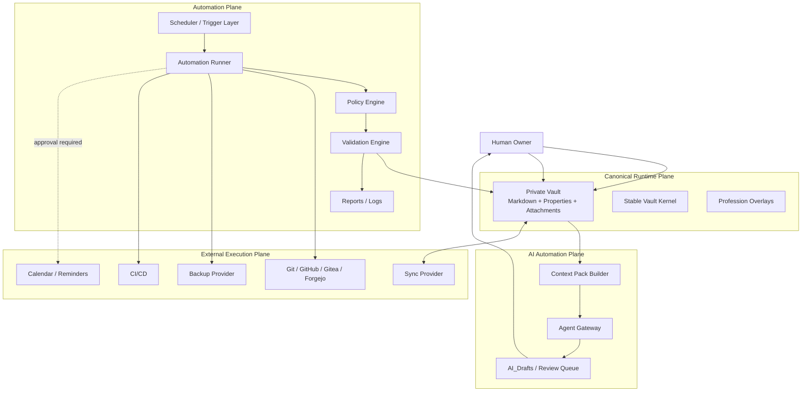

---

## 6. Automation Planes

Life OS defines six automation planes.

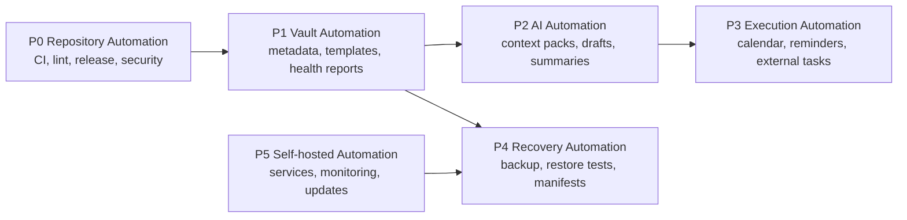

### 6.1 Repository Automation

Repository automation runs in the framework repo.

Typical jobs:

- Markdown lint;
- schema validation;
- template validation;
- Mermaid validation;
- link checks;
- secret scanning;
- forbidden file checks;
- profession-pack validation;
- release checklist validation;
- changelog checks;
- generated documentation checks.

### 6.2 Vault Automation

Vault automation runs on a private user vault.

Typical jobs:

- vault health reports;
- missing metadata detection;
- duplicate candidate detection;
- broken link report;
- orphan attachment report;
- stale project report;
- weekly review packet generation;
- archive candidate report;
- import quarantine triage;
- dashboard data consistency checks.

### 6.3 AI Automation

AI automation runs through Agent Gateway.

Typical jobs:

- context pack generation;
- AI summary draft;
- research synthesis draft;
- meeting preparation draft;
- project next-action proposal;
- schema migration proposal;
- maintenance report explanation;
- profession-pack onboarding guide.

### 6.4 Execution Automation

Execution automation touches external systems.

Examples:

- create calendar event;
- update reminder;
- create issue;
- send email;
- update external task;
- schedule notification.

Execution automation is high-risk and usually requires approval.

### 6.5 Recovery Automation

Recovery automation maintains survivability.

Examples:

- encrypted backup;
- backup manifest generation;
- restore test;
- checksum validation;
- backup retention pruning;
- recovery dashboard.

### 6.6 Self-hosted Automation

Self-hosted automation manages optional infrastructure.

Examples:

- Gitea/Forgejo service checks;
- Nextcloud health checks;
- Syncthing device state checks;
- backup service monitoring;
- certificate renewal alerts;
- uptime checks;
- log rotation.

---

## 7. Automation Action Classes

All automations MUST be classified.

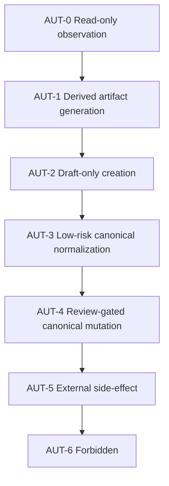

| Class | Name | Default Permission | Human Approval | Examples |
|---|---|---:|---:|---|
| `AUT-0` | Read-only observation | allowed | no | scan notes, report missing metadata |
| `AUT-1` | Derived artifact generation | allowed | no | generate health report, build index |
| `AUT-2` | Draft-only creation | allowed | no or optional | write AI draft, migration proposal |
| `AUT-3` | Low-risk canonical normalization | limited | recommended / configurable | add missing `updated`, normalize tags |
| `AUT-4` | Review-gated canonical mutation | blocked until review | yes | apply schema migration, move notes |
| `AUT-5` | External side-effect | blocked until explicit approval | yes | create calendar event, send email |
| `AUT-6` | Forbidden | never | not sufficient | delete vault, store secrets, move money |

---

## 8. Automation Permission Matrix

| Target | AUT-0 | AUT-1 | AUT-2 | AUT-3 | AUT-4 | AUT-5 | AUT-6 |
|---|---:|---:|---:|---:|---:|---:|---:|
| `00_System/Policies/` | read | report | draft | no | maintainer only | no | never |
| `01_Inbox/` | read | report | write drafts | limited | review | no | never |
| `02_Daily/` | read | report | draft | limited | review | calendar approval | never |
| `10_Areas/` | read | report | draft | limited | review | no | never |
| `20_Projects/` | read | report | draft | limited | review | external approval | never |
| `30_Knowledge/` | read | index | draft | limited | review | no | never |
| `40_Work/` | scoped | scoped | draft | limited | review | approval | never |
| `50_Finance/` | scoped | report | draft | no by default | explicit review | explicit approval | never |
| `60_People/` | scoped | report | draft | no by default | explicit review | explicit approval | never |
| `70_AI/` | read | write logs | write drafts | limited | review | no | never |
| `80_Archive/` | read | report | draft | no | review | no | never |
| `99_Attachments/` | metadata | report | no | no | review | no | never |
| secrets | no | no | no | no | no | no | never |

---

## 9. Automation Lifecycle

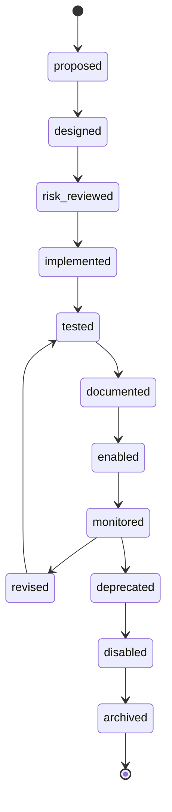

Every production automation MUST have a lifecycle record.

Recommended file:

```text
00_System/Automation/Registry/<automation-id>.md
```

---

## 10. Automation Registry Contract

Every automation MUST be registered before production use.

```yaml
---
id: "automation-vault-health-report"
type: "automation"
title: "Vault Health Report"
status: "active"
class: "AUT-1"
owner: "me"
maintainer:
  - "Life OS Framework maintainers"
trigger:
  type: "scheduled"
  cadence: "weekly"
inputs:
  paths:
    - "00_System/"
    - "10_Areas/"
    - "20_Projects/"
    - "30_Knowledge/"
outputs:
  paths:
    - "00_System/Maintenance/Reports/"
writes_canonical: false
external_side_effects: false
sensitivity_ceiling: "private"
requires_human_approval: false
logs:
  path: "70_AI/Agent_Logs/"
rollback:
  method: "delete derived report"
related_docs:
  - "03_DATA_MODEL.md"
  - "04_SECURITY_MODEL.md"
  - "08_VAULT_STRUCTURE.md"
---
```

Required fields:

- `id`
- `type`
- `title`
- `status`
- `class`
- `owner`
- `trigger`
- `inputs`
- `outputs`
- `writes_canonical`
- `external_side_effects`
- `sensitivity_ceiling`
- `requires_human_approval`
- `logs`
- `rollback`

---

## 11. Trigger Model

Allowed triggers:

| Trigger | Description | Risk |
|---|---|---|
| `manual` | user starts automation | lowest |
| `scheduled` | cron/timer | medium |
| `file-change` | runs when files change | medium/high |
| `git-event` | push/PR/release | medium/high |
| `calendar-event` | calendar-driven | medium/high |
| `external-webhook` | external event | high |
| `agent-request` | AI asks gateway to run | high |
| `bootstrap` | installation/setup | medium |
| `migration` | version upgrade | high |
| `restore` | recovery process | high |

Production rule:

> The more automatic the trigger and the broader the scope, the more restrictive the permissions must be.

---

## 12. Input Trust Model

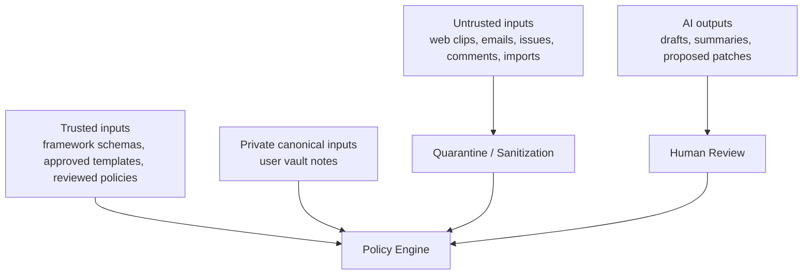

Input classes:

| Class | Examples | Default Handling |
|---|---|---|
| `trusted-framework` | released schemas/templates | validate version |
| `private-canonical` | reviewed notes | scope by sensitivity |
| `private-draft` | AI drafts, inbox notes | review before canonical use |
| `external-untrusted` | web/email/imports/issues | quarantine |
| `generated-derived` | reports/indexes | rebuildable |
| `secret-like` | tokens/keys/passwords | block and alert |

---

## 13. Output Model

Automation outputs must declare whether they are:

| Output Type | Canonical? | Example |
|---|---:|---|
| `report` | no | vault health report |
| `draft` | no | AI summary draft |
| `patch-proposal` | no | migration diff |
| `generated-index` | no | semantic index |
| `dashboard-source` | no | Bases support file |
| `metadata-fix` | yes if applied | normalized frontmatter |
| `note-created` | yes if accepted | new project note |
| `external-action` | external | calendar event, email |
| `backup-artifact` | recovery | encrypted archive |
| `audit-log` | operational canonical | automation log |

Audit logs are operational records and SHOULD be retained according to the retention policy.

---

## 14. Policy Engine

The Policy Engine is the decision layer for automation.

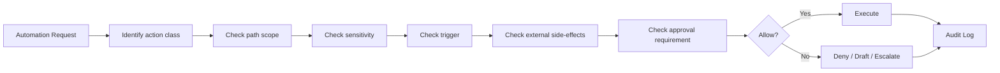

Policy checks:

- class;
- trigger;
- requester;
- input paths;
- output paths;
- sensitivity ceiling;
- external side effects;
- canonical mutation;
- delete operations;
- secret risk;
- AI involvement;
- human approval status;
- rollback availability;
- audit logging.

---

## 15. Canonical Mutation Policy

Canonical mutation means editing, creating, moving, renaming, or deleting files that are part of the canonical vault.

By default:

- `AUT-0` never mutates.
- `AUT-1` never mutates canonical notes.
- `AUT-2` writes drafts only.
- `AUT-3` may mutate limited low-risk fields if enabled.
- `AUT-4` requires human review.
- `AUT-5` requires explicit approval.
- `AUT-6` is forbidden.

Low-risk canonical normalization MAY include:

- adding missing `updated`;
- normalizing known tag casing;
- sorting YAML arrays;
- adding `type` only when path and template make it deterministic;
- formatting whitespace;
- fixing known safe internal link syntax.

Low-risk normalization MUST NOT include:

- changing meaning;
- changing `sensitivity`;
- changing project status;
- marking tasks done;
- changing due dates;
- moving notes across sensitivity zones;
- deleting notes;
- rewriting meeting notes;
- modifying people/finance/health/legal notes without review.

---

## 16. Deletion Policy

Automation MUST NOT delete canonical notes by default.

Allowed deletion-like operations:

| Operation | Allowed? | Requirement |
|---|---:|---|
| delete generated report | yes | derived artifact only |
| delete generated index | yes | rebuildable |
| move canonical note to archive | review | human approval |
| delete duplicate candidate | review | human approval and backup |
| delete orphan attachment | review | human approval and manifest |
| delete backup | restricted | retention policy only |
| delete secrets discovered in repo | emergency | rotate secret first, preserve incident record |
| delete user vault | never | forbidden |

Preferred pattern:

```text
detect → report → human review → archive → backup retention → eventual deletion
```

---

## 17. External Side-Effect Policy

External side effects are high-impact because they change the world outside the vault.

Examples:

- send email;
- send chat message;
- create calendar event;
- modify calendar event;
- create GitHub issue;
- comment on PR;
- create invoice;
- trigger deployment;
- create cloud resource;
- change permissions;
- call external API.

Policy:

- AI MAY draft external actions.
- Automation MAY prepare external action payloads.
- Human MUST approve before execution unless the action is explicitly marked as routine and low-risk.
- Credentials MUST be stored outside the vault.
- External side effects MUST be logged.
- Idempotency SHOULD be implemented.
- Rollback or compensation SHOULD be documented.

---

## 18. Forbidden Automation

The following automation is forbidden in production:

- storing secrets in vault/repo;
- moving money;
- trading financial assets;
- submitting legal documents;
- diagnosing or treating medical conditions;
- sending confidential client data to AI without explicit scoped policy;
- deleting canonical vault data without review;
- mass rewriting vault notes without dry-run and backup;
- changing sensitivity labels downward automatically;
- bypassing Agent Gateway;
- bypassing human review for high-impact AI output;
- running unreviewed scripts from web clips or AI output;
- executing shell commands generated by AI without human inspection;
- pushing personal vault data to shared framework repository;
- training external models on vault data without explicit export and consent;
- disabling backup or security controls silently.

---

## 19. Automation Repository Structure

Recommended framework repo structure:

```text
automations/
├── README.md
├── registry/
│   ├── automation-vault-health-report.md
│   ├── automation-context-pack-builder.md
│   └── automation-schema-validator.md
├── scripts/
│   ├── validate-frontmatter.ts
│   ├── validate-schemas.ts
│   ├── validate-templates.ts
│   ├── validate-links.ts
│   ├── validate-mermaid.ts
│   ├── detect-forbidden-data.ts
│   ├── build-context-pack.ts
│   ├── generate-vault-health-report.ts
│   ├── generate-backup-manifest.ts
│   └── dry-run-migration.ts
├── policies/
│   ├── automation-policy.yaml
│   ├── allowed-write-paths.yaml
│   ├── forbidden-paths.yaml
│   ├── sensitivity-rules.yaml
│   └── ai-action-policy.yaml
├── prompts/
│   ├── summarize-report.md
│   ├── weekly-review-assistant.md
│   ├── migration-review-assistant.md
│   └── profession-pack-reviewer.md
├── configs/
│   ├── markdownlint.json
│   ├── link-checker.json
│   ├── mermaid-config.json
│   └── schema-validation.json
└── tests/
    ├── fixtures/
    ├── automation-policy.test.ts
    ├── frontmatter-validation.test.ts
    ├── context-pack-builder.test.ts
    └── forbidden-data-detection.test.ts
```

---

## 20. Private Vault Automation Structure

Recommended private vault structure:

```text
00_System/
├── Automation/
│   ├── Registry/
│   ├── Policies/
│   ├── Reports/
│   ├── Runbooks/
│   └── Schedules/
├── Maintenance/
│   ├── Reports/
│   ├── Vault Health.md
│   └── Broken Links.md
└── Dashboards/

01_Inbox/
├── Imports/
├── AI_Drafts/
└── Unprocessed/

70_AI/
├── Context_Packs/
├── Agent_Logs/
├── Evaluations/
└── Review_Queue/
```

Rules:

- runtime logs SHOULD remain in private vault;
- framework-level automation code SHOULD remain in framework repo;
- user-specific secrets MUST remain outside both;
- local configuration MAY remain local and uncommitted;
- generated context packs SHOULD be disposable.

---

## 21. Bootstrap Automation

Bootstrap automation helps create a working system from the framework template.

Bootstrap may:

- create folders;
- copy templates;
- copy schemas;
- initialize dashboards;
- create example synthetic notes;
- generate local config files;
- validate installation;
- generate first health report.

Bootstrap must not:

- collect personal data;
- enable external integrations without explicit user action;
- configure secrets in plaintext;
- upload vault data to any provider;
- enable AI write access;
- overwrite existing vault data without backup.

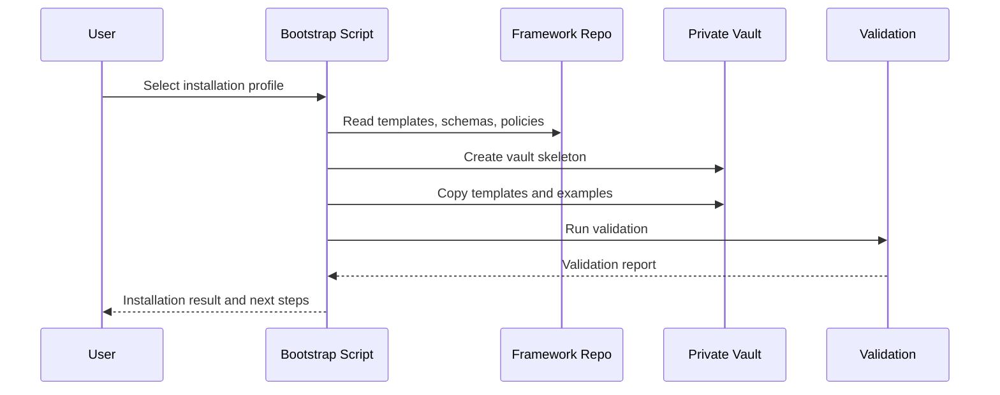

---

## 22. Schema Validation Automation

Schema validation is mandatory for production.

Validation must check:

- required frontmatter fields;
- valid `type`;
- valid `status`;
- valid `sensitivity`;
- valid path/type placement;
- valid date formats;
- valid relation syntax;
- valid context-pack schema;
- valid profession-pack manifest;
- no forbidden properties;
- no invalid sensitivity downgrade;
- no broken reserved field usage.

Validation outputs:

```text
00_System/Maintenance/Reports/schema-validation-YYYY-MM-DD.md
```

CI outputs:

```text
artifacts/schema-validation-report.json
```

---

## 23. Frontmatter Normalization

Frontmatter normalization is useful but dangerous if it changes meaning.

Safe normalization examples:

```yaml
# before
Type: Project
status: Active
tags: [LifeOS, Project]

# after
type: project
status: active
tags:
  - life-os
  - project
```

Rules:

- dry-run by default;
- show diff;
- preserve comments when possible;
- never modify sensitive fields without review;
- never infer private details;
- never downgrade sensitivity;
- never convert ambiguous notes automatically.

---

## 24. Link Validation

Link validation checks:

- broken wikilinks;
- broken Markdown links;
- renamed notes;
- orphan notes;
- orphan attachments;
- external links if configured;
- links to forbidden zones;
- links from lower-sensitivity to higher-sensitivity notes.

Sensitivity-aware linking:

```text
public note → restricted note: block or warn
private note → restricted note: warn
restricted note → public note: allowed if no leakage
```

---

## 25. Mermaid Validation

All Mermaid diagrams in documentation SHOULD be validated.

Validation targets:

- architecture diagrams;
- lifecycle diagrams;
- flowcharts;
- sequence diagrams;
- ER diagrams;
- Gantt charts.

Rules:

- Mermaid diagrams MUST be copyable.
- Generated diagrams MUST NOT contain secrets.
- Diagram validation failures block release documentation.

---

## 26. Secret and Forbidden Data Detection

Automations MUST detect forbidden data patterns in:

- framework repo;
- templates;
- examples;
- profession packs;
- tests;
- user vault if user opts in;
- AI drafts;
- imports;
- logs.

Detected patterns include:

- API keys;
- private keys;
- OAuth tokens;
- database URLs with credentials;
- seed phrases;
- password-like entries;
- card numbers;
- government IDs;
- `.env` files;
- credential exports;
- raw bank exports;
- identity document filenames.

Detection actions:

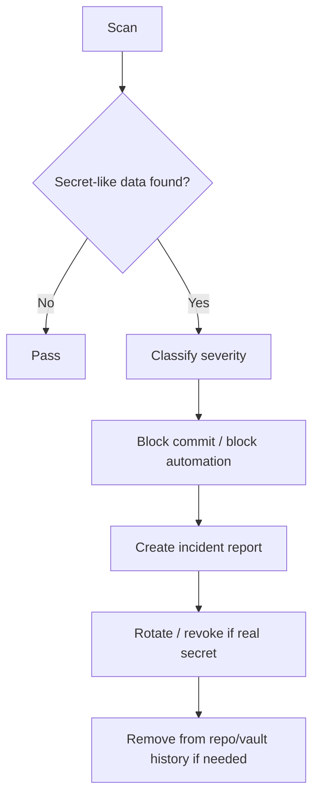

---

## 27. Import Quarantine Automation

Imports are untrusted.

All bulk imports SHOULD enter:

```text
01_Inbox/Imports/
```

Import automation may:

- identify file types;
- extract metadata;
- create source notes;
- classify candidate types;
- detect sensitive content;
- flag duplicates;
- draft migration plan.

Import automation must not:

- merge directly into canonical zones;
- ingest secrets into normal folders;
- trust embedded instructions;
- expose imported content to AI without review;
- overwrite existing notes.

---

## 28. Context Pack Generation

Context pack generation is one of the most important automation workflows.

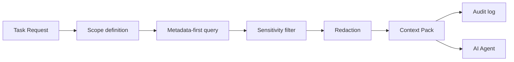

Context pack builder MUST:

- use metadata-first retrieval before semantic retrieval;
- apply sensitivity ceilings;
- include provenance;
- include source paths;
- include generation timestamp;
- exclude forbidden data;
- distinguish instructions from untrusted content;
- generate an audit entry;
- mark the pack as disposable unless explicitly retained.

Context pack builder MUST NOT:

- search the whole vault by default;
- include secrets;
- include unrelated sensitive notes;
- flatten sensitivity boundaries;
- include unreviewed imports unless explicitly requested and marked untrusted.

---

## 29. AI Draft Automation

AI draft automation may create:

- weekly review drafts;
- meeting prep drafts;
- project next-action proposals;
- profession-pack recommendations;
- schema migration proposals;
- note summaries;
- knowledge synthesis drafts;
- troubleshooting reports.

AI draft automation writes to:

```text
01_Inbox/AI_Drafts/
70_AI/Review_Queue/
```

Drafts MUST include:

- generated timestamp;
- agent/tool name;
- context pack ID;
- source references;
- sensitivity level;
- action class;
- review status;
- proposed canonical targets;
- clear warning that draft is not canonical.

---

## 30. Review Queue Automation

The review queue turns automation output into human decisions.

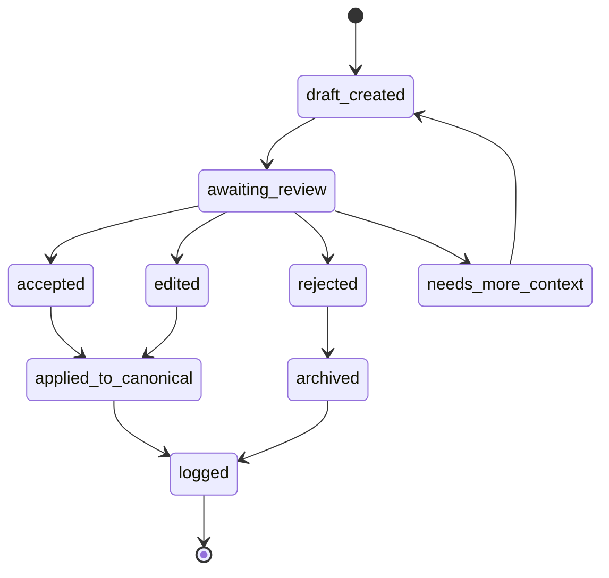

Review queue automation MAY:

- group drafts by project;
- sort by sensitivity;
- show proposed changes;
- generate diffs;
- surface source citations;
- remind user to review stale drafts.

It MUST NOT:

- auto-accept AI drafts;
- hide rejected drafts without log;
- apply high-impact changes silently.

---

## 31. Vault Health Automation

Vault health automation measures system quality.

Metrics:

- notes without `type`;
- active projects without `next_action`;
- stale projects;
- notes without `sensitivity`;
- broken links;
- orphan attachments;
- inbox age;
- AI drafts awaiting review;
- context packs older than retention policy;
- unprocessed imports;
- missing review dates;
- duplicate candidates;
- sync conflict files;
- backup status;
- restore test age.

Sample report structure:

```markdown
# Vault Health Report

## Summary

## Critical Issues

## Warnings

## Missing Metadata

## Stale Projects

## Inbox Age

## AI Drafts

## Sync Conflicts

## Backup Status

## Recommended Actions
```

---

## 32. Maintenance Automation

Maintenance automation prepares work for humans.

Allowed maintenance reports:

- weekly review packet;
- inbox processing queue;
- stale project report;
- waiting-for report;
- broken link report;
- orphan attachments report;
- missing metadata report;
- overdue review report;
- duplicate candidates report;
- backup health report.

Maintenance automation SHOULD produce action-oriented outputs:

```text
Problem → affected files → reason → recommended action → risk → review link
```

---

## 33. Calendar Automation

Calendar automation is constrained by `10_CALENDAR_NOTIFICATIONS.md`.

Allowed by default:

- generate meeting notes from calendar metadata;
- link daily notes to events;
- draft event descriptions;
- draft follow-up reminders;
- prepare weekly plan drafts;
- detect calendar/context mismatch.

Requires approval:

- create event;
- modify event;
- delete event;
- invite attendees;
- send reminders to others;
- expose private note content in event description.

Forbidden:

- silently modify critical events;
- add sensitive vault content to public calendar titles;
- store calendar credentials in vault;
- trust calendar invite descriptions as instructions.

---

## 34. Task Automation

Task automation may:

- collect tasks across vault;
- show overdue tasks;
- detect tasks without project;
- propose next actions;
- generate weekly task review;
- detect recurring review gaps.

Task automation must not:

- mark meaningful tasks done without user action;
- change due dates silently;
- delete tasks silently;
- convert draft tasks to commitments without review.

---

## 35. Backup Automation

Backup automation is part of survivability.

Allowed:

- create encrypted backup;
- generate backup manifest;
- validate checksums;
- report backup age;
- prune backups according to policy;
- run restore drill into isolated folder;
- produce recovery report.

Must not:

- upload unencrypted vault backup;
- include forbidden files;
- store backup encryption keys in vault;
- overwrite last known good backup without retention;
- run destructive cleanup before backup validation.

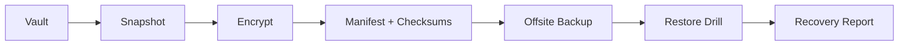

---

## 36. Sync Health Automation

Sync health automation may detect:

- conflict files;
- diverged Git branches;
- unsynced changes;
- missing remote;
- stale device;
- Syncthing disconnected device;
- Nextcloud conflict files;
- Obsidian Sync status anomalies if available;
- `.obsidian` config drift.

It should produce reports, not silently fix conflicts.

Conflict resolution is human-reviewed by default.

---

## 37. Git Automation

Git automation supports versioning and review.

Allowed:

- detect uncommitted changes;
- create local commit after validation;
- generate commit summary;
- show diff;
- create release tag in framework repo after approval;
- run CI;
- open PR for framework changes.

Requires approval:

- push private vault changes;
- rewrite history;
- force push;
- merge PR;
- tag release;
- publish package;
- apply migration to user vault.

Forbidden:

- push secrets;
- push personal data to shared framework repo;
- commit AI drafts as canonical without review;
- run untrusted scripts from issue bodies or PR text.

Recommended GitHub Actions posture:

- minimal `GITHUB_TOKEN` permissions;
- pin third-party actions to commit SHA where practical;
- avoid secrets in pull requests from forks;
- validate all untrusted event inputs;
- separate build/test from privileged release jobs;
- use environment protection for releases;
- scan for secrets and forbidden files.

---

## 38. CI/CD Automation

CI/CD belongs primarily to the framework repo.

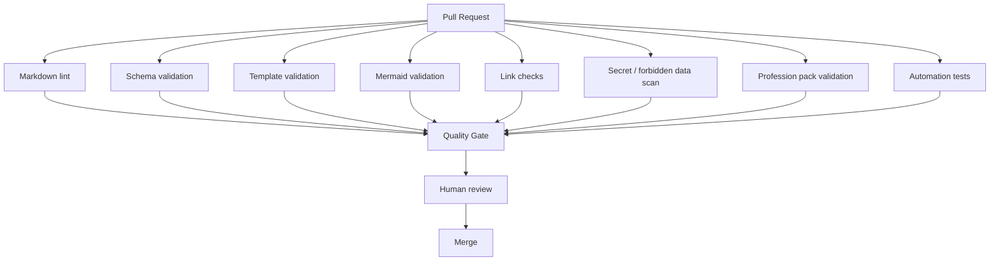

CI MUST fail on:

- invalid schemas;
- templates without required frontmatter;
- forbidden sample data;
- secrets;
- broken required links;
- invalid Mermaid diagrams in production docs;
- invalid profession-pack manifest;
- automation registry mismatch;
- missing changelog entry for release-impacting changes;
- security-policy violations.

---

## 39. CI Workflow Baseline

Recommended workflows:

```text
.github/workflows/
├── validate.yml
├── markdown.yml
├── schemas.yml
├── templates.yml
├── mermaid.yml
├── links.yml
├── secrets.yml
├── profession-packs.yml
├── automation-tests.yml
├── security.yml
└── release.yml
```

Each workflow SHOULD:

- run with least privilege;
- avoid unnecessary write permissions;
- use pinned dependencies where practical;
- avoid leaking secrets in logs;
- avoid running privileged steps on untrusted PR input;
- publish sanitized artifacts only;
- use clear retention periods for artifacts.

---

## 40. Local Automation Runner

A local automation runner may be used for private vault maintenance.

Recommended command pattern:

```bash
lifeos validate --vault ./vault
lifeos health --vault ./vault
lifeos context-pack build --profile weekly-review
lifeos backup manifest --vault ./vault
lifeos migrate dry-run --from 1.0.0 --to 1.1.0
```

Local runner rules:

- dry-run by default for mutations;
- human-readable diffs;
- machine-readable JSON reports;
- no telemetry by default;
- no network access unless explicitly requested;
- no secret storage;
- clear logs.

---

## 41. Network Access Policy

Automations must declare network behavior.

| Network Class | Meaning | Default |
|---|---|---|
| `offline` | no network | preferred |
| `local-only` | localhost / LAN | allowed if scoped |
| `trusted-provider` | GitHub, Obsidian Sync, Nextcloud, etc. | configured |
| `external-api` | third-party API | review |
| `unknown-web` | arbitrary internet | blocked by default |

Network access must be explicit because automation can otherwise become a data exfiltration path.

---

## 42. Local REST / MCP Automation Policy

Local REST and MCP interfaces are powerful and must be gateway-mediated.

Allowed pattern:

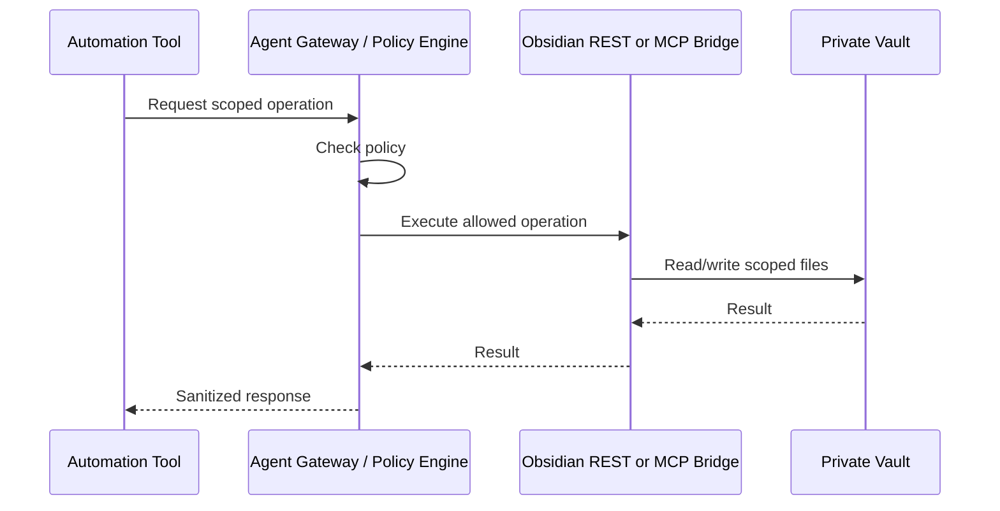

Forbidden pattern:

```text
AI model → raw MCP tool → unrestricted vault write
```

Rules:

- raw tool access MUST NOT be exposed directly to general-purpose AI;
- path scope MUST be enforced before tool call;
- write scope MUST default to draft zones;
- logs MUST be produced;
- dangerous commands MUST be disabled;
- shell execution MUST be prohibited unless explicitly reviewed;
- prompt and content boundaries MUST be separated.

---

## 43. Semantic Index Automation

Semantic index automation is derived-artifact generation.

Allowed:

- build local embeddings;
- build scoped indexes;
- store source path and checksum;
- exclude forbidden zones;
- apply sensitivity filters;
- delete/rebuild index after source deletion.

Must not:

- treat index as canonical;
- retain deleted sensitive content;
- index forbidden data;
- upload embeddings to unapproved providers;
- merge private indexes into framework repo.

Semantic index generation class:

```text
AUT-1 by default
AUT-4 if it modifies canonical metadata
AUT-5 if it sends data to external embedding provider
```

---

## 44. Profession Pack Automation

Profession-pack automation may:

- install pack templates;
- validate pack manifest;
- generate profession dashboards;
- create sample synthetic data;
- map profession types to `40_Work/`;
- validate safety constraints;
- generate onboarding guide.

Must not:

- overwrite user templates without backup;
- import real professional data into examples;
- bypass safety-critical disclaimers;
- downgrade sensitivity for client/patient/legal notes;
- create external actions without approval.

---

## 45. Migration Automation

Migration automation is high risk.

Required phases:

```mermaid
flowchart LR
    Analyze["Analyze current vault"] --> Plan["Generate migration plan"]
    Plan --> DryRun["Dry run"]
    DryRun --> Backup["Backup checkpoint"]
    Backup --> Review["Human review"]
    Review --> Apply["Apply migration"]
    Apply --> Validate["Validate"]
    Validate --> Report["Migration report"]
    Report --> Rollback["Rollback path retained"]
```

Migration automation MUST:

- produce a plan;
- run dry-run first;
- create backup checkpoint;
- show diffs;
- require approval;
- apply changes deterministically;
- generate report;
- preserve rollback.

Migration automation MUST NOT:

- run automatically on sync;
- run from unreviewed AI output;
- delete personal data without explicit approval;
- rewrite sensitive zones without explicit scoped policy.

---

## 46. Release Automation

Framework release automation may:

- validate docs;
- validate schemas;
- package vault-template;
- generate changelog;
- generate migration notes;
- tag release;
- create release artifacts;
- publish release notes.

Release automation requires:

- clean CI;
- changelog entry;
- migration guide updates if schema/structure changed;
- maintainer approval;
- no secrets;
- no personal data;
- source baseline reviewed.

---

## 47. Audit Logging

Every automation run SHOULD generate an audit record.

Audit log fields:

```yaml
---
id: "automation-run-20260519-001"
type: "automation-log"
automation_id: "automation-vault-health-report"
class: "AUT-1"
status: "completed"
started: "2026-05-19T10:00:00+03:00"
finished: "2026-05-19T10:00:05+03:00"
trigger: "scheduled"
actor: "local-runner"
input_paths:
  - "20_Projects/"
output_paths:
  - "00_System/Maintenance/Reports/"
sensitivity_ceiling: "private"
canonical_mutation: false
external_side_effects: false
result: "success"
---
```

Logs SHOULD avoid storing sensitive note content. Store references and summaries, not full private payloads.

---

## 48. Observability

Automation observability includes:

- run history;
- failure count;
- duration;
- changed files;
- skipped files;
- blocked actions;
- approval requests;
- secret/forbidden detections;
- restore test status;
- CI status;
- policy violations.

Recommended dashboard:

```text
00_System/Dashboards/Automation Dashboard.md
```

Dashboard sections:

- Last successful runs;
- Failed runs;
- Pending approvals;
- AI drafts awaiting review;
- Backups and restore tests;
- Sync conflicts;
- Policy violations;
- Upcoming scheduled automations.

---

## 49. Error Handling

Automation errors must be actionable.

Error report fields:

- what failed;
- automation ID;
- class;
- affected files;
- safe current state;
- whether canonical data changed;
- rollback instructions;
- recommended next action;
- whether human review is required;
- log path.

Error anti-patterns:

- silent failure;
- stack trace only;
- partial canonical mutation without report;
- retry loops causing repeated corruption;
- hiding failures inside AI summaries.

---

## 50. Rollback Model

Rollback is mandatory for mutation-capable automation.

Rollback methods:

| Change Type | Rollback Method |
|---|---|
| generated report | delete/regenerate |
| generated context pack | delete/regenerate |
| frontmatter normalization | patch reverse / Git diff |
| file move | move manifest reverse |
| template migration | pre-migration backup |
| profession pack install | install manifest uninstall |
| external calendar action | cancel/revert manually |
| backup pruning | retention policy only |

---

## 51. Security Controls

Minimum automation security controls:

- least privilege;
- scoped paths;
- no plaintext secrets;
- no raw AI-to-tool write access;
- no unrestricted shell execution;
- no untrusted PR secrets;
- no hidden canonical mutation;
- no automatic sensitivity downgrade;
- dry-run for migrations;
- immutable logs where practical;
- backup before bulk changes;
- policy file review;
- dependency scanning;
- pinned actions where practical;
- explicit network policy.

---

## 52. Supply Chain Controls

Automation code is part of the supply chain.

Controls:

- review all automation scripts;
- use dependency lockfiles;
- monitor dependencies;
- minimize dependencies;
- pin CI actions where practical;
- avoid running arbitrary remote installers;
- verify checksums for downloaded tools;
- separate framework examples from user private data;
- run automation tests;
- document supported runtimes.

---

## 53. AI-Assisted Automation Boundaries

AI can be a powerful automation planner, but must not become a hidden executor.

Allowed:

- explain validation reports;
- draft scripts;
- draft migration plans;
- propose context pack scopes;
- classify errors;
- generate review checklists;
- suggest improvements.

Requires human review:

- running AI-generated scripts;
- applying AI-generated patches;
- approving context packs with sensitive data;
- changing policy files;
- enabling external integrations.

Forbidden:

- AI-generated shell command auto-execution;
- AI-generated deletion without review;
- AI-generated credentials handling;
- AI bypassing approval gates;
- AI making financial/legal/medical commitments.

---

## 54. Agentic Workflow Injection Controls

Automation that consumes untrusted text into AI prompts or later scripts must guard against injection.

Risky inputs:

- GitHub issues;
- PR descriptions;
- PR comments;
- calendar descriptions;
- emails;
- web clips;
- imported documents;
- user-shared external notes.

Controls:

- mark untrusted content as data, not instructions;
- quote or delimit untrusted content;
- never pass untrusted content directly into privileged scripts;
- do not let AI output become shell commands without review;
- use taint-like thinking: untrusted input remains untrusted until reviewed;
- strip tool instructions from retrieved content where possible;
- separate analysis from execution.

---

## 55. Scheduler Model

Recommended cadence:

| Automation | Cadence | Class |
|---|---|---|
| vault health report | weekly | AUT-1 |
| missing metadata scan | weekly | AUT-1 |
| broken links scan | weekly | AUT-1 |
| AI draft review reminder | weekly | AUT-1 |
| backup manifest | daily/weekly | AUT-1 |
| restore drill | monthly/quarterly | AUT-1/AUT-4 |
| context pack cleanup | weekly/monthly | AUT-1/AUT-4 |
| schema validation | on change / CI | AUT-1 |
| migration dry run | on release | AUT-2/AUT-4 |
| profession pack validation | on PR/install | AUT-1 |
| release validation | on release | AUT-1/AUT-4 |

No scheduled automation should perform high-impact external actions without approval.

---

## 56. Automation Configuration Model

Recommended policy file:

```yaml
version: "1.0.0"
default_mode: "dry-run"
default_network: "offline"
canonical_mutation_default: "deny"
external_side_effect_default: "deny"

allowed_write_paths:
  - "01_Inbox/AI_Drafts/"
  - "70_AI/Agent_Logs/"
  - "00_System/Maintenance/Reports/"

forbidden_paths:
  - "secrets/"
  - "private-keys/"
  - "raw-bank-exports/"
  - "identity-documents/"
  - "50_Finance/Raw/"
  - "60_People/Restricted/"

sensitivity:
  max_default: "private"
  restricted_requires_approval: true
  sensitivity_downgrade_allowed: false

ai:
  raw_tool_access_allowed: false
  write_default: "draft-only"
  require_context_pack: true
  require_audit_log: true

backup:
  require_checkpoint_before_bulk_mutation: true
  require_restore_test_for_production: true
```

---

## 57. Automation Testing

Automation tests must cover:

- happy path;
- invalid input;
- forbidden paths;
- high sensitivity;
- missing metadata;
- broken links;
- malformed frontmatter;
- invalid schema;
- AI draft output;
- policy denial;
- dry-run mode;
- rollback manifest;
- idempotency;
- external side-effect blocking;
- secret detection.

Test fixtures must be synthetic.

No real personal data in tests.

---

## 58. Idempotency

Automation SHOULD be idempotent when possible.

Idempotent means running it twice does not create duplicate damage.

Examples:

- generating report with timestamp path may create multiple reports intentionally;
- normalizing frontmatter should not change file after first run;
- installing profession pack should detect existing files;
- backup manifest should reference the exact snapshot;
- calendar event drafts should not create duplicate external events.

---

## 59. Dry-Run Mode

Mutation-capable automations MUST support dry-run.

Dry-run output should include:

- files that would change;
- fields that would change;
- before/after diff;
- risk classification;
- required approval;
- rollback plan;
- estimated impact.

Dry-run is mandatory for:

- migrations;
- bulk moves;
- metadata rewrites;
- archive operations;
- profession pack installs;
- sync conflict resolution;
- external action batches.

---

## 60. Approval Model

Approval types:

| Approval | Scope |
|---|---|
| `none` | read-only or derived artifact |
| `review-recommended` | low-risk normalization |
| `explicit-human` | canonical mutation |
| `explicit-high-risk` | finance/people/legal/health/external |
| `maintainer` | framework repo/policy/release |
| `dual-control` | high-sensitivity, destructive, or team-wide change |

Approval record:

```yaml
approval:
  required: true
  approver: "human-owner"
  approved_at: "2026-05-19T12:00:00+03:00"
  scope:
    - "20_Projects/"
  action: "apply migration"
  diff_reviewed: true
```

---

## 61. Automation and Sensitivity

Sensitivity inheritance rules from `03_DATA_MODEL.md` apply.

If an automation reads multiple sources, output sensitivity is:

```text
max(source.sensitivity)
```

Unless redaction is explicitly applied and logged.

Automation MUST NOT lower sensitivity automatically.

If sensitivity is unknown, treat as `sensitive`.

---

## 62. Automation and Provenance

Generated artifacts SHOULD include provenance.

Example:

```yaml
provenance:
  generated_by: "lifeos-context-pack-builder"
  generator_version: "1.0.0"
  generated_at: "2026-05-19T12:00:00+03:00"
  source_query:
    type:
      - "project"
      - "decision"
    project: "life-os-framework"
  source_paths:
    - "20_Projects/Life OS.md"
    - "14_DECISIONS_LOG.md"
  source_checksums:
    - "sha256:..."
```

---

## 63. Automation and Privacy

Privacy rules:

- minimize data in logs;
- avoid copying full sensitive notes into reports;
- use paths and counts where possible;
- redact personal data in shared artifacts;
- keep user-specific reports in private vault;
- never send private vault contents to external APIs without explicit user configuration;
- do not use telemetry by default.

---

## 64. Automation and Calendar Privacy

Calendar automation must avoid leaking private context.

Bad event title:

```text
Therapy session about anxiety and family conflict
```

Better event title:

```text
Private appointment
```

Bad event description:

```text
Full note pasted from 60_People/Private/...
```

Better event description:

```text
Context: see private vault note. Do not paste sensitive content into calendar.
```

---

## 65. Automation and Finance

Finance automation is restricted.

Allowed:

- subscription review report;
- budget category consistency report;
- finance review draft;
- tax checklist reminder draft;
- investment thesis summary draft.

Requires explicit approval:

- export to accountant;
- create payment reminder;
- change financial plan note;
- ingest raw statements.

Forbidden:

- move money;
- trade;
- store bank credentials;
- store seed phrases;
- store full card numbers;
- auto-send tax/legal documents.

---

## 66. Automation and People Data

People data is sensitive.

Allowed:

- follow-up reminder draft;
- meeting prep draft;
- relationship context summary for private use;
- stale contact report.

Requires explicit approval:

- send message;
- share contact details;
- generate public biography;
- export CRM data.

Forbidden:

- expose private person notes to shared repo;
- auto-send sensitive messages;
- infer sensitive attributes without user review.

---

## 67. Automation and Health / Legal / Safety-Critical Work

For healthcare, legal, safety-critical, or regulated professions:

- automation is advisory only unless integrated into approved systems;
- real patient/client/legal records require compliant storage;
- AI outputs must be reviewed by qualified humans;
- action classes are more restrictive;
- audit logs and retention rules are mandatory;
- external sharing requires explicit approval.

---

## 68. Automation and Profession Packs

Each profession pack may define automation recipes.

Recipe file:

```yaml
id: "machinist-weekly-quality-report"
profession_pack: "machinist"
class: "AUT-1"
inputs:
  types:
    - "work-order"
    - "quality-check"
outputs:
  path: "00_System/Maintenance/Reports/"
requires_human_approval: false
safety_critical: true
```

Profession automation MUST declare:

- domain risks;
- safety constraints;
- allowed folders;
- templates used;
- dashboards affected;
- AI rules;
- external systems touched.

---

## 69. Automation Dashboards

Required dashboards:

```text
00_System/Dashboards/Automation Dashboard.md
00_System/Dashboards/System Health.md
00_System/Dashboards/Review Queue.md
00_System/Dashboards/Backup Recovery.md
00_System/Dashboards/Security Alerts.md
```

Automation Dashboard should show:

- run status;
- pending approvals;
- failed jobs;
- next scheduled jobs;
- last backup;
- last restore test;
- blocked security events;
- AI drafts waiting;
- migration status.

---

## 70. Automation Reports

Report naming:

```text
<report-type>-YYYY-MM-DD.md
<report-type>-YYYY-MM-DD-HHmm.md
```

Examples:

```text
vault-health-2026-05-19.md
schema-validation-2026-05-19.md
backup-manifest-2026-05-19.json
restore-test-2026-05-19.md
context-pack-generation-2026-05-19.md
```

Reports should be stored in:

```text
00_System/Maintenance/Reports/
```

AI-related logs:

```text
70_AI/Agent_Logs/
```

---

## 71. Validation Gate Matrix

| Gate | Applies To | Blocks Release? |
|---|---|---:|
| Markdown lint | docs/templates | yes |
| YAML frontmatter parse | docs/templates/vault notes | yes for framework |
| Schema validation | schemas/templates/examples | yes |
| Link validation | docs | yes for required docs |
| Mermaid validation | docs | yes |
| Secret scan | all repo files | yes |
| Forbidden data scan | examples/templates | yes |
| Profession pack validation | packs | yes |
| Automation registry validation | automations | yes |
| Test suite | scripts | yes |
| Security review | policy/script changes | yes |
| Migration guide check | schema changes | yes |

---

## 72. Automation Anti-Patterns

Avoid:

- one giant script that does everything;
- AI with raw file-system write access;
- automatic deletion;
- automatic sensitivity downgrade;
- unscoped semantic search;
- generated artifacts committed as canonical truth;
- workflows with broad write permissions by default;
- secrets in `.env` committed to repo;
- running privileged CI on untrusted PR content;
- mobile sync conflict auto-resolution;
- calendar event creation without approval;
- backup without restore testing;
- hardcoded user paths;
- scripts that require a specific vendor when a generic path is possible;
- hidden telemetry.

---

## 73. Failure Modes and Mitigations

| Failure | Impact | Mitigation |
|---|---|---|
| automation corrupts frontmatter | dashboards break | dry-run, schema tests, backup |
| AI draft applied incorrectly | wrong canonical knowledge | human review, diff, rollback |
| context pack leaks sensitive note | privacy breach | sensitivity ceiling, redaction, audit |
| CI runs with excessive permissions | repo compromise | least privilege, protected branches |
| secret committed | credential leak | secret scanning, rotation playbook |
| sync conflict auto-merged badly | data loss | reports, manual conflict resolution |
| backup job silently fails | no recovery | monitoring, restore drill |
| external calendar event duplicated | missed/duplicated commitment | idempotency keys, approval |
| untrusted import triggers prompt injection | AI/tool abuse | quarantine, prompt isolation |
| profession pack overwrites user template | data loss | install manifest, backup, dry-run |

---

## 74. Production Automation Profiles

### 74.1 Minimal Profile

For non-technical users.

Enabled:

- vault health report;
- backup reminder;
- review queue;
- missing metadata report;
- manual context pack creation.

Disabled by default:

- canonical mutation;
- external side effects;
- AI tool access;
- scheduled migrations.

### 74.2 Developer Profile

Enabled:

- Git validation;
- CI workflows;
- schema checks;
- context pack builder;
- local automation runner;
- backup manifests;
- release checks.

Review-gated:

- migration application;
- external actions;
- AI patch application.

### 74.3 Self-Hosted Profile

Enabled:

- service health checks;
- backup monitoring;
- restore drills;
- sync health;
- certificate expiry alerts;
- disk usage checks.

Review-gated:

- service updates;
- migration;
- permission changes.

### 74.4 High-Sensitivity Profile

Enabled:

- read-only reports;
- strict secret scan;
- local-only processing;
- encrypted backup manifests;
- limited context packs.

Disabled by default:

- external AI APIs;
- broad semantic index;
- external side-effect automation;
- automatic canonical mutation.

---

## 75. Automation Roadmap

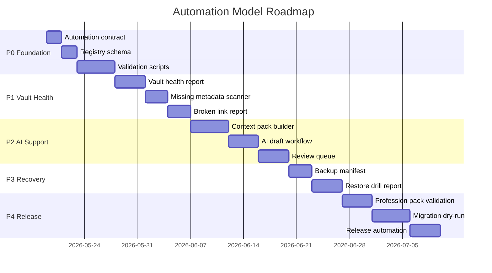

---

## 76. MVP Automation Boundary

For v1.0, implement only:

- schema validation;
- template validation;
- Markdown lint;
- link checks;
- Mermaid checks;
- secret/forbidden data scan;
- profession-pack validation;
- vault health report;
- missing metadata report;
- context pack draft generator;
- backup manifest generator;
- restore test runbook support;
- dry-run migration planner.

Do not implement in v1.0:

- unrestricted AI tools;
- autonomous external action execution;
- automatic deletion;
- automatic finance/legal/health actions;
- broad live semantic indexing of sensitive zones;
- background canonical rewrites;
- fully autonomous multi-agent orchestration.

---

## 77. Production Definition of Done

Automation is production-ready when:

```text
[ ] Every automation is registered.
[ ] Every automation has an action class.
[ ] Every automation has explicit input/output paths.
[ ] Every mutation-capable automation supports dry-run.
[ ] Every canonical mutation is reversible.
[ ] Every external side-effect requires approval unless explicitly routine and low-risk.
[ ] AI has no raw unrestricted tool access.
[ ] Context pack generation enforces sensitivity and provenance.
[ ] Secret/forbidden data scanning runs in CI.
[ ] Framework repo automations run with least privilege.
[ ] Backup and restore automation produces verifiable reports.
[ ] Profession pack automation is validated.
[ ] CI blocks invalid docs, schemas, templates, and packs.
[ ] Logs do not leak sensitive content.
[ ] All high-risk automations have runbooks.
[ ] There are no hidden background authority paths.
```

---

## 78. Production Checklist

Before enabling an automation:

```text
[ ] Purpose is documented.
[ ] Owner is assigned.
[ ] Action class is assigned.
[ ] Risk level is assigned.
[ ] Inputs are scoped.
[ ] Outputs are scoped.
[ ] Sensitivity ceiling is defined.
[ ] External side effects are declared.
[ ] Human approval requirement is defined.
[ ] Dry-run exists if mutation is possible.
[ ] Rollback exists if mutation is possible.
[ ] Logs are configured.
[ ] Tests exist.
[ ] Failure modes are documented.
[ ] Security review is complete.
[ ] Backup checkpoint is required for bulk changes.
[ ] Documentation links are updated.
```

---

## 79. Source Baseline

This automation model is designed to align with:

- `01_PROJECT_BRIEF.md` — strategic purpose and non-goals.
- `14_DECISIONS_LOG.md` — ADR baseline.
- `02_ARCHITECTURE.md` — system architecture.
- `03_DATA_MODEL.md` — canonical data model.
- `04_SECURITY_MODEL.md` — security contract.
- `05_AI_AGENT_MODEL.md` — Agent Gateway and context-pack model.
- `06_SYNC_BACKUP_RECOVERY.md` — recovery and sync boundaries.
- `07_INSTALLATION.md` — installation and onboarding.
- `08_VAULT_STRUCTURE.md` — folder contracts.
- `09_PROFESSION_PACKS.md` — profession overlays.
- `10_CALENDAR_NOTIFICATIONS.md` — execution and notification boundaries.

External baseline:

- Obsidian local vault / Properties / Bases model.
- Obsidian Local REST / MCP bridge capabilities where configured.
- GitHub Actions security and repository governance practices.
- OWASP guidance on prompt injection, AI agents, RAG security, secrets management, and GitHub Actions security.
- NIST AI RMF and NIST CSF-style governance.
- CISA-style recovery guidance emphasizing tested backups.
- Syncthing / Nextcloud conflict and sync behavior.
- Git as versioning/review, not universal live sync.

---

## 80. Final Automation Thesis

The Life OS automation layer must be powerful enough to remove friction and disciplined enough to never steal agency.

The best automation model is not the one that performs the most actions. It is the one that performs the right actions with the right scope, the right evidence, the right review gates, and the right recovery path.

In production, Life OS automation is therefore:

```text
observe → validate → draft → review → apply → log → recover
```

Not:

```text
guess → mutate → hide → hope
```

That distinction is what makes the framework trustworthy, durable, and worthy of becoming the operational foundation for personal knowledge, professional work, and human-AI collaboration.
