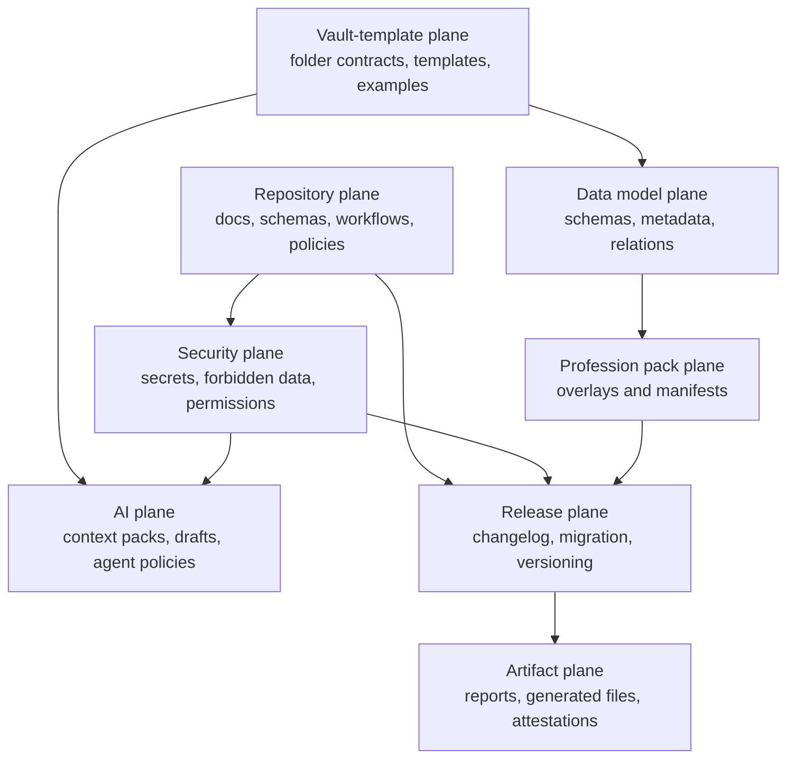
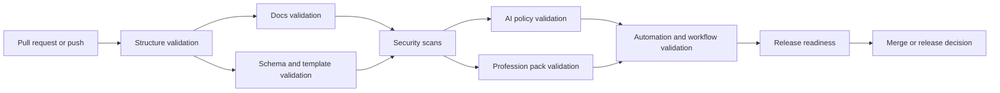
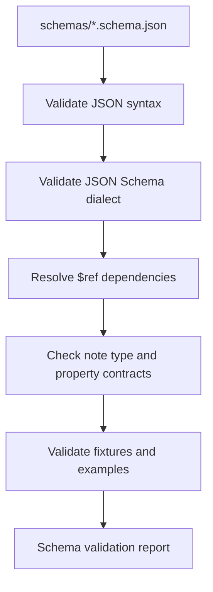
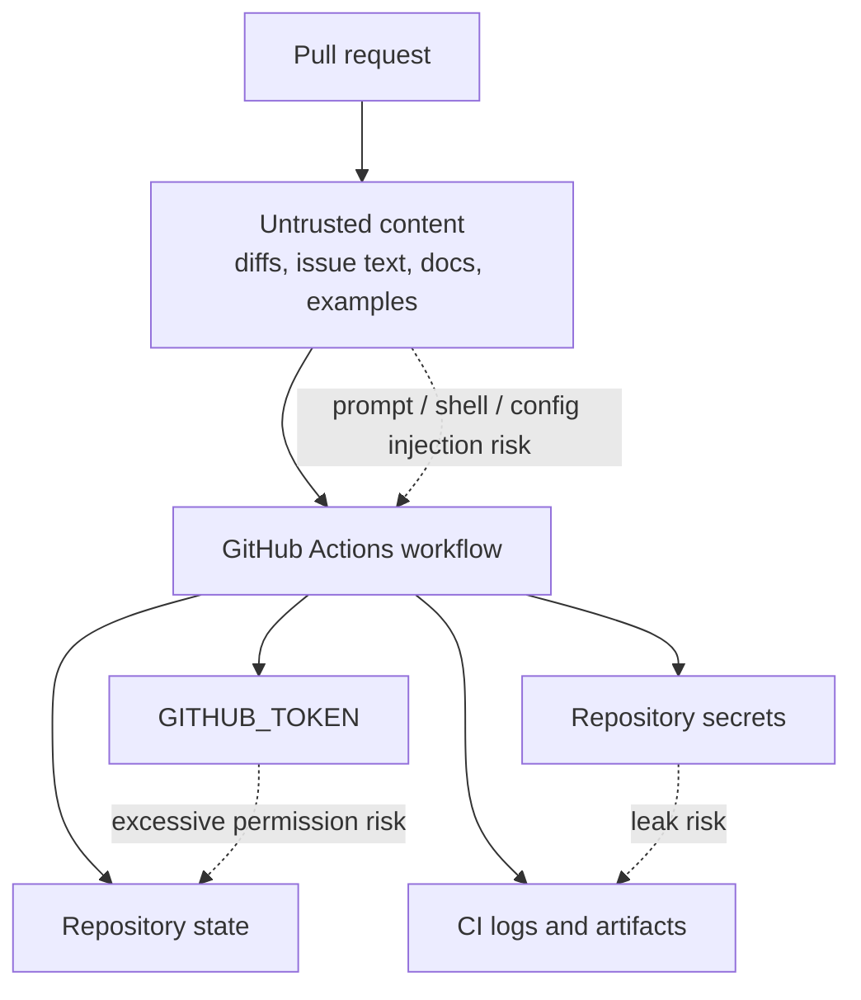
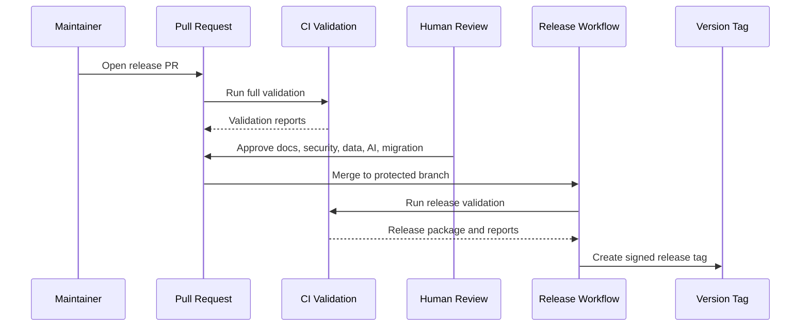
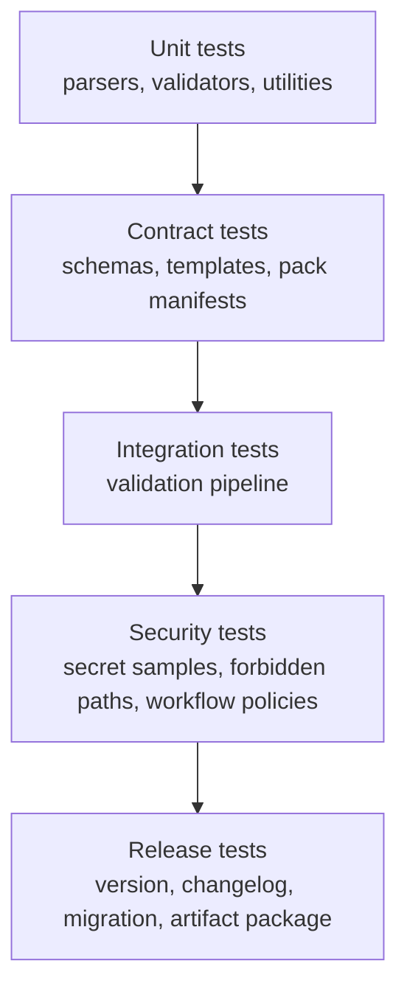

# 12 CI/CD Validation

## 1. Purpose

This document defines the production CI/CD and validation model for the Life OS Framework.
It is the repository quality contract that turns the framework from a collection of Markdown files, schemas, templates, automation scripts, and policies into a continuously verified product.

The purpose of CI/CD in this project is not merely to run tests.
The purpose is to protect the integrity of the framework that other people will use to create private, long-lived operating systems for their lives, work, knowledge, finances, professional practice, and AI collaboration.

Life OS Framework can be marketed as premium only if the engineering discipline behind it is visible, repeatable, and enforceable.
This document defines that discipline.

## 2. North Star

> CI/CD is the production immune system of the Life OS Framework.
> It prevents broken schemas, unsafe examples, weak automation, invalid documentation, unreviewed security changes, and misleading release artifacts from becoming the foundation of other people's private operating systems.

The CI/CD layer MUST ensure that:

1. the framework repository never becomes a personal vault;
2. schemas and templates remain compatible;
3. profession packs extend the stable kernel without breaking it;
4. security policies are continuously enforced;
5. AI-related files remain draft-first, scoped, auditable, and safe by default;
6. generated artifacts are traceable and rebuildable;
7. documentation remains coherent and internally linked;
8. releases are blocked when production-critical contracts are violated;
9. migrations are explicit, reviewed, and reversible where practical;
10. maintainers can trust the repository state before recommending it to users.

## 3. Scope

This document governs validation for:

- root documentation;
- `docs/`;
- `vault-template/`;
- `schemas/`;
- `templates/`;
- `profession-packs/`;
- `policies/`;
- `automations/`;
- `examples/`;
- `tests/`;
- `.github/workflows/`;
- release notes and migration guides;
- generated validation reports;
- optional user-vault validation tooling.

This document does not govern:

- deployment of a centralized SaaS product;
- direct synchronization of private user vaults;
- automated ingestion of real personal data into the framework repository;
- unrestricted AI mutation of canonical vaults;
- production secrets management inside the vault.

Those topics are handled by the architecture, security, AI, sync, and automation contracts.

## 4. Relationship to Other Documents

```mermaid
flowchart TB
    Brief["01_PROJECT_BRIEF.md<br/>vision and success criteria"]
    ADR["14_DECISIONS_LOG.md<br/>accepted decisions"]
    Architecture["02_ARCHITECTURE.md<br/>system architecture"]
    Data["03_DATA_MODEL.md<br/>ontology and schemas"]
    Security["04_SECURITY_MODEL.md<br/>threat model and controls"]
    AI["05_AI_AGENT_MODEL.md<br/>agent and context model"]
    Sync["06_SYNC_BACKUP_RECOVERY.md<br/>recovery requirements"]
    Install["07_INSTALLATION.md<br/>installation gates"]
    Vault["08_VAULT_STRUCTURE.md<br/>folder contracts"]
    Packs["09_PROFESSION_PACKS.md<br/>extension model"]
    Calendar["10_CALENDAR_NOTIFICATIONS.md<br/>execution layer"]
    Automation["11_AUTOMATION_MODEL.md<br/>automation classes"]
    CI["12_CI_CD_VALIDATION.md<br/>quality gates"]

    Brief --> CI
    ADR --> CI
    Architecture --> CI
    Data --> CI
    Security --> CI
    AI --> CI
    Sync --> CI
    Install --> CI
    Vault --> CI
    Packs --> CI
    Calendar --> CI
    Automation --> CI
```



`12_CI_CD_VALIDATION.md` is the enforcement layer for the contracts already defined in the documents above.
It does not replace them.
It turns their requirements into automated, semi-automated, and human-reviewed gates.

## 5. Production Claims Policy

The framework may use premium positioning such as:

- production-grade;
- security-first;
- local-first;
- AI-ready;
- profession-adaptable;
- recovery-aware;
- schema-driven;
- human-owned;
- governance-ready.

The framework MUST NOT claim:

- perfect security;
- guaranteed prevention of data loss;
- guaranteed compliance with all regulations;
- safe storage of secrets in Markdown;
- autonomous AI without human risk;
- universal fit without configuration;
- no maintenance burden;
- complete replacement for professional systems such as EHR, ERP, accounting, legal case management, or regulated industrial systems.

CI/CD exists to make allowed claims defensible.
A claim is defensible only when the repository contains corresponding tests, policy checks, documentation, and maintenance process.

## 6. CI/CD Design Principles

### 6.1 Validate the Framework, Not User Data

The shared repository is a framework/template repository.
CI/CD MUST validate reusable assets, synthetic examples, schemas, templates, policies, scripts, and documentation.
It MUST NOT require access to private user vaults.

Optional user-vault validators MAY be shipped as local tools, but they MUST run under user control and MUST NOT upload private vault data by default.

### 6.2 Fail Closed for Security-Critical Violations

Security-critical violations MUST block merge and release.
Examples:

- detected secret or credential;
- real personal data in examples;
- schema change without migration note;
- AI policy weakening without security review;
- automation that writes to canonical zones without review path;
- unsafe GitHub Actions permission expansion;
- unpinned or untrusted CI action in protected workflows;
- missing `SECURITY.md` or security policy regression.

### 6.3 Prefer Deterministic Validation

Validation SHOULD be deterministic, local-reproducible, and independent of external AI calls.
LLM-based review MAY assist maintainers, but MUST NOT be the sole release-blocking authority.

### 6.4 Validate the Contract, Not Just Syntax

Markdown syntax is not enough.
The CI/CD layer must validate:

- semantic document structure;
- cross-document consistency;
- frontmatter requirements;
- schema compatibility;
- profession pack manifests;
- security zones;
- forbidden data patterns;
- automation action classes;
- migration requirements;
- source and provenance rules;
- release readiness.

### 6.5 Every Gate Has an Owner

Every release-blocking gate MUST have:

- owner;
- purpose;
- severity;
- failure message;
- remediation path;
- local command;
- CI job mapping.

### 6.6 Human Review Remains Required

CI/CD is a guardrail, not the maintainer.
Human review remains mandatory for:

- schema changes;
- security policy changes;
- AI policy changes;
- profession pack additions;
- release approvals;
- migration guides;
- governance changes;
- changes to validators themselves.

## 7. CI/CD Planes



The CI/CD system is divided into planes so failures are understandable.
A schema failure, security failure, AI policy failure, and release failure must not collapse into a generic “build failed” message.

## 8. Repository Events

CI/CD SHOULD run on the following events:

| Event | Purpose | Required gates |
|---|---|---|
| `pull_request` | Validate proposed changes before merge | all blocking validation except release publishing |
| `push` to `main` | Validate merged state | full validation, report artifacts |
| `workflow_dispatch` | Manual validation by maintainers | selected or full validation |
| `schedule` | Drift and dependency checks | security, dependency, link, validator freshness |
| release tag | Release validation | release notes, changelog, migration, artifact package |

Recommended branch strategy:

```text
main        = protected production-ready branch
dev         = optional integration branch for maintainers
feature/*   = individual changes
release/*   = release preparation branches
hotfix/*    = urgent fixes
```

The `main` branch MUST be protected.
Direct pushes to `main` SHOULD be disabled for all non-emergency workflows.

## 9. Validation Severity Levels

| Level | Name | Blocks PR | Blocks release | Examples |
|---|---|---:|---:|---|
| `S0` | informational | no | no | style suggestion, metrics drift |
| `S1` | warning | no | sometimes | optional doc improvement, low-risk broken optional link |
| `S2` | quality blocker | yes | yes | invalid frontmatter, broken required link |
| `S3` | contract blocker | yes | yes | schema/template mismatch, invalid profession pack |
| `S4` | security blocker | yes | yes | secret, forbidden data, unsafe automation |
| `S5` | release blocker | yes | yes | missing migration, changelog, release notes, incompatible version |

Default rule:

```text
S2 and above block merge.
S3 and above block release.
S4 always blocks merge and release.
S5 blocks release and may block merge when the change is release-scoped.
```

## 10. Required CI Jobs

### 10.1 Job Summary

| Job | Blocks PR | Blocks release | Owner |
|---|---:|---:|---|
| repository structure validation | yes | yes | maintainers |
| Markdown lint | yes | yes | docs owners |
| frontmatter validation | yes | yes | data model owners |
| schema validation | yes | yes | data model owners |
| template validation | yes | yes | vault owners |
| profession pack validation | yes | yes | pack owners |
| Mermaid validation | yes | yes | docs owners |
| internal link validation | yes | yes | docs owners |
| forbidden data scan | yes | yes | security owners |
| secret scan | yes | yes | security owners |
| automation policy validation | yes | yes | automation owners |
| workflow security validation | yes | yes | platform owners |
| dependency vulnerability scan | yes | yes | security owners |
| release readiness validation | conditional | yes | release managers |
| migration validation | conditional | yes | migration owners |
| artifact generation | no | yes | release managers |

### 10.2 CI Flow



The order matters.
Security gates should run early enough to stop unsafe changes quickly, but structure and syntax gates should run first to produce readable failures.

## 11. Required Repository Structure Checks

The repository MUST contain:

```text
README.md
SECURITY.md
CONTRIBUTING.md
CHANGELOG.md
ROADMAP.md
docs/
vault-template/
schemas/
templates/
profession-packs/
policies/
automations/
examples/
tests/
.github/workflows/
```

The repository SHOULD contain:

```text
MIGRATION_GUIDE.md
RELEASE_PROCESS.md
GOVERNANCE.md
TROUBLESHOOTING.md
.github/CODEOWNERS
.github/pull_request_template.md
.github/ISSUE_TEMPLATE/
```

The following MUST NOT be present:

```text
.env
.env.*
secrets/
private/
raw-bank-exports/
identity-documents/
real-user-data/
real-client-data/
production-credentials/
*.pem
*.key
*.p12
*.pfx
id_rsa
id_ed25519
```

## 12. Documentation Validation

Documentation validation ensures that the framework remains understandable, navigable, and safe to use.

Required checks:

1. every Markdown file has a top-level heading or frontmatter `title`;
2. required production docs exist;
3. internal links resolve;
4. code fences are balanced;
5. Mermaid diagrams parse;
6. prohibited placeholder markers are absent;
7. claims policy is respected;
8. related-document references exist;
9. status frontmatter uses approved values;
10. no document contradicts accepted ADRs.

Approved document status values:

```yaml
allowed_statuses:
  - draft
  - proposed
  - accepted
  - deprecated
  - superseded
  - archived
```

For production release, P0 documents MUST be `accepted`.

## 13. Markdown Lint Rules

The repository SHOULD use a Markdown linter with a project-specific configuration.
Rules SHOULD enforce consistency without blocking useful technical writing.

Required policy:

```yaml
markdown_policy:
  require_headings: true
  require_language_for_code_fences: true
  allow_long_lines_for:
    - tables
    - URLs
    - Mermaid diagrams
    - YAML examples
  forbid_placeholder_terms:
    - "TODO"
    - "TBD"
    - "FIXME"
    - "PLACEHOLDER"
  require_frontmatter_for:
    - "docs/*.md"
    - "templates/*.md"
    - "profession-packs/**/*.md"
```

The forbidden placeholder terms are blocked because production docs must not contain unresolved commitments.
If a future improvement is needed, it belongs in `ROADMAP.md`, an issue, or a release plan.

## 14. Mermaid Validation

Mermaid diagrams are first-class architecture assets.
They MUST be parseable and copy-ready.

Validation MUST check:

- `flowchart` syntax;
- `sequenceDiagram` syntax;
- `stateDiagram-v2` syntax;
- `erDiagram` syntax;
- `gantt` syntax;
- balanced fences;
- absence of unsupported inline Markdown inside diagram nodes when it breaks rendering.

Mermaid diagrams SHOULD be stored in documentation and MAY also be exported into `docs/diagrams/` when useful.

Failure severity:

| Issue | Severity |
|---|---|
| broken Mermaid fence | S2 |
| diagram parse failure in P0 doc | S2 |
| diagram parse failure in release doc | S5 |
| diagram contradicts text contract | S3 |

## 15. Frontmatter Validation

Every production document SHOULD have frontmatter.
Every template MUST have frontmatter.
Every schema-bound example MUST have frontmatter.

Required document frontmatter:

```yaml
title: ""
description: ""
version: ""
status: "accepted"
owners: []
last_reviewed: "YYYY-MM-DD"
related_documents: []
```

Required note template frontmatter depends on note type but MUST include:

```yaml
id: ""
type: ""
title: ""
status: ""
created: ""
updated: ""
sensitivity: ""
```

Validation MUST fail when a required property is missing from a production template.

## 16. Schema Validation

The `schemas/` directory defines machine-readable contracts for typed notes and framework artifacts.

CI MUST validate:

- every schema is valid JSON Schema;
- schema IDs are unique;
- schema versions are valid semver;
- schema dependencies resolve;
- required properties match `03_DATA_MODEL.md`;
- sensitivity values match `04_SECURITY_MODEL.md`;
- note types match approved ontology;
- profession pack schemas extend rather than overwrite kernel schemas;
- schema examples validate against their schemas.

Schema validation flow:



Schema changes MUST trigger:

- template validation;
- example validation;
- migration requirement check;
- changelog requirement check;
- review by data model owners.

## 17. Template Validation

Templates are the user's first operational interface with the data model.
They MUST be valid, safe, and compatible with schemas.

CI MUST validate:

1. each template has valid frontmatter;
2. each template declares an approved `type`;
3. required schema fields are represented;
4. default sensitivity is safe;
5. templates do not include real personal data;
6. templates do not include secrets or credentials;
7. templates do not weaken AI policy;
8. templates link to valid docs where applicable;
9. templates use stable naming conventions;
10. templates are compatible with relevant profession packs.

Template classes:

| Template class | Examples | Validation strictness |
|---|---|---|
| kernel | project, area, meeting, decision | strict |
| AI | context-pack, ai-agent, ai-draft | strict |
| finance | finance-record, finance-decision | strict |
| profession | work-order, design-brief, ADR | strict with pack manifest |
| example | synthetic demo notes | strict synthetic-data scan |

## 18. Profession Pack Validation

Profession packs are extensions, not forks.
CI MUST enforce the pack contract from `09_PROFESSION_PACKS.md`.

Each pack MUST contain:

```text
profession-packs/<pack-id>/README.md
profession-packs/<pack-id>/pack.yaml
profession-packs/<pack-id>/templates/
profession-packs/<pack-id>/schemas/
profession-packs/<pack-id>/dashboards/
profession-packs/<pack-id>/checklists/
```

`pack.yaml` MUST include:

```yaml
pack_id: ""
name: ""
version: ""
status: "accepted"
profession_domains: []
extends:
  - "kernel"
note_types: []
folders: []
dashboards: []
security_considerations: []
ai_permissions: {}
```

CI MUST verify that:

- `pack_id` is unique;
- note types are namespaced or approved;
- pack schemas validate;
- pack templates validate;
- pack dashboards do not depend on forbidden data;
- pack does not change kernel folder semantics;
- high-sensitivity professions declare safety constraints;
- pack README includes adaptation instructions;
- examples use synthetic data only.

## 19. AI Policy Validation

AI-related validation protects the human-owned model.

CI MUST validate:

- AI policies exist;
- context pack schemas exist;
- AI draft templates exist;
- AI agent templates include permission class;
- AI agents do not default to unrestricted vault access;
- canonical write permissions are not granted by default;
- delete permissions are not granted to AI;
- context packs declare scope, provenance, sensitivity, and expiry;
- AI-visible imports require provenance;
- semantic index config excludes forbidden zones;
- MCP/tool policies use explicit allowlists.

Forbidden AI defaults:

```yaml
forbidden_ai_defaults:
  unrestricted_read: true
  unrestricted_write: true
  delete_access: true
  external_send_without_review: true
  calendar_mutation_without_approval: true
  finance_or_legal_action_without_approval: true
  secret_access: true
```

Any file introducing these defaults MUST fail CI.

## 20. Automation Validation

The automation model defines allowed action classes.
CI MUST validate every automation definition and workflow against those classes.

Automation files MUST declare:

```yaml
automation_id: ""
action_class: "AUT-0"
owner: ""
inputs: []
outputs: []
allowed_paths: []
forbidden_paths: []
requires_human_review: true
external_side_effects: false
audit_log: true
rollback: ""
```

CI MUST fail when:

- action class is missing;
- automation writes to canonical zones without review path;
- automation deletes files without explicit approved policy;
- automation touches forbidden zones;
- automation uses secrets from repository files;
- automation bypasses the Agent Gateway for AI tool access;
- automation emits unredacted sensitive data to CI logs.

## 21. Security Scanning

Security scanning MUST include at minimum:

1. secret scanning;
2. forbidden file detection;
3. forbidden content pattern detection;
4. dependency vulnerability scanning;
5. workflow permission scanning;
6. AI/tool policy scanning;
7. synthetic data validation;
8. suspicious large/binary file detection.

Security scans MUST run on every PR and every push to protected branches.

### 21.1 Secret Patterns

The scanner MUST detect common classes of secrets:

- API keys;
- access tokens;
- private keys;
- SSH keys;
- certificates;
- database URLs;
- cloud credentials;
- webhook secrets;
- OAuth client secrets;
- crypto seed phrase patterns;
- password-like assignments.

If a secret is detected, the PR MUST fail.
Remediation MUST include rotation, removal from Git history where necessary, and incident entry when the secret may be real.

### 21.2 Forbidden Personal Data Patterns

The scanner SHOULD detect likely real personal data in examples:

- real-looking email addresses outside approved fake domains;
- phone numbers;
- government ID patterns;
- full card number patterns;
- bank account patterns;
- addresses;
- realistic patient/client records;
- unredacted logs;
- private calendar data.

Allowed synthetic domains:

```text
example.com
example.org
example.net
invalid.test
person.example
client.example
```

## 22. Synthetic Data Validation

Examples MUST use synthetic data only.

Allowed example names:

```text
Alex Example
Jordan Sample
Taylor Demo
Client Example LLC
Acme Example Studio
Machine Shop Example
```

Examples MUST NOT include:

- real names unless public and intentionally referenced in documentation;
- real client names;
- real medical cases;
- real legal matters;
- real financial account details;
- real identity documents;
- real calendar invitations;
- real AI memory exports.

Synthetic examples SHOULD be useful and realistic enough to teach structure, but obviously not real enough to create privacy risk.

## 23. Workflow Security Validation

GitHub Actions workflows are executable supply-chain assets.
They MUST be validated as code.

CI MUST check:

- workflows use least-privilege `permissions`;
- workflows avoid broad default write permissions;
- third-party actions are approved;
- critical actions are pinned by full commit SHA where practical;
- untrusted PRs do not receive secrets;
- `pull_request_target` is avoided unless explicitly justified;
- shell scripts use safe settings;
- artifacts do not contain secrets;
- caches are not used to persist sensitive data;
- workflow changes require platform/security owner review.

Recommended workflow permissions default:

```yaml
permissions:
  contents: read
```

Jobs that need write permissions MUST declare them explicitly and explain why.

## 24. GitHub Actions Threat Model



Threats include:

- malicious PR modifying workflows;
- malicious Markdown influencing AI-assisted review;
- shell injection through filenames or document content;
- secret exfiltration through logs or artifacts;
- cache poisoning;
- dependency confusion;
- compromised third-party actions;
- overprivileged `GITHUB_TOKEN`;
- false confidence from passing superficial tests.

Mitigations:

- protected branches;
- required reviews;
- CODEOWNERS;
- least-privilege permissions;
- pinned actions;
- no secrets on untrusted PRs;
- separate release workflows;
- explicit artifact retention;
- deterministic validation scripts;
- security owners for workflow changes.

## 25. Branch Protection and Rulesets

The `main` branch MUST enforce:

- pull request required before merge;
- required status checks;
- required approving reviews;
- CODEOWNERS review for protected paths;
- no force push;
- no deletion;
- conversation resolution before merge;
- signed commits where feasible;
- linear history where feasible;
- admin enforcement where feasible.

Protected paths SHOULD include:

```text
.github/workflows/**
schemas/**
templates/**
policies/**
automations/**
profession-packs/**
docs/04_SECURITY_MODEL.md
docs/05_AI_AGENT_MODEL.md
docs/12_CI_CD_VALIDATION.md
SECURITY.md
GOVERNANCE.md
RELEASE_PROCESS.md
```

## 26. CODEOWNERS Policy

Recommended CODEOWNERS mapping:

```text
# Security-critical files
SECURITY.md                         @security-maintainers
policies/security/**                @security-maintainers
docs/04_SECURITY_MODEL.md           @security-maintainers
.github/workflows/**                @platform-maintainers @security-maintainers

# Data model
schemas/**                          @data-model-maintainers
templates/**                        @data-model-maintainers
vault-template/**                   @vault-maintainers

# AI model
policies/ai/**                      @ai-maintainers @security-maintainers
docs/05_AI_AGENT_MODEL.md           @ai-maintainers @security-maintainers
automations/context-packs/**        @ai-maintainers

# Profession packs
profession-packs/**                 @profession-pack-maintainers

# Release and migration
CHANGELOG.md                        @release-managers
MIGRATION_GUIDE.md                  @release-managers
RELEASE_PROCESS.md                  @release-managers
```

Human ownership is part of the validation system.
A CI job can detect technical violations, but domain owners must approve risk-bearing changes.

## 27. Dependency and Supply-Chain Validation

If the repository includes scripts, packages, or automation dependencies, CI MUST validate:

- lockfiles are present;
- dependencies are not known-vulnerable at release time;
- dependency update automation is enabled;
- package scripts are reviewed;
- transitive dependency risk is considered for release tooling;
- license compatibility is checked where required.

Recommended tooling classes:

| Tool class | Purpose |
|---|---|
| dependency scanner | detect vulnerable packages |
| lockfile integrity checker | prevent dependency drift |
| license checker | detect incompatible licenses |
| static analysis | detect code-level vulnerabilities |
| action pin checker | reduce third-party action drift |

## 28. Release Validation

A release MUST NOT be created unless:

- all required CI jobs pass;
- `CHANGELOG.md` contains the release entry;
- `MIGRATION_GUIDE.md` contains upgrade instructions when required;
- all accepted P0 docs are present;
- version numbers are consistent;
- schema changes include migration notes;
- profession pack changes include compatibility notes;
- security-affecting changes have security review;
- release artifacts are generated from source;
- artifacts exclude private data and secrets;
- release notes do not make unsupported claims.

Release flow:



## 29. Versioning Policy

The framework SHOULD use semantic versioning:

```text
MAJOR.MINOR.PATCH
```

Interpretation:

| Version change | Meaning |
|---|---|
| `PATCH` | documentation fixes, non-breaking template improvements, validation fixes |
| `MINOR` | new profession pack, new template, additive schema changes, optional automation |
| `MAJOR` | breaking schema changes, vault kernel changes, policy model changes, migration-required release |

Version metadata MUST be consistent across:

- release tag;
- `CHANGELOG.md`;
- `MIGRATION_GUIDE.md`;
- package metadata when present;
- schema versions;
- profession pack manifests.

## 30. Migration Validation

Changes require migration documentation when they affect:

- vault folder structure;
- note type definitions;
- required frontmatter;
- schema compatibility;
- template names;
- profession pack manifests;
- AI policy scope;
- security zones;
- sync/backup assumptions;
- automation outputs.

Migration validation MUST check:

```yaml
migration_required_when:
  - schemas_changed
  - templates_changed
  - vault_template_changed
  - profession_pack_manifest_changed
  - ai_policy_changed
  - security_zone_changed
  - automation_output_changed
```

If migration is required and no migration note exists, release MUST fail.

## 31. Artifact Policy

CI artifacts MAY include:

- validation reports;
- schema validation summaries;
- link check reports;
- Mermaid render reports;
- security scan summaries without secrets;
- release packages;
- generated docs index;
- test coverage reports for automation scripts.

CI artifacts MUST NOT include:

- private user vault data;
- detected secrets in cleartext;
- real personal data;
- raw sensitive logs;
- unredacted AI prompts containing sensitive content;
- complete untrusted imports.

Artifact retention SHOULD be limited.
Release artifacts SHOULD be reproducible from the repository state.

## 32. Logging and Redaction

CI logs MUST be treated as externally visible within the repository permission boundary.

Validation scripts MUST:

- redact secret-like values;
- avoid printing full file contents on security failures;
- print file path and rule ID rather than sensitive value;
- avoid dumping AI prompts or context packs;
- avoid uploading large raw logs as artifacts;
- include remediation instructions.

Example failure output:

```text
SEC-SECRET-001: Potential secret detected.
File: examples/developer/sample-config.md
Line: 42
Value: redacted
Severity: S4
Remediation: remove the value, rotate if real, and replace with synthetic example.
```

## 33. Local Validation

Maintainers SHOULD be able to run validation locally before pushing.

Recommended commands:

```bash
make validate
make validate-docs
make validate-schemas
make validate-security
make validate-packs
make validate-release
```

Alternative:

```bash
npm run validate
npm run validate:docs
npm run validate:schemas
npm run validate:security
npm run validate:packs
npm run validate:release
```

Local validation MUST use the same core scripts as CI.
CI-only behavior should be limited to event metadata, artifact upload, and permission-specific checks.

## 34. Reference Validation Script Layout

Recommended structure:

```text
automations/scripts/
├── validate-repository-structure.ts
├── validate-markdown.ts
├── validate-frontmatter.ts
├── validate-schemas.ts
├── validate-templates.ts
├── validate-profession-packs.ts
├── validate-mermaid.ts
├── validate-links.ts
├── validate-security.ts
├── validate-ai-policy.ts
├── validate-automations.ts
├── validate-workflows.ts
├── validate-release.ts
├── generate-validation-report.ts
└── lib/
    ├── paths.ts
    ├── frontmatter.ts
    ├── schemas.ts
    ├── severity.ts
    ├── reporting.ts
    └── redaction.ts
```

Scripts SHOULD output both human-readable logs and machine-readable JSON reports.

## 35. Machine-Readable Validation Report

Recommended report format:

```json
{
  "schema_version": "1.0.0",
  "repository": "life-os-framework",
  "commit": "<commit-sha>",
  "generated_at": "2026-05-19T00:00:00Z",
  "status": "failed",
  "summary": {
    "errors": 1,
    "warnings": 2,
    "info": 5
  },
  "findings": [
    {
      "rule_id": "SEC-SECRET-001",
      "severity": "S4",
      "path": "examples/developer/sample-config.md",
      "line": 42,
      "message": "Potential secret detected. Value redacted.",
      "remediation": "Remove value, rotate if real, replace with synthetic data."
    }
  ]
}
```

Reports allow dashboards, release summaries, and audit history without exposing sensitive values.

## 36. Sample GitHub Actions Workflow

Reference workflow:

```yaml
name: Validate Framework

on:
  pull_request:
  push:
    branches:
      - main
  workflow_dispatch:

permissions:
  contents: read

concurrency:
  group: validate-${{ github.ref }}
  cancel-in-progress: true

jobs:
  validate:
    name: Validate framework contracts
    runs-on: ubuntu-latest
    timeout-minutes: 20

    steps:
      - name: Checkout repository
        uses: actions/checkout@v4
        with:
          persist-credentials: false

      - name: Setup Node.js
        uses: actions/setup-node@v4
        with:
          node-version: "22"
          cache: "npm"

      - name: Install dependencies
        run: npm ci

      - name: Validate repository structure
        run: npm run validate:structure

      - name: Validate Markdown
        run: npm run validate:markdown

      - name: Validate frontmatter
        run: npm run validate:frontmatter

      - name: Validate schemas
        run: npm run validate:schemas

      - name: Validate templates
        run: npm run validate:templates

      - name: Validate profession packs
        run: npm run validate:packs

      - name: Validate security policy
        run: npm run validate:security

      - name: Validate AI policy
        run: npm run validate:ai

      - name: Validate automations
        run: npm run validate:automations

      - name: Generate validation report
        if: always()
        run: npm run report:validation

      - name: Upload validation report
        if: always()
        uses: actions/upload-artifact@v4
        with:
          name: validation-report
          path: reports/validation-report.json
          retention-days: 14
```

This workflow is a reference, not the only valid implementation.
The production requirement is the set of gates, not a specific runtime stack.

## 37. Release Workflow Reference

Release workflow SHOULD be separate from PR validation and SHOULD run only from protected branches or signed tags.

```yaml
name: Release Framework

on:
  push:
    tags:
      - "v*.*.*"

permissions:
  contents: write

jobs:
  release-check:
    name: Release readiness
    runs-on: ubuntu-latest
    timeout-minutes: 20

    steps:
      - name: Checkout repository
        uses: actions/checkout@v4
        with:
          persist-credentials: false

      - name: Setup Node.js
        uses: actions/setup-node@v4
        with:
          node-version: "22"
          cache: "npm"

      - name: Install dependencies
        run: npm ci

      - name: Run full validation
        run: npm run validate

      - name: Validate release metadata
        run: npm run validate:release

      - name: Build release package
        run: npm run build:release

      - name: Upload release bundle
        uses: actions/upload-artifact@v4
        with:
          name: life-os-framework-release
          path: dist/
          retention-days: 30
```

Release workflows MUST avoid reading secrets unless required for publishing.
If secrets are required, the workflow MUST be restricted to trusted events only.

## 38. Path-Based Review Requirements

Path-based controls SHOULD enforce appropriate owner review.

| Path | Required review |
|---|---|
| `.github/workflows/**` | platform + security |
| `schemas/**` | data model |
| `templates/**` | data model + vault |
| `policies/security/**` | security |
| `policies/ai/**` | AI + security |
| `automations/**` | automation + security |
| `profession-packs/**` | profession pack owners |
| `docs/04_SECURITY_MODEL.md` | security |
| `docs/05_AI_AGENT_MODEL.md` | AI + security |
| `docs/12_CI_CD_VALIDATION.md` | platform + security |
| `CHANGELOG.md` | release managers |
| `MIGRATION_GUIDE.md` | release + data model |

## 39. Documentation Consistency Checks

CI SHOULD detect cross-document contradictions.

Examples:

- a note type exists in `03_DATA_MODEL.md` but has no schema;
- a profession pack declares a type that is not documented;
- `08_VAULT_STRUCTURE.md` allows a folder/type combination blocked by `03_DATA_MODEL.md`;
- `05_AI_AGENT_MODEL.md` grants an action forbidden by `04_SECURITY_MODEL.md`;
- `10_CALENDAR_NOTIFICATIONS.md` allows AI calendar mutation without approval;
- `11_AUTOMATION_MODEL.md` permits automation deletion contrary to security policy.

Not all contradictions can be detected automatically.
CI SHOULD catch machine-detectable contradictions, while CODEOWNERS review catches semantic contradictions.

## 40. Data Model Gate

The data model gate blocks changes that break canonical data integrity.

Required checks:

- approved note types only;
- required properties present;
- status values valid;
- sensitivity values valid;
- relation fields well-formed;
- provenance fields present where required;
- retention metadata valid where required;
- derived artifact flags correct;
- external reference fields do not store secrets.

Data model gate failure severity:

| Failure | Severity |
|---|---|
| missing required property in kernel template | S3 |
| invalid status value | S3 |
| invalid sensitivity value | S4 |
| missing provenance in import template | S3 |
| secret-like external reference | S4 |

## 41. Security Gate

The security gate is release-critical.

It MUST include:

- secret scanning;
- forbidden data scanning;
- action permission validation;
- workflow event validation;
- policy regression detection;
- synthetic data check;
- dependency vulnerability check;
- risky binary file detection;
- dangerous automation detection;
- AI policy weakening detection.

Security gate pass condition:

```text
No S4 findings.
All security-owned changed files have owner approval.
All high-risk changes include rationale and migration/security impact notes.
```

## 42. AI Gate

The AI gate ensures the framework remains human-owned and review-first.

It MUST validate:

- context-pack schema;
- AI draft lifecycle;
- Agent Gateway policy;
- MCP/tool allowlists;
- no unrestricted default access;
- no direct canonical writes by default;
- no secret zone access;
- no default external side effects;
- no deletion actions;
- audit log fields.

AI gate failure severity:

| Failure | Severity |
|---|---|
| unrestricted read default | S4 |
| unrestricted write default | S4 |
| delete permission default | S4 |
| missing audit log for agent action | S3 |
| missing context pack sensitivity | S4 |
| no human review path for canonical change | S4 |

## 43. Calendar and Notification Gate

CI MUST validate calendar-related templates and policies.

Required checks:

- event note template exists;
- meeting note template exists;
- deadline template exists;
- notification incident template exists;
- AI calendar mutation requires approval;
- calendar credentials are never stored in repo;
- examples use synthetic attendees and calendars;
- provider-specific docs do not imply guaranteed notification delivery.

## 44. Sync / Backup / Recovery Gate

CI MUST validate recovery documentation and scripts.

Required checks:

- backup guide exists;
- restore runbook exists;
- RPO/RTO definitions exist;
- backup exclude file exists if backup scripts exist;
- sync profile docs exist;
- no backup scripts include secrets;
- recovery examples use synthetic paths;
- artifact retention is distinct from backup.

Release MUST fail if backup/recovery docs are absent or contradicted by installation docs.

## 45. Installation Gate

Installation validation checks whether the framework can be adopted safely.

Required checks:

- installation profiles documented;
- preflight checklist exists;
- first-run validation exists;
- backup setup appears before advanced AI setup;
- high-sensitivity profile exists;
- mobile onboarding/offboarding exists;
- uninstall or rollback guidance exists.

## 46. Vault Template Gate

The vault template MUST be validated as runtime structure.

Required top-level folders:

```text
00_System/
01_Inbox/
02_Daily/
10_Areas/
20_Projects/
30_Knowledge/
40_Work/
50_Finance/
60_People/
70_AI/
80_Archive/
99_Attachments/
```

CI MUST verify:

- folder names match the stable kernel;
- required templates exist;
- system policies exist;
- AI draft folder exists;
- example notes are synthetic;
- forbidden zones are not included by default;
- attachment examples use safe dummy files or metadata-only examples.

## 47. Release-Blocking Criteria

A PR or release MUST be blocked when any of the following occur:

1. secret detected;
2. forbidden personal data detected;
3. security policy weakened without approval;
4. AI default permission becomes broader;
5. schema changes without validation;
6. required template missing;
7. profession pack invalid;
8. Mermaid or Markdown failure in P0 docs;
9. workflow permission risk detected;
10. release metadata inconsistent;
11. migration guide required but absent;
12. backup/recovery requirements contradicted;
13. unsupported marketing claim introduced;
14. unresolved S3/S4/S5 findings.

## 48. Warning-Only Criteria

Warnings SHOULD be emitted but not necessarily block merge when:

- optional docs have style inconsistencies;
- optional links fail transiently;
- non-critical examples could be clearer;
- diagram is valid but visually dense;
- profession pack lacks advanced dashboard;
- local validation report coverage decreased but remains above threshold;
- dependency update available but not security-critical.

Warnings MUST be tracked.
Persistent warnings SHOULD be converted into issues.

## 49. CI/CD Dashboard

The repository SHOULD expose a validation summary dashboard.

Dashboard fields:

```yaml
ci_dashboard:
  latest_commit: ""
  latest_validation_status: "pass"
  docs_status: "pass"
  schema_status: "pass"
  security_status: "pass"
  ai_policy_status: "pass"
  profession_pack_status: "pass"
  release_status: "not_release_candidate"
  open_security_findings: 0
  open_schema_findings: 0
  warning_count: 0
  last_restore_doc_review: "YYYY-MM-DD"
```

This dashboard is a derived artifact and MUST be rebuildable.

## 50. Self-Hosted CI

The framework SHOULD support self-hosted CI alternatives such as:

- Gitea Actions;
- Forgejo Actions;
- GitLab CI;
- local `make validate`;
- containerized validation runner.

The CI/CD contract is platform-independent.
GitHub Actions is the reference implementation, not the only allowed implementation.

Self-hosted CI MUST preserve:

- equivalent validation gates;
- secret handling;
- least-privilege runners;
- artifact retention policy;
- security review of workflow changes;
- isolated runners for untrusted contributions where applicable.

## 51. Runner Security

CI runners are part of the attack surface.

Recommended controls:

- use hosted ephemeral runners for untrusted PRs where practical;
- isolate self-hosted runners;
- never expose long-lived secrets to untrusted workflows;
- clear workspace between jobs;
- avoid privileged containers unless required;
- restrict network access for validation jobs where practical;
- do not mount private vaults into public validation runners;
- audit runner configuration changes.

## 52. AI-Assisted CI Review

AI MAY assist CI by:

- summarizing validation findings;
- suggesting remediation;
- reviewing documentation consistency;
- drafting changelog entries;
- classifying warnings;
- proposing migration text.

AI MUST NOT:

- be the sole authority for release approval;
- receive secrets;
- receive full private vaults;
- mutate protected branches directly;
- bypass CODEOWNERS;
- hide or downgrade security findings;
- auto-merge security-sensitive changes.

AI-assisted CI outputs MUST be labeled as suggestions.

## 53. Validation of Generated Files

Generated files MUST include provenance metadata where practical.

Generated artifacts SHOULD state:

```yaml
generated_by: ""
source_commit: ""
generated_at: ""
inputs: []
rebuild_command: ""
```

Generated files MUST NOT become canonical truth unless explicitly approved.

## 54. Path-Specific Rules

### 54.1 `docs/`

Required:

- frontmatter;
- valid headings;
- internal links;
- balanced code fences;
- valid Mermaid;
- no unsupported claims.

### 54.2 `schemas/`

Required:

- valid JSON Schema;
- version;
- unique ID;
- fixtures;
- migration note for breaking changes.

### 54.3 `templates/`

Required:

- frontmatter;
- approved note type;
- required properties;
- safe defaults;
- no real data.

### 54.4 `profession-packs/`

Required:

- manifest;
- README;
- schemas;
- templates;
- dashboards;
- security notes;
- AI policy notes.

### 54.5 `automations/`

Required:

- action class;
- owner;
- permissions;
- input/output contract;
- audit log;
- rollback path.

### 54.6 `.github/workflows/`

Required:

- least privilege;
- no secrets on untrusted PRs;
- safe triggers;
- approved actions;
- CODEOWNERS review.

## 55. Testing Strategy

Testing levels:



Validators MUST have fixtures for:

- valid documents;
- invalid frontmatter;
- invalid schema;
- missing migration;
- fake secret pattern;
- forbidden file path;
- invalid profession pack;
- unsafe AI policy;
- unsafe workflow permission.

## 56. Fixture Policy

Test fixtures MUST be synthetic.

Recommended structure:

```text
tests/fixtures/
├── valid/
├── invalid-frontmatter/
├── invalid-schema/
├── invalid-pack/
├── forbidden-data/
├── unsafe-ai-policy/
├── unsafe-workflow/
└── release-cases/
```

Secret-detection fixtures MUST use clearly fake tokens.
Never commit real revoked secrets as fixtures.

## 57. Required Validation Rules

Rule naming convention:

```text
<DOMAIN>-<CATEGORY>-<NUMBER>
```

Examples:

```text
DOC-FENCE-001
DOC-LINK-001
DATA-TYPE-001
DATA-SENS-001
SEC-SECRET-001
SEC-FORBIDDEN-PATH-001
AI-PERM-001
AI-CONTEXT-001
PACK-MANIFEST-001
AUTO-ACTION-001
REL-MIGRATION-001
WF-PERM-001
```

Every rule MUST include:

- ID;
- title;
- severity;
- description;
- remediation;
- owner;
- local command;
- examples.

## 58. Example Rule Definition

```yaml
rule_id: "AI-PERM-001"
title: "AI agents must not default to unrestricted write access"
severity: "S4"
owner: "ai-maintainers"
paths:
  - "policies/ai/**"
  - "70_AI/**"
  - "templates/ai-agent.md"
description: "AI agents must write only to draft/review zones unless explicit human-approved policy grants a bounded exception."
remediation: "Set default_write_scope to AI_Drafts or review_queue and require human approval for canonical changes."
release_blocking: true
```

## 59. CI/CD Risk Register

| Risk | Impact | Mitigation |
|---|---|---|
| broken schema merged | user vault corruption or invalid templates | schema validation, fixtures, owner review |
| secret committed | credential compromise | secret scanning, push protection, incident process |
| unsafe workflow | repository compromise | least privilege, CODEOWNERS, pinning |
| AI policy weakened | unsafe agent behavior | AI gate, security review |
| examples contain real data | privacy breach | synthetic data validation |
| missing migration | users cannot update safely | migration gate |
| broken docs | installation failure | docs validation, link check |
| validation scripts rot | false confidence | tests for validators, scheduled runs |
| CI becomes too slow | maintainers bypass it | job parallelization, caching, tiered checks |
| overstrict lint | low contributor adoption | severity levels and focused rules |

## 60. Performance Requirements

CI should be fast enough to preserve contributor flow.

Recommended targets:

| Pipeline | Target |
|---|---:|
| local quick validation | under 60 seconds |
| PR validation | under 10 minutes |
| full release validation | under 20 minutes |
| scheduled deep validation | under 30 minutes |

Performance strategies:

- cache dependencies;
- parallelize independent jobs;
- run path-aware checks when safe;
- reserve slow deep checks for scheduled or release workflows;
- avoid network-dependent checks as hard blockers unless release-scoped;
- keep validation scripts deterministic.

## 61. Path-Aware Validation

Path-aware validation MAY reduce runtime but MUST NOT skip security-critical checks.

Examples:

| Changed path | Required checks |
|---|---|
| docs only | docs, links, Mermaid, security scan |
| schemas | schemas, templates, examples, migrations, security scan |
| templates | templates, schemas, vault, security scan |
| profession pack | pack validation, schemas, templates, docs, security scan |
| workflows | workflow security, security scan, platform review |
| policies/security | full validation, security owner review |
| policies/ai | AI gate, security gate, full validation |

Security scan MUST run for every PR regardless of path.

## 62. Network-Dependent Checks

Network-dependent checks can be flaky.

Rules:

- link checking MAY be warning-only for external links on PRs;
- internal link checking MUST be blocking;
- release checks SHOULD include external link verification;
- dependency vulnerability scans MAY require network access and SHOULD fail safely;
- validator updates SHOULD be pinned and reviewed.

## 63. External Link Policy

External links SHOULD be curated and stable.

For production docs, prefer:

- official product documentation;
- standards bodies;
- security organizations;
- peer-reviewed or credible technical research;
- project documentation for tools explicitly used.

External links SHOULD include context in text so the document remains useful if the link changes.

## 64. Compliance Considerations

The framework is not a compliance product by itself.
CI/CD can support compliance posture by maintaining:

- change history;
- review logs;
- security policies;
- validation reports;
- release artifacts;
- migration records;
- source provenance;
- audit-friendly decision records.

For regulated professions, profession packs MUST include compliance caveats and SHOULD direct users to approved systems for regulated records.

## 65. Governance Integration

CI/CD is governed by maintainers, not ad hoc scripts.

Governance MUST define:

- who can change workflows;
- who can approve security exceptions;
- who owns schemas;
- who owns AI policy;
- who approves releases;
- how incidents are handled;
- how compatibility is maintained.

CI/CD configuration changes are architecture changes.
They require review equivalent to code changes.

## 66. Exception Policy

Exceptions MUST be explicit, documented, and time-bounded.

Allowed exception format:

```yaml
exception_id: "EX-2026-001"
rule_id: "DOC-EXT-LINK-001"
reason: "External source is temporarily unavailable during release preparation."
approved_by:
  - "release-manager"
expires: "2026-06-01"
risk_acceptance: "Low. Internal docs remain valid."
```

Exceptions MUST NOT be allowed for:

- real secrets;
- real private data;
- unrestricted AI write access;
- missing security review for security-critical files;
- release without migration for breaking changes.

## 67. CI/CD Anti-Patterns

Forbidden or discouraged patterns:

- treating CI as optional for protected branches;
- using CI to process private user vault data;
- exposing secrets to untrusted PR workflows;
- storing detected secrets in artifacts;
- relying on AI-only validation;
- allowing broad `contents: write` by default;
- using `pull_request_target` without hardened design;
- adding profession packs without schemas;
- adding templates without validation;
- publishing releases without migration notes;
- treating sync history as backup;
- allowing examples with realistic personal data.

## 68. Validation Roadmap

### 68.1 P0: Production Baseline

Required for first production release:

- structure validation;
- Markdown/frontmatter validation;
- schema/template validation;
- profession pack manifest validation;
- secret/forbidden data scan;
- Mermaid validation;
- internal link validation;
- workflow security validation;
- release readiness check.

### 68.2 P1: Strong Governance

- CODEOWNERS automation;
- dependency scanning;
- license scanning;
- generated validation dashboard;
- migration impact detection;
- path-aware validation;
- more synthetic data checks.

### 68.3 P2: Advanced Assurance

- semantic consistency checks;
- local vault validator package;
- SBOM for automation dependencies;
- artifact attestations;
- reproducible release bundles;
- AI-assisted non-blocking review summaries;
- self-hosted CI templates.

### 68.4 P3: Ecosystem Scale

- profession pack marketplace validation;
- third-party pack certification;
- signed packs;
- compatibility matrix;
- federated validation rules;
- enterprise governance profiles.

## 69. Production Definition of Done

CI/CD is production-ready when:

```text
[ ] main branch is protected.
[ ] Required reviews are enabled.
[ ] CODEOWNERS exists for critical paths.
[ ] Required CI jobs block merge.
[ ] Secret and forbidden data scans run on every PR.
[ ] Schemas validate.
[ ] Templates validate against schemas.
[ ] Profession packs validate.
[ ] AI policies validate.
[ ] Automation policies validate.
[ ] Workflows use least privilege.
[ ] Release readiness gate exists.
[ ] Migration gate exists.
[ ] Validation reports are generated.
[ ] Artifacts are redacted and retention-limited.
[ ] Local validation commands exist.
[ ] Documentation explains failures and remediation.
[ ] Synthetic examples are enforced.
[ ] No production release can ship with S3/S4/S5 unresolved findings.
```

## 70. Production Validation Checklist

Before every release:

```text
[ ] Full validation passed on release branch or tag.
[ ] Security gate passed.
[ ] AI gate passed.
[ ] Schema/template compatibility passed.
[ ] Profession pack compatibility passed.
[ ] Installation docs match current repository layout.
[ ] Sync/backup/recovery docs match current architecture.
[ ] Migration guide updated if required.
[ ] Changelog updated.
[ ] Release notes prepared.
[ ] Artifacts contain no secrets or private data.
[ ] CODEOWNERS approvals are present.
[ ] Unsupported claims are absent.
[ ] Release tag/version is consistent.
```

## 71. Minimal MVP CI Configuration

The MVP CI/CD layer MUST include:

```text
- validate repository structure
- validate Markdown fences
- validate frontmatter
- validate schemas
- validate templates
- validate profession pack manifests
- scan for forbidden files
- scan for secret-like content
- validate AI policy defaults
- validate GitHub Actions workflow permissions
- validate release metadata
```

The MVP MUST NOT include:

```text
- AI-only approval
- private user vault upload
- automatic release without human review
- secrets on untrusted PRs
- unrestricted workflow token permissions
```

## 72. Future Extensions

Future versions MAY add:

- signed release artifacts;
- SBOM generation;
- provenance attestations;
- self-hosted CI templates;
- local vault validator CLI;
- semantic consistency engine;
- third-party profession pack certification;
- optional enterprise compliance profiles;
- repository health score;
- AI-assisted review summaries with strict non-authoritative labeling.

These extensions must preserve the core architecture:

```text
human ownership
private canonical vaults
framework-only repository
schema-first validation
draft-first AI
restore-tested recovery
least-privilege automation
```

## 73. Reference Baseline

This CI/CD model is designed to be compatible with the existing project contracts and with established platform/security principles:

- GitHub Actions as the reference CI implementation;
- protected branches and CODEOWNERS as governance controls;
- secret scanning and push protection as secret leak controls;
- CodeQL and dependency monitoring as code/security quality controls;
- deterministic local validation as the contributor baseline;
- OWASP-style least privilege, secrets management, and AI/agent threat awareness;
- NIST-style govern/identify/protect/detect/respond/recover risk thinking;
- CISA-style recovery discipline with tested backup and restoration practices.

The reference baseline is not a promise that any platform makes the framework secure automatically.
It is the set of controls the maintainers must implement, validate, and continuously improve.

## 74. Final Architecture Statement

The Life OS Framework is only as trustworthy as its contracts are enforceable.
`12_CI_CD_VALIDATION.md` makes the framework measurable.
It converts architecture into checks, security principles into gates, data model rules into schemas, AI safety into permissions, profession adaptability into validated packs, and premium positioning into demonstrable engineering practice.

The final production posture is:

```text
framework repo changes are reviewed;
contracts are validated;
schemas and templates are compatible;
examples are synthetic;
security gates block unsafe changes;
AI remains scoped and draft-first;
releases include migration paths;
private user data never enters shared CI;
and every release can be trusted as a stable foundation for private Life OS instances.
```
