# 13 Roadmap

## 1. Purpose

This document defines the production roadmap for the Life OS Framework.

It is not a wishlist.
It is the delivery contract that connects the strategic vision, architecture, data model, security model, AI model, sync and recovery model, installation model, vault structure, profession pack model, calendar model, automation model, CI/CD model, and decision log into a staged implementation plan.

The purpose of this roadmap is to make the framework buildable, reviewable, releasable, maintainable, and trustworthy.

Life OS Framework is an opinionated production-grade reference architecture for building a private, local-first, AI-augmented personal operating system. The roadmap exists to turn that architecture into a working repository, a repeatable vault template, validated schemas, safe automation, profession-specific overlays, installation profiles, and long-term governance.

## 2. North Star

> Build the safest, most durable, most adaptable, and most human-owned operating system framework for personal knowledge, work, calendar context, professional practice, and AI collaboration.

The roadmap is driven by maturity gates, not by hype.
A release is ready only when it satisfies its engineering, security, documentation, validation, migration, and user-operability criteria.

The premium value of Life OS Framework must come from:

- architectural clarity;
- local-first ownership;
- security-by-design;
- schema-first structure;
- explicit human authority over AI;
- tested backup and recovery;
- profession-level adaptability;
- maintainable releases;
- honest documentation;
- reproducible installation;
- validated repository quality.

The roadmap must never depend on exaggerated claims, fake autonomy, or pretending that a tool is safer or more capable than it actually is.

## 3. Roadmap Philosophy

The Life OS Framework roadmap follows seven delivery principles.

### 3.1 Criteria Before Calendar

Dates are planning aids.
Release quality is determined by gates.

A release cannot ship just because a date has arrived.
A release ships when the required contracts are complete, validation passes, migration notes exist, security checks pass, and the maintainers can explain exactly what a user can safely rely on.

### 3.2 Documentation Before Automation

Automation without documentation becomes invisible complexity.
AI automation without documentation becomes risk.

The framework therefore documents architecture, decisions, data contracts, security boundaries, and operating procedures before expanding automation.

### 3.3 Safety Before Power

The project should prefer a safe draft-first AI capability over an unsafe fully autonomous workflow.
It should prefer explicit context packs over vault-wide retrieval.
It should prefer manual review over irreversible mutation.
It should prefer tested restore over optimistic sync.

### 3.4 Kernel Before Overlays

The stable vault kernel must be defined before profession packs scale.
Profession packs extend the kernel; they must not fork it.

### 3.5 Validation Before Distribution

Every release must pass validation for:

- Markdown;
- frontmatter;
- Mermaid;
- schema structure;
- templates;
- profession packs;
- security policy;
- automation policy;
- forbidden files;
- synthetic examples;
- migration guidance;
- release metadata.

### 3.6 Migration Before Version Growth

Because users create private vaults from a framework/template repository, upgrades are not automatic merges.
Each meaningful release must include migration guidance.

### 3.7 Human Ownership Before Agent Autonomy

AI is a collaborator and amplifier.
It is not the owner of the vault, calendar, finances, relationships, work commitments, or security posture.

## 4. Scope

This roadmap covers the staged delivery of:

- repository structure;
- documentation set;
- vault template;
- schemas;
- note templates;
- policies;
- automation scripts;
- CI/CD validation;
- installation profiles;
- sync and backup profiles;
- profession packs;
- AI context pack system;
- AI draft and review workflows;
- Agent Gateway reference model;
- migration guides;
- governance;
- release process;
- examples;
- future self-hosted and semantic index layers.

## 5. Non-Goals

This roadmap does not commit the project to:

- replacing Obsidian with a custom application;
- building a monolithic hosted SaaS;
- storing user private data in the framework repository;
- giving AI unrestricted write or delete access;
- replacing calendars or reminder systems;
- replacing password managers or secret managers;
- promising perfect security;
- promising perfect automation;
- supporting every third-party plugin equally;
- providing legal, medical, financial, or compliance guarantees;
- forcing all users into one sync provider;
- requiring cloud infrastructure for all users.

## 6. Roadmap Operating Model

The roadmap is organized into maturity phases.

```mermaid
flowchart LR
    F0["F0\nFoundation docs"] --> F1["F1\nRepository skeleton"]
    F1 --> F2["F2\nVault template"]
    F2 --> F3["F3\nSchemas and templates"]
    F3 --> F4["F4\nSecurity and recovery"]
    F4 --> F5["F5\nCI validation"]
    F5 --> F6["F6\nInstallation profiles"]
    F6 --> F7["F7\nProfession packs"]
    F7 --> F8["F8\nAI draft workflows"]
    F8 --> F9["F9\nBeta release"]
    F9 --> F10["F10\nProduction v1.0"]
    F10 --> F11["F11\nPost-v1 evolution"]
```

Each phase has:

- objective;
- inputs;
- outputs;
- release gates;
- blockers;
- validation requirements;
- migration impact;
- security review requirements.

## 7. Release Maturity Levels

| Level | Name | Meaning |
|---|---|---|
| `M0` | Concept | Idea is documented but not structured. |
| `M1` | Contracted | Architecture and decisions are defined. |
| `M2` | Scaffolding | Repository and vault skeleton exist. |
| `M3` | Validated | Schemas, templates, docs, and policies pass CI. |
| `M4` | Installable | A new user can install a working vault from the repo. |
| `M5` | Recoverable | Backup and restore are documented and tested. |
| `M6` | Profession-ready | Initial profession packs work without breaking kernel. |
| `M7` | AI-safe | AI workflows operate through scoped context and drafts. |
| `M8` | Beta | Real users can run the system with known limitations. |
| `M9` | Production | v1.0 release criteria are satisfied. |
| `M10` | Ecosystem | Extensions, local LLM, MCP, semantic index, and advanced self-hosting mature. |

## 8. Current Baseline

As of this roadmap revision, the production contract set includes:

- project brief;
- decision log;
- architecture contract;
- data model contract;
- security model contract;
- AI agent model contract;
- sync, backup, and recovery contract;
- installation runbook;
- vault structure contract;
- profession pack contract;
- calendar and notification contract;
- automation model contract;
- CI/CD validation contract.

This roadmap assumes those documents define the current intended architecture and must remain internally consistent.

## 9. Remaining Production Documentation

The following repository documents still need to be completed for a full production-grade release family.

| Document | Priority | Purpose |
|---|---:|---|
| `README.md` | P0 | Public entry point, quickstart, value proposition, architecture summary. |
| `CONTRIBUTING.md` | P1 | Contribution rules, PR process, review expectations. |
| `SECURITY.md` | P1 | Vulnerability reporting, forbidden data, secret leak response. |
| `CHANGELOG.md` | P1 | Version history and user-facing change tracking. |
| `MIGRATION_GUIDE.md` | P1 | Safe upgrade path between framework versions. |
| `RELEASE_PROCESS.md` | P1 | Release branches, tags, checks, approvals, compatibility notes. |
| `GOVERNANCE.md` | P1 | Maintainer roles, CODEOWNERS, decision rules, change authority. |
| `TROUBLESHOOTING.md` | P1 | Operational diagnosis for sync, plugins, Git, backup, AI, CI. |
| `LOCAL_LLM.md` | P2 | Local model usage, privacy, hardware, limitations. |
| `MCP_INTEGRATION.md` | P2 | MCP threat model, tools, approval boundaries. |
| `SEMANTIC_INDEX.md` | P2 | RAG and vector index architecture. |
| `SELF_HOSTED_REFERENCE_STACK.md` | P2 | Gitea, Forgejo, Nextcloud, Syncthing, backups, monitoring. |
| `EXAMPLES.md` | P2 | Example vaults, profession examples, synthetic workflows. |

## 10. Roadmap Dependency Graph

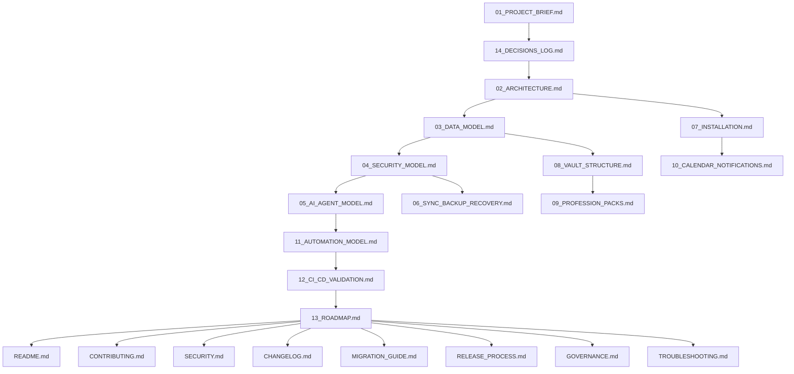

## 11. Release Train Overview

The roadmap uses semantic versions for framework releases.

```text
v0.x = pre-production framework construction
v1.x = production baseline and stable evolution
v2.x = advanced AI, semantic index, and self-hosted runtime maturity
v3.x = local-first intelligent runtime and multi-vault federation
v4.x = ecosystem, marketplace-quality packs, and enterprise-grade governance patterns
```

The project must avoid version inflation.
A release version should communicate real user impact, not merely internal progress.

## 12. Phase F0 — Foundation Contracts

### Objective

Create the core documentation contracts that define what the system is, why it exists, how it is structured, what it forbids, and how it preserves human ownership.

### Inputs

- project vision;
- architecture decisions;
- security principles;
- data model needs;
- AI collaboration requirements;
- sync and recovery requirements;
- profession adaptability requirements.

### Outputs

- `01_PROJECT_BRIEF.md`;
- `14_DECISIONS_LOG.md`;
- `02_ARCHITECTURE.md`;
- `03_DATA_MODEL.md`;
- `04_SECURITY_MODEL.md`;
- `05_AI_AGENT_MODEL.md`;
- `06_SYNC_BACKUP_RECOVERY.md`;
- `07_INSTALLATION.md`;
- `08_VAULT_STRUCTURE.md`;
- `09_PROFESSION_PACKS.md`;
- `10_CALENDAR_NOTIFICATIONS.md`;
- `11_AUTOMATION_MODEL.md`;
- `12_CI_CD_VALIDATION.md`;
- `13_ROADMAP.md`.

### Release Gate

F0 is complete when:

- all core documents exist;
- documents have frontmatter;
- documents have balanced Markdown fences;
- documents contain no unresolved editorial markers;
- documents cross-reference each other correctly;
- documents do not contradict the ADR baseline;
- premium positioning remains truthful.

### Risks

| Risk | Mitigation |
|---|---|
| Documentation becomes aspirational rather than actionable. | Use MUST/SHOULD/MAY language and Definition of Done sections. |
| Documents repeat each other instead of forming a system. | Assign each document a distinct contract role. |
| Marketing language weakens trust. | Separate positioning from guarantees. |
| Architecture drifts while writing docs. | Require ADR updates for fundamental changes. |

## 13. Phase F1 — Repository Skeleton

### Objective

Create the framework repository structure that can host all future production assets.

### Required Structure

```text
life-os-framework/
├── README.md
├── SECURITY.md
├── CONTRIBUTING.md
├── CHANGELOG.md
├── ROADMAP.md
├── docs/
├── vault-template/
├── schemas/
├── templates/
├── profession-packs/
├── policies/
├── automations/
├── examples/
├── tests/
└── .github/
```

### Outputs

- repository initialized;
- branch protection plan documented;
- CODEOWNERS drafted;
- basic folder structure created;
- initial `docs/` content copied;
- initial empty package manifests or tool configs added only if needed;
- synthetic example policy created.

### Release Gate

F1 is complete when:

- repository structure matches the architecture;
- no private user data exists in the repository;
- no secrets exist in the repository;
- required root files exist;
- top-level folders include README-style purpose notes or equivalent;
- repository can be cloned and inspected without external services.

## 14. Phase F2 — Vault Template MVP

### Objective

Create a minimal but correct private vault template that implements the stable kernel.

### Required Vault Kernel

```text
vault-template/
├── 00_System/
├── 01_Inbox/
├── 02_Daily/
├── 10_Areas/
├── 20_Projects/
├── 30_Knowledge/
├── 40_Work/
├── 50_Finance/
├── 60_People/
├── 70_AI/
├── 80_Archive/
└── 99_Attachments/
```

### Outputs

- `vault-template/` folder exists;
- default dashboards exist;
- default daily/weekly/monthly templates exist;
- AI draft and log zones exist;
- import quarantine zone exists;
- attachment structure exists;
- folder-level contracts are included;
- default `.gitignore` and exclude patterns are provided for private vault use.

### Release Gate

F2 is complete when:

- a user can open `vault-template/` as an Obsidian vault;
- required folder contracts are present;
- no real personal data exists;
- synthetic notes pass validation;
- hidden folder handling is documented;
- AI write zones are present and separated from canonical zones.

## 15. Phase F3 — Schemas and Templates

### Objective

Implement the schema-first data model.

### Required Schema Families

- universal note;
- area;
- project;
- task;
- person;
- meeting;
- decision;
- resource;
- asset;
- client;
- work-order;
- finance-record;
- finance-decision;
- daily-note;
- weekly-review;
- monthly-review;
- ai-agent;
- context-pack;
- ai-draft;
- agent-log;
- profession-pack manifest.

### Outputs

- JSON schemas or equivalent validation schemas;
- Markdown templates;
- template-to-schema mapping;
- controlled vocabularies;
- ID conventions;
- sensitivity mapping;
- relation rules;
- sample valid notes;
- sample invalid fixtures for validation testing.

### Release Gate

F3 is complete when:

- every required note type has a schema;
- every schema has a matching template where useful;
- each template contains frontmatter;
- controlled vocabularies are documented;
- fixture validation runs locally and in CI;
- schema changes require migration notes.

## 16. Phase F4 — Security and Recovery Hardening

### Objective

Make security and recoverability operational rather than aspirational.

### Outputs

- `SECURITY.md`;
- forbidden data scanner;
- security zone examples;
- secret handling policy;
- AI security policy files;
- backup exclude patterns;
- restore runbook;
- incident response runbook;
- high-sensitivity profile;
- self-hosted security notes.

### Release Gate

F4 is complete when:

- forbidden data policy is enforceable by CI where feasible;
- secret scanning is enabled in supported repository environments;
- backup and restore instructions are executable by a real user;
- at least one restore drill scenario is documented step-by-step;
- AI write permissions are draft-only by default;
- security issue reporting is documented.

## 17. Phase F5 — CI/CD Validation

### Objective

Build the repository immune system.

### Required Jobs

- repository structure validation;
- Markdown validation;
- frontmatter validation;
- schema validation;
- template validation;
- profession pack validation;
- Mermaid validation;
- forbidden file validation;
- secret scanning integration;
- automation policy validation;
- link validation;
- release metadata validation.

### Outputs

- `.github/workflows/validate.yml`;
- local validation script;
- validation fixtures;
- validation report artifacts;
- branch protection recommendations;
- path-aware review rules;
- quality gate documentation.

### Release Gate

F5 is complete when:

- CI runs on pull requests;
- release-blocking criteria are enforced;
- validation can run locally;
- generated artifacts contain no private data;
- CI failures are actionable;
- maintainers know which failures block merge.

## 18. Phase F6 — Installation Profiles

### Objective

Make the system installable by real users with different technical needs.

### Required Profiles

- `personal-simple`;
- `developer-hybrid`;
- `self-hosted-nextcloud`;
- `self-hosted-syncthing`;
- `team-template`;
- `high-sensitivity`;
- `mobile-first`.

### Outputs

- profile-specific installation paths;
- preflight checklists;
- sync strategy decision tree;
- backup setup instructions;
- initial weekly review process;
- device onboarding;
- device offboarding;
- first restore test;
- first profession pack installation.

### Release Gate

F6 is complete when:

- each profile has a deterministic setup path;
- each profile includes security checks;
- each profile includes backup and restore checks;
- each profile defines when AI is disabled, draft-only, or allowed through gateway;
- first-run validation can be completed by a user.

## 19. Phase F7 — Profession Packs Alpha

### Objective

Prove that the framework adapts to real professions without forking the core kernel.

### Required Alpha Packs

- developer;
- designer;
- machinist or craftsperson;
- teacher;
- researcher;
- founder or operator;
- consultant;
- student;
- writer or creator.

### Extended Packs

- healthcare study;
- lawyer or legal;
- finance;
- artist or creative;
- custom profession template.

### Outputs

Each profession pack must include:

- `pack.yaml`;
- pack README;
- type extensions;
- templates;
- dashboard definitions;
- checklists;
- quality criteria;
- AI context rules;
- security constraints;
- synthetic examples;
- migration notes.

### Release Gate

F7 is complete when:

- profession packs pass validation;
- packs do not modify the stable kernel;
- packs use synthetic data only;
- packs define safety boundaries;
- packs include dashboard and review guidance;
- packs can be installed and removed without corrupting the base vault.

## 20. Phase F8 — Safe AI Draft Workflows

### Objective

Deliver meaningful AI collaboration without unsafe autonomy.

### Required Capabilities

- context pack templates;
- context pack generator specification;
- AI draft folder and lifecycle;
- review queue workflow;
- agent log contract;
- policy examples;
- AI prompt templates;
- redaction guidance;
- semantic index readiness;
- MCP boundary guidance;
- explicit approval workflow for high-impact actions.

### Release Gate

F8 is complete when:

- AI can assist through scoped context packs;
- AI outputs go to draft/review zones;
- canonical mutation requires human review;
- AI cannot write to forbidden zones through the reference workflow;
- agent logs preserve provenance;
- prompt injection and RAG poisoning mitigations are documented;
- examples demonstrate safe and unsafe patterns.

## 21. Phase F9 — Beta Release

### Objective

Release the framework to a limited group of users who can test real workflows.

### Beta Criteria

- repository structure complete;
- core docs complete;
- vault template installable;
- schemas and templates validated;
- at least five profession packs usable;
- installation profiles tested;
- backup and restore process tested;
- CI passes;
- migration guide exists;
- known limitations documented.

### Beta User Profiles

Beta should include:

- a non-technical personal user;
- a developer;
- a designer or creator;
- a self-hosted user;
- a high-sensitivity user;
- a profession-pack user outside knowledge work, such as machinist, craftsperson, or operator.

### Beta Success Criteria

| Area | Success Signal |
|---|---|
| Installability | User can create vault without maintainer intervention. |
| Understandability | User can explain canonical vs derived data. |
| Safety | User does not put secrets in vault after reading docs. |
| AI workflow | User understands draft/review model. |
| Recovery | User completes at least one restore test. |
| Profession fit | User adapts pack without modifying kernel. |
| Maintenance | User completes first weekly review. |

## 22. Phase F10 — Production v1.0

### Objective

Ship the first production-grade release.

### v1.0 Required Assets

- `README.md`;
- `SECURITY.md`;
- `CONTRIBUTING.md`;
- `CHANGELOG.md`;
- `MIGRATION_GUIDE.md`;
- `RELEASE_PROCESS.md`;
- `GOVERNANCE.md`;
- `TROUBLESHOOTING.md`;
- `docs/` core set;
- `vault-template/`;
- `schemas/`;
- `templates/`;
- `profession-packs/`;
- `policies/`;
- `automations/`;
- `examples/`;
- `tests/`;
- `.github/workflows/`.

### v1.0 Release Gate

v1.0 may ship only when:

- CI passes;
- branch protection is documented;
- CODEOWNERS exists;
- forbidden data checks pass;
- schema validation passes;
- profession pack validation passes;
- installation profiles are tested;
- backup and restore runbooks are tested;
- AI draft workflow is documented and safe by default;
- migration guide exists;
- changelog exists;
- release notes are written;
- maintainers approve production status.

## 23. Phase F11 — Post-v1 Evolution

### Objective

Expand power without compromising the kernel.

### v1.x Focus

- improve templates;
- improve profession packs;
- improve validation;
- improve examples;
- refine installation profiles;
- improve migration tooling;
- add more dashboards;
- improve troubleshooting.

### v2.x Focus

- local LLM profiles;
- MCP integration;
- semantic index;
- self-hosted reference stack;
- advanced AI evaluations;
- richer context pack generation;
- pack marketplace readiness.

### v3.x Focus

- multi-vault federation;
- encrypted compartments;
- advanced provenance;
- lifecycle analytics;
- local-first RAG;
- workflow orchestration;
- self-hosted agent runtime.

### v4.x Focus

- ecosystem governance;
- premium profession packs;
- enterprise-style deployment patterns;
- compliance-oriented profiles;
- community-maintained extensions;
- advanced interoperability.

## 24. Versioned Release Plan

| Version | Name | Primary Goal | Production Meaning |
|---|---|---|---|
| `v0.1` | Foundation Contracts | Complete core documentation contracts. | Architecture is defined. |
| `v0.2` | Repository Skeleton | Create framework repo structure. | Repo shape is stable. |
| `v0.3` | Vault Kernel | Implement minimal vault template. | Users can open a base vault. |
| `v0.4` | Schemas and Templates | Implement schema-first notes. | Data model becomes enforceable. |
| `v0.5` | Security and Recovery | Add security policy and restore runbooks. | Safety becomes operational. |
| `v0.6` | Validation System | Add CI and local checks. | Quality gates become repeatable. |
| `v0.7` | Installation Profiles | Add user setup paths. | New users can onboard safely. |
| `v0.8` | Profession Packs Alpha | Add initial profession overlays. | Framework adapts to real work. |
| `v0.9` | AI-Safe Beta | Add safe AI draft workflows. | Human + AI collaboration is usable. |
| `v1.0` | Production Baseline | Ship validated framework. | Release is production-ready. |
| `v1.1` | Migration and Governance | Improve upgrades and maintainer process. | Long-term operation improves. |
| `v1.2` | Profession Pack Expansion | Add broader pack coverage. | More users can adopt it. |
| `v2.0` | Intelligent Local Runtime | Add semantic/MCP/local LLM layers. | AI power expands safely. |

## 25. Roadmap Gantt

The schedule below is illustrative. It shows sequencing and dependency pressure, not an immutable commitment.

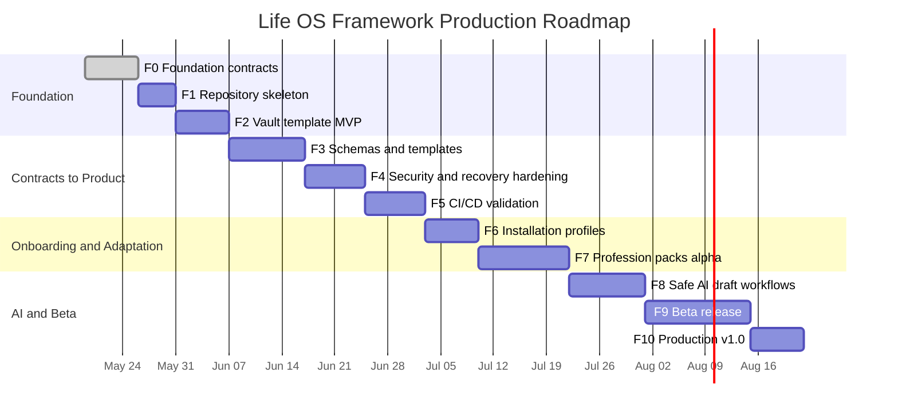

## 26. Release Gate Flow

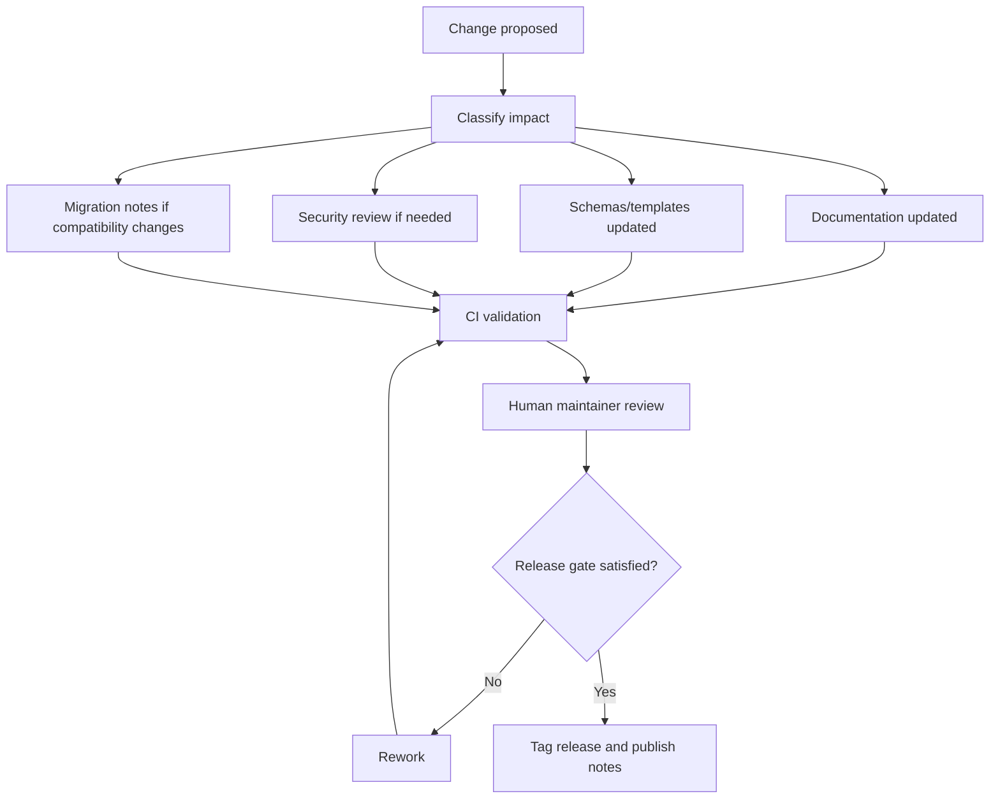

## 27. Release Blockers

A release must not ship if any of the following are true:

- CI fails;
- release notes are missing;
- migration notes are missing for compatibility changes;
- schemas are inconsistent with templates;
- profession packs modify the stable kernel directly;
- example data contains real personal data;
- secrets or credential-like material are detected;
- AI workflows allow unrestricted canonical mutation;
- backup and restore instructions are absent for affected profiles;
- documentation contradicts ADRs;
- security-sensitive changes lack maintainer approval;
- root README makes exaggerated claims not supported by the implementation.

## 28. Warning Conditions

A release may ship with warnings if the limitations are explicit.

| Warning | Required Treatment |
|---|---|
| Feature is experimental. | Mark status clearly and exclude from default profile. |
| Plugin behavior varies by platform. | Document platform limitations. |
| Self-hosted setup requires admin skill. | Mark as advanced profile. |
| AI workflow is not fully implemented. | Keep draft-only and document manual steps. |
| Profession pack is early. | Mark as alpha and require synthetic examples. |
| Validation coverage is partial. | State exactly what is and is not validated. |

## 29. Production Definition of Done

Production v1.0 is complete only when all of the following are true.

### 29.1 Repository

- Repository structure matches architecture.
- Root documentation exists.
- Required docs exist.
- CI runs on pull requests.
- CODEOWNERS exists.
- Branch protection policy is documented.
- Release process exists.
- Governance process exists.

### 29.2 Vault

- Stable vault kernel exists.
- Folder contracts exist.
- Templates exist.
- Schemas exist.
- Example notes use synthetic data only.
- Dashboards exist for core workflows.
- AI draft zones exist.
- Import quarantine exists.

### 29.3 Data

- Base ontology is implemented.
- Controlled vocabularies are documented.
- Required properties are validated.
- Sensitivity model is applied.
- Context packs inherit source sensitivity.
- Derived artifacts are clearly marked.

### 29.4 Security

- Forbidden data rules are documented and checked where feasible.
- Secrets are not stored in the repository.
- AI write policy is draft-first.
- High-impact actions require approval.
- Incident response exists.
- Restore runbooks exist.

### 29.5 Sync and Recovery

- At least three sync profiles are documented.
- One primary live sync method rule is documented.
- Backup is independent from sync.
- Restore test procedure exists.
- RPO/RTO guidance exists.
- Conflict handling is documented.

### 29.6 AI

- Agent Gateway model exists.
- Context pack model exists.
- AI draft lifecycle exists.
- Audit log contract exists.
- Tool/MCP boundaries are documented.
- Prompt injection and RAG poisoning risks are addressed.

### 29.7 Adoption

- Installation runbook works.
- First-week onboarding exists.
- Profession pack pattern exists.
- Troubleshooting guide exists.
- Migration guide exists.
- README explains value honestly.

## 30. P0 Workstream

P0 is required for production baseline.

| Workstream | Deliverables |
|---|---|
| Documentation Core | README, core docs, ADR log, roadmap. |
| Repository Structure | root files, docs, vault-template, schemas, templates, policies. |
| Data Model | schemas, controlled vocabularies, templates. |
| Security | SECURITY.md, forbidden data policy, AI write restrictions. |
| Sync/Recovery | installation profiles, backup runbooks, restore tests. |
| AI Safety | context packs, draft workflow, Agent Gateway specification. |
| Validation | CI workflows, local validation, release blockers. |

## 31. P1 Workstream

P1 is required for a mature public or team release.

| Workstream | Deliverables |
|---|---|
| Contribution Model | CONTRIBUTING, PR templates, issue templates. |
| Governance | GOVERNANCE, CODEOWNERS, maintainer roles. |
| Release Management | RELEASE_PROCESS, CHANGELOG, migration notes. |
| Troubleshooting | sync, Git, plugin, backup, AI, CI diagnosis. |
| Profession Packs | broader packs, pack review process, pack compatibility matrix. |
| Examples | synthetic example vaults and workflows. |

## 32. P2 Workstream

P2 expands the framework after v1.0 without weakening the kernel.

| Workstream | Deliverables |
|---|---|
| Local LLM | local model profiles, hardware guidance, privacy tradeoffs. |
| MCP | MCP integration guide, tool policy, approval flow. |
| Semantic Index | vector search, metadata-first retrieval, deletion propagation. |
| Self-hosting | reference stack, monitoring, backups, upgrade path. |
| Advanced Automation | semantic checks, richer health reports, migration assistants. |
| Ecosystem | pack catalog, certification rules, compatibility badges. |

## 33. Product Layer Roadmap

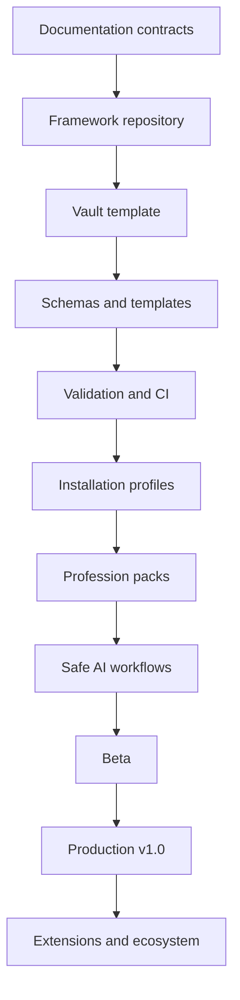

## 34. Technical Layer Roadmap

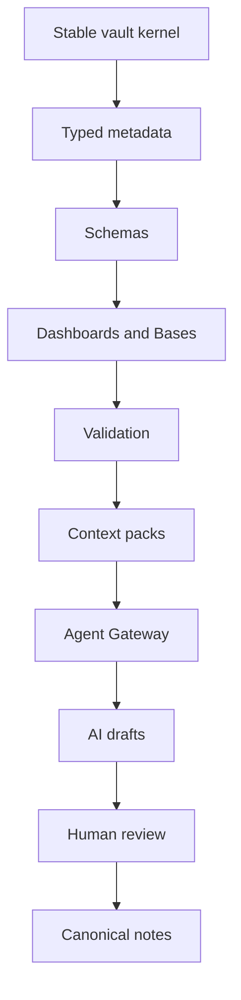

## 35. Security Roadmap

| Phase | Security Capability |
|---|---|
| F0 | Security principles documented. |
| F1 | Repository forbidden data policy. |
| F2 | Vault sensitive zones created. |
| F3 | Sensitivity metadata validation. |
| F4 | Security policy, incident response, restore runbooks. |
| F5 | CI security gates. |
| F6 | Secure installation profiles. |
| F7 | Profession-specific security rules. |
| F8 | AI action restrictions and review queue. |
| F9 | Beta security review. |
| F10 | Production security acceptance. |

## 36. AI Roadmap

| Phase | AI Capability | Risk Posture |
|---|---|---|
| F0 | AI principles documented. | Conceptual. |
| F2 | AI draft folders exist. | Manual only. |
| F3 | AI note types and context-pack schema exist. | Structured. |
| F4 | AI security controls exist. | Restricted. |
| F5 | AI policy validation begins. | Enforced. |
| F8 | Draft-first AI workflows implemented. | Human-reviewed. |
| F9 | Beta AI workflows tested. | Limited. |
| F10 | v1.0 AI-safe baseline. | Production draft-only. |
| v2.x | Local LLM/MCP/semantic index. | Gateway-mediated. |

## 37. Data Roadmap

| Phase | Data Capability |
|---|---|
| F0 | Data model contract documented. |
| F2 | Vault folder zones exist. |
| F3 | Schemas and templates implemented. |
| F5 | Schema validation in CI. |
| F6 | Install-time sample data validation. |
| F7 | Profession-specific type extensions validated. |
| F8 | Context-pack data contracts implemented. |
| F10 | Production data compatibility guarantees. |
| v2.x | Semantic indexing and deletion propagation. |

## 38. Sync and Recovery Roadmap

| Phase | Capability |
|---|---|
| F0 | Sync/recovery contract documented. |
| F2 | Backup include/exclude patterns drafted. |
| F4 | Restore runbooks completed. |
| F6 | Installation profiles include sync and backup setup. |
| F9 | Beta users complete restore tests. |
| F10 | Production profiles include recoverability requirements. |
| v1.x | More troubleshooting and platform-specific guidance. |
| v2.x | Self-hosted reference stack matures. |

## 39. Profession Pack Roadmap

| Phase | Capability |
|---|---|
| F0 | Profession pack contract documented. |
| F2 | `40_Work/` overlay zone exists. |
| F3 | Profession pack manifest schema. |
| F5 | Profession pack validation. |
| F7 | Initial alpha packs. |
| F9 | Beta packs tested by real users. |
| F10 | Production pack pattern stable. |
| v1.x | Expand profession coverage. |
| v2.x | Pack catalog and certification model. |

## 40. Documentation Roadmap

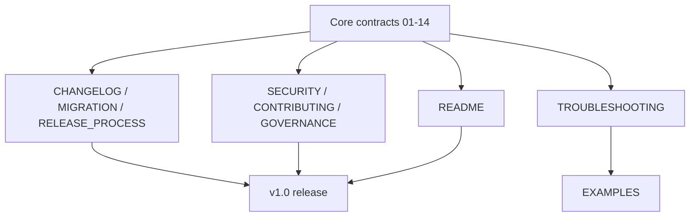

## 41. Release Artifacts

Each release should produce:

- version tag;
- changelog entry;
- release notes;
- migration notes;
- validation report;
- schema compatibility summary;
- profession pack compatibility summary;
- security review summary;
- known limitations;
- upgrade instructions;
- rollback instructions.

## 42. Migration Strategy

Every release must classify migration impact.

| Migration Level | Meaning | Required Action |
|---|---|---|
| `MIG-0` | No user action. | Mention in changelog. |
| `MIG-1` | Optional template update. | Provide copy instructions. |
| `MIG-2` | Schema or metadata update. | Provide migration guide. |
| `MIG-3` | Folder or vault structure change. | Provide step-by-step migration and rollback. |
| `MIG-4` | Security-critical change. | Require explicit upgrade notice and maintainer review. |

## 43. Compatibility Policy

The framework should maintain compatibility across:

- Markdown notes;
- YAML/frontmatter;
- folder kernel;
- base ontology;
- sensitivity levels;
- AI draft workflow;
- context pack structure;
- profession pack manifest;
- migration process.

Breaking changes require:

- ADR update;
- changelog entry;
- migration guide;
- validation update;
- release notes;
- compatibility table.

## 44. Deprecation Policy

Deprecated features should follow a staged path.

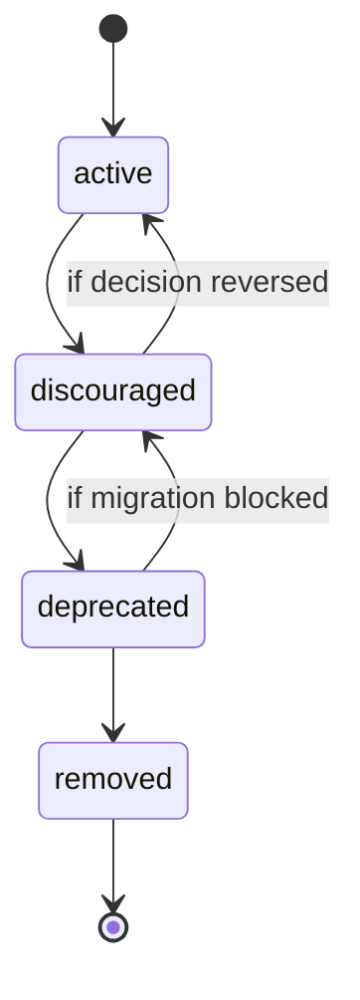

| State | Meaning |
|---|---|
| `active` | Fully supported. |
| `discouraged` | Supported but no longer recommended. |
| `deprecated` | Supported temporarily with migration guidance. |
| `removed` | No longer part of the framework. |

## 45. Risk Burn-Down Roadmap

| Risk | Burn-Down Mechanism |
|---|---|
| Data chaos | Schema-first templates and validation. |
| Security leakage | Forbidden data policy, secret scanning, review gates. |
| AI overreach | Agent Gateway, action classes, draft-only default. |
| Sync conflicts | One primary live sync method and conflict runbooks. |
| Backup illusion | Restore tests and independent backup. |
| Profession bloat | Overlay rules and pack validation. |
| Migration failure | Versioned migration guide and compatibility matrix. |
| Governance drift | ADR log, CODEOWNERS, release process. |
| Marketing overclaim | Claims policy and implementation-based release notes. |

## 46. Risk Matrix

| Risk | Likelihood | Impact | Priority | Mitigation |
|---|---:|---:|---:|---|
| User stores secrets in vault. | Medium | Critical | P0 | Forbidden data education, scanning, `.gitignore`, password manager guidance. |
| AI writes unsafe canonical changes. | Medium | Critical | P0 | Draft-only workflow, review queue, Agent Gateway. |
| Sync conflicts corrupt notes. | Medium | High | P0 | One primary sync method, conflict runbooks, backups. |
| Backup cannot restore. | Medium | Critical | P0 | Restore drills, manifests, encrypted offsite backup. |
| Profession packs fork kernel. | Medium | High | P1 | Pack contract, validation, review. |
| CI becomes too slow. | Medium | Medium | P1 | Path-aware validation and severity levels. |
| Docs become inconsistent. | Medium | High | P0 | ADR dependencies and validation checks. |
| Advanced AI features exceed safety model. | Medium | High | P2 | Gateway-mediated rollout and explicit action classes. |

## 47. Governance Roadmap

| Phase | Governance Capability |
|---|---|
| F0 | ADR log exists. |
| F1 | Maintainer roles drafted. |
| F5 | CODEOWNERS and path reviews. |
| F9 | Beta feedback process. |
| F10 | Production release authority. |
| v1.x | Governance refinement. |
| v2.x | Pack certification model. |

## 48. Contribution Roadmap

The contribution model should mature in stages.

1. Maintainer-only contract drafting.
2. Internal PRs for repo structure and validation.
3. Controlled contribution to profession packs.
4. Public or team contribution process.
5. Pack review process.
6. Security reporting process.
7. Release governance process.

## 49. Quality Metrics

| Metric | Target for v1.0 |
|---|---:|
| Required docs present | 100% |
| Core schema coverage | 100% |
| Required template coverage | 100% |
| CI release-blocking jobs passing | 100% |
| Synthetic example data | 100% synthetic |
| Forbidden files detected in repo | 0 |
| AI unrestricted canonical write paths | 0 |
| Installation profiles documented | 7 |
| Restore runbooks documented | 3 or more |
| Initial profession packs | 5 or more |
| Critical release blockers open | 0 |

## 50. User Adoption Roadmap

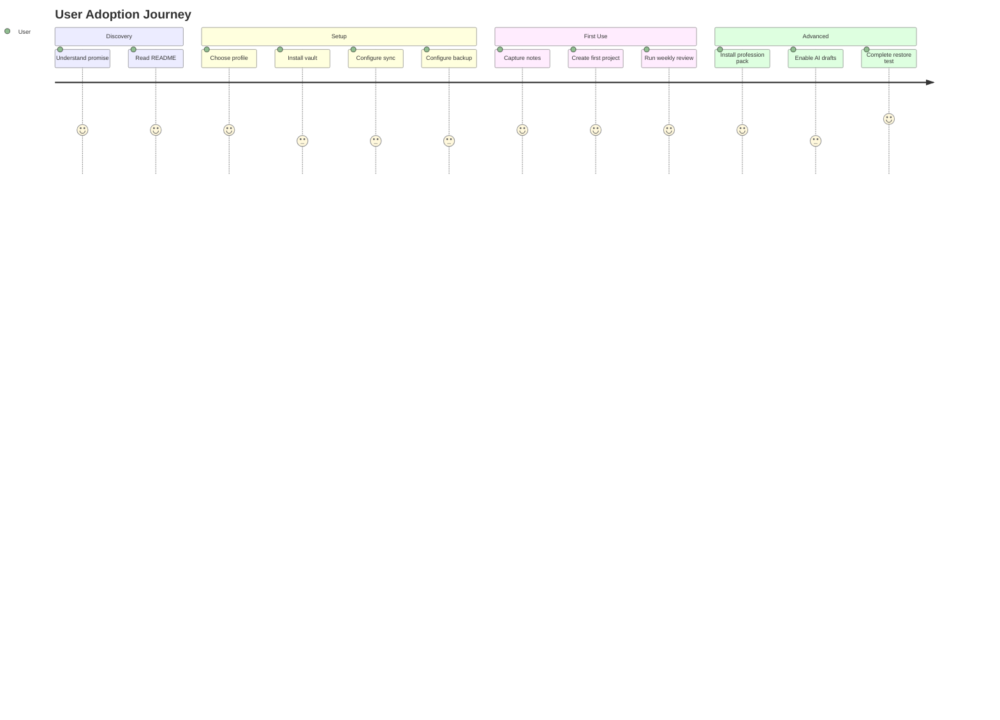

## 51. Maintainer Adoption Roadmap

Maintainers must be able to:

- evaluate architectural changes;
- review schemas;
- review security changes;
- review AI policy changes;
- review profession packs;
- interpret CI failures;
- prepare releases;
- write migration notes;
- handle security reports;
- preserve project coherence.

## 52. Release Management Model

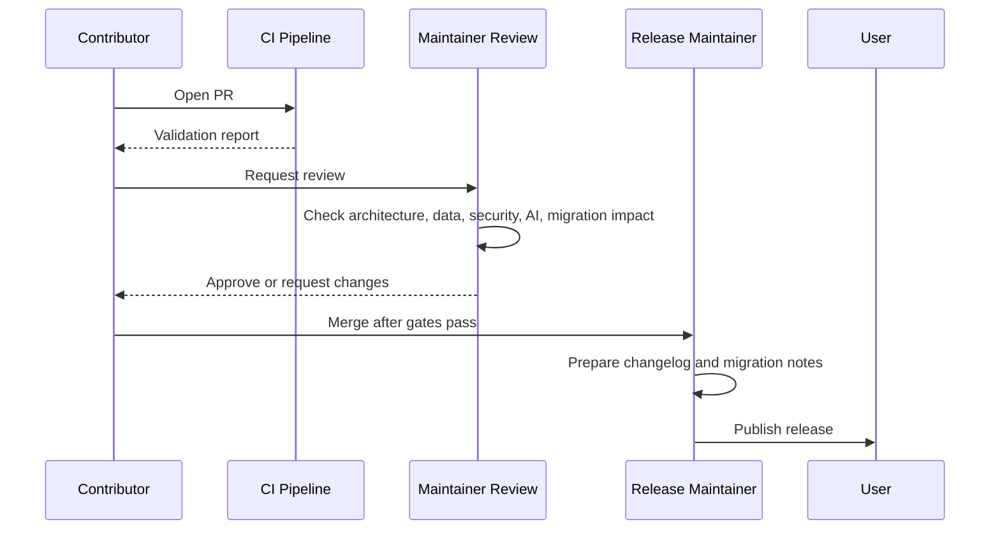

## 53. Roadmap Review Cadence

| Cadence | Review Focus |
|---|---|
| Weekly | active work, blockers, release risks. |
| Monthly | roadmap priorities, validation health, user feedback. |
| Quarterly | architecture direction, security posture, profession expansion. |
| Every release | compatibility, migration, security, claims accuracy. |
| Every major AI change | threat model, action classes, approval gates. |
| Every sync/recovery change | restore paths, RPO/RTO, conflict risk. |

## 54. Roadmap Change Control

A roadmap change requires an ADR update when it changes:

- canonical storage;
- vault kernel;
- security zones;
- AI permissions;
- sync architecture;
- backup/recovery guarantees;
- release criteria;
- governance authority;
- profession pack compatibility;
- migration policy.

A roadmap change may be made through normal PR review when it only changes:

- sequencing;
- estimated phase duration;
- documentation wording;
- non-breaking pack additions;
- examples;
- minor validation improvements.

## 55. Marketing and Claims Roadmap

The product positioning may mature as the implementation matures.

| Maturity | Allowed Claim |
|---|---|
| Contract stage | “A production-oriented architecture for Life OS.” |
| Scaffold stage | “A working repository structure and vault template.” |
| Validated stage | “A schema-driven and CI-validated framework.” |
| Beta stage | “A real-world tested framework for early adopters.” |
| Production stage | “A production-grade reference framework for personal operating systems.” |

The framework must not claim:

- perfect security;
- universal legal compliance;
- guaranteed life optimization;
- autonomous AI safety without review;
- complete replacement for professional systems;
- zero maintenance;
- automatic migration of all personal data;
- provider-independent behavior when a feature depends on a provider.

## 56. v1.0 Release Checklist

```text
[ ] README.md complete.
[ ] SECURITY.md complete.
[ ] CONTRIBUTING.md complete.
[ ] CHANGELOG.md complete.
[ ] MIGRATION_GUIDE.md complete.
[ ] RELEASE_PROCESS.md complete.
[ ] GOVERNANCE.md complete.
[ ] TROUBLESHOOTING.md complete.
[ ] Core docs 01-14 complete.
[ ] Repository skeleton complete.
[ ] Vault template complete.
[ ] Schemas complete.
[ ] Templates complete.
[ ] Policies complete.
[ ] Profession packs alpha complete.
[ ] Examples synthetic and validated.
[ ] CI workflows passing.
[ ] Branch protection documented.
[ ] CODEOWNERS configured.
[ ] Secret scanning posture documented.
[ ] Backup and restore runbooks tested.
[ ] AI draft workflow documented and validated.
[ ] Installation profiles tested.
[ ] Migration guide reviewed.
[ ] Release notes written.
[ ] Maintainer approval recorded.
```

## 57. Post-v1 Release Checklist

```text
[ ] Collect user feedback.
[ ] Review installation friction.
[ ] Review sync conflict incidents.
[ ] Review backup restore results.
[ ] Review AI draft workflow failures.
[ ] Review profession pack gaps.
[ ] Review CI false positives and false negatives.
[ ] Review documentation clarity.
[ ] Review security reports.
[ ] Update ADRs for major changes.
[ ] Publish minor release with migration notes.
```

## 58. Roadmap Anti-Patterns

The roadmap explicitly rejects:

- building AI autonomy before AI safety;
- adding plugins before defining data contracts;
- adding profession packs that fork the kernel;
- using GitHub as a shared personal-data vault;
- treating sync as backup;
- shipping examples with real personal data;
- shipping docs without validation;
- releasing without migration notes;
- hiding limitations behind premium language;
- adding self-hosted complexity before simple profiles work;
- relying on undocumented scripts;
- allowing generated artifacts to become canonical truth.

## 59. Roadmap Status Model

| Status | Meaning |
|---|---|
| `proposed` | Candidate roadmap item. |
| `accepted` | Approved for roadmap. |
| `in-progress` | Actively being implemented. |
| `blocked` | Cannot proceed until dependency is resolved. |
| `shipped` | Released to users. |
| `deferred` | Intentionally delayed. |
| `retired` | Removed from roadmap. |

## 60. Roadmap Item Template

```yaml
id: "roadmap-item-id"
title: "Roadmap item title"
status: "accepted"
priority: "P0"
phase: "F5"
owner: "Life OS Framework maintainers"
depends_on:
  - "dependency-id"
deliverables:
  - "deliverable"
release_gate:
  - "gate condition"
risk:
  - "risk"
mitigation:
  - "mitigation"
migration_impact: "MIG-0"
security_review_required: false
ai_review_required: false
```

## 61. Roadmap Issue Template

```markdown
# Roadmap Item

## Summary

## Problem

## Desired Outcome

## Phase

## Priority

## Dependencies

## Deliverables

## Acceptance Criteria

## Security Impact

## AI Impact

## Data Model Impact

## Migration Impact

## Documentation Impact

## Validation Impact

## Rollback Plan
```

## 62. Phase Acceptance Summary

| Phase | Acceptance Summary |
|---|---|
| F0 | Contracts complete and coherent. |
| F1 | Repository shape exists. |
| F2 | Vault opens and follows kernel. |
| F3 | Schemas and templates validate. |
| F4 | Security and recovery are operationally documented. |
| F5 | CI blocks unsafe or invalid changes. |
| F6 | Users can install by profile. |
| F7 | Profession overlays work safely. |
| F8 | AI drafts work through review. |
| F9 | Beta users validate workflows. |
| F10 | Production release criteria pass. |

## 63. Implementation Sequencing

The immediate implementation sequence after this document is:

1. Finalize `README.md`.
2. Create `SECURITY.md`.
3. Create `CONTRIBUTING.md`.
4. Create `MIGRATION_GUIDE.md`.
5. Create `RELEASE_PROCESS.md`.
6. Create `GOVERNANCE.md`.
7. Create `TROUBLESHOOTING.md`.
8. Create repository skeleton.
9. Create vault-template skeleton.
10. Create schemas.
11. Create templates.
12. Create policies.
13. Create initial CI workflows.
14. Create profession pack alpha set.
15. Create synthetic examples.
16. Run release-readiness validation.

## 64. MVP Boundary

The MVP must include:

- stable repository structure;
- stable vault kernel;
- basic schemas;
- basic templates;
- basic CI;
- installation guide;
- sync/backup/recovery guidance;
- AI draft-only workflow;
- at least three profession packs;
- security policy;
- migration guide;
- changelog;
- troubleshooting guide.

The MVP must not include:

- uncontrolled AI write access;
- fully automated calendar mutations without approval;
- vault-wide semantic retrieval by default;
- secrets storage;
- real personal data examples;
- complex self-hosted installers as the default path;
- marketplace behavior;
- compliance guarantees.

## 65. Production v1.0 Boundary

v1.0 includes:

- a validated framework repository;
- an installable vault template;
- strict data contracts;
- safe AI draft workflows;
- initial profession packs;
- installation profiles;
- backup/recovery runbooks;
- governance and release process.

v1.0 does not include:

- full autonomous agent runtime;
- full local LLM runtime;
- fully automated multi-vault federation;
- regulated-industry compliance certification;
- provider-specific enterprise deployment guarantee;
- automated migration of arbitrary legacy vaults.

## 66. Future Architecture Roadmap

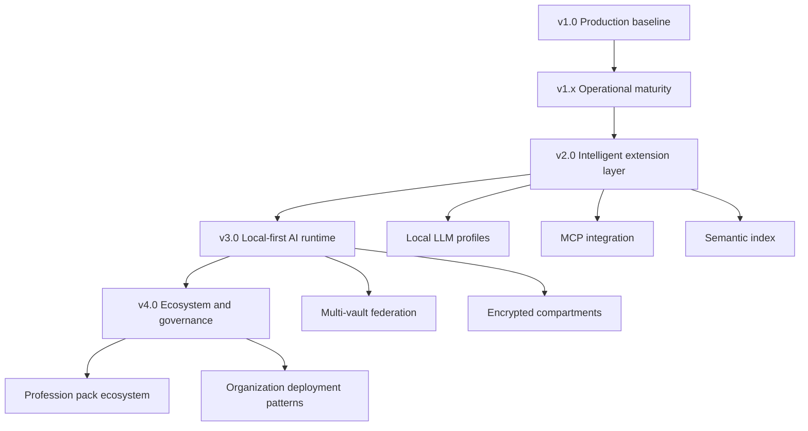

## 67. Long-Term Bet

The long-term bet of Life OS Framework is that personal and professional information systems should become:

- human-owned;
- local-first;
- structured but flexible;
- AI-augmented but not AI-controlled;
- profession-aware;
- recoverable;
- portable;
- transparent;
- secure-by-default;
- extensible through contracts rather than chaos.

## 68. Roadmap Definition of Done

This roadmap is complete when it:

- describes the full path from contracts to v1.0;
- lists required phases;
- defines release gates;
- defines production criteria;
- identifies remaining documents;
- connects roadmap items to existing architecture;
- preserves safety and human ownership;
- includes migration and governance;
- includes future evolution without weakening MVP boundaries;
- separates premium positioning from real guarantees;
- can guide maintainers through implementation decisions.

## 69. Maintainer Checklist for Roadmap Updates

Before updating this roadmap, maintainers must check:

```text
[ ] Does the change preserve local-first ownership?
[ ] Does the change preserve private vault boundaries?
[ ] Does the change preserve AI draft-first safety?
[ ] Does the change preserve sync/backup separation?
[ ] Does the change require ADR update?
[ ] Does the change require migration notes?
[ ] Does the change require schema validation changes?
[ ] Does the change require security review?
[ ] Does the change require profession pack compatibility review?
[ ] Does the change affect installation profiles?
[ ] Does the change affect release claims?
```

## 70. Closing Position

Life OS Framework becomes production-grade not by promising that it can solve every life-management problem automatically, but by giving users a disciplined architecture for owning, structuring, protecting, recovering, and evolving their personal and professional information systems.

The roadmap therefore prioritizes:

- durable foundations;
- enforceable contracts;
- safe AI collaboration;
- real recoverability;
- honest releases;
- profession-aware adaptability;
- long-term maintainability.

This is the path from an ambitious idea to a framework that can become genuinely foundational.
