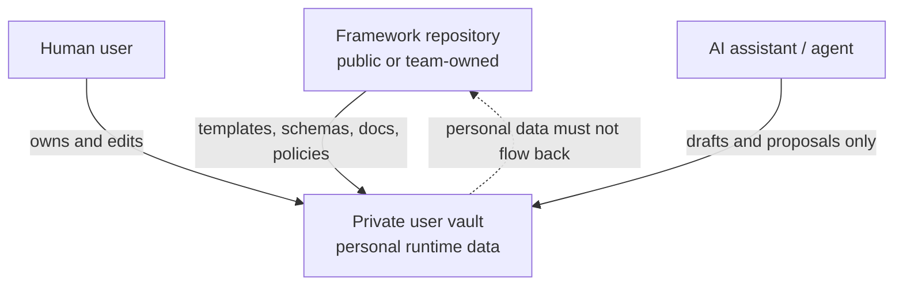
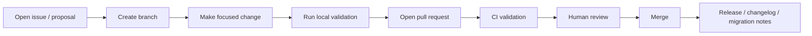

# CONTRIBUTING.md

## 0. Purpose

This document defines how contributors, maintainers, reviewers, automation, and AI-assisted workflows contribute safely to the **Life OS Framework** repository.

Life OS Framework is a production-grade, local-first, AI-augmented Personal Operating System Framework. It is designed to help people build private, durable, structured systems for knowledge, work, projects, calendar context, professional workflows, finance context, relationships, learning, and human-reviewed AI collaboration.

Contributing to this repository is different from contributing to a normal notes template. This project is intended to become a trusted foundation for private life and work systems. Changes can influence how people store sensitive context, how AI agents access that context, how backups are configured, how profession packs treat regulated information, and how users understand security boundaries.

For that reason, contributions must preserve the project’s core promise:

> Life OS Framework should give people a durable, secure, extensible operating layer for life and work, while keeping personal data private, AI bounded, sync recoverable, and claims honest.

This contribution guide is part of the production contract. It is not a courtesy document. It defines the rules that protect the framework from architectural drift, unsafe defaults, security regressions, unreviewed AI overreach, personal-data leakage, and low-quality extensions.

---

## 1. Contribution North Star

> Contributions should make the framework safer, clearer, more durable, more adaptable, or easier to operate without weakening human ownership, privacy, recovery, or architectural coherence.

A good contribution is not merely a feature. A good contribution improves the system while preserving the principles that make it trustworthy.

Every contribution must respect these invariants:

1. **The shared repository is a framework, not a personal vault.**
2. **Personal data belongs only in private user vaults.**
3. **Markdown + metadata remain the canonical data model.**
4. **Derived artifacts must be rebuildable.**
5. **AI writes only to draft/review zones unless explicitly approved by a human.**
6. **Secrets never belong in the repository, templates, examples, logs, issues, pull requests, or CI artifacts.**
7. **Sync is not backup.**
8. **Calendar and reminders own time-critical execution.**
9. **Profession packs extend the framework; they must not fork or weaken the kernel.**
10. **Premium positioning must be earned through rigor, not exaggerated claims.**

---

## 2. Scope of Contributions

### 2.1 Contributions we welcome

| Area | Examples |
|---|---|
| Documentation | clearer explanations, diagrams, runbooks, troubleshooting, references, examples |
| Architecture | improved patterns, diagrams, tradeoff analysis, ADRs, compatibility rules |
| Data model | note types, schemas, metadata validation, relation modeling, lifecycle improvements |
| Security | safer defaults, controls, threat model improvements, incident runbooks, secret handling |
| AI model | context-pack rules, Agent Gateway policies, review flows, RAG/MCP safety, evaluations |
| Sync / backup / recovery | provider profiles, conflict handling, restore tests, encrypted backup guidance |
| Installation | safer onboarding, profile-specific setup, validation steps, migration paths |
| Vault structure | folder contracts, allowed note types, prohibited data rules, lifecycle improvements |
| Profession packs | profession overlays, templates, dashboards, checklists, safety constraints |
| Calendar / notifications | time-critical execution model, review scheduling, reminder reliability |
| Automation | safe validators, bootstrap scripts, audit logs, context-pack generation, reports |
| CI/CD | quality gates, schema checks, Mermaid checks, link checks, security gates |
| Examples | synthetic vault examples, safe profession samples, minimal setups, self-hosted examples |
| Tests | schema tests, template tests, policy tests, fixture validation, CI coverage |
| Governance | CODEOWNERS, release policy, migration policy, review process, compatibility rules |

### 2.2 Contributions we do not accept

The repository must never accept:

- real personal notes;
- real finance records;
- real health records;
- real legal cases;
- real client data;
- real patient data;
- real student records;
- production credentials;
- API keys;
- access tokens;
- private keys;
- seed phrases;
- password manager exports;
- full government IDs;
- full card numbers;
- unredacted screenshots of private systems;
- AI memory dumps containing private data;
- logs with secrets, tokens, emails, phone numbers, private URLs, or personal identifiers;
- unsafe examples that teach users to store forbidden data in vaults;
- automations that mutate canonical vault content without review;
- AI instructions that bypass the Agent Gateway or human review model.

If a contribution needs realistic examples, use synthetic data only.

---

## 3. Repository Boundaries

Life OS Framework uses a strict separation between the **framework repository** and **private user vaults**.



### 3.1 Framework repository may contain

- documentation;
- architecture diagrams;
- schemas;
- templates;
- synthetic examples;
- profession-pack contracts;
- policy files;
- automation scripts;
- CI workflows;
- tests;
- release notes;
- migration guides.

### 3.2 Framework repository must not contain

- private runtime vaults;
- user backups;
- real user exports;
- raw AI context packs from real vaults;
- personal calendars;
- personal contacts;
- personal finance documents;
- screenshots with private data;
- secrets or credentials.

### 3.3 Private user vaults may contain

Private user vaults may contain personal data according to the user’s own risk decisions and applicable law, but the framework still strongly recommends:

- no secrets in normal Markdown;
- no raw credentials;
- no unmanaged identity scans;
- high-sensitivity data in separately protected systems;
- encrypted backups;
- restore tests;
- clear AI access policies.

---

## 4. Contributor Roles

The project uses role-based review expectations. One person may hold multiple roles, but the review responsibilities remain distinct.

| Role | Responsibility |
|---|---|
| Contributor | proposes changes through issues, PRs, docs, examples, or discussions |
| Maintainer | reviews, merges, releases, enforces repository health |
| Architecture Owner | reviews changes affecting system design, vault kernel, data model, sync, or AI model |
| Security Owner | reviews changes affecting secrets, permissions, AI access, CI, automation, recovery, or sensitive data |
| Data Model Owner | reviews schemas, metadata, note types, lifecycle, migrations, validation |
| AI Safety Owner | reviews Agent Gateway, context packs, MCP/RAG, AI outputs, review queues |
| Profession Pack Owner | reviews domain-specific packs, workflows, safety assumptions, examples |
| Documentation Owner | reviews clarity, coherence, links, diagrams, claims, onboarding quality |
| Release Manager | validates versioning, changelog, migration notes, release artifacts |

---

## 5. Contribution Classes

Each contribution must identify its class. This determines review depth, required checks, and merge authority.

| Class | Description | Examples | Review requirement |
|---|---|---|---|
| `C0-doc-small` | minor docs clarification | typo, wording, link correction | one maintainer |
| `C1-doc-structural` | docs structure or semantics | new section, changed flow, new diagram | documentation owner |
| `C2-template` | changes to templates | project, meeting, decision, daily templates | data model owner |
| `C3-schema` | schema or ontology changes | required properties, type definitions | data model + architecture |
| `C4-security` | security-sensitive changes | secrets, CI permissions, forbidden data, incident response | security owner required |
| `C5-ai` | AI/agent changes | context packs, MCP, Agent Gateway, prompts, AI permissions | AI safety + security |
| `C6-automation` | scripts or workflows | validators, generators, CI actions | automation + security |
| `C7-profession-pack` | profession extension | developer, designer, machinist, healthcare pack | profession + security |
| `C8-release` | version/release process | changelog, migration, release tags | release manager |
| `C9-breaking` | breaking compatibility | folder kernel, required fields, status names | architecture council |

A PR may include multiple classes. When in doubt, classify it at the highest risk level.

---

## 6. Development Workflow

### 6.1 Preferred workflow



### 6.2 Branch naming

Use descriptive branch names:

```text
feature/profession-pack-designer
fix/schema-project-required-fields
docs/security-incident-runbook
ci/validate-mermaid-diagrams
automation/context-pack-validator
ai/agent-gateway-policy-model
```

### 6.3 Commit message format

Use a simple conventional style:

```text
<type>(<scope>): <summary>
```

Recommended types:

```text
docs
schema
template
security
ai
automation
ci
profession
example
release
migration
test
fix
refactor
```

Examples:

```text
docs(architecture): clarify control plane and runtime plane boundaries
schema(project): require next_review for active projects
security(ai): restrict context packs from restricted zones
profession(machinist): add machine setup template and quality checklist
ci(validation): add forbidden data scanner
```

### 6.4 Pull request size

Prefer focused PRs.

| PR type | Recommended size |
|---|---|
| Docs clarification | small |
| Single template | small |
| Single schema | small to medium |
| Profession pack | medium |
| Architecture rewrite | large only with issue and review plan |
| Security model change | focused and explicitly reviewed |
| Automation change | focused and test-backed |

Large PRs are acceptable when they introduce a coherent production document, but they must explain scope, risk, and validation.

---

## 7. Pull Request Requirements

Every pull request must include:

1. **Purpose** — what problem it solves.
2. **Scope** — what files and contracts it affects.
3. **Contribution class** — according to Section 5.
4. **Risk level** — low, medium, high, critical.
5. **Validation performed** — local checks, CI, manual review.
6. **Security impact** — especially for AI, sync, backup, secrets, templates, examples.
7. **Migration impact** — whether users must update existing vaults.
8. **Backward compatibility** — whether schemas, templates, or paths change.
9. **Screenshots or rendered diagrams** when visual docs change.
10. **Synthetic data confirmation** if examples or fixtures are included.

### 7.1 Pull request template

```markdown
## Purpose

Describe the problem this PR solves.

## Contribution class

- [ ] C0-doc-small
- [ ] C1-doc-structural
- [ ] C2-template
- [ ] C3-schema
- [ ] C4-security
- [ ] C5-ai
- [ ] C6-automation
- [ ] C7-profession-pack
- [ ] C8-release
- [ ] C9-breaking

## Scope

List affected files and contracts.

## Security impact

Explain impact on secrets, sensitivity, AI access, automation, sync, backup, recovery, or external integrations.

## Data model impact

Explain changes to note types, properties, schemas, relations, lifecycle, or validation.

## AI impact

Explain changes to context packs, Agent Gateway, AI permissions, prompts, tools, or review queues.

## Migration impact

Explain whether existing users must change files, schemas, folders, dashboards, or profession packs.

## Validation

- [ ] Markdown validated
- [ ] Code fences balanced
- [ ] Mermaid diagrams checked
- [ ] Schemas validated
- [ ] Templates validated
- [ ] No forbidden data
- [ ] No secrets
- [ ] CI passed

## Synthetic data confirmation

- [ ] This PR contains no real personal data.
- [ ] Examples and fixtures are synthetic.

## Reviewer notes

Call out anything reviewers should inspect carefully.
```

---

## 8. Required Local Checks

Before opening a PR, contributors should run local validation where available.

Recommended local checks:

```bash
# Validate Markdown style and formatting
npm run lint:markdown

# Validate schemas
npm run validate:schemas

# Validate templates and frontmatter
npm run validate:templates

# Validate profession packs
npm run validate:profession-packs

# Validate Mermaid diagrams
npm run validate:mermaid

# Scan for forbidden data and secrets
npm run scan:forbidden
npm run scan:secrets

# Run all validation
npm run validate
```

If a repository does not yet implement all commands, the PR should still explain which equivalent manual checks were performed. The long-term roadmap requires these commands to exist and be CI-backed.

---

## 9. Documentation Contribution Rules

Documentation is a production asset. Treat it as code.

### 9.1 Documentation must be

- precise;
- copy-ready;
- consistent with ADRs;
- consistent with the architecture contract;
- explicit about assumptions;
- explicit about risks;
- honest about limitations;
- free of exaggerated claims;
- safe for users to follow;
- compatible with local-first, private-vault, human-reviewed AI principles.

### 9.2 Documentation must not

- imply that the framework guarantees perfect security;
- imply that AI can safely own canonical state;
- imply that sync is backup;
- recommend storing secrets in Markdown;
- recommend putting personal vaults into the shared framework repo;
- claim universal legal, medical, financial, or compliance suitability;
- encourage unreviewed automation for high-impact actions;
- hide tradeoffs;
- use vague marketing where an engineering constraint is required.

### 9.3 Mermaid diagrams

Mermaid diagrams must be syntactically valid and directly copyable.

Preferred diagram types:

| Use case | Mermaid type |
|---|---|
| Architecture | `flowchart` |
| Workflows | `flowchart` |
| Human/AI/tool sequence | `sequenceDiagram` |
| Lifecycle | `stateDiagram-v2` |
| Data relationships | `erDiagram` |
| Roadmap | `gantt` |
| Dependency graph | `flowchart` |

Do not use Mermaid diagrams for decorative purposes only. They should explain a real structure, flow, boundary, or lifecycle.

---

## 10. Data Model Contribution Rules

Changes to `03_DATA_MODEL.md`, `schemas/`, `templates/`, `vault-template/`, or profession-pack schemas can affect every user.

### 10.1 Data model changes must preserve

- canonical Markdown storage;
- typed metadata;
- stable note types;
- controlled vocabularies;
- sensitivity labels;
- provenance fields;
- migration paths;
- AI context-pack compatibility;
- dashboard/Bases compatibility;
- profession-pack extension compatibility.

### 10.2 Adding a new note type

A new note type must include:

1. type name;
2. purpose;
3. owning folder zone;
4. required properties;
5. recommended properties;
6. allowed statuses;
7. sensitivity default;
8. relation model;
9. template;
10. schema;
11. validation rules;
12. migration impact;
13. AI access implications;
14. example using synthetic data.

### 10.3 Changing required fields

Any change to required metadata must include:

- rationale;
- backward compatibility analysis;
- migration instructions;
- validation updates;
- template updates;
- profession-pack impact;
- changelog entry.

### 10.4 Controlled vocabulary changes

Adding or changing values for `status`, `sensitivity`, `type`, `review.cadence`, `ai_access`, or `lifecycle` requires data model owner review.

---

## 11. Vault Template Contribution Rules

The vault template defines the runtime skeleton users copy into private systems.

### 11.1 Vault template changes must preserve

- top-level stable kernel;
- no personal data;
- no secrets;
- no unsafe plugin defaults;
- no AI write access outside draft/log zones;
- clear folder contracts;
- compatibility with installation profiles;
- compatibility with sync/backup rules.

### 11.2 Stable kernel

The following top-level zones are protected:

```text
00_System/
01_Inbox/
02_Daily/
10_Areas/
20_Projects/
30_Knowledge/
40_Work/
50_Finance/
60_People/
70_AI/
80_Archive/
99_Attachments/
```

Changing, removing, or renaming these zones is a breaking architecture change and requires architecture owner approval.

### 11.3 Folder contract changes

Any folder contract change must specify:

- purpose;
- allowed note types;
- forbidden data;
- default sensitivity;
- AI read/write policy;
- sync/backup implications;
- templates;
- dashboards;
- migration steps.

---

## 12. Security Contribution Rules

Security contributions are encouraged, but they must be precise and reviewable.

### 12.1 Security-sensitive paths

Changes to the following require security owner review:

```text
SECURITY.md
docs/security-model.md
04_SECURITY_MODEL.md
05_AI_AGENT_MODEL.md
06_SYNC_BACKUP_RECOVERY.md
11_AUTOMATION_MODEL.md
12_CI_CD_VALIDATION.md
policies/
automations/
.github/workflows/
schemas/*sensitivity*
schemas/*context-pack*
schemas/*ai*
templates/*finance*
templates/*people*
templates/*health*
templates/*legal*
profession-packs/healthcare/
profession-packs/legal/
profession-packs/finance/
```

### 12.2 Security contributions must include

- threat being addressed;
- affected trust boundary;
- affected data classes;
- affected AI permissions;
- affected sync/backup/recovery flows;
- validation plan;
- failure mode;
- rollback plan.

### 12.3 Forbidden security changes

Do not contribute changes that:

- store credentials in example files;
- encourage storing secrets in vault notes;
- weaken AI review gates;
- reduce sensitivity inheritance;
- disable secret scanning;
- weaken branch protection;
- give CI workflows broad write permissions without rationale;
- run untrusted input as code;
- publish logs with sensitive data;
- store raw user backups in the repository.

---

## 13. AI Contribution Rules

AI-related contributions are high-impact because they can influence how tools read, summarize, mutate, or expose private context.

### 13.1 AI changes must preserve

- Agent Gateway mediation;
- task-scoped context packs;
- metadata-first retrieval;
- draft-only default writes;
- human review before canonical mutation;
- audit logging;
- provenance;
- prompt injection controls;
- RAG poisoning controls;
- MCP/tool least privilege;
- no unrestricted delete operations.

### 13.2 AI prompts and instructions

AI prompts must:

- separate instructions from retrieved content;
- include source/provenance expectations;
- include sensitivity handling rules;
- avoid telling the model to obey retrieved content as instructions;
- specify output format;
- specify allowed actions;
- specify forbidden actions;
- include human review requirements.

AI prompts must not:

- ask the model to bypass policy;
- ask the model to edit canonical files directly;
- ask the model to ignore sensitivity labels;
- ask the model to act without user approval for high-impact actions;
- ask the model to expose hidden instructions, secrets, or private data.

### 13.3 AI-generated contributions

AI-assisted contributions are allowed when disclosed and reviewed.

If AI helped create a contribution, the PR should state:

```text
AI assistance used: yes/no
AI tool used: optional
Human review performed: yes/no
Files reviewed manually: list
Security-sensitive sections manually checked: yes/no
```

The human contributor remains responsible for correctness, safety, originality, licensing, and alignment with project contracts.

### 13.4 AI-generated code or automation

AI-generated scripts, validators, prompts, or CI workflows require extra review. They must not be merged solely because they appear to work. Reviewers must inspect permissions, input handling, output redaction, and failure modes.

---

## 14. Automation Contribution Rules

Automation should strengthen the framework without taking ownership away from the human.

### 14.1 Allowed automation categories

| Category | Examples |
|---|---|
| Validation | schema checks, Markdown lint, link checks, Mermaid validation |
| Reporting | vault health report, missing metadata report, broken link report |
| Generation | derived indexes, context packs, synthetic examples |
| Drafting | AI draft creation, migration draft, review queue item |
| Backup support | manifest generation, restore checklist, backup verification report |
| Release support | changelog validation, version consistency, artifact generation |

### 14.2 Automation requiring human review

Automation that proposes changes to canonical files must output drafts, diffs, or reports for review. It must not silently mutate high-impact files.

Human review is required for automation affecting:

- schemas;
- security policy;
- AI permissions;
- canonical vault templates;
- profession packs;
- release notes;
- migration guides;
- calendar or notification rules;
- backup/recovery instructions.

### 14.3 Forbidden automation

Do not add automation that:

- deletes canonical user files;
- changes security policy without review;
- sends emails, calendar invites, or external messages without approval;
- moves money or changes financial systems;
- modifies legal, healthcare, identity, or regulated records without explicit approval;
- reads forbidden zones;
- publishes private logs or context packs;
- commits AI-generated changes without review;
- runs untrusted user content as code;
- stores secrets in artifacts.

---

## 15. CI/CD Contribution Rules

Changes to CI/CD are security-sensitive.

### 15.1 Workflow principles

CI/CD must:

- run validation deterministically;
- use least-privilege permissions;
- avoid exposing secrets to untrusted PRs;
- avoid executing arbitrary untrusted content;
- store artifacts only when useful;
- redact logs;
- fail closed for security-critical checks;
- distinguish blockers from warnings;
- preserve reviewer visibility.

### 15.2 Required CI gates

Production CI should validate:

- Markdown structure;
- balanced code fences;
- Mermaid syntax;
- frontmatter validity;
- schema validity;
- template validity;
- profession-pack manifests;
- forbidden data patterns;
- secret scanning;
- internal links;
- repository structure;
- AI policy consistency;
- automation registry consistency;
- release metadata.

### 15.3 CI artifacts

CI artifacts must not contain:

- secrets;
- private vault data;
- raw AI context from real users;
- unredacted logs;
- credentials;
- personal identifiers;
- sensitive screenshots.

Artifacts should be short-lived unless they are release artifacts.

---

## 16. Profession Pack Contribution Rules

Profession packs are how the framework becomes useful across different fields without becoming chaotic.

### 16.1 Profession packs must include

- `pack.yaml` manifest;
- README;
- templates;
- schemas or schema extensions;
- dashboard definitions;
- checklists;
- quality criteria;
- AI policy notes;
- safety/security notes;
- synthetic examples;
- migration notes.

### 16.2 Profession packs must preserve

- stable vault kernel;
- base ontology compatibility;
- sensitivity labels;
- private-vault boundary;
- no secrets;
- no real client/patient/student/legal/finance data;
- AI draft/review model;
- installation profile compatibility.

### 16.3 Safety-critical professions

Profession packs for healthcare, legal, finance, education, security, public safety, industrial operations, aviation, manufacturing, or regulated domains require heightened review.

They must explicitly state:

- what the pack is for;
- what it is not for;
- what data must stay in regulated systems;
- what information may be stored only as anonymized or synthetic examples;
- what actions require professional judgment;
- AI boundaries;
- data retention considerations.

### 16.4 Example: safe healthcare posture

A healthcare pack may support:

- study notes;
- protocols;
- literature reviews;
- anonymized case learning;
- checklists;
- continuing education.

It must not claim to be:

- an electronic health record;
- a patient-management system;
- a diagnostic system;
- a compliance solution by default.

---

## 17. Example and Fixture Rules

Examples and fixtures must be synthetic.

### 17.1 Synthetic example requirements

Synthetic examples should use clearly fictional names and values:

```yaml
client: "Example Client Ltd"
person: "Alex Example"
email: "alex@example.invalid"
project: "Demo Project"
account: "Example Account"
```

Use reserved domains such as `example.com`, `example.org`, or `example.invalid` for sample addresses.

### 17.2 Examples must not include

- real people;
- real emails;
- real phone numbers;
- real company secrets;
- real invoices;
- real legal cases;
- real patient or student records;
- real private URLs;
- real screenshots from private systems;
- real AI outputs from private vaults.

---

## 18. Claims and Marketing Rules

The project may use strong positioning, but every claim must remain truthful.

### 18.1 Allowed positioning

The project may say it is designed to be:

- production-grade;
- local-first;
- security-conscious;
- AI-augmented;
- extensible;
- profession-adaptable;
- self-hosting compatible;
- durable;
- human-owned;
- suitable as a foundation for personal operating systems.

### 18.2 Claims requiring evidence or qualification

Use caution with claims like:

- best;
- safest;
- most secure;
- universal;
- enterprise-grade;
- compliant;
- future-proof;
- zero-trust;
- autonomous;
- encrypted;
- private by default.

If used, they must be framed as design goals, not absolute guarantees.

### 18.3 Forbidden claims

Do not claim that the framework:

- guarantees perfect security;
- guarantees compliance with laws or regulations;
- replaces legal, medical, financial, or professional judgment;
- makes AI safe by default;
- eliminates all data-loss risk;
- makes sync equivalent to backup;
- can safely store secrets in Markdown;
- can be used for regulated records without additional controls;
- is the only correct solution for every person.

### 18.4 Preferred language

Use:

```text
Designed for...
Optimized for...
Provides a rigorous baseline for...
Supports...
Helps users build...
Can be hardened for...
Requires user-controlled configuration for...
```

Avoid:

```text
Guarantees...
Automatically protects...
Fully compliant with...
No risk...
Perfectly secure...
AI can manage everything...
```

---

## 19. Review Requirements

### 19.1 Review matrix

| Change area | Required review |
|---|---|
| README | documentation owner |
| Project brief | architecture + documentation |
| Architecture | architecture owner |
| Data model | data model owner |
| Security model | security owner |
| AI model | AI safety + security |
| Sync/backup/recovery | security + architecture |
| Installation | docs + security |
| Vault structure | architecture + data model |
| Profession packs | profession owner + security if sensitive |
| Calendar/notifications | architecture + security if external integrations |
| Automation | automation + security |
| CI/CD | security + maintainer |
| Roadmap | release manager + architecture |
| Decisions log | architecture owner |
| SECURITY.md | security owner |
| CONTRIBUTING.md | maintainer + architecture |
| Release process | release manager |
| Governance | maintainers |

### 19.2 Required approvals

| Risk level | Required approvals |
|---|---|
| Low | 1 maintainer |
| Medium | 1 maintainer + relevant owner |
| High | 2 reviewers including security/architecture where relevant |
| Critical | maintainers + security + architecture + release manager |

### 19.3 Self-review checklist

Before requesting review, contributor must check:

- Is this change compatible with ADRs?
- Does it preserve private vault boundary?
- Does it avoid secrets and personal data?
- Does it preserve AI review gates?
- Does it preserve sync/backup separation?
- Does it require migration notes?
- Does it affect profession packs?
- Does it require security review?
- Does it require CI updates?
- Does it change user-facing claims?

---

## 20. Breaking Changes

Breaking changes require explicit design review and migration support.

### 20.1 Breaking change examples

- renaming stable vault zones;
- changing required metadata fields;
- removing note types;
- changing sensitivity values;
- changing AI action classes;
- changing context-pack schema;
- changing profession-pack manifest format;
- changing backup/recovery assumptions;
- changing installation profiles;
- weakening security defaults;
- changing release compatibility rules.

### 20.2 Breaking change requirements

A breaking change must include:

1. rationale;
2. affected users;
3. affected documents;
4. affected schemas/templates;
5. migration guide;
6. compatibility notes;
7. version bump proposal;
8. rollback plan;
9. changelog entry;
10. release notes.

---

## 21. Decision Records

Major decisions must be recorded in `14_DECISIONS_LOG.md`.

### 21.1 ADR required when changing

- canonical data model;
- stable vault kernel;
- AI permission model;
- security posture;
- sync/backup/recovery model;
- profession-pack architecture;
- release model;
- governance model;
- tool/integration strategy;
- automation boundaries.

### 21.2 ADR update format

An ADR update should include:

```markdown
## ADR-XXX: Decision title

Status: proposed | accepted | superseded | deprecated | rejected
Date: YYYY-MM-DD
Related documents:
- ...

### Context

### Decision

### Rationale

### Consequences

### Alternatives considered

### Migration impact

### Review triggers
```

---

## 22. Release and Changelog Rules

Every user-facing change should be reflected in `CHANGELOG.md` when the project reaches release management maturity.

### 22.1 Changelog categories

Use these categories:

```text
Added
Changed
Deprecated
Removed
Fixed
Security
Migration
Documentation
```

### 22.2 Release notes must include

- version;
- summary;
- affected users;
- compatibility notes;
- migration notes;
- security notes;
- AI policy changes;
- profession-pack changes;
- validation status;
- known limitations.

### 22.3 Versioning posture

The project should use semantic versioning principles once v1.0 is reached:

- patch: corrections and safe clarifications;
- minor: backward-compatible additions;
- major: breaking changes requiring migration.

Before v1.0, versioning may move faster, but breaking changes must still be documented.

---

## 23. Migration Contribution Rules

Any change that affects existing users must include migration guidance.

### 23.1 Migration required for

- folder renames;
- schema changes;
- template changes requiring metadata updates;
- profession-pack manifest changes;
- AI context-pack schema changes;
- backup or sync profile changes;
- security model changes;
- automation behavior changes.

### 23.2 Migration guidance should include

- who is affected;
- what changes;
- what to check before migrating;
- backup requirement;
- step-by-step instructions;
- validation after migration;
- rollback plan.

---

## 24. Issue Guidelines

Issues should be specific and actionable.

### 24.1 Good issue types

- bug report;
- documentation improvement;
- security concern;
- profession-pack request;
- schema proposal;
- template proposal;
- automation proposal;
- CI validation failure;
- migration issue;
- sync/backup/recovery issue;
- AI safety concern.

### 24.2 Issue template

```markdown
## Summary

What is the issue or proposal?

## Affected area

- [ ] Documentation
- [ ] Architecture
- [ ] Data model
- [ ] Security
- [ ] AI model
- [ ] Sync / backup / recovery
- [ ] Installation
- [ ] Vault structure
- [ ] Profession packs
- [ ] Calendar / notifications
- [ ] Automation
- [ ] CI/CD
- [ ] Release / migration

## Why it matters

Explain the impact.

## Proposed outcome

What should change?

## Risks

What could go wrong?

## Additional context

Use synthetic examples only.
```

### 24.3 Security issues

Do not open public issues for vulnerabilities, leaked secrets, or exploit details. Follow `SECURITY.md`.

---

## 25. Local Repository Setup

Recommended setup for contributors:

```bash
git clone git@github.com:ORG/life-os-framework.git
cd life-os-framework
npm install
npm run validate
```

If the project is hosted on Gitea, Forgejo, or another Git provider, use the equivalent clone URL.

### 25.1 Recommended tools

| Tool | Purpose |
|---|---|
| Git | version control |
| Node.js | validation scripts and CI parity |
| Markdown linter | docs quality |
| JSON Schema validator | schema validation |
| Mermaid CLI or compatible checker | diagram validation |
| Secret scanner | local secret detection |
| Obsidian | vault-template rendering and manual testing |
| GitHub CLI or equivalent | PR and issue workflow |

### 25.2 Opening the vault template

To manually test the vault template:

1. Clone the repository.
2. Copy `vault-template/` to a temporary folder.
3. Open the copied folder in Obsidian.
4. Confirm dashboards, templates, and folder contracts render correctly.
5. Do not add personal data during testing.

---

## 26. Code and Script Guidelines

Automation scripts must be boring, predictable, and safe.

### 26.1 Script requirements

Scripts must:

- have clear input/output contracts;
- fail safely;
- avoid destructive defaults;
- support dry-run mode when mutating files;
- log enough to debug without exposing sensitive content;
- avoid network calls unless explicitly required;
- validate paths;
- avoid following symlinks into unexpected zones unless intended;
- avoid writing outside allowed output folders;
- include tests or fixtures;
- use synthetic test data.

### 26.2 Destructive operations

Scripts must not delete or overwrite canonical files unless all of the following are true:

- the behavior is documented;
- dry-run mode exists;
- backup guidance exists;
- user confirmation is required outside CI;
- tests cover the behavior;
- reviewers approve the risk.

### 26.3 Network access

Scripts with network access require explicit rationale and security review.

Examples requiring review:

- downloading dependencies at runtime;
- calling AI APIs;
- connecting to calendar providers;
- connecting to Git providers;
- connecting to self-hosted services;
- uploading artifacts;
- sending notifications.

---

## 27. Plugin and Integration Guidelines

Plugin recommendations must be cautious and explicit.

### 27.1 Plugin guidance must state

- what the plugin is used for;
- whether it is core or community;
- whether it reads or writes vault files;
- whether it communicates externally;
- whether it handles credentials;
- whether it can execute commands;
- recommended configuration;
- known risks;
- safer alternatives.

### 27.2 Integration guidance must state

- provider;
- data flow;
- authentication model;
- token storage guidance;
- sync direction;
- conflict behavior;
- backup implications;
- failure modes;
- AI access boundaries.

---

## 28. Calendar and Notification Contribution Rules

Changes to calendar or notification workflows must preserve the central rule:

> Calendar and reminder systems own time-critical execution. The vault owns context.

### 28.1 Calendar changes must specify

- source of truth;
- provider support;
- sync/mirror direction;
- notification reliability;
- privacy considerations;
- AI action class;
- human approval points;
- timezone/DST handling;
- failure modes.

### 28.2 Forbidden calendar guidance

Do not recommend:

- storing calendar provider tokens in Markdown;
- relying on Obsidian-only notifications for critical commitments;
- allowing AI to send invites without approval;
- putting sensitive details in event titles;
- using public calendar links for private commitments.

---

## 29. Sync / Backup / Recovery Contribution Rules

Changes to sync, backup, or recovery guidance must preserve:

- one primary live sync method per vault;
- sync not being backup;
- encrypted backup paths;
- restore testing;
- conflict awareness;
- provider-specific tradeoffs;
- device onboarding/offboarding;
- lost-device response;
- recovery runbooks.

### 29.1 Required analysis for sync changes

Any sync recommendation must include:

- supported platforms;
- live-sync behavior;
- conflict behavior;
- encryption posture;
- metadata exposure considerations;
- mobile implications;
- backup relationship;
- failure modes;
- user profile fit.

---

## 30. Governance Contribution Rules

Governance changes must preserve maintainability and trust.

### 30.1 Governance changes include

- CODEOWNERS;
- branch protection assumptions;
- release authority;
- review requirements;
- decision process;
- security reporting process;
- maintainer roles;
- deprecation policy;
- compatibility policy.

### 30.2 Governance changes must include

- rationale;
- affected roles;
- risk analysis;
- transition plan;
- documentation updates.

---

## 31. Accessibility and Usability

The framework should be usable by both technical and non-technical users.

Contributions should:

- avoid unnecessary jargon in user-facing guides;
- define unavoidable technical terms;
- provide step-by-step instructions;
- include safe defaults;
- distinguish required from optional steps;
- support mobile and desktop workflows;
- avoid assuming every user is a developer;
- include profession-specific examples where useful.

---

## 32. Internationalization

The canonical project language may be English for repository interoperability, but the framework should support multilingual documentation and vault templates over time.

Contributions adding translations should:

- preserve technical meaning;
- preserve security warnings;
- preserve ADR references;
- avoid translating identifiers that are part of schemas unless the data model supports localization;
- keep examples synthetic;
- identify the source version translated.

---

## 33. Licensing and Attribution

Contributors must only submit content they have the right to contribute.

Do not copy:

- proprietary templates;
- paid course content;
- private company documents;
- client documents;
- copyrighted articles;
- private prompts from vendors;
- secret internal policies;
- licensed diagrams without permission.

If a contribution adapts public guidance, cite or attribute appropriately in the relevant document.

AI-assisted contributions still require the human contributor to verify rights, correctness, and safety.

---

## 34. Maintainer Merge Checklist

Before merging, maintainers should confirm:

```text
[ ] PR class and risk level are clear.
[ ] Required reviewers approved.
[ ] CI passed or exceptions are documented.
[ ] No secrets or personal data are present.
[ ] Security impact is reviewed.
[ ] AI impact is reviewed where relevant.
[ ] Data model impact is reviewed where relevant.
[ ] Migration impact is addressed.
[ ] Changelog impact is considered.
[ ] Documentation links are valid.
[ ] Mermaid diagrams render.
[ ] Claims are truthful and appropriately qualified.
[ ] Synthetic examples are synthetic.
```

---

## 35. Contributor Self-Assessment

A high-quality contribution should be able to answer these questions:

1. Does it make the framework safer, clearer, more useful, or more maintainable?
2. Does it preserve private vault ownership?
3. Does it avoid storing or exposing personal data?
4. Does it respect AI draft/review boundaries?
5. Does it preserve sync/backup separation?
6. Does it introduce any new external dependency?
7. Does it change any required metadata or schema?
8. Does it change any sensitive default?
9. Does it need a migration note?
10. Does it need an ADR?
11. Does it need a security review?
12. Does it need release notes?

---

## 36. Anti-Patterns

Avoid these patterns:

| Anti-pattern | Why it is harmful |
|---|---|
| Shared personal vault in framework repo | leaks private data and breaks architecture |
| AI direct write to canonical notes | bypasses human review |
| Secrets in Markdown | creates durable credential exposure |
| Sync as backup | fails during deletion, corruption, ransomware, or account loss |
| Plugin sprawl | increases fragility and attack surface |
| Untyped notes everywhere | destroys queryability and AI reliability |
| Profession packs that fork the kernel | breaks interoperability |
| Real examples | privacy and compliance risk |
| Overpromising security | misleading and dangerous |
| CI with broad write permissions | supply-chain and workflow risk |
| Unreviewed generated docs | can introduce false claims or unsafe guidance |
| Calendar tokens in notes | credential exposure |
| Raw AI memory dumps | uncontrolled sensitive-data spread |

---

## 37. Contribution Quality Levels

| Level | Meaning |
|---|---|
| `Q0` | unsafe or out of scope |
| `Q1` | useful idea but not production-ready |
| `Q2` | clear, safe, but incomplete validation |
| `Q3` | production-quality and validated |
| `Q4` | production-quality, tested, documented, migration-aware |
| `Q5` | exemplary: improves architecture, safety, usability, and long-term maintainability |

The project should aim for `Q3` minimum for merged changes and `Q4+` for high-impact files.

---

## 38. Contribution Definition of Done

A contribution is done when:

```text
[ ] It solves a clearly stated problem.
[ ] It preserves the framework/private-vault boundary.
[ ] It contains no real personal data.
[ ] It contains no secrets.
[ ] It preserves human-reviewed AI.
[ ] It respects data model and vault structure contracts.
[ ] It passes required validation.
[ ] It documents security impact.
[ ] It documents migration impact where relevant.
[ ] It updates related docs where relevant.
[ ] It uses truthful claims.
[ ] It is approved by required reviewers.
```

---

## 39. How to Get Started

New contributors should begin with low-risk improvements:

1. Read `README.md`.
2. Read `01_PROJECT_BRIEF.md`.
3. Read `14_DECISIONS_LOG.md`.
4. Read the document related to the area you want to change.
5. Open an issue describing the proposed change.
6. Start with documentation, examples, or validation improvements.
7. Avoid high-risk changes until you understand the architecture.

Recommended first contributions:

- improve a diagram;
- clarify installation steps;
- add a synthetic example;
- improve a checklist;
- add a validation rule;
- document a failure mode;
- improve a profession pack README;
- add a safe troubleshooting entry.

---

## 40. Contributor Conduct

The project should remain rigorous, respectful, and practical.

Expected behavior:

- be precise;
- be honest about uncertainty;
- respect privacy;
- avoid hype without evidence;
- accept review;
- explain tradeoffs;
- protect users from unsafe defaults;
- prefer clarity over cleverness;
- preserve long-term maintainability.

Unacceptable behavior:

- submitting private data;
- dismissing security concerns;
- bypassing review;
- making unsupported claims;
- hiding risks;
- attacking contributors;
- pressuring maintainers to merge unsafe changes;
- using AI output as a substitute for human accountability.

---

## 41. Maintainer Responsibilities

Maintainers must protect the architecture and users.

Maintainers should:

- enforce security boundaries;
- require review for high-impact changes;
- maintain CODEOWNERS;
- keep CI healthy;
- protect release branches;
- review AI-assisted contributions carefully;
- ensure examples are synthetic;
- ensure migrations are documented;
- avoid merging convenience features that weaken safety;
- keep claims honest;
- keep the framework coherent across documents.

Maintainers should not:

- merge security-sensitive changes without review;
- accept real data examples;
- disable validation to ship faster;
- approve AI autonomy increases without threat analysis;
- make unsupported claims about security, compliance, or universality.

---

## 42. Roadmap Alignment

Contributions should align with `13_ROADMAP.md`.

Out-of-roadmap contributions may still be accepted if they:

- fix a security issue;
- reduce data-loss risk;
- improve correctness;
- unblock implementation;
- improve validation;
- address a real user need without architectural compromise.

Large roadmap changes should update `13_ROADMAP.md` and may require an ADR.

---

## 43. Release Readiness for Contributor Work

A contribution is release-ready when:

- it is merged;
- CI passes;
- changelog impact is recorded;
- migration impact is addressed;
- related documentation is updated;
- security impact is reviewed;
- release notes can explain it clearly;
- it does not require hidden manual steps.

---

## 44. Final Principle

Life OS Framework exists to help people build private, durable, AI-augmented operating systems for life and work.

Contributors help by making the framework more trustworthy.

The best contribution is not the flashiest feature. The best contribution is the one that makes the system clearer, safer, easier to operate, easier to recover, easier to adapt, and harder to misuse.

> Build for human ownership. Automate with restraint. Extend without breaking the kernel. Document with honesty. Review with care.
