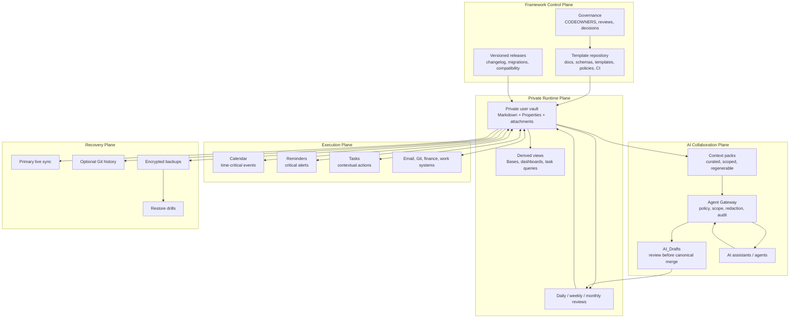
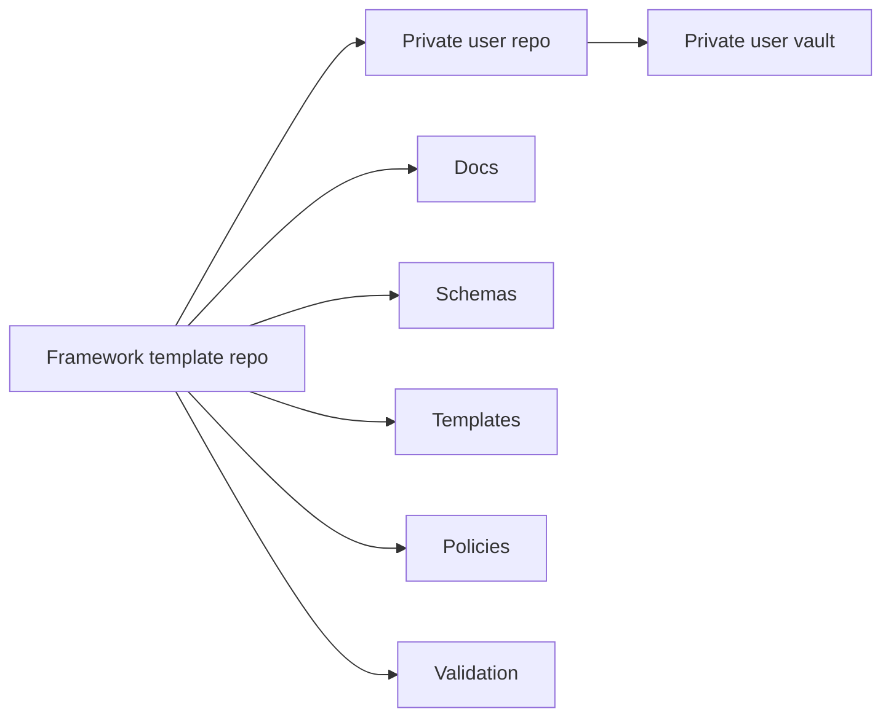
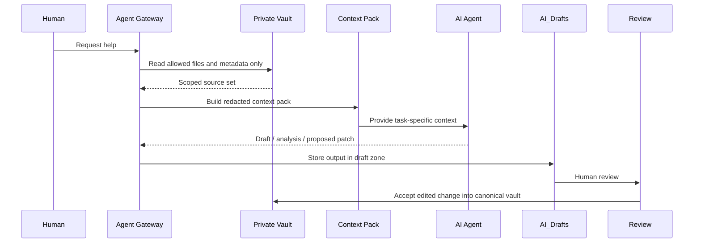
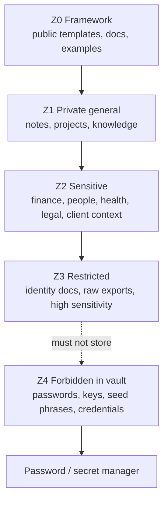
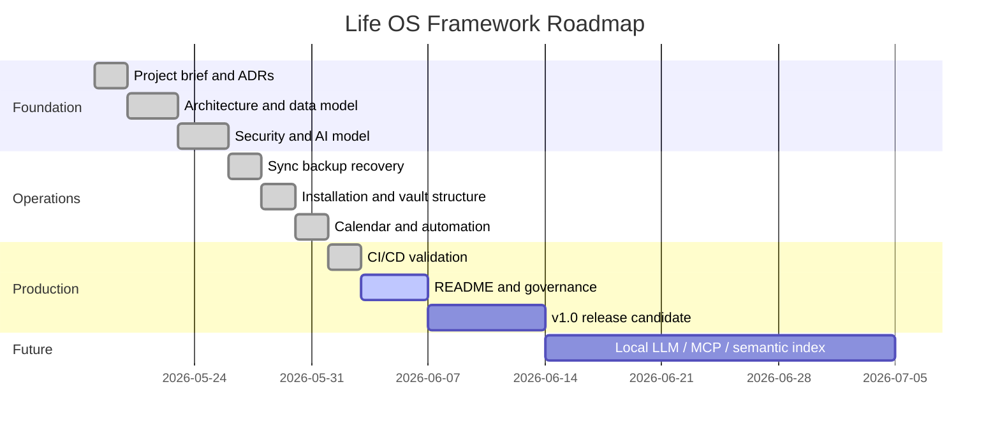

# Life OS Framework

> **Production-grade framework for a secure, local-first, AI-augmented personal operating system.**

**Life OS Framework** is a reference architecture and repository template for building a private operating system for life, work, knowledge, projects, tasks, calendars, professional processes, finances, relationships, learning, and controlled human + AI collaboration.

It is designed for people who want more than a note-taking setup. It is for users and teams who want a durable, secure, extensible, profession-adaptable information system that remains useful for years, works across devices, supports self-hosted and cloud setups, and gives AI enough context to help without giving it ownership over the user’s life.

This repository is the **framework**.  
Your personal vault is **private**.  
AI is a **reviewed collaborator**, not the owner of the system.

---

## Table of contents

- [1. What this project is](#1-what-this-project-is)
- [2. What this project is not](#2-what-this-project-is-not)
- [3. Core promise](#3-core-promise)
- [4. Architecture in one diagram](#4-architecture-in-one-diagram)
- [5. Core principles](#5-core-principles)
- [6. Who this is for](#6-who-this-is-for)
- [7. Repository model](#7-repository-model)
- [8. Personal vault model](#8-personal-vault-model)
- [9. Human + AI collaboration model](#9-human--ai-collaboration-model)
- [10. Installation profiles](#10-installation-profiles)
- [11. Quickstart](#11-quickstart)
- [12. Documentation map](#12-documentation-map)
- [13. Repository structure](#13-repository-structure)
- [14. Vault structure](#14-vault-structure)
- [15. Data model](#15-data-model)
- [16. AI model](#16-ai-model)
- [17. Security model](#17-security-model)
- [18. Sync, backup, and recovery](#18-sync-backup-and-recovery)
- [19. Calendar, reminders, and tasks](#19-calendar-reminders-and-tasks)
- [20. Profession packs](#20-profession-packs)
- [21. Automation and CI/CD](#21-automation-and-cicd)
- [22. Production readiness](#22-production-readiness)
- [23. Roadmap](#23-roadmap)
- [24. Claims policy](#24-claims-policy)
- [25. Contributing](#25-contributing)
- [26. Security reporting](#26-security-reporting)
- [27. License](#27-license)
- [28. Reference baseline](#28-reference-baseline)

---

## 1. What this project is

Life OS Framework is a **production-grade Personal Operating System Framework** built around:

- **Obsidian** as the primary human interface.
- **Markdown** as durable canonical storage.
- **YAML / Obsidian Properties** as the structured metadata layer.
- **Obsidian Bases / dashboards** as derived operational views.
- **GitHub / Gitea / Forgejo** as framework, versioning, review, and governance infrastructure.
- **Obsidian Sync / Nextcloud / Syncthing / Git / hybrid strategies** as selectable sync modes.
- **External calendars and reminders** as the source of truth for time-critical execution.
- **AI agents** as constrained collaborators operating through context packs, policies, drafts, logs, and human review.
- **Profession packs** as modular overlays that adapt the system to any field of work.
- **Encrypted backup and restore drills** as non-negotiable operational requirements.

The framework is intended to become a reliable foundation for a user’s full information life:

```text
capture → structure → connect → decide → act → review → archive → improve
```

It is not optimized for novelty. It is optimized for **durability, trust, portability, clarity, and safe leverage**.

---

## 2. What this project is not

Life OS Framework is not:

- a shared database of everyone’s private data;
- a SaaS platform that owns user information;
- a single mandatory sync provider;
- a task app replacement;
- a calendar replacement;
- a password manager;
- a financial ledger;
- a medical or legal record system;
- an unrestricted AI agent system;
- a plugin pack with no security model;
- an aesthetic-only Obsidian template.

The framework repository contains **architecture, schemas, templates, policies, documentation, automations, examples, and validation**.

It must not contain:

- real personal notes;
- passwords or credentials;
- API keys;
- seed phrases;
- raw banking exports;
- private identity documents;
- unreviewed AI memory dumps;
- real client, patient, student, legal, or financial confidential data.

---

## 3. Core promise

Life OS Framework gives a person or team a disciplined way to build a private, long-lived operating system for life and work.

The premium positioning is simple:

> **A serious information system for serious people who want AI leverage without surrendering ownership, privacy, or operational control.**

The engineering promise is stricter:

> If a user follows the framework, they get a local-first, schema-driven, auditable, recoverable, AI-compatible system where canonical data remains private and human-owned.

The project does **not** claim perfection, guaranteed security, medical/legal/financial compliance, or universal suitability without configuration. It claims a strong, extensible, security-conscious architecture that can be adapted, audited, and improved.

---

## 4. Architecture in one diagram



---

## 5. Core principles

### 5.1. Local-first canonical storage

The canonical system must remain useful if cloud services, AI providers, sync tools, or plugins change.

Canonical data lives in:

```text
Markdown files + YAML / Properties + local attachments
```

Derived systems may be regenerated.

### 5.2. Template repository, private vaults

The shared repository is a **framework/template**.

Each user creates a private instance:

```text
shared framework repo → private user vault → personal runtime system
```

This prevents personal data from leaking into shared history and makes the framework reusable for teams.

### 5.3. Schema-first knowledge

Every important note has a `type`, required metadata, lifecycle status, sensitivity, and relations.

A vault without metadata becomes a pile of files.  
A vault with metadata becomes an operational knowledge graph.

### 5.4. Human-owned AI

AI can:

- search;
- summarize;
- classify;
- draft;
- propose;
- validate;
- compare;
- generate checklists;
- prepare context packs;
- detect missing metadata.

AI must not:

- own canonical state;
- delete notes;
- bypass human review;
- write secrets;
- silently mutate critical records;
- send external communications without approval;
- create or change time-critical commitments without approval;
- access unrestricted private context.

### 5.5. Calendar owns time, vault owns context

The calendar/reminder system owns:

```text
time-critical events
deadlines
alerts
invitations
notifications
```

The vault owns:

```text
context
agenda
meeting notes
decisions
follow-ups
reviews
linked knowledge
```

### 5.6. Sync is not backup

Sync keeps devices aligned.

Backup makes recovery possible.

Recovery is only real when restore has been tested.

### 5.7. Profession packs extend the kernel

The core vault structure remains stable. Profession packs add overlays for specific fields without forking the framework.

---

## 6. Who this is for

Life OS Framework is designed for:

- developers;
- designers;
- founders;
- operators;
- managers;
- consultants;
- researchers;
- students;
- writers;
- artists;
- teachers;
- machinists;
- craftspeople;
- lawyers;
- finance professionals;
- healthcare learners and professionals working with non-regulated or appropriately anonymized material;
- privacy-first users;
- self-hosted users;
- teams building a shared methodology without sharing personal data.

The system is especially useful when a person needs to manage:

- many projects;
- many roles;
- long-term knowledge;
- professional processes;
- decisions and tradeoffs;
- calendar commitments;
- AI collaboration;
- private information;
- cross-device workflows;
- self-hosted or hybrid infrastructure.

---

## 7. Repository model

The repository is the **control plane**.

It contains:

```text
README.md
SECURITY.md
CONTRIBUTING.md
CHANGELOG.md
ROADMAP.md
docs/
vault-template/
schemas/
templates/
profession-packs/
policies/
automations/
examples/
tests/
.github/
```

It does not contain real personal data.



---

## 8. Personal vault model

The private vault is the **runtime plane**.

Default stable kernel:

```text
vault/
├── 00_System/
├── 01_Inbox/
├── 02_Daily/
├── 10_Areas/
├── 20_Projects/
├── 30_Knowledge/
├── 40_Work/
├── 50_Finance/
├── 60_People/
├── 70_AI/
├── 80_Archive/
└── 99_Attachments/
```

Each folder has:

- purpose;
- allowed note types;
- forbidden content;
- metadata rules;
- lifecycle rules;
- AI access policy;
- sync/backup implications;
- dashboard implications.

The full contract is defined in [`08_VAULT_STRUCTURE.md`](./08_VAULT_STRUCTURE.md).

---

## 9. Human + AI collaboration model

The best default AI model is:

```text
human request
→ scoped context pack
→ AI analysis
→ draft / proposed patch / recommendation
→ human review
→ canonical merge
→ audit log
```



Core AI safety requirements:

- AI reads only scoped context.
- AI writes only to draft/log zones by default.
- AI-generated changes are reviewed before canonical merge.
- High-impact actions require explicit approval.
- External content is treated as untrusted.
- Prompt injection and RAG poisoning are in-scope threats.
- Tool/MCP access must go through a policy layer.

The full AI model is defined in [`05_AI_AGENT_MODEL.md`](./05_AI_AGENT_MODEL.md).

---

## 10. Installation profiles

Life OS Framework supports several production profiles.

| Profile | Best for | Primary sync | Versioning | Backup |
|---|---|---|---|---|
| `personal-simple` | most users | Obsidian Sync | optional | encrypted local + offsite |
| `developer-hybrid` | developers | Obsidian Sync / Syncthing | GitHub / Gitea | encrypted snapshots |
| `self-hosted-nextcloud` | self-hosted users | Nextcloud | optional Git | server + offsite backups |
| `self-hosted-syncthing` | privacy-first users | Syncthing | optional Git | encrypted offsite |
| `team-template` | teams | no shared personal vault | framework repo | repository backup |
| `high-sensitivity` | sensitive users | minimized / compartmentalized | restricted | encrypted, tested, isolated |
| `mobile-first` | users primarily on phone/tablet | Obsidian Sync | optional | simple encrypted backup |

See [`07_INSTALLATION.md`](./07_INSTALLATION.md) and [`06_SYNC_BACKUP_RECOVERY.md`](./06_SYNC_BACKUP_RECOVERY.md).

---

## 11. Quickstart

### Step 1 — choose your profile

Start with one of:

```text
personal-simple
developer-hybrid
self-hosted-nextcloud
self-hosted-syncthing
team-template
high-sensitivity
mobile-first
```

Default recommendation:

```text
personal-simple for most people
developer-hybrid for technical users
self-hosted-nextcloud or self-hosted-syncthing for self-hosted/privacy-first users
```

### Step 2 — create your private vault

Use this repository as a template, or copy `vault-template/` into a private location.

```text
framework repo → private vault
```

Do not put private user data in the framework repository.

### Step 3 — open the vault in Obsidian

Open the `vault/` folder as an Obsidian vault.

Enable recommended core plugins:

```text
Properties
Bases
Daily Notes
Templates
Canvas
Search
Backlinks
Graph View
```

### Step 4 — configure sync

Pick one primary live sync method:

```text
Obsidian Sync
GitHub / Git
Gitea / Forgejo
Nextcloud
Syncthing
hybrid
```

Do not mix multiple live-sync tools against the same files unless the profile explicitly allows it.

### Step 5 — configure backup

Create at least:

```text
one local encrypted backup
one offsite encrypted backup
one tested restore path
```

### Step 6 — create your first system notes

Create or review:

```text
00_System/Home.md
02_Daily/Daily/<today>.md
10_Areas/Area - Systems.md
20_Projects/Active/Project - Life OS Setup.md
70_AI/AI_Policies/AI Policy.md
```

### Step 7 — run your first weekly review

The system becomes real when it enters the review loop.

```text
capture → process → plan → act → review → improve
```

---

## 12. Documentation map

The production documentation set is split into contracts.

| File | Purpose |
|---|---|
| [`01_PROJECT_BRIEF.md`](./01_PROJECT_BRIEF.md) | Vision, scope, goals, non-goals, success definition |
| [`02_ARCHITECTURE.md`](./02_ARCHITECTURE.md) | System architecture and production blueprint |
| [`03_DATA_MODEL.md`](./03_DATA_MODEL.md) | Ontology, metadata, schemas, lifecycles, relations |
| [`04_SECURITY_MODEL.md`](./04_SECURITY_MODEL.md) | Threat model, trust boundaries, forbidden data, controls |
| [`05_AI_AGENT_MODEL.md`](./05_AI_AGENT_MODEL.md) | Agent Gateway, context packs, action classes, review flows |
| [`06_SYNC_BACKUP_RECOVERY.md`](./06_SYNC_BACKUP_RECOVERY.md) | Sync profiles, backups, recovery, RPO/RTO, conflicts |
| [`07_INSTALLATION.md`](./07_INSTALLATION.md) | Installation and onboarding runbook |
| [`08_VAULT_STRUCTURE.md`](./08_VAULT_STRUCTURE.md) | Folder contracts, allowed types, AI/sync/backup implications |
| [`09_PROFESSION_PACKS.md`](./09_PROFESSION_PACKS.md) | Profession overlays and adaptation model |
| [`10_CALENDAR_NOTIFICATIONS.md`](./10_CALENDAR_NOTIFICATIONS.md) | Calendar, reminders, notifications, tasks, reviews |
| [`11_AUTOMATION_MODEL.md`](./11_AUTOMATION_MODEL.md) | Automation classes, permissions, review gates, audit |
| [`12_CI_CD_VALIDATION.md`](./12_CI_CD_VALIDATION.md) | CI/CD, validation gates, security checks, release blockers |
| [`13_ROADMAP.md`](./13_ROADMAP.md) | Roadmap, milestones, maturity levels, release gates |
| [`14_DECISIONS_LOG.md`](./14_DECISIONS_LOG.md) | Architecture Decision Record log |

Additional production files:

```text
CONTRIBUTING.md
SECURITY.md
CHANGELOG.md
MIGRATION_GUIDE.md
RELEASE_PROCESS.md
GOVERNANCE.md
TROUBLESHOOTING.md
```

Future / P2 files:

```text
LOCAL_LLM.md
MCP_INTEGRATION.md
SEMANTIC_INDEX.md
SELF_HOSTED_REFERENCE_STACK.md
EXAMPLES.md
```

---

## 13. Repository structure

Recommended production repository:

```text
life-os-framework/
├── README.md
├── SECURITY.md
├── CONTRIBUTING.md
├── CHANGELOG.md
├── ROADMAP.md
├── docs/
│   ├── 01_PROJECT_BRIEF.md
│   ├── 02_ARCHITECTURE.md
│   ├── 03_DATA_MODEL.md
│   ├── 04_SECURITY_MODEL.md
│   ├── 05_AI_AGENT_MODEL.md
│   ├── 06_SYNC_BACKUP_RECOVERY.md
│   ├── 07_INSTALLATION.md
│   ├── 08_VAULT_STRUCTURE.md
│   ├── 09_PROFESSION_PACKS.md
│   ├── 10_CALENDAR_NOTIFICATIONS.md
│   ├── 11_AUTOMATION_MODEL.md
│   ├── 12_CI_CD_VALIDATION.md
│   ├── 13_ROADMAP.md
│   └── 14_DECISIONS_LOG.md
├── vault-template/
├── schemas/
├── templates/
├── profession-packs/
├── policies/
├── automations/
├── examples/
├── tests/
└── .github/
```

If the repository keeps docs in the root during early development, links may point to root files. For production release, prefer `docs/` and keep this README as the root entry point.

---

## 14. Vault structure

Default vault:

```text
vault/
├── 00_System/
│   ├── Dashboards/
│   ├── Templates/
│   ├── Schemas/
│   ├── Bases/
│   ├── Policies/
│   └── Maintenance/
├── 01_Inbox/
│   ├── Quick/
│   ├── Web/
│   ├── Voice/
│   ├── Imports/
│   └── AI_Drafts/
├── 02_Daily/
│   ├── Daily/
│   ├── Weekly/
│   ├── Monthly/
│   └── Yearly/
├── 10_Areas/
├── 20_Projects/
├── 30_Knowledge/
├── 40_Work/
├── 50_Finance/
├── 60_People/
├── 70_AI/
├── 80_Archive/
└── 99_Attachments/
```

Top-level folder contracts:

| Folder | Purpose |
|---|---|
| `00_System` | operating manuals, dashboards, schemas, templates, policies |
| `01_Inbox` | unprocessed capture and AI drafts |
| `02_Daily` | daily, weekly, monthly, yearly operating rhythm |
| `10_Areas` | long-term areas of responsibility |
| `20_Projects` | active, waiting, someday, completed projects |
| `30_Knowledge` | concepts, research, resources, learning |
| `40_Work` | profession-specific work systems |
| `50_Finance` | financial goals, decisions, reviews; no secrets |
| `60_People` | relationship context, CRM, meetings, commitments |
| `70_AI` | agents, context packs, prompts, logs, evaluations |
| `80_Archive` | inactive material |
| `99_Attachments` | files linked from metadata notes |

---

## 15. Data model

Every important note should have structured metadata.

Minimal example:

```yaml
---
id: "project-life-os-setup"
type: "project"
title: "Life OS Setup"
status: "active"
created: "2026-05-19"
updated: "2026-05-19"
sensitivity: "private"
area: "systems"
project: "life-os"
tags:
  - life-os
  - setup
review:
  cadence: "weekly"
  next: "2026-05-26"
relations:
  people: []
  projects: []
  decisions: []
  resources: []
---
```

Base object types include:

```text
note
area
project
task
person
meeting
decision
resource
asset
client
work-order
finance-record
finance-decision
daily-note
weekly-review
monthly-review
ai-agent
context-pack
review
experiment
architecture-decision
checklist
process
standard
deliverable
```

Sensitivity levels:

```text
public
internal
private
sensitive
restricted
forbidden
```

The full data contract is in [`03_DATA_MODEL.md`](./03_DATA_MODEL.md).

---

## 16. AI model

Life OS Framework uses a bounded AI model:

```text
AI can assist.
AI cannot own.
AI can draft.
AI cannot silently mutate canonical state.
AI can retrieve scoped context.
AI cannot search everything by default.
```

AI action classes:

| Class | Meaning | Default policy |
|---|---|---|
| `A0` | no AI involvement | allowed |
| `A1` | read-only explanation | allowed with scope |
| `A2` | summarization/classification | allowed with provenance |
| `A3` | draft creation | draft-only |
| `A4` | proposed canonical edit | review required |
| `A5` | external side effect | explicit approval required |
| `A6` | destructive / financial / legal / security-critical | forbidden or special approval |

Default write paths:

```text
01_Inbox/AI_Drafts/
70_AI/Agent_Logs/
```

Default forbidden actions:

```text
delete canonical files
modify secrets
send external messages without approval
move money
change permissions
publish private data
perform legal/medical/financial decisions as authority
```

---

## 17. Security model

Security posture:

```text
private by default
least privilege
zero-trust mindset
no secrets in vault
no unrestricted AI write access
human review for canonical changes
encrypted backups
restore-tested recovery
```

Forbidden in the vault or framework repository:

```text
passwords
API keys
private keys
seed phrases
production credentials
full card numbers
full government IDs
raw credential exports
unreviewed AI memory dumps
```

Security zones:



See [`04_SECURITY_MODEL.md`](./04_SECURITY_MODEL.md).

---

## 18. Sync, backup, and recovery

Supported sync and storage modes:

```text
Obsidian Sync
GitHub private repository
Gitea / Forgejo self-hosted Git
Nextcloud
Syncthing
hybrid
```

Production rule:

```text
one primary live sync method per vault
```

Recovery rule:

```text
sync is not backup
backup is not recovery
recovery is only real after restore test
```

Minimum backup posture:

```text
local encrypted snapshot
offsite encrypted backup
restore test
documented RPO/RTO
```

Default RPO/RTO targets:

| Profile | RPO | RTO |
|---|---:|---:|
| personal-simple | 24h | 4h |
| developer-hybrid | 4h–24h | 2h–8h |
| high-sensitivity | profile-specific | profile-specific |
| team-template repo | every merge/release | same day |

See [`06_SYNC_BACKUP_RECOVERY.md`](./06_SYNC_BACKUP_RECOVERY.md).

---

## 19. Calendar, reminders, and tasks

Production principle:

```text
Calendar/reminders execute time.
Life OS explains why time matters.
```

Source-of-truth model:

| Domain | Source of truth |
|---|---|
| meetings | external calendar |
| critical reminders | reminder system |
| project context | vault |
| meeting notes | vault |
| decisions | vault |
| contextual tasks | vault / task system |
| external commitments | calendar / external tool |

AI may help with planning, but must not silently create or modify time-critical commitments.

See [`10_CALENDAR_NOTIFICATIONS.md`](./10_CALENDAR_NOTIFICATIONS.md).

---

## 20. Profession packs

Profession packs adapt the framework without breaking the kernel.

Examples:

```text
developer
designer
machinist
craftsperson
teacher
researcher
founder
lawyer
healthcare-study
finance
student
writer
artist
consultant
custom
```

A profession pack may include:

```text
pack.yaml
README.md
schemas/
templates/
dashboards/
checklists/
ai/
examples/
migrations/
```

Profession packs must define:

- domain objects;
- folder overlays;
- templates;
- dashboards;
- quality criteria;
- safety constraints;
- AI boundaries;
- validation rules;
- migration rules.

See [`09_PROFESSION_PACKS.md`](./09_PROFESSION_PACKS.md).

---

## 21. Automation and CI/CD

Automation is allowed when it strengthens structure, quality, validation, and recovery.

Automation must not silently replace human ownership.

Automation flow:

```text
observe → validate → draft → review → apply → log → recover
```

CI/CD validates:

- repository structure;
- Markdown;
- frontmatter;
- schemas;
- templates;
- profession packs;
- policies;
- forbidden data patterns;
- links;
- Mermaid;
- AI policy;
- automation policy;
- release readiness.

See [`11_AUTOMATION_MODEL.md`](./11_AUTOMATION_MODEL.md) and [`12_CI_CD_VALIDATION.md`](./12_CI_CD_VALIDATION.md).

---

## 22. Production readiness

A Life OS Framework release is production-ready only when:

```text
[ ] Project brief is accepted.
[ ] Architecture contract is accepted.
[ ] Data model is accepted.
[ ] Security model is accepted.
[ ] AI agent model is accepted.
[ ] Sync / backup / recovery model is accepted.
[ ] Installation runbook is accepted.
[ ] Vault structure contract is accepted.
[ ] Profession pack model is accepted.
[ ] Calendar / notifications contract is accepted.
[ ] Automation model is accepted.
[ ] CI/CD validation model is accepted.
[ ] Roadmap is accepted.
[ ] Decision log is accepted.
[ ] README is accurate and aligned.
[ ] SECURITY.md exists.
[ ] CONTRIBUTING.md exists.
[ ] CHANGELOG.md exists.
[ ] MIGRATION_GUIDE.md exists.
[ ] No private data is in the framework repo.
[ ] No secrets are in the framework repo.
[ ] Release validation passes.
```

---

## 23. Roadmap

High-level roadmap:



See [`13_ROADMAP.md`](./13_ROADMAP.md).

---

## 24. Claims policy

This project may honestly claim:

- local-first design;
- private-vault ownership model;
- schema-first documentation architecture;
- human-reviewed AI collaboration;
- profession-adaptable framework;
- sync-provider flexibility;
- backup/recovery-first operating model;
- security-conscious reference architecture;
- production-grade documentation and validation intent.

This project must not claim:

- perfect security;
- guaranteed compliance;
- universal medical/legal/financial suitability;
- complete immunity to AI attacks;
- guaranteed recovery without tested backups;
- replacement for professional systems where regulated systems are required;
- that AI outputs are authoritative without human validation.

Premium marketing is allowed only when backed by architecture, constraints, and verifiable implementation.

---

## 25. Contributing

Contributions should improve the framework, not add private data.

Accepted contribution types:

```text
documentation improvements
schema improvements
template improvements
profession packs
validation rules
automation scripts
examples with synthetic data only
security hardening
migration guides
accessibility improvements
```

Not accepted:

```text
real personal notes
real client data
real patient data
real financial exports
secrets
credentials
private keys
AI memory dumps containing personal data
```

See `CONTRIBUTING.md`.

---

## 26. Security reporting

Security issues include:

- secret exposure;
- unsafe AI permissions;
- prompt-injection risk;
- RAG poisoning risk;
- unsafe automation;
- CI/CD supply-chain risk;
- unsafe profession pack patterns;
- misleading documentation that could cause data loss or privacy exposure;
- backup/recovery claims that are not operationally valid.

See `SECURITY.md`.

---

## 27. License

License is not finalized in this draft.

Recommended options:

- **MIT** for maximum permissive reuse.
- **Apache-2.0** if explicit patent language is desired.
- **AGPL-3.0** only if the project intentionally wants strong copyleft for networked modifications.

Choose the license before public release.

---

## 28. Reference baseline

The framework is designed around stable, well-documented primitives and current safety guidance:

- Obsidian Bases: https://obsidian.md/help/bases
- Obsidian Properties: https://obsidian.md/help/properties
- Obsidian Sync security: https://obsidian.md/help/sync/security
- GitHub template repositories: https://docs.github.com/en/repositories/creating-and-managing-repositories/creating-a-template-repository
- GitHub repository security features: https://docs.github.com/en/code-security/getting-started/quickstart-for-securing-your-repository
- OWASP LLM Prompt Injection Prevention Cheat Sheet: https://cheatsheetseries.owasp.org/cheatsheets/LLM_Prompt_Injection_Prevention_Cheat_Sheet.html
- OWASP RAG Security Cheat Sheet: https://cheatsheetseries.owasp.org/cheatsheets/RAG_Security_Cheat_Sheet.html
- OWASP AI Agent Security Cheat Sheet: https://cheatsheetseries.owasp.org/cheatsheets/AI_Agent_Security_Cheat_Sheet.html
- OWASP Secrets Management Cheat Sheet: https://cheatsheetseries.owasp.org/cheatsheets/Secrets_Management_Cheat_Sheet.html
- NIST AI Risk Management Framework: https://www.nist.gov/itl/ai-risk-management-framework
- NIST Cybersecurity Framework: https://www.nist.gov/cyberframework
- NIST SP 800-184 Guide for Cybersecurity Event Recovery: https://csrc.nist.gov/pubs/sp/800/184/final
- CISA StopRansomware Guide: https://www.cisa.gov/stopransomware/ransomware-guide
- Nextcloud documentation: https://docs.nextcloud.com/
- Syncthing documentation: https://docs.syncthing.net/

---

## Final summary

Life OS Framework is a production-grade attempt to answer a practical question:

> How should a person build a long-lived private operating system for life and work in the age of AI?

The answer is not “give everything to AI.”  
The answer is not “put everything into one app.”  
The answer is not “trust sync as backup.”  
The answer is not “make a pretty note template.”

The answer is:

```text
private canonical vault
+ local-first Markdown
+ structured metadata
+ explicit architecture
+ secure sync and recovery
+ external execution systems
+ scoped AI collaboration
+ profession-specific overlays
+ validation and governance
```

The system belongs to the human.  
AI helps maintain, reason, draft, and improve it.  
The framework makes that collaboration structured, safe, durable, and extensible.
